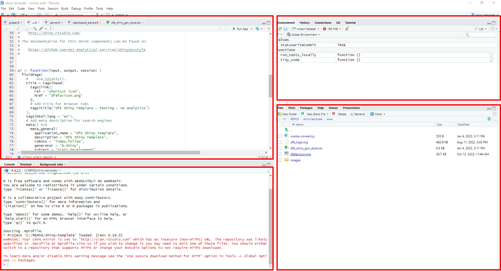
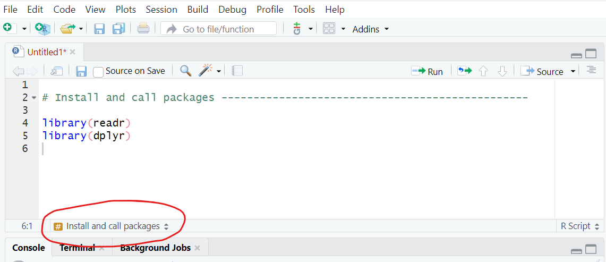
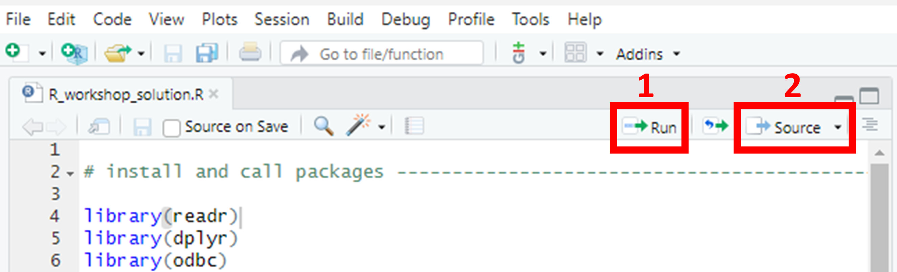
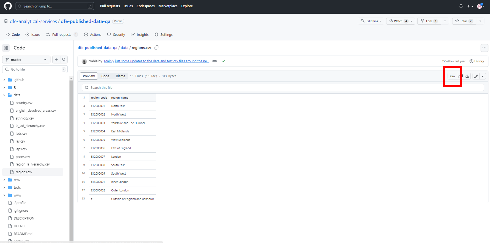
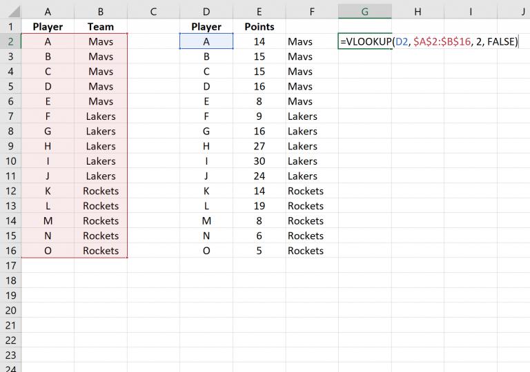

```{r write title page, include=FALSE}
connTitle <- file("title.sty")
writeLines(c("\\resizebox{48mm}{!}{\\includegraphics{images/Department_for_Education.png}}\n",
             "\\vspace*{0.24\\textheight}\n",
             "\\raggedright\\HUGE{\\color{dfeheadingblue}\\textbf{DfE Statistics Development Team Workshops}} \n",
             paste0("\\huge{\\color{dfeheadingblue}\\textbf{Coding RAP using R}}"),
             "\\vspace*{2\\baselineskip} \n",
             "\\normalsize \n \\newpage \n"), connTitle)
close(connTitle)
```

\newpage

# Introduction

We've prepared this walkthrough guide for statistics publication teams as an introduction to the ways in which coding in R can be used for Reproducible Analystical Pipelines (RAPs), creating functions for typical tasks that teams may come across.
The guide is intended to be step-by-step, building up from the very basics.
The plan is to work through this in groups of 3-ish with access to experienced R users for support.
If it starts too basic for your level, then just go through at your own/your group's pace as you see fit.
By no means can we cover everything in this walkthrough, so please see it as a prompt to ask follow-up questions as you're working through on anything related to R, RAP and coding in general.

## What is a RAP?

RAP stands for Reproducible Analytical Pipeline.
The full words still hide the true meaning behind buzzwords and jargon though.
What it actually means is using automation to our advantage when analysing data, and this is as simple as writing code such as an R script that we can click a button to execute and do the job for us.

Using R (the coding language) really helps us to put the R in RAP ('reproducible').
Ask yourself, if someone else picked up your work, could they easily reproduce your exact outputs?
And when the time comes around to update your analysis with new data, how easy is it for you to reproduce the analysis you need?
In an ideal RAP, it would be as simple as plugging the new data in and clicking 'go', with no need to manually scroll through multiple scripts updating the year in every file name or the variable name that's changed from using \_ to -.

## What is R/R Studio?

R is a coding language.
There are many different languages of code, some others include SQL, python, JavaScript and many more.
They all have benefits, and the difference is often the syntax used (literally like learning new languages!).
R is open-source, meaning it is free, anyone can use it and anyone can contribute to developing new 'packages'.

-   A *package* is a set of functions someone else has written and tied together in a nice neat bow, ready for you to use!
    You simply install the package, and then you have all of the functions available.

-   A *function* is a chunk of code that has been grouped together, given a name, and often has 'place holders' you can change, such that you can use that name to run that code, and apply it to different data.
    For example, mean(x) is a function that calculates the arithmetic mean of x.
    You replace x with any numeric data.

R Studio is a piece of software, specifically an integrated development environment (IDE), that enables us to write code in the R coding language, while also providing a visual and interactive interface.
It has useful areas and windows that enable you to see what tables you have loaded, charts you have created, Git user interface, file explorer, help windows and many more!
Normally you will see the screen split into 3 or 4 windows:

```{r echo=FALSE, out.width='100%', fig.cap='R studio panels'}

```

-   Top left - Source pane.
    Open and view your code scripts, tables, data sets, functions.

-   top right - Environment/History/Connections/Git (if you have it).
    The environment shows you what data, functions, objects etc you have.

-   Bottom left - Console.
    Shows what you have run, and you can type and run commands directly into the console.

-   Bottom right - File explorer/plots/packages/Viewer.

# ADA and databricks

This workshop and it's materials were developed before the implementation of ADA or databricks.
Therefore, they are not currently covered in this workshop, and we use the existing tools of R Studio, Git and SQL for the tasks.
As ADA develops and becomes more widely used, we will incorporate it into the workshop to account for new ways of working.

# Pre-workshop requirements

## Technical requirements

First of all, make sure to bring your laptop.
This is going to be interactive and require you to do some coding.

Preferably before coming along, you'll need to go through the following list of things you'll need to make sure are set up on your DfE laptop:

-   Set up an Azure Dev Ops Basic account (not a Stakeholder account) at the DfE Service Portal; Either:

-   Install git on your laptop: <https://git-scm.com/downloads>;

-   Install R-Studio on your machine: Download **R for Windows (x64)** and **RStudio** from the Software Centre on your DfE laptop.

Or:

-   If you're on EDAP and used to using R/R-Studio and/or git on there, feel free to just use that.

You'll also need to make sure that git is set up in the git/SVN pane of global options in R-Studio (found in the Tools drop down menu).
Make sure the path to your git executable is entered in the git path box and git should automatically be integrated with R-Studio.

```{r echo=FALSE, out.width='64%', fig.cap='Enter the path to your git executable in the git path option box'}
knitr::include_graphics('images/gitdemo/gitdemo-gitRstudio-settings.png')
```

Once you open a repository, you'll get an extra panel, named 'git', in the top right pane of R-Studio and you'll also be able to use git in the 'Terminal' tab at the bottom left (in the same place as the R console).

```{r echo=FALSE, out.width='56%', fig.cap='The `git BASH` terminal in R-Studio'}
knitr::include_graphics('images/gitdemo/gitdemo-gitRstudio-NewTerminal.png')
```

A useful thing here if you want to use git commands in the terminal is to switch the terminal from the default Windows Command Prompt to `git BASH`.
You can do this in the Terminal tab of R-Studio's global options - just select `git BASH` from the 'New terminal opens with' pull down menu.
Click apply and then select the Terminal tab (next to the Console tab), click 'Terminal 1' and then select 'New terminal' from the drop down menu.
You should see something similar to the terminal screenshot.

## Working in groups

To get the most out of the workshop, we expect everyone to work through all of the tasks themselves while discussing the work in small groups.
If anything is unclear then ask and most importantly, communicate with each other about what you're doing.

So that we all have a record of what we have done, everyone will be working in the same repository on their own branch.
Once you have cloned the repository, please **create a branch** called your name (i.e. `<firstname>_<lastname>`).

By the end, you should get a good idea of how to utilize R for RAP processes, as well as a brief understanding of using git.

\newpage

# Getting started ...

Now we will begin the tasks and group work.
First, everyone **open up R studio.**

# Creating a project & cloning repositories

When creating RAP processes, it's key that your code is reusable, transparent, and well documented, such that it is future-proofed for any future team members.
Therefore, first, we will show you how to create an R project.
Using an R project ensures that all of the files in the project folder (scripts, plots, notes, etc.) can all be referenced relative to the **.Rproj file** location.
Basically, it removes the need to set and get your working directory, and removes the need to use long & complete file paths.
Instead, you essentially start any file path from the location of the .Rproj file!
*For example*, if you have a code.R code script, and a data.csv file in a project folder that has been set up as an R project, and you want to read the .csv in the R script, you don't need the entire file path of the csv (which probably starts C:/... and can get very long), just the file path relative to the *.Rproj file* which in this case would simply be 'data.csv'.

If you're struggling to grasp that, that's okay, we will create a project and see this in action today.
To create a new project, in R studio, go to **File \> New Project \> ...**.
If you were creating a new R project that was not linked to an online *Git* repository, you would select **File \> New Project \> New directory \> New Project**, *however*, today we will be using [the GitHub repository for the workshop](https://github.com/dfe-analytical-services/techskills_workshops).
Using Git repositories is best RAP practice as it means you're using version control software and your work is more easily shared transparently within your team/department.

```{=tex}
\begin{tcolorbox}[colback=gssmidblue, 
 leftright skip=0.1cm,
 coltext=white, 
 halign=left, 
 fontupper={\large \bfseries},
 fontlower={\normalsize},
 sharp corners, 
 colframe=gssmidblue,
 width=0.9\linewidth,
 boxrule=0pt
 ]
Create project
\tcblower
Select \textbf{File > New Project > Version Control > Git}. To get the repository URL, go to the GitHub repository, click the green 'code' button and copy the link from there. You can choose the project directory name, as this is how it will appear on your device. 

For the file path at the bottom, you should make sure this is \textbf{not} saved in your OneDrive area. You should select Browse and navigate out of OneDrive to save the project directory elsewhere (this is because OneDrive has it's own version-control system, and trying to use Git within that can cause complications and errors). 

Click 'Create project'. 
\end{tcolorbox}
```
## Using renv

Renv (short for R environment) is a package in R that helps you to keep a record of which packages your project uses, and what version of each package it should use (for a reminder of what a package is, check back to the What is R/R Studio? section above).
Using renv in your R project means that anybody in the future (including your future self) who comes back to this project, can immediately get all of the required packages.
First you need to install the renv package by running `install.packages('renv')` in the console.

Once that has installed, you can run the functions from this package.
You can also see what packages are installed by navigating to the 'Packages' tab in the bottom right window - renv should have appeared in here now.

When using functions from packages, you can either type `<package name>::<function name>` )(e.g. `readr::read_csv()`) or just the function name on its own.
However, problems can arise if two packages have different functions with the same name.
When you have loaded two packages that contain functions with the same name and you only type the function name, R automatically uses the function from the package that was loaded most recently.
If you want to choose which package to use and override the precedent set by R, you should use the package name and colons to explicitly state the source package and function you intended.

```{=tex}
\begin{tcolorbox}[colback=gssmidblue, 
 leftright skip=0.1cm,
 coltext=white, 
 halign=left, 
 fontupper={\large \bfseries},
 fontlower={\normalsize},
 sharp corners, 
 colframe=gssmidblue,
 width=0.9\linewidth,
 boxrule=0pt,
 ]
Activate renv
\tcblower
To activate renv, run \verb|renv::activate()| in the console. If you navigate back to the files tab in the bottom left and look in your project folder, you should see some renv-related files have appeared, including a \textit{renv.lock} file. The renv.lock file is the file that records all of your project's packages and their versions. If you click on the renv.lock file it will open for you to view in the top left.  
\end{tcolorbox}
```
Each time you add or remove packages, or update the package versions, you should run `renv::snapshot()` to take a snapshot of the current state of your library.
If you ever get a new device, or someone else wants to view your project, they simply need to run `renv::restore()` to restore the package library on their device to match the packages recorded in the renv.lock file.

# Your initial script

Now that we have your project created and renv activated, we can create our first code script.

```{=tex}
\begin{tcolorbox}[colback=gssmidblue, 
 leftright skip=0.1cm,
 coltext=white, 
 halign=left, 
 fontupper={\large \bfseries},
 fontlower={\normalsize},
 sharp corners, 
 colframe=gssmidblue,
 width=0.9\linewidth,
 boxrule=0pt
 ]
 Open a new script
\tcblower
Open a new R script file by selecting \textbf{File > New File > R script}.
\end{tcolorbox}
```
## Comments and headings

Comments in code are some of the most useful documentation you can use, and are crucial for RAP!
You should start your script with comments that provide important information such as what this code script contains and what it is for - basically anything you think a new person would need to know in order to understand and run the code effectively.
You add comments in R scripts by starting the line with a **hash symbol, \#**.
Any line that starts with a hash symbol will be treated as a comment rather than code, and so will not be 'run'.
You can also add comments to the end of lines of code by including the hash symbol half-way through a line - everything after the \# will be treated as a comment, and everything before will be treated as code.
If you have multiple lines of comments you wish to add, you can type them out, highlight them and use \hlblue{`ctrl+shift+C`} to 'comment out' all of the highlighted lines.

```{=tex}
\begin{tcolorbox}[colback=gssmidblue, 
 leftright skip=0.1cm,
 coltext=white, 
 halign=left, 
 fontupper={\large \bfseries},
 fontlower={\normalsize},
 sharp corners, 
 colframe=gssmidblue,
 width=0.9\linewidth,
 boxrule=0pt
 ]
Set up your script
\tcblower
Add some comments to the beginning of your script now - include your name, the date, and a short description that explains that this is the first script, and will include library calls as well as loading data and any functions that will be used in future.

Your first script should definitely include the 'library-calls' for all of the packages you will need. This basically means loading any packages you need at the beginning, before running any future code that requires them. We load/call packages by using the \verb|library()| function.
\end{tcolorbox}
```
```{=tex}
\begin{tcolorbox}[colback=gssmidblue, 
 leftright skip=0.1cm,
 coltext=white, 
 halign=left, 
 fontupper={\large \bfseries},
 fontlower={\normalsize},
 sharp corners, 
 colframe=gssmidblue,
 width=0.9\linewidth,
 boxrule=0pt
 ]
Install packages
\tcblower
Our first steps only require two packages, 'readr' and 'dplyr'. You can either install these by typing \verb|install.packages('readr')| and \verb|install.packages('dplyr')| one at a time in the console, or you can install both packages at once by running \verb|install.packages(c('readr', 'dplyr'))|. Then, remember to take a \verb|renv::snapshot()| to add these to the renv.lock file! 
\end{tcolorbox}
```
Now, below your initial comments, we will add the library calls to the script.
First, we should add a section header!
Section headers are yet again another form of good documentation, and and extremely helpful when navigating around scripts of code!

```{=tex}
\begin{tcolorbox}[colback=gssmidblue, 
 leftright skip=0.1cm,
 coltext=white, 
 halign=left, 
 fontupper={\large \bfseries},
 fontlower={\normalsize},
 sharp corners, 
 colframe=gssmidblue,
 width=0.9\linewidth,
 boxrule=0pt
 ]
Add a section header
\tcblower
To add a section header, we can use the keyboard shortcut \hlblue{`ctrl+shift+R`}. In the pop-up window, give the first section the header 'Load in packages'. Then click okay and you should see the header has appeared in your code. In the bottom left of the code window, you should see the section header has appeared, and if you click on the name you can navigate to other sections when you have built up your script further. 
\end{tcolorbox}
```
Another way to view and navigate between all of the sections in a script is to use the keyboard shortcut \hlblue{`ctrl+shift+O`} to open the sections in a small panel on the right of your script.

```{=tex}
\begin{tcolorbox}[colback=gssmidblue, 
 leftright skip=0.1cm,
 coltext=white, 
 halign=left, 
 fontupper={\large \bfseries},
 fontlower={\normalsize},
 sharp corners, 
 colframe=gssmidblue,
 width=0.9\linewidth,
 boxrule=0pt
 ]
Save your script
\tcblower
Now save your initial script with the name 'main.R'. You can save code scripts by either selecting \textbf{File > Save As...} or by clicking the save icon in the bar below the script name. When your script contains \textbf{unsaved changes}, the script name will turn red and end with a * symbol. When it does not contain any unsaved changes, the name of the script will turn black, with no * symbol, and the save icon beneath it will grey-out.

\textbf{Throughout this workshop, make sure to add comments at every step so you know what each code snippet is doing, and why!}
\end{tcolorbox}
```
```{r echo=FALSE, out.width='100%', fig.cap='R Studio section headers navigation'}

```

## Adding and running code

```{=tex}
\begin{tcolorbox}[colback=gssmidblue, 
 leftright skip=0.1cm,
 coltext=white, 
 halign=left, 
 fontupper={\large \bfseries},
 fontlower={\normalsize},
 sharp corners, 
 colframe=gssmidblue,
 width=0.9\linewidth,
 boxrule=0pt
 ]
Add package library calls
\tcblower
Now, below the heading on a new line, add \verb|library(readr)|, then on a new line add \verb|library(dplyr)|. 
\end{tcolorbox}
```
In R, each new line represents a new code command.
You don't need to use a semi-colon or any other punctuation to separate commands other than just starting a new line, and you cannot have two commands on the same line.
Therefore, since the two library calls are two distinct commands because they load different packages, they each need to be on a new line.

To actually run code that you have saved in a script file, there are a few options.
Firstly, there are buttons you can use to the top right of the script file's window.

```{r echo=FALSE, out.width='100%', fig.cap='R Studio run and source buttons'}

```

Button 1 in the above image (the 'run' button) will run either all *highlighted* code, or, if no lines are highlighted it will run the line or snippet where your cursor is located (in the above image, you can see the faint cursor line at the end of line 4, so clicking run would run line 4 in this instance).
Another way to do this is to use the 'run' keyboard shortcut - \hlblue{`ctrl + Enter`}.
This works in the same way and will either run all highlighted lines, or the snippet where the cursor is located.

Button 2 (the 'Source' button) will run the entire script from the first to the last line in one go!
This is the same as running `Source("script_name.R")` in the console.
`Source(...)` is particularly useful in RAPs, as one of the baseline expectations for statistics publication pipelines is that you have one script that runs every single step of the process - sourcing scripts one by one in the correct order in a 'run_pipeline' script (with comments!) is great way to do this while keeping it tidy and clear!

```{=tex}
\begin{tcolorbox}[colback=gssmidblue, 
 leftright skip=0.1cm,
 coltext=white, 
 halign=left, 
 fontupper={\large \bfseries},
 fontlower={\normalsize},
 sharp corners, 
 colframe=gssmidblue,
 width=0.9\linewidth,
 boxrule=0pt
 ]
Run your code
\tcblower
Highlight the lines you have just added to the script and run them either using the button or the keyboard shortcut. Now we have the packages we need to load in some data. 
\end{tcolorbox}
```
## Data types and objects in R

### Basic data types

In R, you can have multiple types of data. The basic data types can be divided into the following: 

* Numeric (10.5, 55, 787)
* Integer (1L, 55L, 100L - "L" declares these as integers)
* Complex (9 + 3i - "i" is an imaginary part)
* Character (a.k.a string/text)
* Logical (a.k.a boolean- e.g. TRUE or FALSE)

We can use the `class()` function to check the data type of a variable in R. 

### Basic data objects

In R, we can store *objects* in our *environment*. There are 5 basic types of objects in the R language.

**Atomic vectors** can store homogeneous data types such as character, doubles, integers, raw, logical, and complex. A single element variable is also said to be vector. To create vectors in R, we use `c()`. 

```{=tex}
\begin{tcolorbox}[colback=gssmidblue, 
 leftright skip=0.1cm,
 coltext=white, 
 halign=left, 
 fontupper={\large \bfseries},
 fontlower={\normalsize},
 sharp corners, 
 colframe=gssmidblue,
 width=0.9\linewidth,
 boxrule=0pt
 ]
Atomic vectors
\tcblower
Try running the following code: 
\begin{verbatim}
# Create vectors
x <- c(1, 2, 3, 4)
y <- c("a", "b", "c", "d")
z <- 5
  
# Print vector and class of vector
print(x)
class(x)

print(y)
class(y)

print(z)
class(z)
\end{verbatim}
\end{tcolorbox}
```

**Lists** are another type of object in R programming. Lists can contain heterogeneous data types such as vectors or another lists.

```{=tex}
\begin{tcolorbox}[colback=gssmidblue, 
 leftright skip=0.1cm,
 coltext=white, 
 halign=left, 
 fontupper={\large \bfseries},
 fontlower={\normalsize},
 sharp corners, 
 colframe=gssmidblue,
 width=0.9\linewidth,
 boxrule=0pt
 ]
Lists
\tcblower
Try running the following code: 
\begin{verbatim}
# Create list
ls <- list(c(1, 2, 3, 4), list("a", "b", "c"))
  
# Print
print(ls)
class(ls)
\end{verbatim}
\end{tcolorbox}
```

**Matrices** are used in R to store 2-dimensional arrays. Data, number of rows and columns are defined in the `matrix()` function. The syntax for the `matrix()` function is:
```
matrix(data = NA, nrow = 1, ncol = 1, byrow = FALSE, dimnames = NULL)
```

```{=tex}
\begin{tcolorbox}[colback=gssmidblue, 
 leftright skip=0.1cm,
 coltext=white, 
 halign=left, 
 fontupper={\large \bfseries},
 fontlower={\normalsize},
 sharp corners, 
 colframe=gssmidblue,
 width=0.9\linewidth,
 boxrule=0pt
 ]
Matrices
\tcblower
Try running the following code: 
\begin{verbatim}
x <- c(1, 2, 3, 4, 5, 6)
  
# Create matrix
mat <- matrix(x, nrow = 2)
  
print(mat)
class(mat)
\end{verbatim}
\end{tcolorbox}
```

**Factors** encode a vector of unique elements (levels) from the given data vector. 

```{=tex}
\begin{tcolorbox}[colback=gssmidblue, 
 leftright skip=0.1cm,
 coltext=white, 
 halign=left, 
 fontupper={\large \bfseries},
 fontlower={\normalsize},
 sharp corners, 
 colframe=gssmidblue,
 width=0.9\linewidth,
 boxrule=0pt
 ]
Factors
\tcblower
Try running the following code: 
\begin{verbatim}
# Create vector
s <- c("spring", "autumn", "winter", "summer", 
"spring", "autumn")
  
factor(s)
nlevels(factor(s))
\end{verbatim}
\end{tcolorbox}
```

**Arrays** are n-dimensional arrays. The `array()` function takes dim attribute as an argument and creates required length of each dimension as specified in the attribute.

```{=tex}
\begin{tcolorbox}[colback=gssmidblue, 
 leftright skip=0.1cm,
 coltext=white, 
 halign=left, 
 fontupper={\large \bfseries},
 fontlower={\normalsize},
 sharp corners, 
 colframe=gssmidblue,
 width=0.9\linewidth,
 boxrule=0pt
 ]
Arrays
\tcblower
Try running the following code: 
\begin{verbatim}
# Create vector
# Create 3-dimensional array
# and filling values by column
arr <- array(c(1, 2, 3), dim = c(3, 3, 3))
  
print(arr)
\end{verbatim}
\end{tcolorbox}
```

**Data frames** are tabular data objects in R. Data frames consists of multiple columns and each column represents a vector. Columns in data frame can have different modes of data unlike matrices.

```{=tex}
\begin{tcolorbox}[colback=gssmidblue, 
 leftright skip=0.1cm,
 coltext=white, 
 halign=left, 
 fontupper={\large \bfseries},
 fontlower={\normalsize},
 sharp corners, 
 colframe=gssmidblue,
 width=0.9\linewidth,
 boxrule=0pt
 ]
Data frames
\tcblower
Try running the following code: 
\begin{verbatim}
# Create vectors
x <- 1:5
y <- LETTERS[1:5]
z <- c("Albert", "Bob", "Charlie", "Denver", "Elie")
  
# Create data frame of vectors
df <- data.frame(x, y, z)
  
# Print data frame
print(df)
\end{verbatim}
\end{tcolorbox}
```

## Loading in the data

There are multiple ways to load data into R.
Today we will cover two common ways we see analysts use;

1.  Reading in a **CSV** file,

2.  Loading data in directly from **SQL** servers.

Before using either method to load in the data, we should add a new section header!
Use the guidance above to add a new section header called 'Load in the data'.

### Reading in CSVs

We already installed the `readr` package, which contains the functions we need to read CSVs into R.
In R, it is best practice to name our objects (tables, data sets, etc) so that you can use that name to reference the objects you need.
This means that while the code `readr::read_csv(insert_filename/filepath_here)` is the function that reads in a given csv, we should write it in the below format:

`chosen_name <- readr::read_csv(insert_filename/filepath_here)`

```{=tex}
\begin{tcolorbox}[colback=gssmidblue, 
 leftright skip=0.1cm,
 coltext=white, 
 halign=left, 
 fontupper={\large \bfseries},
 fontlower={\normalsize},
 sharp corners, 
 colframe=gssmidblue,
 width=0.9\linewidth,
 boxrule=0pt
 ]
Read in the data
\tcblower
In this workshop, the data is available as a csv in the 'data' folder of the project, and is called \verb|HEA_some_student_results.csv|. Therefore, the code will look like this:

\begin{verbatim}
student_results <- read_csv("data/HEA_some_student_results.csv")
\end{verbatim}

Write and run this line in your script. 
\end{tcolorbox}
```
Then, if you navigate to the 'environment' window in the top right of the screen, you should see an object has appeared with your chosen name under the heading 'Data'.
If you click the blue circle with the white arrow inside, it will expand to show you information about the data you've uploaded, including the name of every column/variable, and the format of each column (i.e. chr for character, num for numeric).
If you click the name of the object, it will open in the viewer in the top left so that you can look at the table.
This is the same as typing `View(name_of_data)` in the console.

### Writing to and reading from a SQL database (optional section)

In order to read and write data from and to a SQL database, we need to install the relevant packages and connect to the SQL database.
Firstly, we need to install the `odbc` and `DBI` packages.
Try to use the above guidance to;

a.  Install the `odbc`, `DBI` and `dbplyr` packages,

b.  Add the library calls to the correct section of the initial script,

c.  Take a snapshot to update the renv.lock file.

Once you have completed the above steps, we can use the new packages to connect to the secure SQL database.
We use the following code (**inserting the server and database we require**) to create an object with the connection.
You can call it anything, but common practice is to call this connection 'con':

```         
# Connect to SQL database
con <- DBI::dbConnect(odbc::odbc(),
    Driver = "{SQL Server Native Client 11.0}",
    Server = "...",
    Database = "...",
    Trusted_connection = "Yes"
  )
```

**[Note that this code will only work for you if you have access to the specified server and database, so only users with existing access can use this code in R to connect and pull in data! If someone without access tried to run this code, they would get an error in the R console.]**

#### Writing a table to a SQL database

There are a number of functions available in R that can write a data frame to a table on a SQL database.
Here we'll use the `dbWriteTable()` function with our students dataframe:

`dbWriteTable(con,  Id(schema = "dbo", table = 'sd_sandbox_student_results'), student_results)`

Note the first argument the function takes is the database connection you've already created, the second is the table location that you want to write to on that database (comprised of the schema and desired name) and the third argument is the data frame that you're sending to the database.

```{=tex}
\begin{tcolorbox}[colback=gssmidblue, 
 leftright skip=0.1cm,
 coltext=white, 
 halign=left, 
 fontupper={\large \bfseries},
 fontlower={\normalsize},
 sharp corners, 
 colframe=gssmidblue,
 width=0.9\linewidth,
 boxrule=0pt
 ]
Try connecting to SQL 
\tcblower
If you have existing access to a SQL database that you or your team owns, you can give the above code a go at writing the student results data that we have just pulled in as a CSV to your SQL database, as long as you defined 'con' using the server and database name. 

At the end of the workshop you can delete this by right clicking on the table in SQL Server Management.
\end{tcolorbox}
```
#### Reading a table from a SQL database

Now that we have the connection stored and named, we can use it to read in a table from the database into R.
There are multiple ways to do this - in this workshop we will cover two of them.
Unless you successfully wrote the table to a SQL database in the previous step, you **cannot run the following code**.
It is still useful to read and have knowledge of this, and to refer back to in future.

1.  Use `dplyr::tbl(con, table_name)`,

2.  Use `RODBC::sqlQuery(con, "SELECT * FROM [table_name];")`.

Option one above is a very concise and tidy way to read in data from SQL tables, which (as long as you've added descriptive comments) will make your code easy to read and understand.
This option runs extremely quickly because rather than storing the SQL table as a data table in R, it stores a 'live connection' to the table in SQL.
You can type the name of the 'tbl' object in the console, and it will provide a preview of the SQL table using the live connection.
In the environment it will appear as a list rather than a data table.

Option two is slightly longer to write and takes much longer to run, but it does allow you to write SQL queries directly in R, so if you have previous experience with SQL you may find this useful.
You can edit and customise the SQL query, meaning you have the option of selecting specific columns and filtering at this stage, rather than reading in the entire table.
Just ensure that you write the table_name exactly how you would in SQL (including schemas).

Whichever option you choose, you need to choose what name you would like this object to have in R once the table is read in.
It is best practice to make object names descriptive but concise.
This means describing what the table contains, but not including unnecessary and repetitive words such as 'table' in the name.
The data we are using today contains data on the characteristics and grades of some students, so we might choose to call the table 'students'.
We assign the table this name by using the `<-` symbols, so the full snippet should look something like this:

```         
# Read in student data from SQL
student_results <- tbl(con, 'dbo.sd_sandbox_student_results')
```

Add this under an appropriate heading/comment to your initial script.
Then, if you navigate to the 'environment' window in the top right of the screen, you should see an object has appeared with your chosen name under the heading 'Data'.
If you click the blue circle with the white arrow inside, it will expand to show you information about the data you've uploaded, including the name of every column/variable, and the format of each column (i.e. chr for character, num for numeric).
If you click the name of the object, it will open in the viewer in the top left so that you can look at the table.
This is the same as typing `View(name_of_data)` in the console.

# Cleaning data

Once you have pulled data into R studio and you can see it in your environment, you might need to give it a clean.

In most cases, cleaning a data set involves dealing with missing values and duplicated data.
The `dplyr` package includes some useful functions for cleaning data!

## Dealing with missing values

The `na.omit()` function removes any rows that contain NA's or missing values!
We use this when we want to **completely remove** the rows with any missing values.
You should be able to see `student_results` in your environment now.

```{=tex}
\begin{tcolorbox}[colback=gssmidblue, 
 leftright skip=0.1cm,
 coltext=white, 
 halign=left, 
 fontupper={\large \bfseries},
 fontlower={\normalsize},
 sharp corners, 
 colframe=gssmidblue,
 width=0.9\linewidth,
 boxrule=0pt
 ]
Remove all rows with missing values 
\tcblower
To remove rows that contain any missing values or NA's, we use the following code. Let's call our new dataset \verb|'student_results_rmNAs'| (rmNAs meaning remove NAs):
\begin{verbatim}
student_results_rmNAs <- student_results %>%
  na.omit()
  
student_results_rmNAs
\end{verbatim}
See how in the environment, \verb|student_results_rmNAs| has less obserbations than \verb|student_results|. 
\end{tcolorbox}
```
However, we might only want to remove rows where a **specific column** is NA.
For example, we might want to remove rows if the age or school is missing, but we might not mind if there are other missing values (for example, we might expect some missing values in G1 if a student didn't receive a grade for whatever reason).
In this case there we can use the `drop_na()` function.

```{=tex}
\begin{tcolorbox}[colback=gssmidblue, 
 leftright skip=0.1cm,
 coltext=white, 
 halign=left, 
 fontupper={\large \bfseries},
 fontlower={\normalsize},
 sharp corners, 
 colframe=gssmidblue,
 width=0.9\linewidth,
 boxrule=0pt
 ]
Remove rows with missing values in specific columns
\tcblower
To remove rows that contain missing values or NA's in a specific column, we use the following code.
\begin{verbatim}
student_results_rmNAs <- student_results %>%
  drop_na(c(age, school))

student_results_rmNAs
\end{verbatim}

Note how, because we've used the same name, we have just \textbf{overwritten} what \textit{used} to be saved with that name!
\end{tcolorbox}
```
We might also want to **replace NAs** with an alternative value such as 0 or the common GSS codes of z (not applicable) or x (unavailable).
We can use the `mutate()` function from the `dplyr` package along with the `replace_na()` function from the `tidyr` package to do this.
You'' need to install and call the `tidyr` package before you can use it, so **do that first!**

```{=tex}
\begin{tcolorbox}[colback=gssmidblue, 
 leftright skip=0.1cm,
 coltext=white, 
 halign=left, 
 fontupper={\large \bfseries},
 fontlower={\normalsize},
 sharp corners, 
 colframe=gssmidblue,
 width=0.9\linewidth,
 boxrule=0pt
 ]
Replace missing values 
\tcblower
Something some teams do is replace numeric NAs with negative numbers that they can then filter out or ignore while doing things like creating charts:
\begin{verbatim}
student_results_negatives <- student_results %>%
  mutate(across(where(is.numeric), ~replace_na(.,-100)))
  
student_results_negatives
\end{verbatim}

Another common need is to replace NAs with a GSS symbol like 'x'. The above will need tweaking in order to work, as if you replaced -100 with 'x' in the above code, you would get an error. This is because you can't change NAs in a \textbf{numeric} column to a character such as 'x'. We would have to make the columns into character variables first, however this prevents you from ordering and filtering them as numeric data, so this should be done \textbf{after all numeric calculations have been performed}:

\begin{verbatim}
student_results_x <- student_results %>%
  mutate(across(where(is.numeric), ~as.character(.)),
         across(names(student_results),~replace_na(.,"x")))
         
student_results_x
\end{verbatim}
\end{tcolorbox}
```
## Dealing with duplicates

The other common task when cleaning data is checking for and removing duplicates.
The easiest way to remove duplicate rows is to use the `distinct()` function from the `dplyr` package.

```{=tex}
\begin{tcolorbox}[colback=gssmidblue, 
 leftright skip=0.1cm,
 coltext=white, 
 halign=left, 
 fontupper={\large \bfseries},
 fontlower={\normalsize},
 sharp corners, 
 colframe=gssmidblue,
 width=0.9\linewidth,
 boxrule=0pt
 ]
Remove duplicate rows
\tcblower
To remove duplicate rows, we simply use the \verb|distinct()| function as follows:
\begin{verbatim}
student_results_distinct <- student_results %>%
  distinct()
\end{verbatim}

Again, see how in the environment, \verb|student_results_distinct| has less observations than \verb|student_results| because it has removed a duplicate row!
\end{tcolorbox}
```
You can also choose to only filter out duplicates in certain rows, for instance if you only wanted to keep one row per school you could just filter out the duplicates from that column.
When specifying a column, if you still want the result to include the unused rows you'll need to add `.keep_all = TRUE` to the end, otherwise the output will only give the row you specified.

```{=tex}
\begin{tcolorbox}[colback=gssmidblue, 
 leftright skip=0.1cm,
 coltext=white, 
 halign=left, 
 fontupper={\large \bfseries},
 fontlower={\normalsize},
 sharp corners, 
 colframe=gssmidblue,
 width=0.9\linewidth,
 boxrule=0pt
 ]
Remove duplicates based on one column
\tcblower
To remove duplicate rows based on a specific column, in this instance 'school', we use the \verb|distinct()| function as follows:
\begin{verbatim}
student_results_distinct_school <- student_results %>%
  distinct(school, .keep_all = TRUE)
\end{verbatim}
This returns only 2 observations, because there are only 2 distinct schools! Using distinct in this way will simply keep the first occurance of each distinct school.
\end{tcolorbox}
```
# Descriptive statistics

Sometimes you might want a quick overview of a data set.
There are some really useful functions we can use to immediately view descriptive statistics for data.
One useful function to immediately view some descriptive statistics is `summary()`.

Try running \hlblue{`summary(student\_results)`} in the console.
You should see a quick output which includes a column for each variable.
For character variables, it will simply give the length, class and mode of the variable.
However, for numeric variables it will provide the minimum and maximum values, the interqaurtile range, the mean and the median.

For a more comprehensive guide of descriptive statistics in R including a wide range of statistics and visualisations/plots, see <https://statsandr.com/blog/descriptive-statistics-in-r/> (pages like this are useful to bookmark!).

# Manupilating data

Once you have pulled data into R studio and you can see it in your environment, it is likely you want to manipulate it in some way.
In this workshop, we have pulled in data that contains one line per student, so one common task is to aggregate data, and get it in the correct tidy format for EES.

## Aggregate & filter data

Aggregating data is a common task analysts in in statistics publication face.
In the data we have loaded into R studio in this workshop, there is currently one line per student, containing that students characteristics and grades.
We want to aggregate this by certain characteristics and get the average grade for each aggregated group.
Firstly, it's possible that we might want to filter on certain variables so that we only include certain students in our data.

To **filter** data, we can simply use the `filter()` function from the `dplyr` package, which we have already installed and loaded.
Here we will also introduce the **pipe** symbol - `%>%`.
You can either type it out *or* use the keyboard shortcut \hlblue{`Ctrl + Shift + M`} to insert it!
As said before, in R, a new line is read as a new command, however, sometimes we might have long snippets of code that should all be run as one command!
The pipe symbol is used with `dplyr` commands to join up multiple lines into one command, and **the order does matter!**

```{=tex}
\begin{tcolorbox}[colback=gssmidblue, 
 leftright skip=0.1cm,
 coltext=white, 
 halign=left, 
 fontupper={\large \bfseries},
 fontlower={\normalsize},
 sharp corners, 
 colframe=gssmidblue,
 width=0.9\linewidth,
 boxrule=0pt
 ]
Filter data 
\tcblower
In our environment, we should see the data we have loaded in with the name we gave it - \verb|"student_results"|. If we want to filter this, we could do so in the following format:

\begin{verbatim}
student_results %>%
  filter(year == 2015,
         age > 16, 
         Mjob %in% c("health","teacher","services"))
\end{verbatim}

\end{tcolorbox}
```
In the above code you can see that when using `filter()`, we can choose to filter for specific values by usin g `==`, we can use the `>` and `<` symbols on numeric columns to filter numeric values, and we can use `%in% c(...)` to filter for a given list of multiple values.
You can give this a go in the console without storing the results in the environment by simply running the above without giving it a name like we did when we read the data in.
If you wanted to store your results, you would add `student_results_filtered <-` at the start of the first line (or any other name you choose).

In today's workshop, we don't need to filter the data before we start aggregating, so we don't need to give it a name.
The first thing we want to do is specify the variables we want to group the data by.

```{=tex}
\begin{tcolorbox}[colback=gssmidblue, 
 leftright skip=0.1cm,
 coltext=white, 
 halign=left, 
 fontupper={\large \bfseries},
 fontlower={\normalsize},
 sharp corners, 
 colframe=gssmidblue,
 width=0.9\linewidth,
 boxrule=0pt
 ]
Grouping variables
\tcblower
In this example we want to group by \textbf{year, school, sex} and \textbf{age}. This is very easily done using the \verb|group_by()| function as below: 

\begin{verbatim}
student_results %>%
group_by(year, school, sex, age)
\end{verbatim}

\end{tcolorbox}
```
However, the output from running the above code will look like it hasn't changed, because it doesn't know how to aggregate the groups yet.
We define this using the `summarise()` function *after* the `group_by()` function.
In this workshop we will use two common aggregations; averages and counts, however, this method can be applied to all sorts of aggregation methods!

```{=tex}
\begin{tcolorbox}[colback=gssmidblue, 
 leftright skip=0.1cm,
 coltext=white, 
 halign=left, 
 fontupper={\large \bfseries},
 fontlower={\normalsize},
 sharp corners, 
 colframe=gssmidblue,
 width=0.9\linewidth,
 boxrule=0pt
 ]
Aggregate data
\tcblower
Today, we want to aggregate the data such that we have a row for every group of year, school, sex and age, with the summary statistics being the mean grades (G1, G2, G3) and the total count of students in each row. To start with, we will lay out the code in an explicit form, before we discuss how to convert it to best practice. Running the following code in the console will give the output we want:

\begin{verbatim}
student_results %>%
  group_by(year, school, sex, age) %>%
  summarise(G1_mean = mean(G1), 
            G2_mean = mean(G2), 
            G3_mean = mean(G1),
            students = n())
\end{verbatim}

Within the \verb|summarise| statement, it's defining 4 new columns. \verb|G1_mean = mean(G1)| means that the new column called \verb|G1_mean| will be the mean of the previous G1 column when grouped by the variables defined in the \verb|group_by()| statement. \verb|students = n()| creates a new column named students, which contains the number of rows that have been included in each group.
\end{tcolorbox}
```
While the above code works, it can be written in many different ways, and while in this example we are only creating 4 summary columns and using 4 grouping variables, in real life this can get messy the more columns and variables we add!
Copying and pasting functions and lines and changing the names each time is prone to mistakes.
For example, did any of you notice that **there is a mistake in the above code**?
I forgot to update the final mean, which should have been taking the mean of the G3 column!
However, in my haste of copying and pasting the same thing 3 times, I only updated the name to G3_mean, while forgetting I also needed to edit what was in the mean() brackets.

In real life, mistakes like this are more common than you'd think!
There are best practices in writing our code that can help us to avoid mistakes like this.
If you're applying the same function to multiple columns like we are with `mean()` above, we can use `across()`.

```{=tex}
\begin{tcolorbox}[colback=gssmidblue, 
 leftright skip=0.1cm,
 coltext=white, 
 halign=left, 
 fontupper={\large \bfseries},
 fontlower={\normalsize},
 sharp corners, 
 colframe=gssmidblue,
 width=0.9\linewidth,
 boxrule=0pt
 ]
Using across()
\tcblower
The \verb|across()| function in R allows you to apply one function across a list of columns, and also enables you to specify the new column's names! We can therefore rewrite the above code as below: 

\begin{verbatim}
student_results %>%
  group_by(year, school, sex, age) %>%
  summarise(across(c(G1, G2, G3), mean, .names = "{.col}_mean"), 
            students = n())
\end{verbatim}
\end{tcolorbox}
```
In the above, we have *nested* an `across()` function inside a `summarise()` function.
`across(c(G1, G2, G3), mean, .names = "{.col}_mean")` means apply the `mean()` function to G1, G2 and G3 one-by-one, and set the new column name to be the original column name followed by `_mean`.
In this instance it might not seem much simpler than the first version, however using 'across' can be extremely useful when real-life examples have extremely large data sets!

```{=tex}
\begin{tcolorbox}[colback=gssmidblue, 
 leftright skip=0.1cm,
 coltext=white, 
 halign=left, 
 fontupper={\large \bfseries},
 fontlower={\normalsize},
 sharp corners, 
 colframe=gssmidblue,
 width=0.9\linewidth,
 boxrule=0pt
 ]
Store the aggregated data
\tcblower
Lets store the above results in our environment now and call them \verb|student_results_aggregated| using the following code: 

\begin{verbatim}
student_results_aggregated <- student_results %>%
  group_by(year, school, sex, age) %>%
  summarise(across(c(G1, G2, G3), mean, .names = "{.col}_mean"), 
            students = n())
\end{verbatim}
\end{tcolorbox}
```
## Reorder and rename columns

Something that some analysts might leave to the end or do manually in excel is reorder and rename columns.
However, even simple steps such as these are prone to human error and can result in big mistakes!
It also means that your process isn't fully **automated** or **reproducible**, since someone new to your project wouldn't know from looking at it what you have done, and therefore wouldn't be able to recreate it!
To avoid this, it's always best to do these simple steps in the code.
It also makes your own code robust - if your code for analysis expects columns to have certain names, to all be lower case, or to be in a certain order, and they aren't, it will cause errors later down the line!

First, a very useful function to use is `names()`.
Try running `names(student_results)` and `names(student_results_aggregated)` in the console.
It should return a list of all of the variable/column names in the specified tables.
You can also use this to compare the names of two data sets by running `names(student_results) == names(student_results_aggregated)`.
This will return a `TRUE/FALSE` list - you will see in this case, the first 3 are `TRUE` - this is because the names of the first 3 columns are school, sex, age in both tables, however the rest differ.
This is useful when you are *expecting* two tables to have the same variable names, for example in an annual publication cycle, it is a good idea to check that the variable names this year are the same as they were last year before you start your analysis.

```{=tex}
\begin{tcolorbox}[colback=gssmidblue, 
 leftright skip=0.1cm,
 coltext=white, 
 halign=left, 
 fontupper={\large \bfseries},
 fontlower={\normalsize},
 sharp corners, 
 colframe=gssmidblue,
 width=0.9\linewidth,
 boxrule=0pt
 ]
Reorder and rename
\tcblower
First, lets reorder the columns. I want the \verb|students| column to appear \textbf{before} the grade means. We can simply use the \verb|select()| function here, listing the columns in the order we wish them to appear: 

\begin{verbatim}
student_results_aggregated %>%
  select(year, school, sex, age, students, G1_mean, G2_mean, 
         G3_mean)
\end{verbatim}

Now if we also wanted to rename columns, we can do it together in one step by using another 'pipe' (\verb|%>%|). If there are only a select number of columns you wish to rename, you would use \verb|rename| and specify as follows: |). If there are only a select number of columns you wish to rename, you would use \verb|rename| and specify as follows: |). If there are only a select number of columns you wish to rename, you would use \verb|rename| and specify as follows: 

\begin{verbatim}
student_results_aggregated %>%
  select(year, school, sex, age, students, G1_mean, G2_mean, 
  G3_mean) %>%
  rename(g1_mean = G1_mean, g2_mean = G2_mean, g3_mean = G3_mean)
\end{verbatim}
\end{tcolorbox}
```
So when using `rename` as above, the order needed is `desired_name = original_name`.
As you can see above, all this code does is convert the upper case G's to lower case, however, you could rename each column to anything you like using this method.
It's best practice to stay consistent with the case you use, and in EES, we expect all column names in 'snake_case'.
Therefore, something you might want to do is rename all of the columns to lower case.
If your rename-step is something like converting all columns to lower case, this can be done in a more effective way, with less copying and pasting, using `janitor::clean_names()`.
The `clean_names()` function will convert to snake case by default, however you can also choose title case or sentence case by using `clean_names(case = 'title)`.

```{=tex}
\begin{tcolorbox}[colback=gssmidblue, 
 leftright skip=0.1cm,
 coltext=white, 
 halign=left, 
 fontupper={\large \bfseries},
 fontlower={\normalsize},
 sharp corners, 
 colframe=gssmidblue,
 width=0.9\linewidth,
 boxrule=0pt
 ]
Rename all column names
\tcblower
First, install the \verb|janitor| package and add it to the library calls. Then you can run the following code:
\begin{verbatim}
student_results_aggregated <- student_results_aggregated %>%
  select(year, school, sex, age, students, G1_mean, G2_mean, 
  G3_mean) %>%
  clean_names()
\end{verbatim}
\end{tcolorbox}
```
Since above, we have started the first line with `student_results_aggregated <-`, this means it's going to overwrite whatever was stored in the environment under that name before!
This *can* be risky, since `select()` can also be used to **drop** columns.
If you left out any names from the select line by accident, they would simply be dropped, so be careful if you use the same name as the object from before this step!
This can be avoided by picking a different name, like `student_results_aggregated_reordered` for example.
If you *did* make a mistake, and overwrote something by accident, you can just re-run the code that made the original object before it was overwritten.

## Suppression (and writing functions)

Another common task that analysts face is suppressing data.
In this section, we will write our own function that will do the primary suppression step for us!
We have already been using functions from *packages* throughout this workshop - everything in the format `function_name()` is a function that has already been written for us - it takes whatever we put in the brackets, does things to it, and creates an output.
Here we will introduce writing our own!

### Writing functions

The best way to introduce writing functions is by starting very simple to understand the concept first, so let's practice here with some easy examples.

```{=tex}
\begin{tcolorbox}[colback=gssmidblue, 
 leftright skip=0.1cm,
 coltext=white, 
 halign=left, 
 fontupper={\large \bfseries},
 fontlower={\normalsize},
 sharp corners, 
 colframe=gssmidblue,
 width=0.9\linewidth,
 boxrule=0pt
 ]
Create a functions script
\tcblower
Open a \textbf{new R script} (\verb|file > New file > R script|) and call it 'functions.R'. On the first line, add some \textbf{comments} that explain this script is to practice writing functions. 

Firstly, we will write a simple function that adds two numbers together. Give it a heading that describes this.
\end{tcolorbox}
```
On a new line, we will use the following syntax to create our first function:

```         
function_name <- function(inputs...){
function instructions...
}
```

```{=tex}
\begin{tcolorbox}[colback=gssmidblue, 
 leftright skip=0.1cm,
 coltext=white, 
 halign=left, 
 fontupper={\large \bfseries},
 fontlower={\normalsize},
 sharp corners, 
 colframe=gssmidblue,
 width=0.9\linewidth,
 boxrule=0pt
 ]
Create a simple function
\tcblower
In our function, we want to add two numbers, so we want two inputs. We can call them whatever we want, but you should choose something logical that makes it easy to understand. Whatever names you choose for the inputs in the \verb|function(...)| bracket, you then use those names as place-fillers in the instructions. Then, whenever the function is used, it will carry the inputs through the instructions in the right places. Here is an example:
\begin{verbatim}
add_together <- function(x,y){
x + y
}
\end{verbatim}
\end{tcolorbox}
```
The above function takes two inputs, x and y, and adds them together.
To *use* the function, you need to run the above code once to *create* it, then you can use it in the console.
You should also see it appear under 'functions' in your environment!
Once it's created, you can use it in the console by running `add_together(2,3)` as an example, giving the output of 5 if it's been written correctly!
You can choose whatever numbers you like to replace x and y when using it in the console as above.

Functions can also include character inputs as well as numeric!
Another example we will use here to practice is creating a function that outputs a sentence.
a simple way to output text in R is to use the `paste()` function.

```{=tex}
\begin{tcolorbox}[colback=gssmidblue, 
 leftright skip=0.1cm,
 coltext=white, 
 halign=left, 
 fontupper={\large \bfseries},
 fontlower={\normalsize},
 sharp corners, 
 colframe=gssmidblue,
 width=0.9\linewidth,
 boxrule=0pt
 ]
Another practice function
\tcblower
Try creating a function called \verb|'introduction_text'|, that has \textit{two inputs} defined as 'name' and 'age', and uses \verb|paste("Hi, my name is", name, "and my age is", age)| as the \textit{function instruction}. Test it out! Do you see your sentence appearing in the console?
\end{tcolorbox}
```
### Nested functions

There are two ways to create a nested function:

-   Call a function within another function.
-   Write a function within a function.

In the previous section we defined two functions, `add together()` and `introduction_text()`.
We can use `add_together()` to show how to call a function within another function.

```{=tex}
\begin{tcolorbox}[colback=gssmidblue, 
 leftright skip=0.1cm,
 coltext=white, 
 halign=left, 
 fontupper={\large \bfseries},
 fontlower={\normalsize},
 sharp corners, 
 colframe=gssmidblue,
 width=0.9\linewidth,
 boxrule=0pt
 ]
Call a function in a function
\tcblower
Remember that the \verb|'add_together'| function took two inputs, x and y. In the previous section we simply replaced x and y with numbers. However, you can also replace x and y with \textit{another function}:
\begin{verbatim}
add_together(add_together(2,2), add_together(3,3))
\end{verbatim}
Running the above code should output \textbf{10}, since we are adding together (2+2) + (3+3). 

We can also use the \verb|introduction_text()| function in another example:
\begin{verbatim}
introduction_text("Charlotte", add_together(20,4))
\end{verbatim}
\end{tcolorbox}
```
So we have covered *calling* a function within another function.
Lets look at *writing* a function within a function.
The first think important to note is that if you define a function within another function it will **not** be stored in the environment and you can't call it outside of the function it's defined in!

```{=tex}
\begin{tcolorbox}[colback=gssmidblue, 
 leftright skip=0.1cm,
 coltext=white, 
 halign=left, 
 fontupper={\large \bfseries},
 fontlower={\normalsize},
 sharp corners, 
 colframe=gssmidblue,
 width=0.9\linewidth,
 boxrule=0pt
 ]
Write a function in a function
\tcblower
Lets create another function called \verb|new_introduction_text()|. This new function will work similarly to the \verb|introduction_text()| function we have already defined, but will use another function which we define within the function to calculate approximate birth year (this could be 1 year out and is just for demonstrative purposes). 

\begin{verbatim}
new_introduction_text <- function(name, age){
  birth_year <- function(age){
    as.numeric(substr(Sys.Date(),1,4)) - age
  }
  paste("Hi, my name is", name, "and I was born in", 
  birth_year(age))
}
\end{verbatim}
\end{tcolorbox}
```
In the above example, we define a new function called `birth_year()` within the `new_introductin_text()` function.
the `birth_year()` function takes a *substring* of the system data (`Sys.Date()`).
The substring takes the first 4 characters of the system date, which is the current year.
You can try running \hlblue{Sys.Date()} and \hlblue{substr(Sys.Date(),1,4)} to see the outputs.
Notice that the output for the substring is in speech marks, meaning it's output as a **character**.
That is why in the example code above we have to specify we want the output to be **numeric** by wrapping it in `as.numeric()`.

### if() and ifelse() statements

`if()` and `ifelse()` statements work similarly to using IF in excel formulas - they apply tests and perform actions based on the outcome of the test.
In the console, if you type a question mark followed by a function name it will open the help page for that package!
Try it out here by typing `?ifelse` and read the help page to understand the syntax.

The difference between `if()` and `ifelse()` is that `ifelse()` statements perform one yes/no test - for example `ifelse(age >= 16, '16+','under 16')` tests whether age is greater than or equal to 16.
If it is, then it outputs '16+'.
If it is not, then it outputs 'under 16'.

If statements are different to ifelse statements - they can have multiple conditions and can be stacked.
For example;

```         
if(age >= 16){
'16+'
} else if(age < 12){
'under 12'
} else if(age >= 12 & age < 16){
'12 - 16'
} else NA
```

Here there are 3 'tests' and 4 different outputs.
The outputs are either '16+', '12-16', 'under 12' or NA.
You can also have multiple conditions in one `if()` statement using *and* (`&` symbol) or *or* (`|` symbol) depending on what you need.
For example;

```         
if(age >= 16 & sex = 'Female){
'16+ female'
}
```

This test is finding instances where age is greater than or equal to 16 AND sex is female.
We might want to use *or* in cases like the following example:

```         
if(object == 'Bread | object == 'Fish'){
object <- 'Food'
}
```

The above rewrites object by combining two different options (Bread or Fish) into one 'Food' category.

### Function for suppression

Now that we now how to write our own functions, we can write one to help us suppress data.
First of all, we can demonstrate the suppression using functions from existing packages.
Let's go back to our main.R script.
At this point we should still have `student_results_aggregated` in our environment.

```{=tex}
\begin{tcolorbox}[colback=gssmidblue, 
 leftright skip=0.1cm,
 coltext=white, 
 halign=left, 
 fontupper={\large \bfseries},
 fontlower={\normalsize},
 sharp corners, 
 colframe=gssmidblue,
 width=0.9\linewidth,
 boxrule=0pt
 ]
A suppression function
\tcblower
We want to suppress any rows that have less than 5 students. One way to do this is shown below:

\begin{verbatim}
student_results_aggregated_suppressed <- student_results_aggregated %>%
  mutate(g1_mean = ifelse(students < 5, "c", g1_mean),
         g2_mean = ifelse(students < 5, "c", g2_mean),
         g3_mean = ifelse(students < 5, "c", g3_mean),
         students = ifelse(students < 5, "c", students)
         )
\end{verbatim}
\end{tcolorbox}
```
The above code takes the mean grade columns and uses an `ifelse()` statement *within* a `mutate()` statement.
Here, it's saying for each of the mean columns, if the number of students is less than 5, then replace the entry in that mean grade column with a 'c', if not, then keep what is already in the column.
Note that we *have* to do the students column last, because once we add 'c' to any column it becomes a character variable rather than numeric.
Since the previous columns are based on the numeric value of the students, we must order it so that these mutations occur first, while the student column is still a numeric variable and therefore able to apply the `students < 5` logic.

While the above code works, the same issues arise as in the previous aggregation section where you can end up copying and pasting the same line many times depending on the size of your real-life data sets!
We want to avoid this type of repetition where possible so that we reduce the possibility of making mistakes (like forgetting to update every line you have copied and pasted).
So let's create a function to suppress counts less than 5.

```{=tex}
\begin{tcolorbox}[colback=gssmidblue, 
 leftright skip=0.1cm,
 coltext=white, 
 halign=left, 
 fontupper={\large \bfseries},
 fontlower={\normalsize},
 sharp corners, 
 colframe=gssmidblue,
 width=0.9\linewidth,
 boxrule=0pt
 ]
A better suppression function
\tcblower
With an appropriate comment to explain, add the below to your functions.R script. 

\begin{verbatim}
suppress_counts <- function(column, count) {
  ifelse(count < 5, "c", column)
}
\end{verbatim}

The above function takes a column, and performs the \verb|ifelse| statement from the previous example. Once you have created the function and can see it in your environment, you can rewrite the above example like this: 

\begin{verbatim}
student_results_aggregated_suppressed <- student_results_aggregated %>%
  mutate(g1_mean = suppress_counts(g1_mean, students),
         g2_mean = suppress_counts(g2_mean, students),
         g3_mean = suppress_counts(g3_mean, students),
         students = suppress_counts(students, students))
\end{verbatim}
\end{tcolorbox}
```
However, this *still* includes some repetition we would rather avoid!
therefore, we can take this one step further and make use of the `dplyr::across()` function.
The `across()` function allows you to apply the same function to multiple columns - type `?dplyr::across` in the console to view the help page and more information.

```{=tex}
\begin{tcolorbox}[colback=gssmidblue, 
 leftright skip=0.1cm,
 coltext=white, 
 halign=left, 
 fontupper={\large \bfseries},
 fontlower={\normalsize},
 sharp corners, 
 colframe=gssmidblue,
 width=0.9\linewidth,
 boxrule=0pt
 ]
An even better function for suppression
\tcblower
We can rewrite the above in the following way:

\begin{verbatim}
student_results_aggregated_suppressed <- 
  student_results_aggregated %>%
  mutate(across(c(g1_mean, g2_mean, g3_mean, students), 
          ~suppress_counts(. , students)))
\end{verbatim}
\end{tcolorbox}
```
So, we've just written the same thing in 3 different ways!
While all three options produce the same output, the last example is the best for RAP, as it is the most concise and requires the least repetition.

## Adding new columns

Another common task that many analysts face is needing to add new columns to their data sets.
In DfE, often analysts will need to add the required Explore Education Statistics (EES) columns formatted in the correct way.
Using the [online guidance](https://rsconnect/rsc/stats-production-guidance/ud.html#Overview_of_EES_data_files), we can see that the following columns are required for EES: time_identifier, time_period, geographic_level, country_code (or geographic level equivalent), country_name (or geographic level equivalent).

When uploading data to EES, you should aim to include at least 3 years of data in EES where it exists in light of recent accessibility legislation.
This example has 3 years of data, 2015, 2016, 2016.
However, the time_identifier is not specified yet, and the year column is not correctly formatted!

```{=tex}
\begin{tcolorbox}[colback=gssmidblue, 
 leftright skip=0.1cm,
 coltext=white, 
 halign=left, 
 fontupper={\large \bfseries},
 fontlower={\normalsize},
 sharp corners, 
 colframe=gssmidblue,
 width=0.9\linewidth,
 boxrule=0pt
 ]
Add new columns and rename()
\tcblower
Let's assume in this instance the time identifier is \textit{academic year}. We can easily add this column, and rename the existing year column using the following code: 

\begin{verbatim}
student_results_aggregated_suppressed_EES <- 
  student_results_aggregated_suppressed %>%
  mutate(time_identifier = "Academic year") %>%
  rename(time_period = year)
\end{verbatim}
\end{tcolorbox}
```
We also want to add the required geography columns.
In this case, we are going to use the 'school' column to get the required geography using `case_when()` within `mutate()`.

```{=tex}
\begin{tcolorbox}[colback=gssmidblue, 
 leftright skip=0.1cm,
 coltext=white, 
 halign=left, 
 fontupper={\large \bfseries},
 fontlower={\normalsize},
 sharp corners, 
 colframe=gssmidblue,
 width=0.9\linewidth,
 boxrule=0pt
 ]
Mutate and case when
\tcblower
Assume that the school 'GP' is in London, and the school 'MS' is in East England, and we want a \textit{regional} geographic level (so we need region name and region code). We can use the following code:

\begin{verbatim}
student_results_aggregated_suppressed_EES <- 
  student_results_aggregated_suppressed %>%
  mutate(time_identifier = "Academic year", 
         geographic_level = "Regional",
         region_name = 
              case_when(school == "MS" ~ "East of England",
                        school == "GP" ~ "London")) %>%
  rename(time_period = year)
\end{verbatim}

\end{tcolorbox}
```
The above code gets us the correct geographic level and region name, but not region code.
We can use a *look-up table* to get the correct code...

## Joins & joining geographic codes via lookup tables

The [dfe-analytical-services](https://github.com/dfe-analytical-services) area on GitHub holds a range of useful, publicly available code.
The code behind the [EES data screener](https://rsconnect/rsc/dfe-published-data-qa/) is available here, and [the screener repository](https://github.com/dfe-analytical-services/dfe-published-data-qa) contains a [folder full of geographic lookup tables](https://github.com/dfe-analytical-services/dfe-published-data-qa/tree/master/data)!

Today we will use the [regions.csv](https://github.com/dfe-analytical-services/dfe-published-data-qa/blob/master/data/regions.csv) file from this folder.
We can pull the csv directly from the repo using the 'raw' URL!
To find this, simply open the file in GitHub (in this case use the above link) and select the 'raw' button as in the screenshot below:

```{r echo=FALSE, out.width='100%', fig.cap='R studio panels'}

```

Clicking the button should take you to a new window that looks like a simple text file of the data.
**Copy the URL of this page** - this is the raw URL!
Using this URL to pull the data into R instead of downloading it to your desktop means if the CSV is updated on GitHub, when you run your code it will automatically pull the latest version of the CSV!

```{=tex}
\begin{tcolorbox}[colback=gssmidblue, 
 leftright skip=0.1cm,
 coltext=white, 
 halign=left, 
 fontupper={\large \bfseries},
 fontlower={\normalsize},
 sharp corners, 
 colframe=gssmidblue,
 width=0.9\linewidth,
 boxrule=0pt
 ]
Pull raw data from GitHub
\tcblower
Adding appropriate headings and comments, pull in this lookup table using the following code:

\begin{verbatim}
# Pull in regions lookup table

regions_URL <- "https://raw.githubusercontent.com/dfe-analytical-
services/dfe-published-data-qa/master/data/regions.csv"

regions_lookup <- read.csv(regions_URL)
\end{verbatim}
\end{tcolorbox}
```
The lookup table should have appeared in the environment!
Click on the name to open it, or use the code `View(regions_lookup)`.
Now we can join the codes to our data using the region name using the `left_join()` function!
We can 'pipe' joins in the exact same way we have piped summarise, group_by, mutate and rename statements.
In the console, type `?join` to see the different types of join within the `dplyr` package!

```{=tex}
\begin{tcolorbox}[colback=gssmidblue, 
 leftright skip=0.1cm,
 coltext=white, 
 halign=left, 
 fontupper={\large \bfseries},
 fontlower={\normalsize},
 sharp corners, 
 colframe=gssmidblue,
 width=0.9\linewidth,
 boxrule=0pt
 ]
Use a left join
\tcblower
Here we will use a left join because we want to keep all of the rows from our data, and only join on rows that match from the lookup table. We can use the following code to join the region code using region name and reorder the columns:

\begin{verbatim}
student_results_aggregated_suppressed_EES <- 
student_results_aggregated_suppressed %>%
  mutate(time_identifier = "Academic year", 
         geographic_level = "Regional",
         region_name = 
            case_when(school == "MS" ~ "East of England",
                      school == "GP" ~ "London")) %>%
  rename(time_period = year) %>%
  left_join(regions_lookup, 
            by = c("region_name" = "region_name")) %>%
  select(time_period, time_identifier, geographic_level, 
         region_name, region_code, sex, age, 
         students, g1_mean, g2_mean, g3_mean)
\end{verbatim}
\end{tcolorbox}
```
The data created should now look a lot like what you would normally upload to EES.

## Reformatting data (wide -\> long)

The data produced in the above section meets our EES data standards, and would pass all of the tests run by the [EES data screener](https://rsconnect/rsc/dfe-published-data-qa/).
However, it is not optimised in the best way for users!
Recent user testing found that when using the table tool, users preferred a 'long' data format rather than 'wide'.
This instance is seen as 'wide' because we currently have 3 columns showing the average grade for three different assessments.
The 'long' way to display this would be to have one column called 'assessment' and one column called 'mean_grade'.
The 'assessment' column would indicate which assessment (1, 2 or 3) the grade in that row refers to.

You may be used to a version of this type of transformation in Excel using *pivot tables* for many reasons, not just for EES data.
This can be easily done in R, which is better for RAP, and will also save you time and repetition in the future!
In the `tidyr` package there are two functions that can be used to pivot tables - `pivot_longer()` and `pivot_wider()`.
In this example, we want to use `pivot_longer()` to get the columns mentioned into a long format.

```{=tex}
\begin{tcolorbox}[colback=gssmidblue, 
 leftright skip=0.1cm,
 coltext=white, 
 halign=left, 
 fontupper={\large \bfseries},
 fontlower={\normalsize},
 sharp corners, 
 colframe=gssmidblue,
 width=0.9\linewidth,
 boxrule=0pt
 ]
Pivot tables in R
\tcblower
First, you need to install the \verb|tidyr| package, add it to the library calls and take a \verb|renv::snapshot()|.

The code below will reformat the data: 

\begin{verbatim}
long_data <- student_results_aggregated_suppressed_EES %>%
  pivot_longer(cols = ends_with("mean"),
               names_to = "assessment",
               names_pattern = "(\\d)+",
               values_to = "mean_grade",
               values_drop_na = TRUE)
\end{verbatim}
\end{tcolorbox}
```
View the data and take a look at how it is different now!
`pivot_wider()` works in a similar way to go from long to wide.

## Regular expressions

In the above code, names_pattern uses a *regular expression*.
Regular expressions (often shortened to *regex*) are expressions that describe patterns in text, and are used in many coding languages other than just R (i.e. Python, C++, Javascript etc.).
In the above, `"(\\d+)"` means 'pull out the numeric digits from the string'.
In practice, this means in the new assessment column that is being created, rather than using the old column names of g1_mean, g2_mean and g3_mean as the entries within the assessment column, it will only pull the digit from those strings, which will be 1, 2 or 3.

<!-- # Automating metadata -->

<!-- If you have lots of data files that you need to upload to EES, or you have the a regular publication cycle that repeats often, another big time saver is automating the creation of your metadata files! The best way to do this is to create and save a csv file that contains a list of all of the possible variables you might use, their labels, groupings and filter hints where appropriate. If you create this list once, you can then automate the metadata creation every single time afterwards, rather than recreating the metadata manually for every data file you have. -->

# Running a SQL query

Whilst being able to do all this in R can be very useful, we sometimes have pre-existing SQL code that will do all this for us, or we have datasets that are too large to perform aggregations on efficiently on a typical laptop.
In these cases, we would want to be able to just send a SQL script from within our R pipeline to run on a SQL server and send us back the results once it's done.

Provided you've created the student table on your SQL database using `dbWriteTable()` as described earlier, we can demo this now.
In the SQL folder in your workshop repository, you'll find a simple SQL aggregation script that does the same aggregation as we've just done in R.

```{=tex}
\begin{tcolorbox}[colback=gssmidblue, 
 leftright skip=0.1cm,
 coltext=white, 
 halign=left, 
 fontupper={\large \bfseries},
 fontlower={\normalsize},
 sharp corners, 
 colframe=gssmidblue,
 width=0.9\linewidth,
 boxrule=0pt
 ]
SQL queries in R
\tcblower
First though we'll try just sending a very basic SQL query to the database:

\begin{verbatim}
dbGetQuery(con, statement = "SELECT year, school, sex, age,
   G1, G2, G3  
   FROM dbo.sd_sandbox_student_results")
\end{verbatim}
\end{tcolorbox}
```
Now we've seen how that works, we'll use a pre-built function that reads in the SQL script in a way that R can send it to the SQL server.
This pre-built function is in the script R/utils.R and is called `getSQL()`.

```{=tex}
\begin{tcolorbox}[colback=gssmidblue, 
 leftright skip=0.1cm,
 coltext=white, 
 halign=left, 
 fontupper={\large \bfseries},
 fontlower={\normalsize},
 sharp corners, 
 colframe=gssmidblue,
 width=0.9\linewidth,
 boxrule=0pt
 ]
Run a SQL script
\tcblower
First we'll need to source the utils.R script: \verb|source("R/utils.R")|.

Let's run the \verb|getSQL()| command with the example script as follows:

\begin{verbatim}
query <- getSQL("sql/aggregate_students.sql")`
\end{verbatim}

This creates a string variable called \verb|query| containing the SQL script. We can now send this to the database using:

\begin{verbatim}
dbGetQuery(con, statement = query)
\end{verbatim}

Provided no-one has beaten you to it (that command won't overwrite an existing table if it already exists), this will create a new table in the database containing an aggregated view of the data. We can read this out using the command we used earlier to read a SQL table from the database:

\begin{verbatim}
student_results_aggregated_sql <- tbl(con, Id(schema = "dbo", 
          table = 'sd_sandbox_student_results_aggregated'))
\end{verbatim}

(where this time we're explicitly defining the schema with the function \verb|Id|).

You should now find the aggregated data contained within the variable \verb|student_results_aggregated_sql|.
\end{tcolorbox}
```
# Creating plots

Now that we have our data formatted nicely, lets imagine we want to create a chart.
The most common package used to create charts in R is `ggplot2`.
Install this package, add it to your library calls and snapshot your library for renv.
You can view the package documentation online using this link: <https://www.rdocumentation.org/packages/ggplot2/versions/3.4.1>.
While today we will create a simple grouped bar chart (which would preferably be created in EES if we were really publishing), the `ggplot2` package has a huge range of capabilities which are not yet available on EES, making it useful in those situations!
Saving well-documented code used for plots and charts is also better practice than quickly creating charts in Excel, which can become lost, broken or distorted with no record of how it was initially created.

We want to create a grouped bar chart that compares the average grades of male and female students.
`ggplot` works best with long data, which luckily, we now have!
We will need to filter the data first of all to focus on one specific group.
Create a new script called 'plots.R' and add some comments to introduce the plots script.
Explain in your comments that the plots.R script should be run after the main.R script, since the data we are going to base this on is defined in the main.R script first.

```{=tex}
\begin{tcolorbox}[colback=gssmidblue, 
 leftright skip=0.1cm,
 coltext=white, 
 halign=left, 
 fontupper={\large \bfseries},
 fontlower={\normalsize},
 sharp corners, 
 colframe=gssmidblue,
 width=0.9\linewidth,
 boxrule=0pt
 ]
Filter plot data
\tcblower
Try and take the \verb|'long_data'| we created previously (which should still exist in your environment) and create a subset called \verb|'plot_data'| with the following filters:

\begin{itemize}
\item time period: 2015
\item age: 16
\item region name: London
\end{itemize}
 
Now we can use the \verb|'plot_data'| to create a bar chart using \verb|ggplot2|. The following code creates a plot as described above: 

\begin{verbatim}
ggplotly(ggplot(plot_data) +
           geom_bar(stat = 'identity', aes(x = assessment, 
                                           y = mean_grade, 
                                           fill = sex), 
                    position = "dodge"))
\end{verbatim}
\end{tcolorbox}
```

## Creating functions for plots

We had some practice earlier writing functions. We can apply our function-writing skills in many areas, wone of which is creating plots. If you are creating **many similar plots**, it can be really useful to create a function to save you repeating the same code over and over again! 

Take the code above that we used to plot assessment against mean grade. Imagine we want to compare the mean grade not just by sex, but also want to see comparisons for age, year, and school. We can write a function to create a chart in which we simply input the data and the variables we want to split by each time, removing the need to repeat *all* of the plot code multiple times! 

```{=tex}
\begin{tcolorbox}[colback=gssmidblue, 
 leftright skip=0.1cm,
 coltext=white, 
 halign=left, 
 fontupper={\large \bfseries},
 fontlower={\normalsize},
 sharp corners, 
 colframe=gssmidblue,
 width=0.9\linewidth,
 boxrule=0pt
 ]
Function for charts
\tcblower
We can take the code we used  before to define the plot data and the plot itself, and put in in a function. We simply replace the variables with 'placeholders' which we can choose each time we run the function!

\begin{verbatim}
plot_function <- function(data, filteryear, filterage, filterregion, mapping){
  plot_data <- data %>%
    filter(time_period == filteryear, age == filterage, region_name == filterregion)
  
  #return(plot_data)
  ggplotly(ggplot(plot_data2) +
             geom_bar(stat = 'identity', mapping, 
                      position = "dodge"))
  
}


\end{verbatim}
\end{tcolorbox}
```

# Using online resources

An important skill when writing and developing code is knowing how to solve errors and find answers to your own questions.
Since R is an open-source language that is free to use, the likelihood is any error or query you come across will have been asked by someone else before.
The internet is full of forums and websites dedicated to R coding questions and guidance, making it an invaluable resource once you know how to find what you need!

## Google questions and errors

The plot you have just created might not look the prettiest.
Here, you are going to learn *how* to use Google (or any other search engine) for what you want/need in R!
Top tips are to try and include the package name, keep it short, focusing on key words that might appear in other peoples similar questions, and always mention R somewhere so you find solutions in the right language!

```{=tex}
\begin{tcolorbox}[colback=gssmidblue, 
 leftright skip=0.1cm,
 coltext=white, 
 halign=left, 
 fontupper={\large \bfseries},
 fontlower={\normalsize},
 sharp corners, 
 colframe=gssmidblue,
 width=0.9\linewidth,
 boxrule=0pt
 ]
Using Google!
\tcblower
Try and complete the following tasks using Google alone: 

\begin{itemize}
\item Add a title to your plot
\item Rename the axis labels
\item Change the colours of the bars
\item Format the Y-axis intervals
\item Spell out 'Female' and 'Male' in the legend.
\end{itemize}
\end{tcolorbox}
```
You are almost certainly going to create and cause errors while you experiment with the above.
You can of course ask the workshop facilitators to help, but using Google to troubleshoot is one of the most valuable lessons you can learn for coding!
Try and Google the error to see if someone else has already written an answer or solution online!

## Using chatGPT

> ChatGPT is a large language model chatbot developed by OpenAI.
> It has a remarkable ability to interact in conversational dialogue form and provide responses that can appear surprisingly human.
> Large language models perform the task of predicting the next word in a series of words.
> [(https://www.searchenginejournal.com)](https://www.searchenginejournal.com/what-is-chatgpt/473664/#:~:text=ChatGPT%20is%20a%20large%20language%20model%20chatbot%20developed,the%20next%20word%20in%20a%20series%20of%20words.)

[ChatGPT](https://openai.com/) is a new tool that is proving increasingly useful in learning to code, especially in it's capabilities of translating *natural language* to code.
This means if you know what you would like to do and can express that in your natural, spoken language, chatGPT is pretty capable of translating that into code syntax for you.
**However**, when it comes to writing code for you, it can get things a bit wrong and is known to 'invent' commands that sound ideal but do not in reality exist!
There are still benefits to using chatGPT, since if it gets the syntax right and a few commands wrong, you have the bulk of what you need and you can use Google to troubleshoot the mistakes.

```{=tex}
\begin{tcolorbox}[colback=gssmidblue, 
 leftright skip=0.1cm,
 coltext=white, 
 halign=left, 
 fontupper={\large \bfseries},
 fontlower={\normalsize},
 sharp corners, 
 colframe=gssmidblue,
 width=0.9\linewidth,
 boxrule=0pt
 ]
Using ChatGPT
\tcblower
To start with, lets test out chatGPT using the 'palmer penguins' data. This is an example dataset available in R that we can ask chatGPT about directly. Ask chatGPT to do the following: 

\begin{verbatim}
"write some R code that will calculate what % of penguins from the 
palmer penguins data have a body mass greater than 4500"
\end{verbatim}

Read the answer carefully, as alongside writing code for you, chatGPT also provides explanations and commentary on the code it has written. Try copying and pasting the code output into a \textbf{new R code script} and running it on your device to test if it works!
\end{tcolorbox}
```
Now we can test out something a bit harder using the student results data we have been working with.
First of all, recreate your plot_data without filtering on time period so that it contains rows for 2015 and 2016.
Then ask chatGPT to create an R shiny app for you that displays a grouped bar chart for the assessment mean grades, grouped by sex, with a dropdown that filters on the time period.
Use Google to troubleshoot in the likely event that the code created doesn't work first time.

Top tips: You can define the data in chatGPT by naming it and copying and pasting it as plain text (even if it's long!).
In one message you can start new lines to include multiple things in one message, like defining data followed by your request, i.e.:

```         
plot_data: <paste data here>

Write R code for a shiny app that....
```

If the output code suggests you save the plot_data as a csv and then read it in, you can either do that to practice this, or comment out this line since plot_data will already be defined in your environment.

If you have any specific or more advanced questions that we haven't covered in this workshop, we encourage you to try and use chatGPT for these in any additional time you may have, as well as of course asking the workshop facilitators to support!

# w-RAP it up

Now that we have a few different scripts in our project (main.R, functions.R and plots.R), we should wrap them all up into one 'run_pipeline.R' script!
This is what we mean in our RAP guidance when we say [single dataset production script](https://rsconnect/rsc/stats-production-guidance/rap.html#dataset-production-scripts) or [whole publication prodcution script](https://rsconnect/rsc/stats-production-guidance/rap.html#whole-publication-production-scripts).
We don't mean that *all* of your code is in one single script, we mean that there exists a single script (called run_pipeline.R) that will *source* each of your scripts, in order.

```{=tex}
\begin{tcolorbox}[colback=gssmidblue, 
 leftright skip=0.1cm,
 coltext=white, 
 halign=left, 
 fontupper={\large \bfseries},
 fontlower={\normalsize},
 sharp corners, 
 colframe=gssmidblue,
 width=0.9\linewidth,
 boxrule=0pt
 ]
Create a run script
\tcblower
Create a new script called \verb|run_pipeline.R|. Add some comments to introduce that this is the script that will source and run the entire pipeline. It is important that your \verb|run_pipeline| script is \textbf{always} well documented. In a real life situation, here is where you will explain what each script is before you source it, what it does and why. 

After your comments, add the following lines:

\begin{verbatim}
# Source the main.R script. 
# This is where we run library calls, load in and manipulate 
# the data. 
source("main.R")
\end{verbatim}

Then below, add a comment and \verb|source()| for your functions script and plots script. 
\end{tcolorbox}
```
Once you have sourced all of your scripts here, you can run this run_pipeline script and (hopefully) see all your code running in the console, as well as the charts appearing in the plots viewer - all with the running of this one single script!

# Unit testing in R 

A unit test is basically a small function that tests and helps us to write *robust* code. By robust, we mean code that **won't break easily** upon changes, can be altered or extended, and can be tested with ease. Unit tests are extremely useful when writing **dynamic** code, as there isn't always a straight-forward way to check and test functions without 'invalid argument' errors!

A simple function takes some input x and returns an output y. In unit testing, we verify that the function is returning the **expected value* of y for a specific value of x! We can perform unit tests using the `testthat` package. Make sure you install the `testthat` package first!

```{=tex}
\begin{tcolorbox}[colback=gssmidblue, 
 leftright skip=0.1cm,
 coltext=white, 
 halign=left, 
 fontupper={\large \bfseries},
 fontlower={\normalsize},
 sharp corners, 
 colframe=gssmidblue,
 width=0.9\linewidth,
 boxrule=0pt
 ]
Unit testing
\tcblower

Lets use the \verb|add_together| function we defined earlier! To recap:

\begin{verbatim}
add_together <- function(x,y){
x + y
}
\end{verbatim}

Now let's use \verb|test_that()|:

\begin{verbatim}
# import testthat package
library(testthat)

# use expect_that to create tests
test_that(
  "Unexpected result!", #Customise your message
  {
    expect_equal(add_together(2,2), 5)
    expect_identical(add_together(2,2), 4)
    expect_equal(add_together(2,2), 4)
  }
)
\end{verbatim}
See how the above code returns a message in the console to let you know that there's a 'mismatch'! As we know, 2 + 2 is not 5, so the \verb|expect_that()| function flags where our function and our chosen expected value differ! 
\end{tcolorbox}
```

See https://www.geeksforgeeks.org/unit-testing-in-r-programming/ for more info, including a table of over 20 'expectation' options (i.e. `expect_equal()`, `expect_lt()` means expect less than, `expect_gte()` means expect greater than or equal). 

# dplyr vs. data.table

Most of the code we covered today in the data manipulation section uses the `dplyr` package and syntax.
The `dplyr` package is commonly used due to it's neat, easily read structure, however, depending on the size of your data it can be slow to run.
The faster alternative is data.table, which is a higher-performance option based on the 'base R' syntax (base R is the original dialect of the R programming language that comes built-in without having to install any packages).

This site has an extremely useful side-by-side syntax comparison of `dplyr` and `data.table`: [https://towardsdatascience.com/fast-transition-between-dplyr-and-data-table](https://towardsdatascience.com/fast-transition-between-dplyr-and-data-table-c02d53cb769f)

Here are a couple of quick examples taken from the site linked above that do the exact same thing using the two different syntax:

1.  Filtering by rows

Filter for men aged 79 or younger

```         
data %>% filter(AGE <= 79 & GENDER == “M”) #dplyr
data[AGE <= 79 & GENDER == “M”] #datatable
```

2.  Selecting columns

Let's select the columns GENDER, AGE, and PAID

```         
data %>% select(GENDER, AGE, PAID) #dplyr
data[, .(GENDER, AGE, PAID)] #datatable
```

3.  Summarise by column

What is the average insurance claim paid?

The following code aggregates data and returns a single-record named AVG.PAID

```         
data %>% summarise(AVG.PAID = mean(PAID)) #dplyr
data[, .(AVG.PAID = mean(PAID))] #datatable
```

There is much more available on the linked site!

\newpage

# Troubleshooting

## renv

### renv::restore()

Sometimes `renv::restore()` can fail, and when in specific renv-controlled projects install.packages() will fail saying that packages aren't available even when they clearly are.
There are a couple of workarounds we have found that get around this failure.

Configuring the proxy settings by running the below in R - this also helps if you are getting timeout issues when trying to webscrape with R:

```         
Sys.setenv(no_proxy="*") 
```

Specifying the renv library as the install location.
It's a bit of a fudge, though these lines are helpful to get the packages from the renv lockfile installed and you running the project when needed:

```         
myPath <- .libPaths()[1]

forceInstall <- function(pkg, path) {
missing <- suppressWarnings(eval(parse(text= paste0("!require(",pkg,")"))))

if(missing == FALSE){
message(pkg, " is already installed.")
} else{
install.packages(pkg, lib = path)
}
}

forceInstall("jsonlite", myPath)

renvPackages <- names(jsonlite::fromJSON("renv.lock", flatten = TRUE)$Packages)

invisible(lapply(renvPackages, forceInstall, path = myPath))
```

More manual equivalent to use for specific packages:

```         
.libPaths() 
# note down output 1, and reuse in the lib argument of install.packages() as below

install.packages("rmarkdown", lib = "C:/Users/swong/OneDrive - Department for
Education/Documents/stats-production-guidance/renv/library/R-4.0/x86_64-w64-mingw32")
```

### Updating packages in renv

To update a single package run:

```         
renv::update("dplyr")
```

To update all packages run:

```         
renv::update()
```

### Installing old package versions in renv

This is surprisingly neat to do.
Let's say you wanted to roll back to version 1.0.2 of dplyr, you would run the following:

```         
renv::install("dplyr@1.0.2")
```

## 'Can't find make' error

This error is usually due to Rtools not being properly installed, this has become fairly common since it has been dropped from the software centre.
There have been several requests to read it, though as of yet none have succeeded.
For now there's a workaround to this.

You can [install Rtools as a direct download from CRAN](https://cran.r-project.org/bin/windows/Rtools/).
On there, pick the right version of RTools for your version of R, download the file and install.
When downloading RTools you may need to confirm that you understand the risks of downloading an .exe file from an unknown source, this is common, as this is a trusted source, you can click accept.

When running the .exe file, Windows Defender may step in and act like it's not going to let you progress any further.
If this happens you'll need to click "More info" and only then can you select something like "install anyway".
Set the install location to `C:\rtools40` (it is often this by default)

Next you need to add it to the PATH variable.
We can't edit this without an admin password, though you can temporarily set it to allow you to restore from renv, by doing it from within the R console.
This only sets it temporarily for as long as the R session is running, you'll need to rerun each time you're in an R session and need it.

```         
old_path <- Sys.getenv(“PATH”) 
Sys.setenv(PATH = paste(old_path, “C:\rtools40\usr\bin”, sep = “;”)) 
Sys.getenv(“PATH”)
```

\newpage

# Excel functions in R

R can do everything you do in excel, but takes out the human error.
[This reference table](https://rsconnect/rsc/stats-production-guidance/r.html#Excel_functions_in_R) shows how you would carry out popular Excel commands in R.

R comes in with a built-in dataset called "iris".
We'll use this for all examples so you can recreate them in your local area.

**REMEMBER:** R is case sensitive, so all references to column names/entries need to be as-is in the dataset you are looking at.
[Functions exist](https://www.rdocumentation.org/packages/janitor/versions/1.2.0/topics/clean_names) that can translate all your columns to lower or snake case for ease!

[View the comparison table on our guidance site.](https://rsconnect/rsc/stats-production-guidance/r.html#Excel_functions_in_R)

## VLOOKUP

The **VLOOKUP** function in Excel allows you to look up a value in a table by matching on a column.
For example, in the following Excel worksheet we can look up a player's team name by using the VLOOKUP to match on player name and return the player's team:

```{r echo=FALSE, out.width='100%', fig.cap='R studio panels'}

```

This is essentially *joining* or *merging* data, as the above example is using the first table to join the team onto the second table using the player name.
Joining and merging data are easily done in R!

We can replicate this function in both base R or the `dplyr` package.

### Using base R

The following code shows how to perform a function similar to **VLOOKUP** in base R by using the `merge()` function:

```         
#create first data frame
df1 <- data.frame(player=LETTERS[1:15],
                  team=rep(c('Mavs', 'Lakers', 'Rockets'), each=5))

#create second data frame 
df2 <- data.frame(player=LETTERS[1:15],
                  points=c(14, 15, 15, 16, 8, 9, 16, 27, 30, 24, 14, 19, 8, 6, 5))

#merge the two data frames
merge(df1, df2, by="player")

   player    team points
1       A    Mavs     14
2       B    Mavs     15
3       C    Mavs     15
4       D    Mavs     16
5       E    Mavs      8
6       F  Lakers      9
7       G  Lakers     16
8       H  Lakers     27
9       I  Lakers     30
10      J  Lakers     24
11      K Rockets     14
12      L Rockets     19
13      M Rockets      8
14      N Rockets      6
15      O Rockets      5
```

As you can see, the output above is the same as the output created using VLOOKUP in Excel.
Note that you could specify multiple columns to merge on within the `by =` function by using the syntax `by = c("column1", "column2", ...)`.

### Using dplyr

The following code shows how to perform a function similar to **VLOOKUP** using `join()` functions from the `dplyr` package.

```         
library(dplyr)

#create first data frame
df1 <- data.frame(player=LETTERS[1:15],
                  team=rep(c('Mavs', 'Lakers', 'Rockets'), each=5))

#create second data frame 
df2 <- data.frame(player=LETTERS[1:15],
                  points=c(14, 15, 15, 16, 8, 9, 16, 27, 30, 24, 14, 19, 8, 6, 5))

#merge the two data frames using inner_join
inner_join(df1, df2, by="player")

   player    team points
1       A    Mavs     14
2       B    Mavs     15
3       C    Mavs     15
4       D    Mavs     16
5       E    Mavs      8
6       F  Lakers      9
7       G  Lakers     16
8       H  Lakers     27
9       I  Lakers     30
10      J  Lakers     24
11      K Rockets     14
12      L Rockets     19
13      M Rockets      8
14      N Rockets      6
15      O Rockets      5
```

As you can see, the output is the same as the output created in Excel.
In the above code we use an `inner_join()`.
You could also use a `left_join()` and get the same results.
The **difference** between an `inner_join()` and a `left_join()` is that an `inner_join()` will only keep rows that have a match from **both sides**, whereas a `left_join` will always keep all rows form the 'left' (the data frame we state first), and join *what it can* from the 'right' (the second data frame).

For an example of a left join, go back to the [joins section](#joins-&-joining-geographic-codes-via-lookup-tables) earlier in this workshop!

# SQL functions in R

R can do a lot of the things that are possible in SQL.
[This reference table](https://rsconnect/rsc/stats-production-guidance/r.html#SQL_functions_in_R) shows how you would carry out some popular SQL commands in R.

**REMEMBER:** R is case sensitive, so all references to column names/entries need to be as-is in the dataset you are looking at.
[Functions exist](https://www.rdocumentation.org/packages/janitor/versions/1.2.0/topics/clean_names) that can translate all your columns to lower or snake case for ease!

[View the reference table on our guidance site.](https://rsconnect/rsc/stats-production-guidance/r.html#SQL_functions_in_R)

\newpage

```{=tex}
\resizebox{48mm}{!}{\includegraphics{images/Department_for_Education.png}}
\vspace*{\fill}
\color{black}
```
© Crown copyright 2022

This publication (not including logos) is licensed under the terms of the Open Government Licence v3.0 except where otherwise stated.
Where we have identified any third party copyright information you will need to obtain permission from the copyright holders concerned.

To view this licence:

```{=tex}
\begin{tabular}{p{0.02\linewidth} p{0.1\linewidth} p{0.88\linewidth}}
& visit & www.nationalarchives.gov.uk/doc/open-government-licence/version/3 \\
& email & psi@nationalarchives.gsi.gov.uk \\
& write to & Information Policy Team, The National Archives, Kew, London, TW9 4DU \\
\end{tabular}
```
About this publication:

```{=tex}
\begin{tabular}{p{0.02\linewidth} p{0.1\linewidth} p{0.88\linewidth}}
& enquiries & www.education.gov.uk/contactus \\
& download & www.gov.uk/government/publications \\
\end{tabular}
```
```{=tex}
\begin{tabular}[t]{p{0.06\linewidth} p{0.24\linewidth} p{0.04\linewidth} p{0.06\linewidth} p{0.36\linewidth}}
\raisebox{-.5\height}{\includegraphics{images/logoTwitter.png}} &
Follow us on Twitter: @educationgovuk &
&
\raisebox{-.5\height}{\includegraphics{images/logoFacebook.png}} &
Like us on Facebook: \qquad facebook.com/educationgovuk\\
\end{tabular}
```
