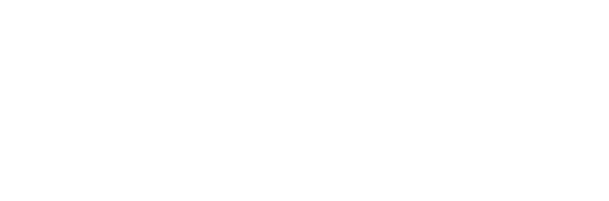
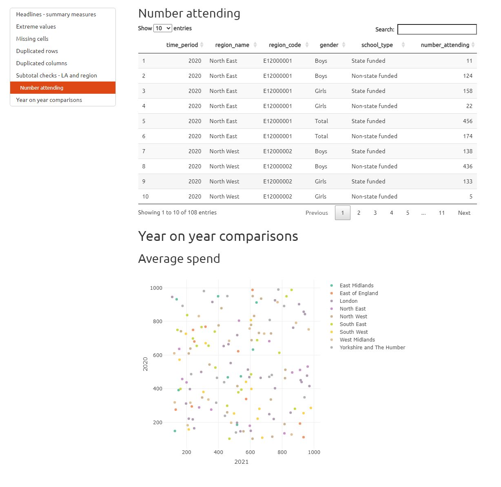

# Why am I here?

This session is designed to cover some of the basic principles of RAP from the perspective of a manager, to outline the level of technical skills (R, SQL, Git) that are expected, and to give you a chance to ask any questions that you might have.

Coding and technical skills form a core part of our work as analysts in DfE. To continue producing high quality statistics, teams need to maintain consistent levels of capability at all levels, and so should be looking to build and maintain these skills at every opportunity. If this doesn't happen, staff turnover or changes in technology may leave you at risk of being left with processes that your team are unable to run or make changes to. 

# What is this workshop for? 

In this workshop, our main aims are to:

- Avoid managers feeling "left behind" and lacking the confidence to effectively support their teams 
- Reduce the risk of single points of failure in teams where only one person has specific coding knowledge or ability
- Ensure that managers have skill levels at which they can effectively collaborate with and advise their peers and teams
- Be confident that managers know where to go for RAP advice and support if they cannot provide it directly themselves
- Provide information on resources available to allow you to build your skills 

There will be a second follow up workshop to build on this content and develop your technical skills further. 


# Do I really need technical skills as a manager? 

<br>

We understand that many managers won't be doing as much of the hands-on coding or technical work, but it's important to have strong enough skill levels in order to successfully support your teams to achieve their potential. 

<br>

Building your own skills will allow you to demonstrate effective technical leadership, provide advice to team members on how to develop their skills, and to cover during absence or busy periods. 

<br>

Improving your team's skills and applying elements of RAP will also build more flexible and resilient teams, reducing stress during periods of staff turnover or absence. 

# Intro quiz

::: {.column width="40%"}
:::

::: {.column width="20%"}
Menti:

{fig-align="center"}
:::

::: {.column width="40%"}
:::


# Q&A - what do you want to know?

::: {.column width="40%"}
:::

::: {.column width="20%"}
Slido:

{fig-align="center"}
:::

::: {.column width="40%"}
:::

# What is RAP?

::: {.fragment .fade-up}
<span style="color:#f67400;">**R**</span>eproducible <span style="color:#f67400;">**A**</span>nalytical <span style="color:#f67400;">**P**</span>ipelines are simply about having well-documented, reusable processes when analysing data, and ensuring we are transparent when we do!
:::

::: {.fragment .fade-up}
We already have *analytical pipelines* and have done for many years. The aim of RAP is to:
:::

::: {.fragment .fade-up}
-   Automate all of the parts that we can, e.g. rather than entering a hardcoded date repeatedly throughout your code, instead use one date variable that can be changed in one place and reused throughout
:::

::: {.fragment .fade-up}
-   Increase efficiency and accuracy by reducing the risk of human error, and making sure that calculations are done the same way each time wherever possible
:::

::: {.fragment .fade-up}
-   Create a clear audit trail using code and documentation to allow analysis to be easily reused where needed, either for repeated publications, or for PQ and FOI requests
:::

# What does RAP look like?

# RAP in "real life" - case studies

::: {.fragment .fade-up}
Implementing RAP best practices can free up time for us to focus on the parts of our work where human input adds true value.
:::

::::::::: columns
:::: {.column width="33%"}
::: {.fragment .fade-up}
> *"The previous process with the two Excel workbooks would take a couple of months to run, whereas now it can be run in a matter of hours."*\
> **- Matt Jago, Ops & infrastructure**
:::
::::

:::: {.column width="33%"}
::: {.fragment .fade-up}
> *"\[The improvements have\] reduced the human errors and also mean analysts and LA colleagues’ time can be spent on more valuable tasks."*\
> **- Family hubs research and analysis team**
:::
::::

:::: {.column width="33%"}
::: {.fragment .fade-up}
> *"The script itself is not complicated, but it removes the risk of human error and reduces the production time to minutes. The time saved can then be dedicated to further quality assurance."*\
> **- RAAC response analyst**
:::
::::
:::::::::

# Improving pipeline efficiency: before RAP

::: {.column width="10%"}
:::

::: {.column width="80%"}

:::

::: {.column width="10%"}
:::

# Improving pipeline efficiency: after RAP

::: {.column width="10%"}
:::

::: {.column width="80%"}

:::

::: {.column width="10%"}
:::

# What it means for managers: cross government RAP strategy

On our [RAP expectations page](https://dfe-analytical-services.github.io/analysts-guide/RAP/rap-expectations.html#analyst-managers), we have pulled out the expectations for analyst managers from the [cross-government RAP strategy](https://analysisfunction.civilservice.gov.uk/policy-store/reproducible-analytical-pipelines-strategy/), which include:

> -   build extra time into projects to adopt new skills and practices where appropriate
> -   learn the skills they need to manage software
> -   evaluate RAP projects within organisations to understand and demonstrate the benefits of RAP
> -   mandate their teams use RAP principles whenever possible

# What it means for managers: GSS and Analysis Function expectations

The [GSG competency framework](https://analysisfunction.civilservice.gov.uk/policy-store/competency-framework-for-the-government-statistician-group-gsg/) contains a Data Analysis strand, applicable to all grades, with the following requirements: 

> - Innovate and seek out new ways of analysing the data
> - Ensure that analysis is reproducible, transparent and robust using coding and code management best practices.

The [Analysis Function expectations](https://analysisfunction.civilservice.gov.uk/careers/career-framework) contain a core skill for:

> - Software programming, tools, and techniques — the ability to use coding and programming skills for data analysis


# What does it actually mean for managers?

# A nightmare scenario...

-   You get a call from your team member, they're too ill to come to work this week. Your other "coder" left the team a month ago and you haven't been able to replace them or train anyone else up yet, so no one else is around
-   Your team member was the only one who knew how to run the code for your publication
-   You're already behind schedule

No problem! You can just run the code yourself, right?

# Ok, first I need to find the code...

::: {.column width="100%"}
:::

::: {.column width="40%"}
This should be easy, it's in our shared folder because we haven't had a chance to move it to Azure DevOps yet...
:::

::: {.column width="60%"}
{fig-align="center" width="60%"}
:::

# 

::: {.column width="100%"}
{fig-align="center" width="60%"}
:::

# Ok, I think I've found the right code...

::: {.column width="100%"}
:::

::: {.column width="40%"}
It's been a little while since I've run this code, I ought to check the documentation to make sure I do it right
:::

::: {.column width="60%"}
{fig-align="center" width="75%"}
:::

# I'm sure there'll be comments in the code that tell me what to do...

::: {.column width="100%"}
:::

::: {.column width="100%"}
{fig-align="center" width="50%"}
:::

# Now there's a weird error

::: {.column width="100%"}
Time to ask for help!
:::

::: {.column width="100%"}
:::

::: {.column width="100%"}
{fig-align="center" width="40%"}
:::

# Of course...

-   This scenario is exaggerated, but it's not far from the truth of what we see in many teams
-   It's not just about the time it takes to find code in multiple folders and unpick and run undocumented processes and the stress it might cause, but the risk of errors and the lack of transparency


# How could RAP have avoided these issues?

# Finding the correct version of the code

-   Sensible folder and file structure <span style="color:#4472c4;">(**Good practice**)</span>
-   Version controlled final code scripts <span style="color:#70ad47;">(**Great practice**)</span>
-   Collaboratively develop code using Git <span style="color:#f67400;">(**Best practice**)</span>

Using Azure DevOps to store and version control your code scripts allows you to:

-   Immediately see the current version of any code your team has been using
-   View all historical versions of the code, along with when the changes were made, what they were, and who made them
-   Roll back to previous versions of the code if you encounter an issue with the current version
- Run each others' versions of local code to collaborate and debug issues
- Quickly work with the Statistics Development Team to resolve issues if they occur

# Understanding how to run the code

-   Documentation <span style="color:#4472c4;">(**Good practice**)</span>

In your Azure DevOps repo, you should have a README file that explains how to run the code, what it does, and any other important information about the code. This means that anyone in your team (including you!) can pick up the code and run it without needing to ask for help.

Your code should also be well-commented, so that anyone reading it can understand what each part of the code does. If sections of code need updating each time, these should be clearly indicated in the code comments.

# Running the code

-   All source data stored in a database <span style="color:#4472c4;">(**Good practice**)</span>
-   Recyclable code for future use <span style="color:#70ad47;">(**Great practice**)</span>

If your code is set up to read data from a database, you can be sure that the data you're using is up-to-date and accurate. This also means that you can easily update the data you're using without needing to change the code.

Recyclable code is code that can be used in multiple projects. This means that you can write code once and use it in multiple projects, saving time and reducing the risk of errors. This is particularly useful for code that is used in multiple publications, or for code that is used in multiple parts of the same publication.

# What is expected from managers

::: {.column width="45%"}
- You should have sufficient confidence and ability relevant to the work of your team to allow you to act as an effective technical leader, to build capability and resilience within your team, and to challenge processes to ensure high quality / value for effort and act as an effective support where needed through advice and peer review
- You should be familiar with our RAP standards as a framework for analytical work, and we expect managers to ensure that their teams are following these standards
:::

::: {.column width="5%"}
:::

::: {.column width="50%"}

<div class="mxgraph" style="max-width: 100%; border: 1px solid transparent; position: relative; touch-action: none; overflow: hidden; margin-top: 26px; width: 999px; height: 494px;" data-mxgraph="{&quot;lightbox&quot;:false,&quot;nav&quot;:true,&quot;resize&quot;:true,&quot;toolbar&quot;:&quot;zoom&quot;,&quot;edit&quot;:&quot;_blank&quot;,&quot;xml&quot;:&quot;<mxfile host=\&quot;app.diagrams.net\&quot; agent=\&quot;Mozilla/5.0 (Windows NT 10.0; Win64; x64) AppleWebKit/537.36 (KHTML, like Gecko) Chrome/131.0.0.0 Safari/537.36 Edg/131.0.0.0\&quot; version=\&quot;25.0.3\&quot;>\n  <diagram id=\&quot;_ltWYIdbVKAG_Xyvna0Y\&quot; name=\&quot;Page-1\&quot;>\n    <mxGraphModel dx=\&quot;1786\&quot; dy=\&quot;749\&quot; grid=\&quot;0\&quot; gridSize=\&quot;10\&quot; guides=\&quot;1\&quot; tooltips=\&quot;1\&quot; connect=\&quot;1\&quot; arrows=\&quot;1\&quot; fold=\&quot;1\&quot; page=\&quot;0\&quot; pageScale=\&quot;1\&quot; pageWidth=\&quot;827\&quot; pageHeight=\&quot;1169\&quot; math=\&quot;0\&quot; shadow=\&quot;0\&quot;>\n      <root>\n        <mxCell id=\&quot;0\&quot; />\n        <mxCell id=\&quot;1\&quot; parent=\&quot;0\&quot; />\n        <UserObject label=\&quot;Sensible folder and file structure\&quot; link=\&quot;#sensible-folder-and-file-structure\&quot; id=\&quot;t2OgNqa9NwPCjF_SyjkI-5\&quot;>\n          <mxCell style=\&quot;shape=hexagon;perimeter=hexagonPerimeter2;whiteSpace=wrap;html=1;fixedSize=1;rotation=90;size=30;direction=east;horizontal=0;fontColor=#FFFFFF;strokeColor=none;fillColor=#4472C4;spacingLeft=7;spacingRight=7;movable=0;resizable=0;rotatable=0;deletable=0;editable=0;connectable=0;fontSize=14;\&quot; parent=\&quot;1\&quot; vertex=\&quot;1\&quot;>\n            <mxGeometry x=\&quot;69\&quot; y=\&quot;326\&quot; width=\&quot;120\&quot; height=\&quot;120\&quot; as=\&quot;geometry\&quot; />\n          </mxCell>\n        </UserObject>\n        <UserObject label=\&quot;Use appropriate tools\&quot; link=\&quot;#appropriate-tools\&quot; id=\&quot;t2OgNqa9NwPCjF_SyjkI-6\&quot;>\n          <mxCell style=\&quot;shape=hexagon;perimeter=hexagonPerimeter2;whiteSpace=wrap;html=1;fixedSize=1;rotation=90;size=30;direction=east;horizontal=0;fontColor=#FFFFFF;fillColor=#4472C4;spacingLeft=7;spacingRight=7;rounded=0;shadow=0;sketch=0;backgroundOutline=0;gradientDirection=north;strokeColor=none;fontSize=14;\&quot; parent=\&quot;1\&quot; vertex=\&quot;1\&quot;>\n            <mxGeometry x=\&quot;-55\&quot; y=\&quot;326\&quot; width=\&quot;120\&quot; height=\&quot;120\&quot; as=\&quot;geometry\&quot; />\n          </mxCell>\n        </UserObject>\n        <UserObject label=\&quot;Processing is done with code\&quot; link=\&quot;#processing-is-done-with-code\&quot; id=\&quot;t2OgNqa9NwPCjF_SyjkI-7\&quot;>\n          <mxCell style=\&quot;shape=hexagon;perimeter=hexagonPerimeter2;whiteSpace=wrap;html=1;fixedSize=1;rotation=90;size=30;direction=east;horizontal=0;fontColor=#FFFFFF;strokeColor=none;fillColor=#4472C4;spacingLeft=7;spacingRight=7;fontSize=14;\&quot; parent=\&quot;1\&quot; vertex=\&quot;1\&quot;>\n            <mxGeometry x=\&quot;7\&quot; y=\&quot;420\&quot; width=\&quot;120\&quot; height=\&quot;120\&quot; as=\&quot;geometry\&quot; />\n          </mxCell>\n        </UserObject>\n        <UserObject label=\&quot;Basic automated QA\&quot; link=\&quot;#basic-automated-qa\&quot; id=\&quot;t2OgNqa9NwPCjF_SyjkI-8\&quot;>\n          <mxCell style=\&quot;shape=hexagon;perimeter=hexagonPerimeter2;whiteSpace=wrap;html=1;fixedSize=1;rotation=90;size=30;direction=east;horizontal=0;fontColor=#FFFFFF;strokeColor=none;fillColor=#4472C4;spacingLeft=7;spacingRight=7;fontSize=14;\&quot; parent=\&quot;1\&quot; vertex=\&quot;1\&quot;>\n            <mxGeometry x=\&quot;132\&quot; y=\&quot;420\&quot; width=\&quot;120\&quot; height=\&quot;120\&quot; as=\&quot;geometry\&quot; />\n          </mxCell>\n        </UserObject>\n        <UserObject label=\&quot;All source data stored in a database\&quot; link=\&quot;#all-source-data-stored-in-a-database\&quot; id=\&quot;t2OgNqa9NwPCjF_SyjkI-9\&quot;>\n          <mxCell style=\&quot;shape=hexagon;perimeter=hexagonPerimeter2;whiteSpace=wrap;html=1;fixedSize=1;rotation=90;size=30;direction=east;horizontal=0;fontColor=#FFFFFF;strokeColor=none;fillColor=#4472C4;spacingLeft=7;spacingRight=7;fontSize=14;\&quot; parent=\&quot;1\&quot; vertex=\&quot;1\&quot;>\n            <mxGeometry x=\&quot;-118\&quot; y=\&quot;420\&quot; width=\&quot;120\&quot; height=\&quot;120\&quot; as=\&quot;geometry\&quot; />\n          </mxCell>\n        </UserObject>\n        <UserObject label=\&quot;Files meet data standards\&quot; link=\&quot;../creating-statistics/ud.html#how-to-check-against-these-standards\&quot; id=\&quot;t2OgNqa9NwPCjF_SyjkI-10\&quot;>\n          <mxCell style=\&quot;shape=hexagon;perimeter=hexagonPerimeter2;whiteSpace=wrap;html=1;fixedSize=1;rotation=90;size=30;direction=east;horizontal=0;fontColor=#FFFFFF;strokeColor=none;fillColor=#4472C4;spacingLeft=7;spacingRight=7;fontSize=14;\&quot; parent=\&quot;1\&quot; vertex=\&quot;1\&quot;>\n            <mxGeometry x=\&quot;-55\&quot; y=\&quot;514\&quot; width=\&quot;120\&quot; height=\&quot;120\&quot; as=\&quot;geometry\&quot; />\n          </mxCell>\n        </UserObject>\n        <UserObject label=\&quot;Documentation\&quot; link=\&quot;#documentation\&quot; id=\&quot;t2OgNqa9NwPCjF_SyjkI-11\&quot;>\n          <mxCell style=\&quot;shape=hexagon;perimeter=hexagonPerimeter2;whiteSpace=wrap;html=1;fixedSize=1;rotation=90;size=30;direction=east;horizontal=0;fontColor=#FFFFFF;strokeColor=none;fillColor=#4472C4;spacingLeft=7;spacingRight=7;fontSize=14;\&quot; parent=\&quot;1\&quot; vertex=\&quot;1\&quot;>\n            <mxGeometry x=\&quot;69\&quot; y=\&quot;514\&quot; width=\&quot;120\&quot; height=\&quot;120\&quot; as=\&quot;geometry\&quot; />\n          </mxCell>\n        </UserObject>\n        <UserObject label=\&quot;Version controlled final code scripts\&quot; link=\&quot;#version-controlled-final-code-scripts\&quot; id=\&quot;t2OgNqa9NwPCjF_SyjkI-12\&quot;>\n          <mxCell style=\&quot;shape=hexagon;perimeter=hexagonPerimeter2;whiteSpace=wrap;html=1;fixedSize=1;rotation=90;size=30;direction=east;horizontal=0;fillColor=#70AD47;strokeColor=none;fontColor=#FFFFFF;spacingLeft=7;spacingRight=7;fontSize=14;\&quot; parent=\&quot;1\&quot; vertex=\&quot;1\&quot;>\n            <mxGeometry x=\&quot;320\&quot; y=\&quot;327\&quot; width=\&quot;120\&quot; height=\&quot;120\&quot; as=\&quot;geometry\&quot; />\n          </mxCell>\n        </UserObject>\n        <UserObject label=\&quot;Recyclable code for future use\&quot; link=\&quot;#recyclable-code-for-future-use\&quot; id=\&quot;t2OgNqa9NwPCjF_SyjkI-13\&quot;>\n          <mxCell style=\&quot;shape=hexagon;perimeter=hexagonPerimeter2;whiteSpace=wrap;html=1;fixedSize=1;rotation=90;size=30;direction=east;horizontal=0;fillColor=#70AD47;strokeColor=none;fontColor=#FFFFFF;spacingLeft=7;spacingRight=7;fontSize=14;\&quot; parent=\&quot;1\&quot; vertex=\&quot;1\&quot;>\n            <mxGeometry x=\&quot;195\&quot; y=\&quot;326\&quot; width=\&quot;120\&quot; height=\&quot;120\&quot; as=\&quot;geometry\&quot; />\n          </mxCell>\n        </UserObject>\n        <UserObject label=\&quot;Dataset production scripts\&quot; link=\&quot;#dataset-production-scripts\&quot; id=\&quot;t2OgNqa9NwPCjF_SyjkI-14\&quot;>\n          <mxCell style=\&quot;shape=hexagon;perimeter=hexagonPerimeter2;whiteSpace=wrap;html=1;fixedSize=1;rotation=90;size=30;direction=east;horizontal=0;fillColor=#70AD47;strokeColor=none;fontColor=#FFFFFF;spacingLeft=7;spacingRight=7;fontSize=14;\&quot; parent=\&quot;1\&quot; vertex=\&quot;1\&quot;>\n            <mxGeometry x=\&quot;257\&quot; y=\&quot;421\&quot; width=\&quot;120\&quot; height=\&quot;120\&quot; as=\&quot;geometry\&quot; />\n          </mxCell>\n        </UserObject>\n        <UserObject label=\&quot;Publication specific automated QA\&quot; link=\&quot;#publication-specific-automated-qa\&quot; id=\&quot;t2OgNqa9NwPCjF_SyjkI-15\&quot;>\n          <mxCell style=\&quot;shape=hexagon;perimeter=hexagonPerimeter2;whiteSpace=wrap;html=1;fixedSize=1;rotation=90;size=30;direction=east;horizontal=0;fillColor=#70AD47;strokeColor=none;fontColor=#FFFFFF;spacingLeft=7;spacingRight=7;fontSize=14;\&quot; parent=\&quot;1\&quot; vertex=\&quot;1\&quot;>\n            <mxGeometry x=\&quot;382\&quot; y=\&quot;421\&quot; width=\&quot;120\&quot; height=\&quot;120\&quot; as=\&quot;geometry\&quot; />\n          </mxCell>\n        </UserObject>\n        <UserObject label=\&quot;Automated summaries\&quot; link=\&quot;#automated-summaries\&quot; id=\&quot;t2OgNqa9NwPCjF_SyjkI-17\&quot;>\n          <mxCell style=\&quot;shape=hexagon;perimeter=hexagonPerimeter2;whiteSpace=wrap;html=1;fixedSize=1;rotation=90;size=30;direction=east;horizontal=0;fillColor=#70AD47;strokeColor=none;fontColor=#FFFFFF;spacingLeft=7;spacingRight=7;fontSize=14;\&quot; parent=\&quot;1\&quot; vertex=\&quot;1\&quot;>\n            <mxGeometry x=\&quot;194\&quot; y=\&quot;515\&quot; width=\&quot;120\&quot; height=\&quot;120\&quot; as=\&quot;geometry\&quot; />\n          </mxCell>\n        </UserObject>\n        <UserObject label=\&quot;Peer review of code within team\&quot; link=\&quot;#review-of-code-within-team\&quot; id=\&quot;t2OgNqa9NwPCjF_SyjkI-18\&quot;>\n          <mxCell style=\&quot;shape=hexagon;perimeter=hexagonPerimeter2;whiteSpace=wrap;html=1;fixedSize=1;rotation=90;size=30;direction=east;horizontal=0;fillColor=#70AD47;strokeColor=none;fontColor=#FFFFFF;spacingLeft=7;spacingRight=7;fontSize=14;\&quot; parent=\&quot;1\&quot; vertex=\&quot;1\&quot;>\n            <mxGeometry x=\&quot;319\&quot; y=\&quot;515\&quot; width=\&quot;120\&quot; height=\&quot;120\&quot; as=\&quot;geometry\&quot; />\n          </mxCell>\n        </UserObject>\n        <UserObject label=\&quot;Collaboratively develop code using git\&quot; link=\&quot;#collaboratively-develop-code-using-git\&quot; id=\&quot;t2OgNqa9NwPCjF_SyjkI-19\&quot;>\n          <mxCell style=\&quot;shape=hexagon;perimeter=hexagonPerimeter2;whiteSpace=wrap;html=1;fixedSize=1;rotation=90;size=30;direction=east;horizontal=0;fillColor=#ED7D31;strokeColor=none;fontColor=#FFFFFF;spacingLeft=7;spacingRight=7;fontSize=14;\&quot; parent=\&quot;1\&quot; vertex=\&quot;1\&quot;>\n            <mxGeometry x=\&quot;674\&quot; y=\&quot;326\&quot; width=\&quot;120\&quot; height=\&quot;120\&quot; as=\&quot;geometry\&quot; />\n          </mxCell>\n        </UserObject>\n        <UserObject label=\&quot;&amp;#39;Clean&amp;#39; final code\&quot; link=\&quot;#clean-final-code\&quot; id=\&quot;t2OgNqa9NwPCjF_SyjkI-20\&quot;>\n          <mxCell style=\&quot;shape=hexagon;perimeter=hexagonPerimeter2;whiteSpace=wrap;html=1;fixedSize=1;rotation=90;size=30;direction=east;horizontal=0;fillColor=#ED7D31;strokeColor=none;fontColor=#FFFFFF;spacingLeft=7;spacingRight=7;fontSize=14;\&quot; parent=\&quot;1\&quot; vertex=\&quot;1\&quot;>\n            <mxGeometry x=\&quot;550\&quot; y=\&quot;326\&quot; width=\&quot;120\&quot; height=\&quot;120\&quot; as=\&quot;geometry\&quot; />\n          </mxCell>\n        </UserObject>\n        <UserObject label=\&quot;&amp;lt;div style=&amp;quot;&amp;quot;&amp;gt;&amp;lt;font style=&amp;quot;font-size: 14px;&amp;quot;&amp;gt;Whole publication production scripts&amp;lt;/font&amp;gt;&amp;lt;/div&amp;gt;\&quot; link=\&quot;#whole-publication-production-scripts\&quot; id=\&quot;t2OgNqa9NwPCjF_SyjkI-21\&quot;>\n          <mxCell style=\&quot;shape=hexagon;perimeter=hexagonPerimeter2;whiteSpace=wrap;html=1;fixedSize=1;rotation=90;size=30;direction=east;horizontal=0;fillColor=#ED7D31;strokeColor=none;fontColor=#FFFFFF;spacingLeft=7;spacingRight=7;fontSize=14;align=center;\&quot; parent=\&quot;1\&quot; vertex=\&quot;1\&quot;>\n            <mxGeometry x=\&quot;612\&quot; y=\&quot;420\&quot; width=\&quot;120\&quot; height=\&quot;120\&quot; as=\&quot;geometry\&quot; />\n          </mxCell>\n        </UserObject>\n        <UserObject label=\&quot;Use open source repositories\&quot; link=\&quot;#use-open-source-repositories\&quot; id=\&quot;t2OgNqa9NwPCjF_SyjkI-22\&quot;>\n          <mxCell style=\&quot;shape=hexagon;perimeter=hexagonPerimeter2;whiteSpace=wrap;html=1;fixedSize=1;rotation=90;size=30;direction=east;horizontal=0;fillColor=#ED7D31;strokeColor=none;fontColor=#FFFFFF;spacingLeft=7;spacingRight=7;fontSize=14;\&quot; parent=\&quot;1\&quot; vertex=\&quot;1\&quot;>\n            <mxGeometry x=\&quot;737\&quot; y=\&quot;420\&quot; width=\&quot;120\&quot; height=\&quot;120\&quot; as=\&quot;geometry\&quot; />\n          </mxCell>\n        </UserObject>\n        <UserObject label=\&quot;Publication specific automated summaries\&quot; link=\&quot;#publication-specific-automated-summaries\&quot; id=\&quot;t2OgNqa9NwPCjF_SyjkI-23\&quot;>\n          <mxCell style=\&quot;shape=hexagon;perimeter=hexagonPerimeter2;whiteSpace=wrap;html=1;fixedSize=1;rotation=90;size=30;direction=east;horizontal=0;fillColor=#ED7D31;strokeColor=none;fontColor=#FFFFFF;spacingLeft=7;spacingRight=7;fontSize=14;\&quot; parent=\&quot;1\&quot; vertex=\&quot;1\&quot;>\n            <mxGeometry x=\&quot;550\&quot; y=\&quot;514\&quot; width=\&quot;120\&quot; height=\&quot;120\&quot; as=\&quot;geometry\&quot; />\n          </mxCell>\n        </UserObject>\n        <UserObject label=\&quot;Peer review of code from outside the team\&quot; link=\&quot;#review-of-code-from-outside-the-team\&quot; id=\&quot;t2OgNqa9NwPCjF_SyjkI-24\&quot;>\n          <mxCell style=\&quot;shape=hexagon;perimeter=hexagonPerimeter2;whiteSpace=wrap;html=1;fixedSize=1;rotation=90;size=30;direction=east;horizontal=0;fillColor=#ED7D31;strokeColor=none;fontColor=#FFFFFF;spacingLeft=7;spacingRight=7;fontSize=14;\&quot; parent=\&quot;1\&quot; vertex=\&quot;1\&quot;>\n            <mxGeometry x=\&quot;674\&quot; y=\&quot;514\&quot; width=\&quot;120\&quot; height=\&quot;120\&quot; as=\&quot;geometry\&quot; />\n          </mxCell>\n        </UserObject>\n        <mxCell id=\&quot;t2OgNqa9NwPCjF_SyjkI-25\&quot; value=\&quot;&amp;lt;font style=&amp;quot;font-size: 32px&amp;quot; color=&amp;quot;#4472c4&amp;quot;&amp;gt;Good practice&amp;lt;/font&amp;gt;\&quot; style=\&quot;text;html=1;align=center;verticalAlign=middle;resizable=0;points=[];autosize=1;fontColor=#FFFFFF;\&quot; parent=\&quot;1\&quot; vertex=\&quot;1\&quot;>\n          <mxGeometry x=\&quot;-38\&quot; y=\&quot;652\&quot; width=\&quot;210\&quot; height=\&quot;30\&quot; as=\&quot;geometry\&quot; />\n        </mxCell>\n        <mxCell id=\&quot;t2OgNqa9NwPCjF_SyjkI-26\&quot; value=\&quot;&amp;lt;font style=&amp;quot;font-size: 32px&amp;quot; color=&amp;quot;#70ad47&amp;quot;&amp;gt;Great practice&amp;lt;/font&amp;gt;\&quot; style=\&quot;text;html=1;align=center;verticalAlign=middle;resizable=0;points=[];autosize=1;fontColor=#FFFFFF;\&quot; parent=\&quot;1\&quot; vertex=\&quot;1\&quot;>\n          <mxGeometry x=\&quot;206\&quot; y=\&quot;652\&quot; width=\&quot;220\&quot; height=\&quot;30\&quot; as=\&quot;geometry\&quot; />\n        </mxCell>\n        <mxCell id=\&quot;t2OgNqa9NwPCjF_SyjkI-27\&quot; value=\&quot;&amp;lt;font style=&amp;quot;font-size: 32px&amp;quot; color=&amp;quot;#ed7d31&amp;quot;&amp;gt;Best practice&amp;lt;/font&amp;gt;\&quot; style=\&quot;text;html=1;align=center;verticalAlign=middle;resizable=0;points=[];autosize=1;fontColor=#FFFFFF;\&quot; parent=\&quot;1\&quot; vertex=\&quot;1\&quot;>\n          <mxGeometry x=\&quot;572\&quot; y=\&quot;652\&quot; width=\&quot;200\&quot; height=\&quot;30\&quot; as=\&quot;geometry\&quot; />\n        </mxCell>\n        <mxCell id=\&quot;S840XJ58BQc_PQPuIZfj-1\&quot; value=\&quot;\&quot; style=\&quot;shape=curlyBracket;whiteSpace=wrap;html=1;rounded=1;labelPosition=left;verticalLabelPosition=middle;align=right;verticalAlign=middle;fontSize=13;rotation=90;strokeWidth=2;strokeColor=#4472c4;gradientColor=none;\&quot; parent=\&quot;1\&quot; vertex=\&quot;1\&quot;>\n          <mxGeometry x=\&quot;168.5\&quot; y=\&quot;26\&quot; width=\&quot;47\&quot; height=\&quot;538\&quot; as=\&quot;geometry\&quot; />\n        </mxCell>\n        <mxCell id=\&quot;S840XJ58BQc_PQPuIZfj-2\&quot; value=\&quot;&amp;lt;font style=&amp;quot;font-size: 32px&amp;quot; color=&amp;quot;#4472c4&amp;quot;&amp;gt;Baseline expectation&amp;lt;/font&amp;gt;\&quot; style=\&quot;text;html=1;align=center;verticalAlign=middle;resizable=0;points=[];autosize=1;fontColor=#FFFFFF;\&quot; parent=\&quot;1\&quot; vertex=\&quot;1\&quot;>\n          <mxGeometry x=\&quot;35.5\&quot; y=\&quot;216\&quot; width=\&quot;313\&quot; height=\&quot;50\&quot; as=\&quot;geometry\&quot; />\n        </mxCell>\n        <mxCell id=\&quot;S840XJ58BQc_PQPuIZfj-4\&quot; value=\&quot;\&quot; style=\&quot;shape=curlyBracket;whiteSpace=wrap;html=1;rounded=1;labelPosition=left;verticalLabelPosition=middle;align=right;verticalAlign=middle;fontSize=13;rotation=90;strokeWidth=2;strokeColor=#ed7d31;gradientColor=none;\&quot; parent=\&quot;1\&quot; vertex=\&quot;1\&quot;>\n          <mxGeometry x=\&quot;659\&quot; y=\&quot;145\&quot; width=\&quot;47\&quot; height=\&quot;292\&quot; as=\&quot;geometry\&quot; />\n        </mxCell>\n        <mxCell id=\&quot;S840XJ58BQc_PQPuIZfj-5\&quot; value=\&quot;&amp;lt;font color=&amp;quot;#ed7d31&amp;quot; style=&amp;quot;font-size: 32px&amp;quot;&amp;gt;Ambition&amp;lt;/font&amp;gt;\&quot; style=\&quot;text;html=1;align=center;verticalAlign=middle;resizable=0;points=[];autosize=1;fontColor=#FFFFFF;\&quot; parent=\&quot;1\&quot; vertex=\&quot;1\&quot;>\n          <mxGeometry x=\&quot;612\&quot; y=\&quot;216\&quot; width=\&quot;143\&quot; height=\&quot;50\&quot; as=\&quot;geometry\&quot; />\n        </mxCell>\n      </root>\n    </mxGraphModel>\n  </diagram>\n</mxfile>\n&quot;}"><svg style="left: 0px; top: 0px; width: 100%; height: 100%; display: block; min-width: 999px; min-height: 494px; background-image: none; background-color: transparent;"><defs><filter id="dropShadow"><feGaussianBlur in="SourceAlpha" stdDeviation="1.7" result="blur"></feGaussianBlur><feOffset in="blur" dx="3" dy="3" result="offsetBlur"></feOffset><feFlood flood-color="#3D4574" flood-opacity="0.4" result="offsetColor"></feFlood><feComposite in="offsetColor" in2="offsetBlur" operator="in" result="offsetBlur"></feComposite><feBlend in="SourceGraphic" in2="offsetBlur"></feBlend></filter></defs><g transformOrigin="0 0" transform="scale(1,1)translate(126,-208)"><g></g><g><g transform="translate(0.5,0.5)" style="visibility: visible;"><path d="M 99 326 L 159 326 L 189 386 L 159 446 L 99 446 L 69 386 Z" fill="#4472c4" stroke="none" transform="rotate(90,129,386)" pointer-events="all"></path></g><g style=""><g><foreignObject pointer-events="none" width="100%" height="100%" style="overflow: visible; text-align: left;"><div style="display: flex; align-items: unsafe center; justify-content: unsafe center; width: 104px; height: 1px; padding-top: 386px; margin-left: 77px;"><div data-drawio-colors="color: #FFFFFF; " style="box-sizing: border-box; font-size: 0px; text-align: center;"><div style="display: inline-block; font-size: 14px; font-family: Helvetica; color: rgb(255, 255, 255); line-height: 1.2; pointer-events: all; white-space: normal; overflow-wrap: normal;">Sensible folder and file structure</div></div></div></foreignObject></g></g><g transform="translate(0.5,0.5)" style="visibility: visible; cursor: pointer;"><path d="M -25 326 L 35 326 L 65 386 L 35 446 L -25 446 L -55 386 Z" fill="#4472c4" stroke="none" transform="rotate(90,5,386)" pointer-events="all"></path></g><g style="cursor: pointer;"><g><foreignObject pointer-events="none" width="100%" height="100%" style="overflow: visible; text-align: left;"><div style="display: flex; align-items: unsafe center; justify-content: unsafe center; width: 104px; height: 1px; padding-top: 386px; margin-left: -47px;"><div data-drawio-colors="color: #FFFFFF; " style="box-sizing: border-box; font-size: 0px; text-align: center;"><div style="display: inline-block; font-size: 14px; font-family: Helvetica; color: rgb(255, 255, 255); line-height: 1.2; pointer-events: all; white-space: normal; overflow-wrap: normal;">Use appropriate tools</div></div></div></foreignObject></g></g><g transform="translate(0.5,0.5)" style="visibility: visible;"><path d="M 37 420 L 97 420 L 127 480 L 97 540 L 37 540 L 7 480 Z" fill="#4472c4" stroke="none" transform="rotate(90,67,480)" pointer-events="all"></path></g><g style=""><g><foreignObject pointer-events="none" width="100%" height="100%" style="overflow: visible; text-align: left;"><div style="display: flex; align-items: unsafe center; justify-content: unsafe center; width: 104px; height: 1px; padding-top: 480px; margin-left: 15px;"><div data-drawio-colors="color: #FFFFFF; " style="box-sizing: border-box; font-size: 0px; text-align: center;"><div style="display: inline-block; font-size: 14px; font-family: Helvetica; color: rgb(255, 255, 255); line-height: 1.2; pointer-events: all; white-space: normal; overflow-wrap: normal;">Processing is done with code</div></div></div></foreignObject></g></g><g transform="translate(0.5,0.5)" style="visibility: visible;"><path d="M 162 420 L 222 420 L 252 480 L 222 540 L 162 540 L 132 480 Z" fill="#4472c4" stroke="none" transform="rotate(90,192,480)" pointer-events="all"></path></g><g style=""><g><foreignObject pointer-events="none" width="100%" height="100%" style="overflow: visible; text-align: left;"><div style="display: flex; align-items: unsafe center; justify-content: unsafe center; width: 104px; height: 1px; padding-top: 480px; margin-left: 140px;"><div data-drawio-colors="color: #FFFFFF; " style="box-sizing: border-box; font-size: 0px; text-align: center;"><div style="display: inline-block; font-size: 14px; font-family: Helvetica; color: rgb(255, 255, 255); line-height: 1.2; pointer-events: all; white-space: normal; overflow-wrap: normal;">Basic automated QA</div></div></div></foreignObject></g></g><g transform="translate(0.5,0.5)" style="visibility: visible;"><path d="M -88 420 L -28 420 L 2 480 L -28 540 L -88 540 L -118 480 Z" fill="#4472c4" stroke="none" transform="rotate(90,-58,480)" pointer-events="all"></path></g><g style=""><g><foreignObject pointer-events="none" width="100%" height="100%" style="overflow: visible; text-align: left;"><div style="display: flex; align-items: unsafe center; justify-content: unsafe center; width: 104px; height: 1px; padding-top: 480px; margin-left: -110px;"><div data-drawio-colors="color: #FFFFFF; " style="box-sizing: border-box; font-size: 0px; text-align: center;"><div style="display: inline-block; font-size: 14px; font-family: Helvetica; color: rgb(255, 255, 255); line-height: 1.2; pointer-events: all; white-space: normal; overflow-wrap: normal;">All source data stored in a database</div></div></div></foreignObject></g></g><g transform="translate(0.5,0.5)" style="visibility: visible;"><path d="M -25 514 L 35 514 L 65 574 L 35 634 L -25 634 L -55 574 Z" fill="#4472c4" stroke="none" transform="rotate(90,5,574)" pointer-events="all"></path></g><g style=""><g><foreignObject pointer-events="none" width="100%" height="100%" style="overflow: visible; text-align: left;"><div style="display: flex; align-items: unsafe center; justify-content: unsafe center; width: 104px; height: 1px; padding-top: 574px; margin-left: -47px;"><div data-drawio-colors="color: #FFFFFF; " style="box-sizing: border-box; font-size: 0px; text-align: center;"><div style="display: inline-block; font-size: 14px; font-family: Helvetica; color: rgb(255, 255, 255); line-height: 1.2; pointer-events: all; white-space: normal; overflow-wrap: normal;">Files meet data standards</div></div></div></foreignObject></g></g><g transform="translate(0.5,0.5)" style="visibility: visible;"><path d="M 99 514 L 159 514 L 189 574 L 159 634 L 99 634 L 69 574 Z" fill="#4472c4" stroke="none" transform="rotate(90,129,574)" pointer-events="all"></path></g><g style=""><g><foreignObject pointer-events="none" width="100%" height="100%" style="overflow: visible; text-align: left;"><div style="display: flex; align-items: unsafe center; justify-content: unsafe center; width: 104px; height: 1px; padding-top: 574px; margin-left: 77px;"><div data-drawio-colors="color: #FFFFFF; " style="box-sizing: border-box; font-size: 0px; text-align: center;"><div style="display: inline-block; font-size: 14px; font-family: Helvetica; color: rgb(255, 255, 255); line-height: 1.2; pointer-events: all; white-space: normal; overflow-wrap: normal;">Documentation</div></div></div></foreignObject></g></g><g transform="translate(0.5,0.5)" style="visibility: visible;"><path d="M 350 327 L 410 327 L 440 387 L 410 447 L 350 447 L 320 387 Z" fill="#70ad47" stroke="none" transform="rotate(90,380,387)" pointer-events="all"></path></g><g style=""><g><foreignObject pointer-events="none" width="100%" height="100%" style="overflow: visible; text-align: left;"><div style="display: flex; align-items: unsafe center; justify-content: unsafe center; width: 104px; height: 1px; padding-top: 387px; margin-left: 328px;"><div data-drawio-colors="color: #FFFFFF; " style="box-sizing: border-box; font-size: 0px; text-align: center;"><div style="display: inline-block; font-size: 14px; font-family: Helvetica; color: rgb(255, 255, 255); line-height: 1.2; pointer-events: all; white-space: normal; overflow-wrap: normal;">Version controlled final code scripts</div></div></div></foreignObject></g></g><g transform="translate(0.5,0.5)" style="visibility: visible;"><path d="M 225 326 L 285 326 L 315 386 L 285 446 L 225 446 L 195 386 Z" fill="#70ad47" stroke="none" transform="rotate(90,255,386)" pointer-events="all"></path></g><g style=""><g><foreignObject pointer-events="none" width="100%" height="100%" style="overflow: visible; text-align: left;"><div style="display: flex; align-items: unsafe center; justify-content: unsafe center; width: 104px; height: 1px; padding-top: 386px; margin-left: 203px;"><div data-drawio-colors="color: #FFFFFF; " style="box-sizing: border-box; font-size: 0px; text-align: center;"><div style="display: inline-block; font-size: 14px; font-family: Helvetica; color: rgb(255, 255, 255); line-height: 1.2; pointer-events: all; white-space: normal; overflow-wrap: normal;">Recyclable code for future use</div></div></div></foreignObject></g></g><g transform="translate(0.5,0.5)" style="visibility: visible;"><path d="M 287 421 L 347 421 L 377 481 L 347 541 L 287 541 L 257 481 Z" fill="#70ad47" stroke="none" transform="rotate(90,317,481)" pointer-events="all"></path></g><g style=""><g><foreignObject pointer-events="none" width="100%" height="100%" style="overflow: visible; text-align: left;"><div style="display: flex; align-items: unsafe center; justify-content: unsafe center; width: 104px; height: 1px; padding-top: 481px; margin-left: 265px;"><div data-drawio-colors="color: #FFFFFF; " style="box-sizing: border-box; font-size: 0px; text-align: center;"><div style="display: inline-block; font-size: 14px; font-family: Helvetica; color: rgb(255, 255, 255); line-height: 1.2; pointer-events: all; white-space: normal; overflow-wrap: normal;">Dataset production scripts</div></div></div></foreignObject></g></g><g transform="translate(0.5,0.5)" style="visibility: visible;"><path d="M 412 421 L 472 421 L 502 481 L 472 541 L 412 541 L 382 481 Z" fill="#70ad47" stroke="none" transform="rotate(90,442,481)" pointer-events="all"></path></g><g style=""><g><foreignObject pointer-events="none" width="100%" height="100%" style="overflow: visible; text-align: left;"><div style="display: flex; align-items: unsafe center; justify-content: unsafe center; width: 104px; height: 1px; padding-top: 481px; margin-left: 390px;"><div data-drawio-colors="color: #FFFFFF; " style="box-sizing: border-box; font-size: 0px; text-align: center;"><div style="display: inline-block; font-size: 14px; font-family: Helvetica; color: rgb(255, 255, 255); line-height: 1.2; pointer-events: all; white-space: normal; overflow-wrap: normal;">Publication specific automated QA</div></div></div></foreignObject></g></g><g transform="translate(0.5,0.5)" style="visibility: visible;"><path d="M 224 515 L 284 515 L 314 575 L 284 635 L 224 635 L 194 575 Z" fill="#70ad47" stroke="none" transform="rotate(90,254,575)" pointer-events="all"></path></g><g style=""><g><foreignObject pointer-events="none" width="100%" height="100%" style="overflow: visible; text-align: left;"><div style="display: flex; align-items: unsafe center; justify-content: unsafe center; width: 104px; height: 1px; padding-top: 575px; margin-left: 202px;"><div data-drawio-colors="color: #FFFFFF; " style="box-sizing: border-box; font-size: 0px; text-align: center;"><div style="display: inline-block; font-size: 14px; font-family: Helvetica; color: rgb(255, 255, 255); line-height: 1.2; pointer-events: all; white-space: normal; overflow-wrap: normal;">Automated summaries</div></div></div></foreignObject></g></g><g transform="translate(0.5,0.5)" style="visibility: visible;"><path d="M 349 515 L 409 515 L 439 575 L 409 635 L 349 635 L 319 575 Z" fill="#70ad47" stroke="none" transform="rotate(90,379,575)" pointer-events="all"></path></g><g style=""><g><foreignObject pointer-events="none" width="100%" height="100%" style="overflow: visible; text-align: left;"><div style="display: flex; align-items: unsafe center; justify-content: unsafe center; width: 104px; height: 1px; padding-top: 575px; margin-left: 327px;"><div data-drawio-colors="color: #FFFFFF; " style="box-sizing: border-box; font-size: 0px; text-align: center;"><div style="display: inline-block; font-size: 14px; font-family: Helvetica; color: rgb(255, 255, 255); line-height: 1.2; pointer-events: all; white-space: normal; overflow-wrap: normal;">Peer review of code within team</div></div></div></foreignObject></g></g><g transform="translate(0.5,0.5)" style="visibility: visible; cursor: pointer;"><path d="M 704 326 L 764 326 L 794 386 L 764 446 L 704 446 L 674 386 Z" fill="#ed7d31" stroke="none" transform="rotate(90,734,386)" pointer-events="all"></path></g><g style="cursor: pointer;"><g><foreignObject pointer-events="none" width="100%" height="100%" style="overflow: visible; text-align: left;"><div style="display: flex; align-items: unsafe center; justify-content: unsafe center; width: 104px; height: 1px; padding-top: 386px; margin-left: 682px;"><div data-drawio-colors="color: #FFFFFF; " style="box-sizing: border-box; font-size: 0px; text-align: center;"><div style="display: inline-block; font-size: 14px; font-family: Helvetica; color: rgb(255, 255, 255); line-height: 1.2; pointer-events: all; white-space: normal; overflow-wrap: normal;">Collaboratively develop code using git</div></div></div></foreignObject></g></g><g transform="translate(0.5,0.5)" style="visibility: visible;"><path d="M 580 326 L 640 326 L 670 386 L 640 446 L 580 446 L 550 386 Z" fill="#ed7d31" stroke="none" transform="rotate(90,610,386)" pointer-events="all"></path></g><g style=""><g><foreignObject pointer-events="none" width="100%" height="100%" style="overflow: visible; text-align: left;"><div style="display: flex; align-items: unsafe center; justify-content: unsafe center; width: 104px; height: 1px; padding-top: 386px; margin-left: 558px;"><div data-drawio-colors="color: #FFFFFF; " style="box-sizing: border-box; font-size: 0px; text-align: center;"><div style="display: inline-block; font-size: 14px; font-family: Helvetica; color: rgb(255, 255, 255); line-height: 1.2; pointer-events: all; white-space: normal; overflow-wrap: normal;">'Clean' final code</div></div></div></foreignObject></g></g><g transform="translate(0.5,0.5)" style="visibility: visible; cursor: pointer;"><path d="M 642 420 L 702 420 L 732 480 L 702 540 L 642 540 L 612 480 Z" fill="#ed7d31" stroke="none" transform="rotate(90,672,480)" pointer-events="all"></path></g><g style="cursor: pointer;"><g><foreignObject pointer-events="none" width="100%" height="100%" style="overflow: visible; text-align: left;"><div style="display: flex; align-items: unsafe center; justify-content: unsafe center; width: 104px; height: 1px; padding-top: 480px; margin-left: 620px;"><div data-drawio-colors="color: #FFFFFF; " style="box-sizing: border-box; font-size: 0px; text-align: center;"><div style="display: inline-block; font-size: 14px; font-family: Helvetica; color: rgb(255, 255, 255); line-height: 1.2; pointer-events: all; white-space: normal; overflow-wrap: normal;"><div style=""><font style="font-size: 14px;">Whole publication production scripts</font></div></div></div></div></foreignObject></g></g><g transform="translate(0.5,0.5)" style="visibility: visible; cursor: pointer;"><path d="M 767 420 L 827 420 L 857 480 L 827 540 L 767 540 L 737 480 Z" fill="#ed7d31" stroke="none" transform="rotate(90,797,480)" pointer-events="all"></path></g><g style="cursor: pointer;"><g><foreignObject pointer-events="none" width="100%" height="100%" style="overflow: visible; text-align: left;"><div style="display: flex; align-items: unsafe center; justify-content: unsafe center; width: 104px; height: 1px; padding-top: 480px; margin-left: 745px;"><div data-drawio-colors="color: #FFFFFF; " style="box-sizing: border-box; font-size: 0px; text-align: center;"><div style="display: inline-block; font-size: 14px; font-family: Helvetica; color: rgb(255, 255, 255); line-height: 1.2; pointer-events: all; white-space: normal; overflow-wrap: normal;">Use open source repositories</div></div></div></foreignObject></g></g><g transform="translate(0.5,0.5)" style="visibility: visible; cursor: pointer;"><path d="M 580 514 L 640 514 L 670 574 L 640 634 L 580 634 L 550 574 Z" fill="#ed7d31" stroke="none" transform="rotate(90,610,574)" pointer-events="all"></path></g><g style="cursor: pointer;"><g><foreignObject pointer-events="none" width="100%" height="100%" style="overflow: visible; text-align: left;"><div style="display: flex; align-items: unsafe center; justify-content: unsafe center; width: 104px; height: 1px; padding-top: 574px; margin-left: 558px;"><div data-drawio-colors="color: #FFFFFF; " style="box-sizing: border-box; font-size: 0px; text-align: center;"><div style="display: inline-block; font-size: 14px; font-family: Helvetica; color: rgb(255, 255, 255); line-height: 1.2; pointer-events: all; white-space: normal; overflow-wrap: normal;">Publication specific automated summaries</div></div></div></foreignObject></g></g><g transform="translate(0.5,0.5)" style="visibility: visible;"><path d="M 704 514 L 764 514 L 794 574 L 764 634 L 704 634 L 674 574 Z" fill="#ed7d31" stroke="none" transform="rotate(90,734,574)" pointer-events="all"></path></g><g style=""><g><foreignObject pointer-events="none" width="100%" height="100%" style="overflow: visible; text-align: left;"><div style="display: flex; align-items: unsafe center; justify-content: unsafe center; width: 104px; height: 1px; padding-top: 574px; margin-left: 682px;"><div data-drawio-colors="color: #FFFFFF; " style="box-sizing: border-box; font-size: 0px; text-align: center;"><div style="display: inline-block; font-size: 14px; font-family: Helvetica; color: rgb(255, 255, 255); line-height: 1.2; pointer-events: all; white-space: normal; overflow-wrap: normal;">Peer review of code from outside the team</div></div></div></foreignObject></g></g><g transform="translate(0.5,0.5)" style="visibility: visible;"><rect x="-38" y="652" width="210" height="30" fill="none" stroke="white" pointer-events="stroke" visibility="hidden" stroke-width="19"></rect><rect x="-38" y="652" width="210" height="30" fill="none" stroke="none" pointer-events="all"></rect></g><g style=""><g><foreignObject pointer-events="none" width="100%" height="100%" style="overflow: visible; text-align: left;"><div style="display: flex; align-items: unsafe center; justify-content: unsafe center; width: 1px; height: 1px; padding-top: 667px; margin-left: 67px;"><div data-drawio-colors="color: #FFFFFF; " style="box-sizing: border-box; font-size: 0px; text-align: center;"><div style="display: inline-block; font-size: 12px; font-family: Helvetica; color: rgb(255, 255, 255); line-height: 1.2; pointer-events: all; white-space: nowrap;"><font color="#4472c4" style="font-size: 32px">Good practice</font></div></div></div></foreignObject></g></g><g transform="translate(0.5,0.5)" style="visibility: visible;"><rect x="206" y="652" width="220" height="30" fill="none" stroke="white" pointer-events="stroke" visibility="hidden" stroke-width="19"></rect><rect x="206" y="652" width="220" height="30" fill="none" stroke="none" pointer-events="all"></rect></g><g style=""><g><foreignObject pointer-events="none" width="100%" height="100%" style="overflow: visible; text-align: left;"><div style="display: flex; align-items: unsafe center; justify-content: unsafe center; width: 1px; height: 1px; padding-top: 667px; margin-left: 316px;"><div data-drawio-colors="color: #FFFFFF; " style="box-sizing: border-box; font-size: 0px; text-align: center;"><div style="display: inline-block; font-size: 12px; font-family: Helvetica; color: rgb(255, 255, 255); line-height: 1.2; pointer-events: all; white-space: nowrap;"><font color="#70ad47" style="font-size: 32px">Great practice</font></div></div></div></foreignObject></g></g><g transform="translate(0.5,0.5)" style="visibility: visible;"><rect x="572" y="652" width="200" height="30" fill="none" stroke="white" pointer-events="stroke" visibility="hidden" stroke-width="19"></rect><rect x="572" y="652" width="200" height="30" fill="none" stroke="none" pointer-events="all"></rect></g><g style=""><g><foreignObject pointer-events="none" width="100%" height="100%" style="overflow: visible; text-align: left;"><div style="display: flex; align-items: unsafe center; justify-content: unsafe center; width: 1px; height: 1px; padding-top: 667px; margin-left: 672px;"><div data-drawio-colors="color: #FFFFFF; " style="box-sizing: border-box; font-size: 0px; text-align: center;"><div style="display: inline-block; font-size: 12px; font-family: Helvetica; color: rgb(255, 255, 255); line-height: 1.2; pointer-events: all; white-space: nowrap;"><font color="#ed7d31" style="font-size: 32px">Best practice</font></div></div></div></foreignObject></g></g><g style="visibility: visible;"><path d="M 215.5 26 L 202 26 Q 192 26 192 36 L 192 285 Q 192 295 182 295 L 175.25 295 Q 168.5 295 178.5 295 L 185.25 295 Q 192 295 192 305 L 192 554 Q 192 564 202 564 L 215.5 564" fill="none" stroke="white" stroke-width="20" stroke-miterlimit="10" transform="rotate(90,192,295)" pointer-events="stroke" visibility="hidden"></path><path d="M 215.5 26 L 202 26 Q 192 26 192 36 L 192 285 Q 192 295 182 295 L 175.25 295 Q 168.5 295 178.5 295 L 185.25 295 Q 192 295 192 305 L 192 554 Q 192 564 202 564 L 215.5 564" fill="none" stroke="#4472c4" stroke-width="2" stroke-miterlimit="10" transform="rotate(90,192,295)" pointer-events="all"></path></g><g transform="translate(0.5,0.5)" style="visibility: visible;"><rect x="35.5" y="216" width="313" height="50" fill="none" stroke="white" pointer-events="stroke" visibility="hidden" stroke-width="19"></rect><rect x="35.5" y="216" width="313" height="50" fill="none" stroke="none" pointer-events="all"></rect></g><g style=""><g><foreignObject pointer-events="none" width="100%" height="100%" style="overflow: visible; text-align: left;"><div style="display: flex; align-items: unsafe center; justify-content: unsafe center; width: 1px; height: 1px; padding-top: 241px; margin-left: 192px;"><div data-drawio-colors="color: #FFFFFF; " style="box-sizing: border-box; font-size: 0px; text-align: center;"><div style="display: inline-block; font-size: 12px; font-family: Helvetica; color: rgb(255, 255, 255); line-height: 1.2; pointer-events: all; white-space: nowrap;"><font color="#4472c4" style="font-size: 32px">Baseline expectation</font></div></div></div></foreignObject></g></g><g style="visibility: visible;"><path d="M 706 145 L 692.5 145 Q 682.5 145 682.5 155 L 682.5 281 Q 682.5 291 672.5 291 L 665.75 291 Q 659 291 669 291 L 675.75 291 Q 682.5 291 682.5 301 L 682.5 427 Q 682.5 437 692.5 437 L 706 437" fill="none" stroke="white" stroke-width="20" stroke-miterlimit="10" transform="rotate(90,682.5,291)" pointer-events="stroke" visibility="hidden"></path><path d="M 706 145 L 692.5 145 Q 682.5 145 682.5 155 L 682.5 281 Q 682.5 291 672.5 291 L 665.75 291 Q 659 291 669 291 L 675.75 291 Q 682.5 291 682.5 301 L 682.5 427 Q 682.5 437 692.5 437 L 706 437" fill="none" stroke="#ed7d31" stroke-width="2" stroke-miterlimit="10" transform="rotate(90,682.5,291)" pointer-events="all"></path></g><g transform="translate(0.5,0.5)" style="visibility: visible;"><rect x="612" y="216" width="143" height="50" fill="none" stroke="white" pointer-events="stroke" visibility="hidden" stroke-width="19"></rect><rect x="612" y="216" width="143" height="50" fill="none" stroke="none" pointer-events="all"></rect></g><g style=""><g><foreignObject pointer-events="none" width="100%" height="100%" style="overflow: visible; text-align: left;"><div style="display: flex; align-items: unsafe center; justify-content: unsafe center; width: 1px; height: 1px; padding-top: 241px; margin-left: 684px;"><div data-drawio-colors="color: #FFFFFF; " style="box-sizing: border-box; font-size: 0px; text-align: center;"><div style="display: inline-block; font-size: 12px; font-family: Helvetica; color: rgb(255, 255, 255); line-height: 1.2; pointer-events: all; white-space: nowrap;"><font style="font-size: 32px" color="#ed7d31">Ambition</font></div></div></div></foreignObject></g></g></g><g></g><g></g></g></svg></div>
:::


# What is expected from managers continued

- You should be aware of, and engage with, the support offer available to you and your team, including HoP knowledge shares, Statistician's Guide to the Galaxy sessions, the Analysts' Guide, the SSU one page support offer guidance, and centrally produced Analysis Function guidance
- Each standard is described in detail on the Analysts' Guide - if this guidance is not suitable for your needs, <b>tell us</b>
- <span style="color:#f67400;">**You should know how to advise your teams on each of these standards**</span>


# How to track your RAP progress

The [RAP self-assessment tool](https://rsconnect/rsc/publication-self-assessment/) allows statistics producers to assess themselves against the department's RAP standards.

::: {.fragment .fade-up}
Importantly for managers, you can monitor your team's progress towards achieving the RAP baseline by viewing 'RAP progress by area' and 'overview of latest responses'.
:::

::: {.fragment .fade-up}
You should have entries for <span style="color:#f67400;">**every publication**</span> you manage, and these should be updated either;


 -   **When you make updates to your processes** that change your responses or,
 -   **once a year minimum** even if you've made no changes.
:::

::: {.fragment .fade-up}
This is so we always have an accurate picture of RAP in the department to share with analytical leaders.
:::

# RAP Mythbusting

- <span style="color:#f67400;">**Myth**</span>: **If we move to a RAP process, we'll be relying on computers rather than humans with experience**
- <span style="color:#f67400;">**Reality**</span>: RAP is about using computers to do the things they're good at (speeding up repetitive processes), so humans can do the things they're good at (critical thinking and quality assurance based on knowledge and context). It's about making the best use of both. 

<br>

- <span style="color:#f67400;">**Myth**</span>: **Once our project has achieved the RAP standards, it'll be perfect**
- <span style="color:#f67400;">**Reality**</span>: RAP is a set of best practice standards, but there are always ways to improve code efficiency. You should be looking to make continuous improvements to your processes where necessary. 


# More RAP Mythbusting

- <span style="color:#f67400;">**Myth**</span>: **If we move to RAP best practice, we'll have to rewrite all our SQL code into R**
- <span style="color:#f67400;">**Reality**</span>: RAP is about using the best tool for the job. If you're using SQL and it's working for you, that's great, and there's no pressure to rewrite code if it's not necessary. We especially recommend using SQL for any heavy processing work with large datasets. 


- <span style="color:#f67400;">**Myth**</span>: **RAP is complicated and hugely time consuming**
- <span style="color:#f67400;">**Reality**</span>: Gradual, small changes towards best practice all add up - you don't have to change everything all at once! You have probably already made much more progress towards best practice than you realise


- <span style="color:#f67400;">**Myth**</span>: **RAP is a barrier to innovation and creativity**
- <span style="color:#f67400;">**Reality**</span>: RAP is just a framework that gives us a consistent way of doing analysis across government. It's about making sure that your code is transparent, repeatable and efficient. It's about making sure that tedious and time consuming parts of processes are automated, so that you can spend more time on the creative and innovative parts of your work.


# Slido

```{r}
# Edit the slido here: https://admin.sli.do/event/adW5shWehmKfor3CAVt57U/polls
```

::: {.column width="100%"}
[Go to slido](https://wall.sli.do/event/adW5shWehmKfor3CAVt57U?section=eeeb3394-c49a-4530-98e4-ac140f1ed3e6){target="_blank" rel="noopener noreferrer"}
:::

::: {.column width="40%"}
:::

::: {.column width="20%"}
{fig-align="center"}
:::

::: {.column width="40%"}
:::

# Final quiz!

# Making time for learning

It may feel difficult to work on your technical skills when you have fewer opportunities to do hands-on work. Please make sure that you have taken time to watch the [HoP Office knowledge share on L&D](https://educationgovuk.sharepoint.com/:f:/r/sites/lveesfa00074/SSU%20%20Open%20sharing/HoP%20office/HoP%20Knowledge%20share%20series/Session%204%20-%20L%26D%20and%20Recruitment?csf=1&web=1&e=RCPRwp) - it contains great advice about how to work on your skills. 

Why not request a [DataCamp](https://www.datacamp.com/) license and spend an hour a month working on one of the courses? You could even put time in the calendar for your whole team and work through the courses together. 

<br>

You can request DataCamp licenses by emailing [Lisa Smyth](mailto:lisa.smyth@education.gov.uk)

# Learning Resources

- [Codecademy course on Strategies for Managing Technical Teams](https://www.codecademy.com/learn/ext-courses/strategies-for-managing-technical-teams)
- [Analysts Guide: Learning support](https://dfe-analytical-services.github.io/analysts-guide/learning-development/learning-support.html)
- [Analysis Function training courses](https://analysisfunction.civilservice.gov.uk/training-courses/)
- [DfE Git Academy](https://dfe-analytical-services.github.io/git-academy/)
- [NHS-R Youtube, including intro to R courses](https://www.youtube.com/c/nhsrcommunity)
- [Analysis Function RAP learning pathway](https://analysisfunction.civilservice.gov.uk/learning-development/learning-pathways/reproducible-analytical-pipelines-rap-learning-pathway/)
- [Statistics Services Unit support offer](https://educationgovuk.sharepoint.com/sites/lveesfa00074/SSU%20%20Open%20sharing?newTargetListUrl=https%3A%2F%2Feducationgovuk%2Esharepoint%2Ecom%2Fsites%2Flveesfa00074%2FSSU%20%20Open%20sharing&id=%2Fsites%2Flveesfa00074%2FSSU%20%20Open%20sharing%2FSSU%20support%20%2D%20one%20pager%2FRoutes%20and%20support%20one%20pager%2Epdf&viewid=a3d9f08d%2D4fe8%2D4848%2D9157%2Dd7e09b43f701&parent=%2Fsites%2Flveesfa00074%2FSSU%20%20Open%20sharing%2FSSU%20support%20%2D%20one%20pager)
- [HoP office knowledge shares](https://educationgovuk.sharepoint.com/:f:/r/sites/lveesfa00074/SSU%20%20Open%20sharing/HoP%20office/HoP%20Knowledge%20share%20series?csf=1&web=1&e=uefwXH)

# Introduction to Git, GitHub and Azure DevOps
:::::
::: 
{width="27%"}
:::
:::::

## Introduction to Git


::: {.fragment .fade-up}
Git is a piece of software designed for version control, i.e.
:::

::: {.fragment .fade-up}
-   Tracking changes
:::

::: {.fragment .fade-up}
-   Undoing changes
:::

::: {.fragment .fade-up}
-   Maintaining parallel variants of code during development periods
:::

::: {.fragment .fade-up}
Git works with **repositories**:

-   A repository (or repo) is just a folder that contains all of the version controlled files of a project.
-   It can have multiple sub-folders that will also be tracked.
:::

::: {.fragment .fade-up}
Git records all the version control information within a hidden folder called *.git*
:::

## GitHub & Azure DevOps

::: {.fragment .fade-up}
There are multiple different ways that you can work with the Git software and interact with your repositories. In DfE, the main two are GitHub and Azure DevOps. Git is the underlying software, and GitHub and Azure DevOps are websites that work alongside it. They allow you to:
:::

::: {.fragment .fade-up}
-   Store a central shared back-up of your repository and view the files in it;
:::

::: {.fragment .fade-up}
-   View a complete history of any changes made to files in the repo and see who made them and when;
:::

::: {.fragment .fade-up}
-   Create and view different *branches* (variants) of the code;
:::

::: {.fragment .fade-up}
-   Use project management tools such as *Issues logs* (on GitHub) or *Kanban boards*/task boards (on Azure DevOps);
:::

::: {.fragment .fade-up}
-   Complete QA by creating *pull requests* (requests to review changes before *merging* them), reviewing code, and getting feedback from collaborators;
:::

::: {.fragment .fade-up}
-   Perform automated QA and deployment of code (e.g. sending a dashboard live).
:::

## GitHub and Azure DevOps

GitHub and Azure DevOps are generally not a place to:

::: {.fragment .fade-up}
-   Run your code;
:::

::: {.fragment .fade-up}
-   Edit your code (although there is some basic text editing functionality you can use).
:::

## What's the difference between git, GitHub and Azure DevOps?

::: {.fragment .fade-up}
-   **Git** is the underlying software that you, GitHub and Azure DevOps use, providing the commands to record changes, create branches, merge branches, undo changes, etc.
:::

::: {.fragment .fade-up}
-   **GitHub** provides a public space to store a shared copy of your repository, with features to plan, manage and share your work publicly.
:::

::: {.fragment .fade-up}
-   **Azure DevOps** provides a secure space to store a shared copy of your repository, with features to plan, manage and share your work internally within the DfE.
:::

## Benefits of Git

::: {.fragment .fade-up}
-   Collaboration: Get support from team and wider community by easily sharing code (our team find it much easier to support you if we can just go and clone your repo…)
:::

::: {.fragment .fade-up}
-   Code QA via reviews and automated checks
:::

::: {.fragment .fade-up}
-   Continuity
:::

::: {.fragment .fade-up}
-   Can undo changes
:::

::: {.fragment .fade-up}
-   Can try different methodologies in a properly controlled way
:::

## Why not use shared folders?

::: {.fragment .fade-up}
-   **Version control:** Shared folders lack good/detailed version control which leads to;

    -   Messy folders with multiple versions of files (file_v1, file_v2, file_final, File_final_FINAL etc.)
    -   Potential to overwrite/lose work
    -   No ability to view a file's history and see who made previous changes and why.

    Git and platforms like GitHub and Azure DevOps provide robust tracking of all changes, who made them, and their *commit message*, ensuring continuity and auditability.
:::

::: {.fragment .fade-up}
-   **Collaboration** in shared folders can be tricky and require duplication of files. Branching with Git is a safe and sensible way to work collaboratively with parallel versions of files that can eventually be *merged* into a final version.
:::

::: {.fragment .fade-up}
-   **Documentation**: 'Run-notes' or README files in shared folders can be easily lost, outdated, or even not exist at all! Git projects often automatically generate README.md files for you to complete, and they render in Azure DevOps/GitHub automatically, providing instantly-seen documentation for anyone who opens the repo. Using a *markdown* (.md) file instead of .txt or Word also gives additional abilities like linking to other pages or files and easily including code snippets.
:::

## Getting set-up

-   **GitHub:** Just [create your own GitHub account](https://github.com/), no IT support needed! You should use your work email address (or link it to an existing account if you have one) for GitHub accounts you will use at work.

-   **Azure DevOps:** Fill in the [DevOps IT service request form](https://dfe.service-now.com/serviceportal?id=sc_cat_item&sys_id=5447e6e91bdbbb802fe864606e4bcba4). See the [help page on how to fill in the DevOps IT request](https://dfe-analytical-services.github.io/azure-devops-for-analysis/devops---the-basics.html#getting-a-devops-account) if you need support filling it in!

# Git Basics

## What does interacting with Git look like?

You can use Git from with R-Studio, Visual Studio and GitHub Desktop using nice graphical user interfaces. At their heart though, all of these run the Git command line functions. The key ones that you'll call on a lot (however you choose to interact with Git) are:

::::: columns
::: {.column width="50%"}
-   `git clone repository-url`
-   `git add .`
-   `git commit -m "This is a message describing my latest changes"`
:::

::: {.column width="50%"}
-   `git push`
-   `git pull`
-   `git checkout -b branch-name`
-   `git merge branch-name`
:::
:::::

These 7 commands are the main things you need to start tracking your projects using Git.

## Clone

When you want to start working on a project that is already on GitHub or Azure DevOps, you need to *clone* the repository. This means creating a copy of the repository on your local machine. That means that you can work on the files on your device, and you choose when to update the online version with your changes (it does NOT update online automatically).

## Push, Pull, Commit

*Push, pull and commit* are the three main commands you will use in Git.

-   `Push:` Send your changes to the shared repository
-   `Pull:` Get the latest changes from the shared repository
-   `Commit:` Record your changes in the repository

A typical workflow would therefore be:

1.  Open the project on your device and ensure you're in the correct branch,
2.  `Pull` to ensure that any changes made to the online version by others are pulled down onto the version you are working on,
3.  Make your own changes and save them.
4.  Commit your saved changes, and include a useful *commit message* to explain what you have done.
5.  `Push` your changes to the shared repository when you're ready for others to see them.

## Branches

Branches in Git are like parallel universes of code.

Your *main* branch should be your most up-to-date, working version of your code. If you want to make updates or develop new features, you should **create a new branch**. This essentially creates a copy of the main branch in a different place.

Working on your new branch means that you can try new things and edit your code **without affecting the main branch** - allowing others to continue using the main, working branch if needed! It also means two people could both create their own branches and do development work simultaneously without affecting each others work!

## Pull requests

Imagine you have finished all of the development work in your branch, and you are ready for your changes to be moved into the main branch! To merge your changes into the main branch, you create a *pull request*. This is a request for someone else to review your changes and approve them before they are merged.

## Visualise the process

::: fragment
:::

::: fragment
:::

::: fragment
:::

::: {.fragment .fade-in-then-out}
[**clone** the repository to your device...]{style="color: white; position: absolute; top: 40%; left: 50%; transform: translate(-50%, -50%);"}
:::

::: fragment
:::

::: fragment
:::

::: {.fragment .fade-in-then-out}
[**clone** the repository to your device...]{style="color: white; position: absolute; top: 40%; right: 50px;"}
:::

::: fragment
:::

:::: fragment
::: {.fragment .fade-in-then-out}
[**Make changes locally**]{style="color: red; position: absolute; bottom: 300px; left: 170px;"}
:::
::::

::: {.fragment .fade-in-then-out}
[**commit** the changes]{style="color: white; position: absolute; bottom: 25%; left: 45%; transform: translate(-50%, -50%);"}
:::

::: {.fragment .fade-in-then-out}
[**...**]{style="color: white; position: absolute; bottom: 50%; left: 50%; transform: translate(-50%, -50%);"}
:::

::: {.fragment .fade-in-then-out}
[**push** the changes]{style="color: white; position: absolute; top: 25%; left: 65%; transform: translate(-50%, -50%);"}
:::

::: fragment
:::

::: {.fragment .fade-in-then-out}
[**Pull** the changes to your device...]{style="color: white; position: absolute; top: 40%; right: 50px;"}
:::

::: fragment
:::

:::: fragment
::: {.fragment .fade-in-then-out}
[**Make changes locally**]{style="color: green; position: absolute; bottom: 300px; left: 80%;"}
:::
::::

::: {.fragment .fade-in-then-out}
[**commit & push** the changes]{style="color: white; position: absolute; top: 40%; right: 50px;"}
:::

::: fragment
:::

::: {.fragment .fade-in-then-out}
[**Pull** the changes to your device...]{style="color: white; position: absolute; top: 40%; left: 50%; transform: translate(-50%, -50%);"}
:::

::: fragment
:::

<!-- ## Visualise branches -->

<!-- ::: {style="display: grid; place-items: center; height: 100%;"} -->

<!--  -->

<!-- ::: -->

<!-- :::{.fragment} -->

<!-- <span style="color: white; position: absolute; top: 50%; left: 3%;">Main</span> -->

<!-- <span style="color: white; position: absolute; top: 25%; left: 5%;">Update_code</span> -->

<!-- <span style="color: white; position: absolute; top: 75%; left: 5%;">Add_new_feature</span> -->

<!-- ::: -->

<!-- :::{.fragment} -->

<!-- <span class="fa-solid fa-circle" style="color: orange; font-size: 1em; position: absolute; top: 240px; left: 20%;"></span> -->

<!-- ::: -->

# README files and pull requests

## README files: expectations

::: fragment
-   You will see a README file on each repository. READMEs should be filled in by your team to help someone familiarise themselves with the code in the repo, any access requirements, places where lines of code might need updating before each run, and contact details if anyone runs into issues.
:::

::: fragment
-   [The dfeR package](https://dfe-analytical-services.github.io/dfeR/reference/create_project.html) contains a README template, and we have information on how to populate it on the [Analysts Guide](https://dfe-analytical-services.github.io/analysts-guide/RAP/rap-statistics.html#writing-a-readme-file)
:::

::: fragment
-   During RAP audits, we check the contents of the repo's README to ensure that it is detailed enough
:::

::: fragment
-   If you're using a public GitHub repo, the contents of the README will also be public, so carefully consider what information you include there
:::

## README template

::: fragment
Your README should contain the following information (but you can always add more!):
:::

::: fragment
-   Introduction: explain the purpose of the code
:::

::: fragment
-   Requirements: which databases do you need access to so that you can run the code? How do you get that access? Is version control being managed using renv? What skills do you need to run the code?
:::

::: fragment
-   Getting started: describe the expected input data and where it can be found, as well as what output you expect from the code
:::

::: fragment
-   How to run and update: do any lines of code need updating before the code is run? If so, list them here. Outline the process for contributing to the repo, updating the code, or raising issues
:::

::: fragment
-   Contact details: list the names and contact information of the people who maintain the repo, as well as any support channels
:::

## Pull Requests - what are they?

::: fragment
-   As a manager, your main interaction with GitHub or Azure DevOps is likely to be through pull requests (PRs). They offer a way to do transparent code QA without having to send long and complicated emails with line numbers that currently contain problems! Any comments added to a pull request are saved in the history of a repo, so you can always go back and confirm whether you asked for certain changes, and check when and how the changes were made
:::

::: fragment
-   When someone in your team is ready for their code to be checked, they should raise a pull request and add you as a reviewer. You will receive an email notification to let you know that your review has been requested
:::

## Pull Requests - what should be included?

::: fragment
-   It is up to the person requesting review to include sufficient detail in their PR.
:::

::: fragment
-   The ideal scenario is that you should be able to pick up a PR and know exactly what you need to check without asking the person who wrote the code for any more information!
:::

::: fragment
-   You might wish to set a PR template on your repo to encourage people to add all the information that any potential reviewers might need:
:::

::: fragment
{width="30%"}
:::

## Pull Requests - how to use them

::: fragment
-   When viewing a pull request, you'll be able to see where new lines or characters have been added to the pre-existing code (shown in green), or whether lines or characters have been deleted (shown in red). You'll only be shown files that have been changed as part of that PR, so don't worry if some files aren't visible.
:::

::: fragment

:::

## Pull Requests - adding comments to code scripts

::: fragment
-   On Azure DevOps, if you hover over a line of code, you'll see the comment icon appear next to the line number. Click on it to add a review comment to that specific line of code
:::

::: fragment
{width="328" height="98"}
:::

::: fragment
-   On GitHub, the process is the same, but the comment icon looks like a blue + symbol instead:
:::

::: fragment
{width="328"}
:::

## Pull Requests - adding general comments

::: fragment
You can also add overall comments on a pull request, rather than leaving comments on specific lines of code.
:::

::: fragment
-   On Azure DevOps, the comment box is at the bottom of the pull request page and looks like this:
:::

::: fragment

:::

::: fragment
-   On GitHub, the comment box is underneath the PR description box and looks like this:
:::

::: fragment

:::

## Pull Requests - requesting changes or approving

::: fragment
When you've finished your review, you have two options:
:::

::: fragment
-   Approve the PR - this means that you're happy with everything and you agree for the current branch to be merged into the main branch. This will overwrite the files in the main branch that have been changed as part of this PR
:::

::: fragment
-   Comment on the PR - this means that you've requested changes to the code, and it'll be sent back to the person who raised the PR so that they can make the requested fixes
:::

# TASK 1: Getting familiar with READMEs and PRs

## Azure DevOps treasure hunt!

::::: columns
::: {.column width="60%"}
Open the [RAP for managers Azure DevOps repo](https://dfe-gov-uk.visualstudio.com/official-statistics-production/_git/RAP_for_managers)!

Your task is to explore the repo in order to find the **2 mistakes** and **6 hidden letters** which spell the mystery-word!

Here are some hints to get your started:

1.  The **README** file should be the first thing you look at in any repo (and should be of a high quality)
2.  As a manager, you will often be asked to approve **pull requests**.
:::

::: {.column width="40%"}

:::
:::::

# Quiz!

[Head back to slido!](https://wall.sli.do/event/adW5shWehmKfor3CAVt57U?section=eeeb3394-c49a-4530-98e4-ac140f1ed3e6){target="_blank" rel="noopener noreferrer"}

# How to Write Good Review Comments

## Why Code Reviews Matter

::: {.fragment .fade-up}
-   **Ensure Quality**: Catch issues early, reduce bugs.
:::

::: {.fragment .fade-up}
-   **Share Knowledge**: Improve team skills and understanding.
:::

::: {.fragment .fade-up}
-   **Encourage Collaboration**: Foster teamwork and better practices.
:::

## Structure Your Review

::: {.fragment .fade-up}
1.  **Understand the Context**:
    -   Read the PR description and associated documentation.
    -   Run the code locally if necessary (check that it works!)
:::

::: {.fragment .fade-up}
2.  **Be Constructive**:
    -   Suggest alternatives instead of just pointing out problems.
    -   Add comments or questions to specific lines.
:::

::: {.fragment .fade-up}
3.  **Praise and Critique**:
    -   Highlight good practices.
    -   Explain why changes are needed.
    -   Ask questions where you require clarity - chances are if you don't understand something, then others looking at it won't either! This is a sign that documentation or comments need improving!
:::

------------------------------------------------------------------------

## Things to look for

<!-- e.g. check the code for things that don't make sense, is the logic clear, do hardcoded things look correct, do you understand the intention of the code  -->

::: {.fragment .fade-up}
1.  **Correctness**: Does the code do what it's supposed to do? Are there any bugs or errors (e.g. an incorrect or missing filter)?
:::

::: {.fragment .fade-up}
2.  **Readability**: Is the code easy to understand? Is the logic clear? Do you understand the intention of the code?
:::

::: {.fragment .fade-up}
3.  **Maintainability**: Is the code easy to update in the future? Are there hard-coded values that will need changing in future spread throughout (bad practice), or are all variables that will change stored in one obvious place?
:::

::: {.fragment .fade-up}
4.  **Performance**: Is the code efficient? Are there any unnecessary steps or loops? Can you see repetitive code that could be made into a function?
:::

::: {.fragment .fade-up}
5.  **Documentation**: Are there comments and documentation where needed? Are they clear and helpful? If you don't understand a decision or piece of code, ask for clarification! The likelyhood is that others will also be confused by it and it needs additional comments or documentation.
:::

## Example: Requesting Clarity and Improved Comments

```{webr-r}
#| context: setup

# Create a dummy dataset
student_data <- data.frame(
  student_id = 1:10,
  age = c(16, 17, 19, 18, 15, 20, 17, 16, 21, 18),
  subject = c("Math", "Science", "Math", "English", "Math", "Science", "Math", "English", "Math", "Science"),
  score = c(85, 90, 78, 88, 91, 84, 79, 92, 95, 89), 
  attendance = c(95, 85, 60, 98, 70, 50, 85, 99, 90, 80),
  year = c(2023, 2023, 2023, 2023, 2023, 2023, 2023, 2023, 2023, 2023)
)

```

**Pull Request Code**:

```{webr-r}
# Original Code in the PR

processed_data <- student_data %>%
  mutate(passed_threshold = if_else(attendance >= 80, TRUE, FALSE)) %>%
  filter(passed_threshold == TRUE)
```

:::: {style="font-size: 75%;"}
::: {.fragment .fade-up}
**Review Comment**:

> *I’m unclear on why the threshold is hardcoded to 80 here. Can you explain why 80 was chosen, and whether this is a departmental or industry standard? This might need to be more flexible for future updates. It would be useful to add a comment explaining the significance of the 80 threshold here and whether it will change in future. This will help future maintainers understand the code.*
:::
::::

::: {.fragment .fade-up}
**Suggested Revision**:

```{webr-r}
# Define attendance threshold
# 80 is the department's standard threshold for 'passing' attendance. This can be changed in future in line with policy changes.
attendance_threshold <- 80  

# Adding a flag for students who passed the threshold
processed_data <- student_data %>%
  mutate(passed_threshold = if_else(attendance >= attendance_threshold, TRUE, FALSE)) %>%
  filter(passed_threshold == TRUE)  # Only include students who passed the attendance threshold
```
:::

## Example: Identifying errors

**Pull Request Code**:

```{webr-r}
# Original Code in the PR

# Filter out students over 18
cleaned_data <- student_data %>%
  filter(age > 18) %>% 
# Calculate average score by subject for students under 18
  group_by(subject) %>%
  summarise(mean_score = mean(score), .groups = "drop")
```

:::: {style="font-size: 75%;"}
::: {.fragment .fade-up}
**Review Comment**:

> *The comment on line 3 states that students over 18 should be filtered out, but the code `filter(age > 18)` keeps students over 18 instead of removing them. This error will be carried through the pipeline, making the outputs inaccurate. I think the filter condition should be `filter(age <= 18)`.*
:::
::::

::: {.fragment .fade-up}
**Suggested Revision**:

```{webr-r}

# Filter out students over 18
cleaned_data <- student_data %>%
  filter(age <= 18) %>%
# Calculate average score by subject for students under 18
  group_by(subject) %>%
  summarise(mean_score = mean(score), .groups = "drop")
```
:::

## Example: Suggesting Improvements

**Pull Request Code**:

```{webr-r}

# Original Code in the PR

# Calculate weighted average score by subject
math_scores <- student_data %>%
  filter(subject == "Math") %>%
  summarise(weighted_score = sum(score * weight, na.rm = TRUE) / sum(weight, na.rm = TRUE))

science_scores <- student_data %>%
  filter(subject == "Science") %>%
  summarise(weighted_score = sum(score * weight, na.rm = TRUE) / sum(weight, na.rm = TRUE))

english_scores <- student_data %>%
  filter(subject == "English") %>%
  summarise(weighted_score = sum(score * weight, na.rm = TRUE) / sum(weight, na.rm = TRUE))
```

:::: {style="font-size: 75%;"}
::: {.fragment .fade-up}
**Review Comment**:

> *This code is repetitive and if we add more subjects, we'll need to duplicate the same logic for each one. This makes the code harder to maintain and more error-prone. Could you write a function to calculate the weighted average score to reduce the risk of errors and make the code easier to maintain?*
:::
::::

::: {.fragment .fade-up}
**Suggested Revision**:

```{webr-r}

# Define a function to calculate the weighted average score
calculate_weighted_score <- function(data, subject_name) {
  data %>%
    filter(subject == subject_name) %>%
    summarise(weighted_score = sum(score * weight, na.rm = TRUE) / sum(weight, na.rm = TRUE))
}

# Calculate weighted average score by subject
math_scores <- calculate_weighted_score(student_data, "Math")
science_scores <- calculate_weighted_score(student_data, "Science")
english_scores <- calculate_weighted_score(student_data, "English")
```
:::

## Example

**Pull Request Code**:

```{webr-r}

# Original Code in the PR

# Calculate average score by subject for 2023
average_scores <- student_data %>%
  filter(year == 2023) %>%
  group_by(subject) %>%
  summarise(mean_score = mean(score, na.rm = TRUE), .groups = "drop")

# Create a summary message for 2023
summary_message <- paste0("The average scores by subject for the year 2023 are as follows:")

# Save the 2023 results to a CSV
write.csv(average_scores, "average_scores_2023.csv", row.names = FALSE)

# Add a flag for scores above 90 in 2023
high_scores <- student_data %>%
  filter(year == 2023) %>%
  mutate(high_score_flag = score > 90)

# Save the high scores dataset for 2023
write.csv(high_scores, "high_scores_2023.csv", row.names = FALSE)

```

:::: {style="font-size: 75%;"}
::: {.fragment .fade-up}
**Review Comment**:

> *The year `2023` is hardcoded in several places: filters, messages, and filenames. If we need to update this code for a different year, we’d have to make changes in every instance, which is error-prone. Consider defining the year as a variable at the top of the script or in a `variable_change` script. This will allow you to update the year in one place, making the code easier to maintain and reuse.*
:::
::::

::: {.fragment .fade-up}
**Suggested Revision**:

```{webr-r}

# Define the analysis year
analysis_year <- 2023  # Update this each year

# Calculate average score by subject for the analysis year
average_scores <- student_data %>%
  filter(year == analysis_year) %>%
  group_by(subject) %>%
  summarise(mean_score = mean(score, na.rm = TRUE), .groups = "drop")

# Create a summary message for the analysis year
summary_message <- paste0("The average scores by subject for the year ", analysis_year, " are as follows:")

# Save the results to a CSV
write.csv(average_scores, paste0("average_scores_", analysis_year, ".csv"), row.names = FALSE)

# Add a flag for scores above 90 in the analysis year
high_scores <- student_data %>%
  filter(year == analysis_year) %>%
  mutate(high_score_flag = score > 90)

# Save the high scores dataset
write.csv(high_scores, paste0("high_scores_", analysis_year, ".csv"), row.names = FALSE)

```
:::

# Azure Devops Boards

## What are Azure DevOps Boards?

Azure DevOps Boards are a project management tool that allows you to plan, track, and discuss work across your teams.

**Key points:**

::: {.fragment .fade-up}
-   Boards are associated with *teams* rather than repositories.
:::

::: {.fragment .fade-up}
-   This means multiple repositories can be tracked on one team board.
:::

::: {.fragment .fade-up}
-   They create a central place to monitor progress, assign tasks, and collaborate efficiently.
:::

## Features of Azure DevOps Boards

Azure DevOps Boards offers powerful tools for project management:

::: {.fragment .fade-up}
-   **Work Items:** Track individual tasks, bugs, or features. Each work item has a title, description, and status, and can be assigned to a team member. You can also add tags, attachments, and comments to work items to provide additional context, and even link work items to branches, commits and pull requests.
:::

::: {.fragment .fade-up}
-   **Backlogs:** Prioritised lists of work items that need to be completed as part of a project. You can add work items to the backlog, assign them to team members, and set priorities. The backlog helps you plan and track the progress of your project, and ensures that work is completed in the correct order.
:::

::: {.fragment .fade-up}
-   **Sprints:** Use sprint planning for time-boxed projects. You can move work items into sprints, assign them to team members, and track progress. Sprints help you break down work into manageable chunks, and ensure that work is completed on time.
:::

::: {.fragment .fade-up}
-   **Kanban Boards:** Visualize work in progress with a drag-and-drop interface (similar to trello).
:::

## Benefits for RAP

Why use Azure DevOps Boards for Reproducible Analytical Pipelines?

::: {.fragment .fade-up}
-   **Visibility:** Track all projects in one place.
:::

::: {.fragment .fade-up}
-   **Accountability:** Assign tasks with clear ownership.
:::

::: {.fragment .fade-up}
-   **Collaboration:** Comment directly on tasks to resolve issues or clarify requirements.
:::

::: {.fragment .fade-up}
-   **Documentation** Link to code, data, and other resources to provide context.
:::

::: {.fragment .fade-up}
-   **Integration:** Link directly to R scripts, SQL code, or other artifacts in your repositories.
:::

::: {.fragment .fade-up}
-   **Organisation** - Keep all your work in one place, and easily see what needs to be done next.
:::

## Let's Practice Together!

### TASK 2: Explore Azure DevOps Boards

1.  Open the [RAP for managers Azure DevOps repo](https://dfe-gov-uk.visualstudio.com/official-statistics-production/_git/RAP_for_managers) and navigate to the **Boards** tab (In the sidebar, expand the boards section and select boards within that!).

2.  Click on the **+ New Item** button and give it a title. Hit Enter to save it!

3.  Now expand it by clicking on the title. Fill in the details for the task, including the description and assignee (you can assign it to yourself or the person you're sat next to!). Explore the different features like tags, attachments, and comments. Close the expanded view and click the three dots on the task to explore eve more features like creating a branch.

4.  **Move a task:** Update the task’s progress by dragging it to a new column.

5.  **Collaborate:** Comment on someone else’s task to provide additional context, ideas or instructions.

**Goal:** By the end of this exercise, you’ll feel confident using Azure DevOps Boards to manage your projects and collaborate effectively.

# The structure of a RAP project

## The RAP MVP

The [Analytical Function guidance](https://github.com/best-practice-and-impact/rap_mvp_maturity_guidance/blob/master/Reproducible-Analytical-Pipelines-MVP.md#the-rap-minimum-viable-product) states that in order to achieve these benefits, at a minimum a Reproducible Analytical Pipeline must:

:::::::::: {style="font-size: 75%;"}
::: {.fragment .fade-up}
-   **Minimise manual steps**. Manual steps include copy and paste, point and click or drag and drop operations. Where it is absolutely necessary to include a manual step in the process this must be fully documented as described below.
:::

::: {.fragment .fade-up}
-   Be built using **open source software** which is available to anyone, preferably [python](https://www.python.org/) or [R](https://www.r-project.org/)
:::

::: {.fragment .fade-up}
-   Deepen technical and quality assurance processes with [**peer review**](https://best-practice-and-impact.github.io/qa-of-code-guidance/peer_review.html) to ensure that the process is reproducible and that the below requirements have been met
:::

::: {.fragment .fade-up}
-   Guarantee an audit trail using [**version control software**](https://best-practice-and-impact.github.io/qa-of-code-guidance/version_control.html#why-do-we-need-version-control), preferably [Git](https://git-scm.com/)
:::

::: {.fragment .fade-up}
-   Be [open to anyone](https://best-practice-and-impact.github.io/qa-of-code-guidance/project_documentation.html#open-source-your-code-span-role-image-aria-label-difficulty-rating-2-out-of-5-span). This can be done most easily by using file and code sharing platforms
:::

::: {.fragment .fade-up}
-   Follow existing good practice for **quality assurance** – guidance set by departments or organisations, and by the Analysis Function teams and Data Quality Hub for the Analysis Function and Government Statistical Service
:::

::: {.fragment .fade-up}
-   Contain [well-commented](https://best-practice-and-impact.github.io/qa-of-code-guidance/code_documentation.html#comments-span-role-image-aria-label-difficulty-rating-1-out-of-5-span) code and have [documentation embedded](https://best-practice-and-impact.github.io/qa-of-code-guidance/project_documentation.html) and version controlled within the product, rather than saved elsewhere
:::
::::::::::

## In the DfE

In the DfE we have our own good, great and best practice standards for RAP. Our minimum requirement is that everyone publishing statistics meets the baseline expectation.

:::::::::::::::::::::::::::::::::::::::::::::::::::::::::::::::::::::::::::: {.mxgraph style="max-width: 100%;border: 1px solid transparent; position: relative; touch-action: none; overflow: hidden; margin-top: 26px; width: 999px; height: 494px;" data-mxgraph="{\"lightbox\":false,\"nav\":true,\"resize\":true,\"toolbar\":\"zoom\",\"edit\":\"_blank\",\"xml\":\"<mxfile host=\\\"app.diagrams.net\\\" agent=\\\"Mozilla/5.0 (Windows NT 10.0; Win64; x64) AppleWebKit/537.36 (KHTML, like Gecko) Chrome/131.0.0.0 Safari/537.36 Edg/131.0.0.0\\\" version=\\\"25.0.3\\\">\\n  <diagram id=\\\"_ltWYIdbVKAG_Xyvna0Y\\\" name=\\\"Page-1\\\">\\n    <mxGraphModel dx=\\\"1786\\\" dy=\\\"749\\\" grid=\\\"0\\\" gridSize=\\\"10\\\" guides=\\\"1\\\" tooltips=\\\"1\\\" connect=\\\"1\\\" arrows=\\\"1\\\" fold=\\\"1\\\" page=\\\"0\\\" pageScale=\\\"1\\\" pageWidth=\\\"827\\\" pageHeight=\\\"1169\\\" math=\\\"0\\\" shadow=\\\"0\\\">\\n      <root>\\n        <mxCell id=\\\"0\\\" />\\n        <mxCell id=\\\"1\\\" parent=\\\"0\\\" />\\n        <UserObject label=\\\"Sensible folder and file structure\\\" link=\\\"#sensible-folder-and-file-structure\\\" id=\\\"t2OgNqa9NwPCjF_SyjkI-5\\\">\\n          <mxCell style=\\\"shape=hexagon;perimeter=hexagonPerimeter2;whiteSpace=wrap;html=1;fixedSize=1;rotation=90;size=30;direction=east;horizontal=0;fontColor=#FFFFFF;strokeColor=none;fillColor=#4472C4;spacingLeft=7;spacingRight=7;movable=0;resizable=0;rotatable=0;deletable=0;editable=0;connectable=0;fontSize=14;\\\" parent=\\\"1\\\" vertex=\\\"1\\\">\\n            <mxGeometry x=\\\"69\\\" y=\\\"326\\\" width=\\\"120\\\" height=\\\"120\\\" as=\\\"geometry\\\" />\\n          </mxCell>\\n        </UserObject>\\n        <UserObject label=\\\"Use appropriate tools\\\" link=\\\"#appropriate-tools\\\" id=\\\"t2OgNqa9NwPCjF_SyjkI-6\\\">\\n          <mxCell style=\\\"shape=hexagon;perimeter=hexagonPerimeter2;whiteSpace=wrap;html=1;fixedSize=1;rotation=90;size=30;direction=east;horizontal=0;fontColor=#FFFFFF;fillColor=#4472C4;spacingLeft=7;spacingRight=7;rounded=0;shadow=0;sketch=0;backgroundOutline=0;gradientDirection=north;strokeColor=none;fontSize=14;\\\" parent=\\\"1\\\" vertex=\\\"1\\\">\\n            <mxGeometry x=\\\"-55\\\" y=\\\"326\\\" width=\\\"120\\\" height=\\\"120\\\" as=\\\"geometry\\\" />\\n          </mxCell>\\n        </UserObject>\\n        <UserObject label=\\\"Processing is done with code\\\" link=\\\"#processing-is-done-with-code\\\" id=\\\"t2OgNqa9NwPCjF_SyjkI-7\\\">\\n          <mxCell style=\\\"shape=hexagon;perimeter=hexagonPerimeter2;whiteSpace=wrap;html=1;fixedSize=1;rotation=90;size=30;direction=east;horizontal=0;fontColor=#FFFFFF;strokeColor=none;fillColor=#4472C4;spacingLeft=7;spacingRight=7;fontSize=14;\\\" parent=\\\"1\\\" vertex=\\\"1\\\">\\n            <mxGeometry x=\\\"7\\\" y=\\\"420\\\" width=\\\"120\\\" height=\\\"120\\\" as=\\\"geometry\\\" />\\n          </mxCell>\\n        </UserObject>\\n        <UserObject label=\\\"Basic automated QA\\\" link=\\\"#basic-automated-qa\\\" id=\\\"t2OgNqa9NwPCjF_SyjkI-8\\\">\\n          <mxCell style=\\\"shape=hexagon;perimeter=hexagonPerimeter2;whiteSpace=wrap;html=1;fixedSize=1;rotation=90;size=30;direction=east;horizontal=0;fontColor=#FFFFFF;strokeColor=none;fillColor=#4472C4;spacingLeft=7;spacingRight=7;fontSize=14;\\\" parent=\\\"1\\\" vertex=\\\"1\\\">\\n            <mxGeometry x=\\\"132\\\" y=\\\"420\\\" width=\\\"120\\\" height=\\\"120\\\" as=\\\"geometry\\\" />\\n          </mxCell>\\n        </UserObject>\\n        <UserObject label=\\\"All source data stored in a database\\\" link=\\\"#all-source-data-stored-in-a-database\\\" id=\\\"t2OgNqa9NwPCjF_SyjkI-9\\\">\\n          <mxCell style=\\\"shape=hexagon;perimeter=hexagonPerimeter2;whiteSpace=wrap;html=1;fixedSize=1;rotation=90;size=30;direction=east;horizontal=0;fontColor=#FFFFFF;strokeColor=none;fillColor=#4472C4;spacingLeft=7;spacingRight=7;fontSize=14;\\\" parent=\\\"1\\\" vertex=\\\"1\\\">\\n            <mxGeometry x=\\\"-118\\\" y=\\\"420\\\" width=\\\"120\\\" height=\\\"120\\\" as=\\\"geometry\\\" />\\n          </mxCell>\\n        </UserObject>\\n        <UserObject label=\\\"Files meet data standards\\\" link=\\\"../creating-statistics/ud.html#how-to-check-against-these-standards\\\" id=\\\"t2OgNqa9NwPCjF_SyjkI-10\\\">\\n          <mxCell style=\\\"shape=hexagon;perimeter=hexagonPerimeter2;whiteSpace=wrap;html=1;fixedSize=1;rotation=90;size=30;direction=east;horizontal=0;fontColor=#FFFFFF;strokeColor=none;fillColor=#4472C4;spacingLeft=7;spacingRight=7;fontSize=14;\\\" parent=\\\"1\\\" vertex=\\\"1\\\">\\n            <mxGeometry x=\\\"-55\\\" y=\\\"514\\\" width=\\\"120\\\" height=\\\"120\\\" as=\\\"geometry\\\" />\\n          </mxCell>\\n        </UserObject>\\n        <UserObject label=\\\"Documentation\\\" link=\\\"#documentation\\\" id=\\\"t2OgNqa9NwPCjF_SyjkI-11\\\">\\n          <mxCell style=\\\"shape=hexagon;perimeter=hexagonPerimeter2;whiteSpace=wrap;html=1;fixedSize=1;rotation=90;size=30;direction=east;horizontal=0;fontColor=#FFFFFF;strokeColor=none;fillColor=#4472C4;spacingLeft=7;spacingRight=7;fontSize=14;\\\" parent=\\\"1\\\" vertex=\\\"1\\\">\\n            <mxGeometry x=\\\"69\\\" y=\\\"514\\\" width=\\\"120\\\" height=\\\"120\\\" as=\\\"geometry\\\" />\\n          </mxCell>\\n        </UserObject>\\n        <UserObject label=\\\"Version controlled final code scripts\\\" link=\\\"#version-controlled-final-code-scripts\\\" id=\\\"t2OgNqa9NwPCjF_SyjkI-12\\\">\\n          <mxCell style=\\\"shape=hexagon;perimeter=hexagonPerimeter2;whiteSpace=wrap;html=1;fixedSize=1;rotation=90;size=30;direction=east;horizontal=0;fillColor=#70AD47;strokeColor=none;fontColor=#FFFFFF;spacingLeft=7;spacingRight=7;fontSize=14;\\\" parent=\\\"1\\\" vertex=\\\"1\\\">\\n            <mxGeometry x=\\\"320\\\" y=\\\"327\\\" width=\\\"120\\\" height=\\\"120\\\" as=\\\"geometry\\\" />\\n          </mxCell>\\n        </UserObject>\\n        <UserObject label=\\\"Recyclable code for future use\\\" link=\\\"#recyclable-code-for-future-use\\\" id=\\\"t2OgNqa9NwPCjF_SyjkI-13\\\">\\n          <mxCell style=\\\"shape=hexagon;perimeter=hexagonPerimeter2;whiteSpace=wrap;html=1;fixedSize=1;rotation=90;size=30;direction=east;horizontal=0;fillColor=#70AD47;strokeColor=none;fontColor=#FFFFFF;spacingLeft=7;spacingRight=7;fontSize=14;\\\" parent=\\\"1\\\" vertex=\\\"1\\\">\\n            <mxGeometry x=\\\"195\\\" y=\\\"326\\\" width=\\\"120\\\" height=\\\"120\\\" as=\\\"geometry\\\" />\\n          </mxCell>\\n        </UserObject>\\n        <UserObject label=\\\"Dataset production scripts\\\" link=\\\"#dataset-production-scripts\\\" id=\\\"t2OgNqa9NwPCjF_SyjkI-14\\\">\\n          <mxCell style=\\\"shape=hexagon;perimeter=hexagonPerimeter2;whiteSpace=wrap;html=1;fixedSize=1;rotation=90;size=30;direction=east;horizontal=0;fillColor=#70AD47;strokeColor=none;fontColor=#FFFFFF;spacingLeft=7;spacingRight=7;fontSize=14;\\\" parent=\\\"1\\\" vertex=\\\"1\\\">\\n            <mxGeometry x=\\\"257\\\" y=\\\"421\\\" width=\\\"120\\\" height=\\\"120\\\" as=\\\"geometry\\\" />\\n          </mxCell>\\n        </UserObject>\\n        <UserObject label=\\\"Publication specific automated QA\\\" link=\\\"#publication-specific-automated-qa\\\" id=\\\"t2OgNqa9NwPCjF_SyjkI-15\\\">\\n          <mxCell style=\\\"shape=hexagon;perimeter=hexagonPerimeter2;whiteSpace=wrap;html=1;fixedSize=1;rotation=90;size=30;direction=east;horizontal=0;fillColor=#70AD47;strokeColor=none;fontColor=#FFFFFF;spacingLeft=7;spacingRight=7;fontSize=14;\\\" parent=\\\"1\\\" vertex=\\\"1\\\">\\n            <mxGeometry x=\\\"382\\\" y=\\\"421\\\" width=\\\"120\\\" height=\\\"120\\\" as=\\\"geometry\\\" />\\n          </mxCell>\\n        </UserObject>\\n        <UserObject label=\\\"Automated summaries\\\" link=\\\"#automated-summaries\\\" id=\\\"t2OgNqa9NwPCjF_SyjkI-17\\\">\\n          <mxCell style=\\\"shape=hexagon;perimeter=hexagonPerimeter2;whiteSpace=wrap;html=1;fixedSize=1;rotation=90;size=30;direction=east;horizontal=0;fillColor=#70AD47;strokeColor=none;fontColor=#FFFFFF;spacingLeft=7;spacingRight=7;fontSize=14;\\\" parent=\\\"1\\\" vertex=\\\"1\\\">\\n            <mxGeometry x=\\\"194\\\" y=\\\"515\\\" width=\\\"120\\\" height=\\\"120\\\" as=\\\"geometry\\\" />\\n          </mxCell>\\n        </UserObject>\\n        <UserObject label=\\\"Peer review of code within team\\\" link=\\\"#review-of-code-within-team\\\" id=\\\"t2OgNqa9NwPCjF_SyjkI-18\\\">\\n          <mxCell style=\\\"shape=hexagon;perimeter=hexagonPerimeter2;whiteSpace=wrap;html=1;fixedSize=1;rotation=90;size=30;direction=east;horizontal=0;fillColor=#70AD47;strokeColor=none;fontColor=#FFFFFF;spacingLeft=7;spacingRight=7;fontSize=14;\\\" parent=\\\"1\\\" vertex=\\\"1\\\">\\n            <mxGeometry x=\\\"319\\\" y=\\\"515\\\" width=\\\"120\\\" height=\\\"120\\\" as=\\\"geometry\\\" />\\n          </mxCell>\\n        </UserObject>\\n        <UserObject label=\\\"Collaboratively develop code using git\\\" link=\\\"#collaboratively-develop-code-using-git\\\" id=\\\"t2OgNqa9NwPCjF_SyjkI-19\\\">\\n          <mxCell style=\\\"shape=hexagon;perimeter=hexagonPerimeter2;whiteSpace=wrap;html=1;fixedSize=1;rotation=90;size=30;direction=east;horizontal=0;fillColor=#ED7D31;strokeColor=none;fontColor=#FFFFFF;spacingLeft=7;spacingRight=7;fontSize=14;\\\" parent=\\\"1\\\" vertex=\\\"1\\\">\\n            <mxGeometry x=\\\"674\\\" y=\\\"326\\\" width=\\\"120\\\" height=\\\"120\\\" as=\\\"geometry\\\" />\\n          </mxCell>\\n        </UserObject>\\n        <UserObject label=\\\"'Clean' final code\\\" link=\\\"#clean-final-code\\\" id=\\\"t2OgNqa9NwPCjF_SyjkI-20\\\">\\n          <mxCell style=\\\"shape=hexagon;perimeter=hexagonPerimeter2;whiteSpace=wrap;html=1;fixedSize=1;rotation=90;size=30;direction=east;horizontal=0;fillColor=#ED7D31;strokeColor=none;fontColor=#FFFFFF;spacingLeft=7;spacingRight=7;fontSize=14;\\\" parent=\\\"1\\\" vertex=\\\"1\\\">\\n            <mxGeometry x=\\\"550\\\" y=\\\"326\\\" width=\\\"120\\\" height=\\\"120\\\" as=\\\"geometry\\\" />\\n          </mxCell>\\n        </UserObject>\\n        <UserObject label=\\\"<div style=\"\"><font style=\"font-size: 14px;\">Whole publication production scripts</font></div>\\\" link=\\\"#whole-publication-production-scripts\\\" id=\\\"t2OgNqa9NwPCjF_SyjkI-21\\\">\\n          <mxCell style=\\\"shape=hexagon;perimeter=hexagonPerimeter2;whiteSpace=wrap;html=1;fixedSize=1;rotation=90;size=30;direction=east;horizontal=0;fillColor=#ED7D31;strokeColor=none;fontColor=#FFFFFF;spacingLeft=7;spacingRight=7;fontSize=14;align=center;\\\" parent=\\\"1\\\" vertex=\\\"1\\\">\\n            <mxGeometry x=\\\"612\\\" y=\\\"420\\\" width=\\\"120\\\" height=\\\"120\\\" as=\\\"geometry\\\" />\\n          </mxCell>\\n        </UserObject>\\n        <UserObject label=\\\"Use open source repositories\\\" link=\\\"#use-open-source-repositories\\\" id=\\\"t2OgNqa9NwPCjF_SyjkI-22\\\">\\n          <mxCell style=\\\"shape=hexagon;perimeter=hexagonPerimeter2;whiteSpace=wrap;html=1;fixedSize=1;rotation=90;size=30;direction=east;horizontal=0;fillColor=#ED7D31;strokeColor=none;fontColor=#FFFFFF;spacingLeft=7;spacingRight=7;fontSize=14;\\\" parent=\\\"1\\\" vertex=\\\"1\\\">\\n            <mxGeometry x=\\\"737\\\" y=\\\"420\\\" width=\\\"120\\\" height=\\\"120\\\" as=\\\"geometry\\\" />\\n          </mxCell>\\n        </UserObject>\\n        <UserObject label=\\\"Publication specific automated summaries\\\" link=\\\"#publication-specific-automated-summaries\\\" id=\\\"t2OgNqa9NwPCjF_SyjkI-23\\\">\\n          <mxCell style=\\\"shape=hexagon;perimeter=hexagonPerimeter2;whiteSpace=wrap;html=1;fixedSize=1;rotation=90;size=30;direction=east;horizontal=0;fillColor=#ED7D31;strokeColor=none;fontColor=#FFFFFF;spacingLeft=7;spacingRight=7;fontSize=14;\\\" parent=\\\"1\\\" vertex=\\\"1\\\">\\n            <mxGeometry x=\\\"550\\\" y=\\\"514\\\" width=\\\"120\\\" height=\\\"120\\\" as=\\\"geometry\\\" />\\n          </mxCell>\\n        </UserObject>\\n        <UserObject label=\\\"Peer review of code from outside the team\\\" link=\\\"#review-of-code-from-outside-the-team\\\" id=\\\"t2OgNqa9NwPCjF_SyjkI-24\\\">\\n          <mxCell style=\\\"shape=hexagon;perimeter=hexagonPerimeter2;whiteSpace=wrap;html=1;fixedSize=1;rotation=90;size=30;direction=east;horizontal=0;fillColor=#ED7D31;strokeColor=none;fontColor=#FFFFFF;spacingLeft=7;spacingRight=7;fontSize=14;\\\" parent=\\\"1\\\" vertex=\\\"1\\\">\\n            <mxGeometry x=\\\"674\\\" y=\\\"514\\\" width=\\\"120\\\" height=\\\"120\\\" as=\\\"geometry\\\" />\\n          </mxCell>\\n        </UserObject>\\n        <mxCell id=\\\"t2OgNqa9NwPCjF_SyjkI-25\\\" value=\\\"<font style=\"font-size: 32px\" color=\"#4472c4\">Good practice</font>\\\" style=\\\"text;html=1;align=center;verticalAlign=middle;resizable=0;points=[];autosize=1;fontColor=#FFFFFF;\\\" parent=\\\"1\\\" vertex=\\\"1\\\">\\n          <mxGeometry x=\\\"-38\\\" y=\\\"652\\\" width=\\\"210\\\" height=\\\"30\\\" as=\\\"geometry\\\" />\\n        </mxCell>\\n        <mxCell id=\\\"t2OgNqa9NwPCjF_SyjkI-26\\\" value=\\\"<font style=\"font-size: 32px\" color=\"#70ad47\">Great practice</font>\\\" style=\\\"text;html=1;align=center;verticalAlign=middle;resizable=0;points=[];autosize=1;fontColor=#FFFFFF;\\\" parent=\\\"1\\\" vertex=\\\"1\\\">\\n          <mxGeometry x=\\\"206\\\" y=\\\"652\\\" width=\\\"220\\\" height=\\\"30\\\" as=\\\"geometry\\\" />\\n        </mxCell>\\n        <mxCell id=\\\"t2OgNqa9NwPCjF_SyjkI-27\\\" value=\\\"<font style=\"font-size: 32px\" color=\"#ed7d31\">Best practice</font>\\\" style=\\\"text;html=1;align=center;verticalAlign=middle;resizable=0;points=[];autosize=1;fontColor=#FFFFFF;\\\" parent=\\\"1\\\" vertex=\\\"1\\\">\\n          <mxGeometry x=\\\"572\\\" y=\\\"652\\\" width=\\\"200\\\" height=\\\"30\\\" as=\\\"geometry\\\" />\\n        </mxCell>\\n        <mxCell id=\\\"S840XJ58BQc_PQPuIZfj-1\\\" value=\\\"\\\" style=\\\"shape=curlyBracket;whiteSpace=wrap;html=1;rounded=1;labelPosition=left;verticalLabelPosition=middle;align=right;verticalAlign=middle;fontSize=13;rotation=90;strokeWidth=2;strokeColor=#4472c4;gradientColor=none;\\\" parent=\\\"1\\\" vertex=\\\"1\\\">\\n          <mxGeometry x=\\\"168.5\\\" y=\\\"26\\\" width=\\\"47\\\" height=\\\"538\\\" as=\\\"geometry\\\" />\\n        </mxCell>\\n        <mxCell id=\\\"S840XJ58BQc_PQPuIZfj-2\\\" value=\\\"<font style=\"font-size: 32px\" color=\"#4472c4\">Baseline expectation</font>\\\" style=\\\"text;html=1;align=center;verticalAlign=middle;resizable=0;points=[];autosize=1;fontColor=#FFFFFF;\\\" parent=\\\"1\\\" vertex=\\\"1\\\">\\n          <mxGeometry x=\\\"35.5\\\" y=\\\"216\\\" width=\\\"313\\\" height=\\\"50\\\" as=\\\"geometry\\\" />\\n        </mxCell>\\n        <mxCell id=\\\"S840XJ58BQc_PQPuIZfj-4\\\" value=\\\"\\\" style=\\\"shape=curlyBracket;whiteSpace=wrap;html=1;rounded=1;labelPosition=left;verticalLabelPosition=middle;align=right;verticalAlign=middle;fontSize=13;rotation=90;strokeWidth=2;strokeColor=#ed7d31;gradientColor=none;\\\" parent=\\\"1\\\" vertex=\\\"1\\\">\\n          <mxGeometry x=\\\"659\\\" y=\\\"145\\\" width=\\\"47\\\" height=\\\"292\\\" as=\\\"geometry\\\" />\\n        </mxCell>\\n        <mxCell id=\\\"S840XJ58BQc_PQPuIZfj-5\\\" value=\\\"<font color=\"#ed7d31\" style=\"font-size: 32px\">Ambition</font>\\\" style=\\\"text;html=1;align=center;verticalAlign=middle;resizable=0;points=[];autosize=1;fontColor=#FFFFFF;\\\" parent=\\\"1\\\" vertex=\\\"1\\\">\\n          <mxGeometry x=\\\"612\\\" y=\\\"216\\\" width=\\\"143\\\" height=\\\"50\\\" as=\\\"geometry\\\" />\\n        </mxCell>\\n      </root>\\n    </mxGraphModel>\\n  </diagram>\\n</mxfile>\\n\"}"}
<svg style="left: 0px; top: 0px; width: 100%; height: 100%; display: block; min-width: 999px; min-height: 494px; background-image: none; background-color: transparent;">

<defs><filter id="dropShadow"><feGaussianBlur in="SourceAlpha" stdDeviation="1.7" result="blur"></feGaussianBlur><feOffset in="blur" dx="3" dy="3" result="offsetBlur"></feOffset><feFlood flood-color="#3D4574" flood-opacity="0.4" result="offsetColor"></feFlood><feComposite in="offsetColor" in2="offsetBlur" operator="in" result="offsetBlur"></feComposite><feBlend in="SourceGraphic" in2="offsetBlur"></feBlend></filter></defs><g transformOrigin="0 0" transform="scale(1,1)translate(126,-208)"><g></g><g><g transform="translate(0.5,0.5)" style="visibility: visible;"><path d="M 99 326 L 159 326 L 189 386 L 159 446 L 99 446 L 69 386 Z" fill="#4472c4" stroke="none" transform="rotate(90,129,386)" pointer-events="all"></path></g><g style=""><g><foreignObject pointer-events="none" width="100%" height="100%" style="overflow: visible; text-align: left;">

::::: {style="display: flex; align-items: unsafe center; justify-content: unsafe center; width: 104px; height: 1px; padding-top: 386px; margin-left: 77px;"}
:::: {data-drawio-colors="color: #FFFFFF; " style="box-sizing: border-box; font-size: 0px; text-align: center;"}
::: {style="display: inline-block; font-size: 14px; font-family: Helvetica; color: rgb(255, 255, 255); line-height: 1.2; pointer-events: all; white-space: normal; overflow-wrap: normal;"}
Sensible folder and file structure
:::
::::
:::::

</foreignObject></g></g><g transform="translate(0.5,0.5)" style="visibility: visible; cursor: pointer;"><path d="M -25 326 L 35 326 L 65 386 L 35 446 L -25 446 L -55 386 Z" fill="#4472c4" stroke="none" transform="rotate(90,5,386)" pointer-events="all"></path></g><g style="cursor: pointer;"><g><foreignObject pointer-events="none" width="100%" height="100%" style="overflow: visible; text-align: left;">

::::: {style="display: flex; align-items: unsafe center; justify-content: unsafe center; width: 104px; height: 1px; padding-top: 386px; margin-left: -47px;"}
:::: {data-drawio-colors="color: #FFFFFF; " style="box-sizing: border-box; font-size: 0px; text-align: center;"}
::: {style="display: inline-block; font-size: 14px; font-family: Helvetica; color: rgb(255, 255, 255); line-height: 1.2; pointer-events: all; white-space: normal; overflow-wrap: normal;"}
Use appropriate tools
:::
::::
:::::

</foreignObject></g></g><g transform="translate(0.5,0.5)" style="visibility: visible;"><path d="M 37 420 L 97 420 L 127 480 L 97 540 L 37 540 L 7 480 Z" fill="#4472c4" stroke="none" transform="rotate(90,67,480)" pointer-events="all"></path></g><g style=""><g><foreignObject pointer-events="none" width="100%" height="100%" style="overflow: visible; text-align: left;">

::::: {style="display: flex; align-items: unsafe center; justify-content: unsafe center; width: 104px; height: 1px; padding-top: 480px; margin-left: 15px;"}
:::: {data-drawio-colors="color: #FFFFFF; " style="box-sizing: border-box; font-size: 0px; text-align: center;"}
::: {style="display: inline-block; font-size: 14px; font-family: Helvetica; color: rgb(255, 255, 255); line-height: 1.2; pointer-events: all; white-space: normal; overflow-wrap: normal;"}
Processing is done with code
:::
::::
:::::

</foreignObject></g></g><g transform="translate(0.5,0.5)" style="visibility: visible;"><path d="M 162 420 L 222 420 L 252 480 L 222 540 L 162 540 L 132 480 Z" fill="#4472c4" stroke="none" transform="rotate(90,192,480)" pointer-events="all"></path></g><g style=""><g><foreignObject pointer-events="none" width="100%" height="100%" style="overflow: visible; text-align: left;">

::::: {style="display: flex; align-items: unsafe center; justify-content: unsafe center; width: 104px; height: 1px; padding-top: 480px; margin-left: 140px;"}
:::: {data-drawio-colors="color: #FFFFFF; " style="box-sizing: border-box; font-size: 0px; text-align: center;"}
::: {style="display: inline-block; font-size: 14px; font-family: Helvetica; color: rgb(255, 255, 255); line-height: 1.2; pointer-events: all; white-space: normal; overflow-wrap: normal;"}
Basic automated QA
:::
::::
:::::

</foreignObject></g></g><g transform="translate(0.5,0.5)" style="visibility: visible;"><path d="M -88 420 L -28 420 L 2 480 L -28 540 L -88 540 L -118 480 Z" fill="#4472c4" stroke="none" transform="rotate(90,-58,480)" pointer-events="all"></path></g><g style=""><g><foreignObject pointer-events="none" width="100%" height="100%" style="overflow: visible; text-align: left;">

::::: {style="display: flex; align-items: unsafe center; justify-content: unsafe center; width: 104px; height: 1px; padding-top: 480px; margin-left: -110px;"}
:::: {data-drawio-colors="color: #FFFFFF; " style="box-sizing: border-box; font-size: 0px; text-align: center;"}
::: {style="display: inline-block; font-size: 14px; font-family: Helvetica; color: rgb(255, 255, 255); line-height: 1.2; pointer-events: all; white-space: normal; overflow-wrap: normal;"}
All source data stored in a database
:::
::::
:::::

</foreignObject></g></g><g transform="translate(0.5,0.5)" style="visibility: visible;"><path d="M -25 514 L 35 514 L 65 574 L 35 634 L -25 634 L -55 574 Z" fill="#4472c4" stroke="none" transform="rotate(90,5,574)" pointer-events="all"></path></g><g style=""><g><foreignObject pointer-events="none" width="100%" height="100%" style="overflow: visible; text-align: left;">

::::: {style="display: flex; align-items: unsafe center; justify-content: unsafe center; width: 104px; height: 1px; padding-top: 574px; margin-left: -47px;"}
:::: {data-drawio-colors="color: #FFFFFF; " style="box-sizing: border-box; font-size: 0px; text-align: center;"}
::: {style="display: inline-block; font-size: 14px; font-family: Helvetica; color: rgb(255, 255, 255); line-height: 1.2; pointer-events: all; white-space: normal; overflow-wrap: normal;"}
Files meet data standards
:::
::::
:::::

</foreignObject></g></g><g transform="translate(0.5,0.5)" style="visibility: visible;"><path d="M 99 514 L 159 514 L 189 574 L 159 634 L 99 634 L 69 574 Z" fill="#4472c4" stroke="none" transform="rotate(90,129,574)" pointer-events="all"></path></g><g style=""><g><foreignObject pointer-events="none" width="100%" height="100%" style="overflow: visible; text-align: left;">

::::: {style="display: flex; align-items: unsafe center; justify-content: unsafe center; width: 104px; height: 1px; padding-top: 574px; margin-left: 77px;"}
:::: {data-drawio-colors="color: #FFFFFF; " style="box-sizing: border-box; font-size: 0px; text-align: center;"}
::: {style="display: inline-block; font-size: 14px; font-family: Helvetica; color: rgb(255, 255, 255); line-height: 1.2; pointer-events: all; white-space: normal; overflow-wrap: normal;"}
Documentation
:::
::::
:::::

</foreignObject></g></g><g transform="translate(0.5,0.5)" style="visibility: visible;"><path d="M 350 327 L 410 327 L 440 387 L 410 447 L 350 447 L 320 387 Z" fill="#70ad47" stroke="none" transform="rotate(90,380,387)" pointer-events="all"></path></g><g style=""><g><foreignObject pointer-events="none" width="100%" height="100%" style="overflow: visible; text-align: left;">

::::: {style="display: flex; align-items: unsafe center; justify-content: unsafe center; width: 104px; height: 1px; padding-top: 387px; margin-left: 328px;"}
:::: {data-drawio-colors="color: #FFFFFF; " style="box-sizing: border-box; font-size: 0px; text-align: center;"}
::: {style="display: inline-block; font-size: 14px; font-family: Helvetica; color: rgb(255, 255, 255); line-height: 1.2; pointer-events: all; white-space: normal; overflow-wrap: normal;"}
Version controlled final code scripts
:::
::::
:::::

</foreignObject></g></g><g transform="translate(0.5,0.5)" style="visibility: visible;"><path d="M 225 326 L 285 326 L 315 386 L 285 446 L 225 446 L 195 386 Z" fill="#70ad47" stroke="none" transform="rotate(90,255,386)" pointer-events="all"></path></g><g style=""><g><foreignObject pointer-events="none" width="100%" height="100%" style="overflow: visible; text-align: left;">

::::: {style="display: flex; align-items: unsafe center; justify-content: unsafe center; width: 104px; height: 1px; padding-top: 386px; margin-left: 203px;"}
:::: {data-drawio-colors="color: #FFFFFF; " style="box-sizing: border-box; font-size: 0px; text-align: center;"}
::: {style="display: inline-block; font-size: 14px; font-family: Helvetica; color: rgb(255, 255, 255); line-height: 1.2; pointer-events: all; white-space: normal; overflow-wrap: normal;"}
Recyclable code for future use
:::
::::
:::::

</foreignObject></g></g><g transform="translate(0.5,0.5)" style="visibility: visible;"><path d="M 287 421 L 347 421 L 377 481 L 347 541 L 287 541 L 257 481 Z" fill="#70ad47" stroke="none" transform="rotate(90,317,481)" pointer-events="all"></path></g><g style=""><g><foreignObject pointer-events="none" width="100%" height="100%" style="overflow: visible; text-align: left;">

::::: {style="display: flex; align-items: unsafe center; justify-content: unsafe center; width: 104px; height: 1px; padding-top: 481px; margin-left: 265px;"}
:::: {data-drawio-colors="color: #FFFFFF; " style="box-sizing: border-box; font-size: 0px; text-align: center;"}
::: {style="display: inline-block; font-size: 14px; font-family: Helvetica; color: rgb(255, 255, 255); line-height: 1.2; pointer-events: all; white-space: normal; overflow-wrap: normal;"}
Dataset production scripts
:::
::::
:::::

</foreignObject></g></g><g transform="translate(0.5,0.5)" style="visibility: visible;"><path d="M 412 421 L 472 421 L 502 481 L 472 541 L 412 541 L 382 481 Z" fill="#70ad47" stroke="none" transform="rotate(90,442,481)" pointer-events="all"></path></g><g style=""><g><foreignObject pointer-events="none" width="100%" height="100%" style="overflow: visible; text-align: left;">

::::: {style="display: flex; align-items: unsafe center; justify-content: unsafe center; width: 104px; height: 1px; padding-top: 481px; margin-left: 390px;"}
:::: {data-drawio-colors="color: #FFFFFF; " style="box-sizing: border-box; font-size: 0px; text-align: center;"}
::: {style="display: inline-block; font-size: 14px; font-family: Helvetica; color: rgb(255, 255, 255); line-height: 1.2; pointer-events: all; white-space: normal; overflow-wrap: normal;"}
Publication specific automated QA
:::
::::
:::::

</foreignObject></g></g><g transform="translate(0.5,0.5)" style="visibility: visible;"><path d="M 224 515 L 284 515 L 314 575 L 284 635 L 224 635 L 194 575 Z" fill="#70ad47" stroke="none" transform="rotate(90,254,575)" pointer-events="all"></path></g><g style=""><g><foreignObject pointer-events="none" width="100%" height="100%" style="overflow: visible; text-align: left;">

::::: {style="display: flex; align-items: unsafe center; justify-content: unsafe center; width: 104px; height: 1px; padding-top: 575px; margin-left: 202px;"}
:::: {data-drawio-colors="color: #FFFFFF; " style="box-sizing: border-box; font-size: 0px; text-align: center;"}
::: {style="display: inline-block; font-size: 14px; font-family: Helvetica; color: rgb(255, 255, 255); line-height: 1.2; pointer-events: all; white-space: normal; overflow-wrap: normal;"}
Automated summaries
:::
::::
:::::

</foreignObject></g></g><g transform="translate(0.5,0.5)" style="visibility: visible;"><path d="M 349 515 L 409 515 L 439 575 L 409 635 L 349 635 L 319 575 Z" fill="#70ad47" stroke="none" transform="rotate(90,379,575)" pointer-events="all"></path></g><g style=""><g><foreignObject pointer-events="none" width="100%" height="100%" style="overflow: visible; text-align: left;">

::::: {style="display: flex; align-items: unsafe center; justify-content: unsafe center; width: 104px; height: 1px; padding-top: 575px; margin-left: 327px;"}
:::: {data-drawio-colors="color: #FFFFFF; " style="box-sizing: border-box; font-size: 0px; text-align: center;"}
::: {style="display: inline-block; font-size: 14px; font-family: Helvetica; color: rgb(255, 255, 255); line-height: 1.2; pointer-events: all; white-space: normal; overflow-wrap: normal;"}
Peer review of code within team
:::
::::
:::::

</foreignObject></g></g><g transform="translate(0.5,0.5)" style="visibility: visible; cursor: pointer;"><path d="M 704 326 L 764 326 L 794 386 L 764 446 L 704 446 L 674 386 Z" fill="#ed7d31" stroke="none" transform="rotate(90,734,386)" pointer-events="all"></path></g><g style="cursor: pointer;"><g><foreignObject pointer-events="none" width="100%" height="100%" style="overflow: visible; text-align: left;">

::::: {style="display: flex; align-items: unsafe center; justify-content: unsafe center; width: 104px; height: 1px; padding-top: 386px; margin-left: 682px;"}
:::: {data-drawio-colors="color: #FFFFFF; " style="box-sizing: border-box; font-size: 0px; text-align: center;"}
::: {style="display: inline-block; font-size: 14px; font-family: Helvetica; color: rgb(255, 255, 255); line-height: 1.2; pointer-events: all; white-space: normal; overflow-wrap: normal;"}
Collaboratively develop code using git
:::
::::
:::::

</foreignObject></g></g><g transform="translate(0.5,0.5)" style="visibility: visible;"><path d="M 580 326 L 640 326 L 670 386 L 640 446 L 580 446 L 550 386 Z" fill="#ed7d31" stroke="none" transform="rotate(90,610,386)" pointer-events="all"></path></g><g style=""><g><foreignObject pointer-events="none" width="100%" height="100%" style="overflow: visible; text-align: left;">

::::: {style="display: flex; align-items: unsafe center; justify-content: unsafe center; width: 104px; height: 1px; padding-top: 386px; margin-left: 558px;"}
:::: {data-drawio-colors="color: #FFFFFF; " style="box-sizing: border-box; font-size: 0px; text-align: center;"}
::: {style="display: inline-block; font-size: 14px; font-family: Helvetica; color: rgb(255, 255, 255); line-height: 1.2; pointer-events: all; white-space: normal; overflow-wrap: normal;"}
'Clean' final code
:::
::::
:::::

</foreignObject></g></g><g transform="translate(0.5,0.5)" style="visibility: visible; cursor: pointer;"><path d="M 642 420 L 702 420 L 732 480 L 702 540 L 642 540 L 612 480 Z" fill="#ed7d31" stroke="none" transform="rotate(90,672,480)" pointer-events="all"></path></g><g style="cursor: pointer;"><g><foreignObject pointer-events="none" width="100%" height="100%" style="overflow: visible; text-align: left;">

:::::: {style="display: flex; align-items: unsafe center; justify-content: unsafe center; width: 104px; height: 1px; padding-top: 480px; margin-left: 620px;"}
::::: {data-drawio-colors="color: #FFFFFF; " style="box-sizing: border-box; font-size: 0px; text-align: center;"}
:::: {style="display: inline-block; font-size: 14px; font-family: Helvetica; color: rgb(255, 255, 255); line-height: 1.2; pointer-events: all; white-space: normal; overflow-wrap: normal;"}
::: {style=""}
<font style="font-size: 14px;">Whole publication production scripts</font>
:::
::::
:::::
::::::

</foreignObject></g></g><g transform="translate(0.5,0.5)" style="visibility: visible; cursor: pointer;"><path d="M 767 420 L 827 420 L 857 480 L 827 540 L 767 540 L 737 480 Z" fill="#ed7d31" stroke="none" transform="rotate(90,797,480)" pointer-events="all"></path></g><g style="cursor: pointer;"><g><foreignObject pointer-events="none" width="100%" height="100%" style="overflow: visible; text-align: left;">

::::: {style="display: flex; align-items: unsafe center; justify-content: unsafe center; width: 104px; height: 1px; padding-top: 480px; margin-left: 745px;"}
:::: {data-drawio-colors="color: #FFFFFF; " style="box-sizing: border-box; font-size: 0px; text-align: center;"}
::: {style="display: inline-block; font-size: 14px; font-family: Helvetica; color: rgb(255, 255, 255); line-height: 1.2; pointer-events: all; white-space: normal; overflow-wrap: normal;"}
Use open source repositories
:::
::::
:::::

</foreignObject></g></g><g transform="translate(0.5,0.5)" style="visibility: visible; cursor: pointer;"><path d="M 580 514 L 640 514 L 670 574 L 640 634 L 580 634 L 550 574 Z" fill="#ed7d31" stroke="none" transform="rotate(90,610,574)" pointer-events="all"></path></g><g style="cursor: pointer;"><g><foreignObject pointer-events="none" width="100%" height="100%" style="overflow: visible; text-align: left;">

::::: {style="display: flex; align-items: unsafe center; justify-content: unsafe center; width: 104px; height: 1px; padding-top: 574px; margin-left: 558px;"}
:::: {data-drawio-colors="color: #FFFFFF; " style="box-sizing: border-box; font-size: 0px; text-align: center;"}
::: {style="display: inline-block; font-size: 14px; font-family: Helvetica; color: rgb(255, 255, 255); line-height: 1.2; pointer-events: all; white-space: normal; overflow-wrap: normal;"}
Publication specific automated summaries
:::
::::
:::::

</foreignObject></g></g><g transform="translate(0.5,0.5)" style="visibility: visible;"><path d="M 704 514 L 764 514 L 794 574 L 764 634 L 704 634 L 674 574 Z" fill="#ed7d31" stroke="none" transform="rotate(90,734,574)" pointer-events="all"></path></g><g style=""><g><foreignObject pointer-events="none" width="100%" height="100%" style="overflow: visible; text-align: left;">

::::: {style="display: flex; align-items: unsafe center; justify-content: unsafe center; width: 104px; height: 1px; padding-top: 574px; margin-left: 682px;"}
:::: {data-drawio-colors="color: #FFFFFF; " style="box-sizing: border-box; font-size: 0px; text-align: center;"}
::: {style="display: inline-block; font-size: 14px; font-family: Helvetica; color: rgb(255, 255, 255); line-height: 1.2; pointer-events: all; white-space: normal; overflow-wrap: normal;"}
Peer review of code from outside the team
:::
::::
:::::

</foreignObject></g></g><g transform="translate(0.5,0.5)" style="visibility: visible;"><rect x="-38" y="652" width="210" height="30" fill="none" stroke="white" pointer-events="stroke" visibility="hidden" stroke-width="19"></rect><rect x="-38" y="652" width="210" height="30" fill="none" stroke="none" pointer-events="all"></rect></g><g style=""><g><foreignObject pointer-events="none" width="100%" height="100%" style="overflow: visible; text-align: left;">

::::: {style="display: flex; align-items: unsafe center; justify-content: unsafe center; width: 1px; height: 1px; padding-top: 667px; margin-left: 67px;"}
:::: {data-drawio-colors="color: #FFFFFF; " style="box-sizing: border-box; font-size: 0px; text-align: center;"}
::: {style="display: inline-block; font-size: 12px; font-family: Helvetica; color: rgb(255, 255, 255); line-height: 1.2; pointer-events: all; white-space: nowrap;"}
<font color="#4472c4" style="font-size: 32px">Good practice</font>
:::
::::
:::::

</foreignObject></g></g><g transform="translate(0.5,0.5)" style="visibility: visible;"><rect x="206" y="652" width="220" height="30" fill="none" stroke="white" pointer-events="stroke" visibility="hidden" stroke-width="19"></rect><rect x="206" y="652" width="220" height="30" fill="none" stroke="none" pointer-events="all"></rect></g><g style=""><g><foreignObject pointer-events="none" width="100%" height="100%" style="overflow: visible; text-align: left;">

::::: {style="display: flex; align-items: unsafe center; justify-content: unsafe center; width: 1px; height: 1px; padding-top: 667px; margin-left: 316px;"}
:::: {data-drawio-colors="color: #FFFFFF; " style="box-sizing: border-box; font-size: 0px; text-align: center;"}
::: {style="display: inline-block; font-size: 12px; font-family: Helvetica; color: rgb(255, 255, 255); line-height: 1.2; pointer-events: all; white-space: nowrap;"}
<font color="#70ad47" style="font-size: 32px">Great practice</font>
:::
::::
:::::

</foreignObject></g></g><g transform="translate(0.5,0.5)" style="visibility: visible;"><rect x="572" y="652" width="200" height="30" fill="none" stroke="white" pointer-events="stroke" visibility="hidden" stroke-width="19"></rect><rect x="572" y="652" width="200" height="30" fill="none" stroke="none" pointer-events="all"></rect></g><g style=""><g><foreignObject pointer-events="none" width="100%" height="100%" style="overflow: visible; text-align: left;">

::::: {style="display: flex; align-items: unsafe center; justify-content: unsafe center; width: 1px; height: 1px; padding-top: 667px; margin-left: 672px;"}
:::: {data-drawio-colors="color: #FFFFFF; " style="box-sizing: border-box; font-size: 0px; text-align: center;"}
::: {style="display: inline-block; font-size: 12px; font-family: Helvetica; color: rgb(255, 255, 255); line-height: 1.2; pointer-events: all; white-space: nowrap;"}
<font color="#ed7d31" style="font-size: 32px">Best practice</font>
:::
::::
:::::

</foreignObject></g></g><g style="visibility: visible;"><path d="M 215.5 26 L 202 26 Q 192 26 192 36 L 192 285 Q 192 295 182 295 L 175.25 295 Q 168.5 295 178.5 295 L 185.25 295 Q 192 295 192 305 L 192 554 Q 192 564 202 564 L 215.5 564" fill="none" stroke="white" stroke-width="20" stroke-miterlimit="10" transform="rotate(90,192,295)" pointer-events="stroke" visibility="hidden"></path><path d="M 215.5 26 L 202 26 Q 192 26 192 36 L 192 285 Q 192 295 182 295 L 175.25 295 Q 168.5 295 178.5 295 L 185.25 295 Q 192 295 192 305 L 192 554 Q 192 564 202 564 L 215.5 564" fill="none" stroke="#4472c4" stroke-width="2" stroke-miterlimit="10" transform="rotate(90,192,295)" pointer-events="all"></path></g><g transform="translate(0.5,0.5)" style="visibility: visible;"><rect x="35.5" y="216" width="313" height="50" fill="none" stroke="white" pointer-events="stroke" visibility="hidden" stroke-width="19"></rect><rect x="35.5" y="216" width="313" height="50" fill="none" stroke="none" pointer-events="all"></rect></g><g style=""><g><foreignObject pointer-events="none" width="100%" height="100%" style="overflow: visible; text-align: left;">

::::: {style="display: flex; align-items: unsafe center; justify-content: unsafe center; width: 1px; height: 1px; padding-top: 241px; margin-left: 192px;"}
:::: {data-drawio-colors="color: #FFFFFF; " style="box-sizing: border-box; font-size: 0px; text-align: center;"}
::: {style="display: inline-block; font-size: 12px; font-family: Helvetica; color: rgb(255, 255, 255); line-height: 1.2; pointer-events: all; white-space: nowrap;"}
<font color="#4472c4" style="font-size: 32px">Baseline expectation</font>
:::
::::
:::::

</foreignObject></g></g><g style="visibility: visible;"><path d="M 706 145 L 692.5 145 Q 682.5 145 682.5 155 L 682.5 281 Q 682.5 291 672.5 291 L 665.75 291 Q 659 291 669 291 L 675.75 291 Q 682.5 291 682.5 301 L 682.5 427 Q 682.5 437 692.5 437 L 706 437" fill="none" stroke="white" stroke-width="20" stroke-miterlimit="10" transform="rotate(90,682.5,291)" pointer-events="stroke" visibility="hidden"></path><path d="M 706 145 L 692.5 145 Q 682.5 145 682.5 155 L 682.5 281 Q 682.5 291 672.5 291 L 665.75 291 Q 659 291 669 291 L 675.75 291 Q 682.5 291 682.5 301 L 682.5 427 Q 682.5 437 692.5 437 L 706 437" fill="none" stroke="#ed7d31" stroke-width="2" stroke-miterlimit="10" transform="rotate(90,682.5,291)" pointer-events="all"></path></g><g transform="translate(0.5,0.5)" style="visibility: visible;"><rect x="612" y="216" width="143" height="50" fill="none" stroke="white" pointer-events="stroke" visibility="hidden" stroke-width="19"></rect><rect x="612" y="216" width="143" height="50" fill="none" stroke="none" pointer-events="all"></rect></g><g style=""><g><foreignObject pointer-events="none" width="100%" height="100%" style="overflow: visible; text-align: left;">

::::: {style="display: flex; align-items: unsafe center; justify-content: unsafe center; width: 1px; height: 1px; padding-top: 241px; margin-left: 684px;"}
:::: {data-drawio-colors="color: #FFFFFF; " style="box-sizing: border-box; font-size: 0px; text-align: center;"}
::: {style="display: inline-block; font-size: 12px; font-family: Helvetica; color: rgb(255, 255, 255); line-height: 1.2; pointer-events: all; white-space: nowrap;"}
<font style="font-size: 32px" color="#ed7d31">Ambition</font>
:::
::::
:::::

</foreignObject></g></g></g><g></g><g></g></g>

</svg>
::::::::::::::::::::::::::::::::::::::::::::::::::::::::::::::::::::::::::::

## In the DfE: In practice

In practice, this roughly means:

:::::::: {style="font-size: 75%;"}
::: {.fragment .fade-up}
-   You are using code to perform all calculations and data manipulation removing all manual steps - this can be a combination of SQL and R code, but one `run_all.R` script should source all code from both languages. Code should be efficient, well documented (good comments!) and easy to understand.
:::

::: {.fragment .fade-up}
-   The code should not require lots of edits or changes on a typical run. Any variables that are expected to change (like year) should be defined in one obvious place (i.e. a `variable_change.R` script) and only require updating in that one place.
:::

::: {.fragment .fade-up}
-   The code should be stored in a Git repository on Azure DevOps, with a sensible file structure and a completed readme document. You should be using branches and pull requests to make changes and reviewing each others code before merging.
:::

::: {.fragment .fade-up}
-   Automated QA and summaries should be generated on each run (ideally in a quarto or markdown report that is easily readable and helps to visualise the data). This could include pass/fail tests and graphs of trends to help spot outliers.
:::

::: {.fragment .fade-up}
-   The final outputs for EES should pass all checks in the [data screener](https://rsconnect/rsc/dfe-published-data-qa/). If they fail, amendments should be made to the code rather than the files directly, that make the required changes.
:::
::::::::

## Structure the process

:::::: columns
::: {.column width="40%"}
Typically, processes can be broken down into the following structure:

1.  Ingest raw/input data
2.  Clean and transform data
3.  Validate/QA the data
4.  Produce your output tables
5.  Produce output charts/dashboards/other products
6.  Write a commentary/report
:::

::: {.column width="5%"}
:::

::: {.column width="55%"}
 example](images/process_chunks.svg)
:::
::::::

## Prioritise

[Chapter 3 in the DfT Strategic Reproducible Analysis in Coding book](https://department-for-transport.github.io/strategic_reproducible_analysis/choosing-a-coding-approach.html#prioritising-coding-tasks) provides some great prioritisation guidance:

*While it’s tempting to work through these steps in chronological order, with well-structured code it’s not necessary to do this, and you can start coding on the section which is the highest priority. Prioritisation of these 'chunks' can be done taking into account:*

::: {.fragment .fade-up}
-   *Which of the sections offer the biggest benefits?*
:::

::: {.fragment .fade-up}
-   *Which sections represent the biggest potential for time-saving (creating a snowball effect in terms of more development time)?*
:::

::: {.fragment .fade-up}
-   *Can some sections fulfill a dual development purpose (i.e. automate table creation while also making it accessible)?*
:::

::: {.fragment .fade-up}
-   *What other processes are dependent on this chunk (i.e. if you don’t have a clear idea of clean data structure prior to table creation, it would make sense to do these chunks in order)?*
:::

::: {.fragment .fade-up}
-   *Is the existing method causing problems, or is it relatively robust?*
:::

## DfT prioritisation example

:::::: columns
::: {.column width="45%"}
 example](images/process_chunks.svg)
:::

::: {.column width="10%"}
:::

::: {.column width="45%"}
 example](images/prioritised_chunks.svg)
:::
::::::

## Example/Disussion

Imagine you are working on a project to produce a report on the number of pupils in each school in England. Within the report you also discuss differences between school types, geographic regions etc.

::: {style="font-size: 75%;"}
1.  Currently your team ingest the raw data from a SQL database owned by another team in the department. You run SQL code that aggregates to school level, then you copy and paste the aggregated data from the SQL table into Excel so you can get to work.

2.  The data is then cleaned and transformed in Excel. The aggregated data is copied into a new sheet to clean it, filters are applied to remove schools outside of England, and some duplicates are removed/combined where certain schools have had name changes etc.

3.  The data is then validated by checking the number of schools in your clean data against the number of schools in the raw data, and also by comparing it to last years figures and judging whether the changes look sensible. This is all done in some additional QA Excel sheets in the same workbook.

4.  The output figures are then produced in Excel in some extra sheets. You copy and paste values from the validated data into new tables, using no formulas so they can't break. you also add some pivot tables to find totals for different school types and geographies etc.

5.  The pivot tables are copied into new sheets and used to produce relevant charts in Excel.

6.  A commentary is written in Word, with some of the charts and tables copied in from Excel.

7.  Once you have the report written up in word, you copy it across to EES.
:::

What would change and how would you prioritise?

# Common things to automate

## Data ingestion: SQL

**SQL queries**: Use R to run SQL queries and ingest data directly into R. This can be done using the `DBI` package.

Example:

```{r}
#| echo: true
#| eval: false

library(DBI)
# Step 1: Define SQL variables

sql_server <- "MY_SQL_SERVER_NAME" # replace with your SQL server name
database <- "MY_DATABASE_NAME" # replace with your database name


# Step 2: Connect to SQL Server
con <- dbConnect(odbc(),
                 Driver = "ODBC Driver 17 for SQL Server",
                 Server = sql_server,
                 Database = database,
                 Trusted_Connection = "yes"
)

# Step 3: Pull data from SQL Server
my_table <- tbl(con, DBI::Id(schema = "dbo", table = "my_SQL_table")) %>% # replace with your SQL table name
  # filter and tidy your data before using collect()
  filter(my_column == "my_value", my_column_2 == "my_value_2") %>% 
  select(my_column_3, my_column_4) %>%
  collect()

```

## Data ingestion: API

**API calls**: Use R to make API calls and ingest data directly into R. This can be done using the `httr` package. Some APIs, like the EES API and Nomis, have their own R packages ([`eesyapi`](https://dfe-analytical-services.github.io/eesyapi/) and [`nomisR`](https://docs.evanodell.com/nomisr/)) designed to pull data into R from their APIs.

::::: columns
::: {.column width="50%"}
EES Example:

```{r}
#| echo: true
#| eval: false

library(eesyapi)
# Query the publication list
eesyapi::get_publications()

# For example from the test list, we can pick out “Attendance API data”, 
# which has an ID of 25d0e40b-643a-4f73-3ae5-08dcf1c4d57f.
# Find all the data sets within that publication
eesyapi::get_data_catalogue("25d0e40b-643a-4f73-3ae5-08dcf1c4d57f")

# For example, we can query the dataset with 
# ID 57b69201-033a-2c77-a19f-abcce2b11341
eesyapi::query_dataset(
  dataset_id = "57b69201-033a-2c77-a19f-abcce2b11341",
  indicators = "tj0Em",
  filter_items = list(
    attendance_status = c("qGJjG"),
    attendance_type = c("TuxPJ", "cZO31", "jgoAM"),
    day_number = "AOhGK",
    attendance_reason = "9Ru4v"
  ),
  geographies = c("NAT|id|mRj9K", "LA|ID|arLPb"),
  time_periods = c("2024|W24")
)
#>    code period geographic_level la_name   la_code la_oldCode nat_name
#> 1   W24   2024               LA    York E06000014        816  England
#> 2   W24   2024               LA    York E06000014        816  England
#> 3   W24   2024               LA    York E06000014        816  England
#> 4   W24   2024               LA    York E06000014        816  England
#> 5   W24   2024               LA    York E06000014        816  England
#> 6   W24   2024               LA    York E06000014        816  England
#> 7   W24   2024              NAT    <NA>      <NA>       <NA>  England
#> 8   W24   2024              NAT    <NA>      <NA>       <NA>  England
#> 9   W24   2024              NAT    <NA>      <NA>       <NA>  England
#> 10  W24   2024              NAT    <NA>      <NA>       <NA>  England
#> 11  W24   2024              NAT    <NA>      <NA>       <NA>  England
#> 12  W24   2024              NAT    <NA>      <NA>       <NA>  England
#> 13  W24   2024              NAT    <NA>      <NA>       <NA>  England
#> 14  W24   2024              NAT    <NA>      <NA>       <NA>  England


```
:::

::: {.column width="50%"}
Nomis Example:

```{r}
#| echo: true
#| eval: false

library(nomisr)

# Use nomis_search to search keywords in table names
nomis_search(keyword = 'Population')

# Use the table ID "NM_2006_1" and the nomis_get_date()
# function to get the data and filter 
nomis_data_county <- nomis_get_data(
  id = "NM_2006_1", # the ID for the dataset
  time = "latest", 
  gender = 0, # 0 is Total, 1 is male, 2 is female
  c_age = c(101, 102, 103, 104, 105), # ages 0, 1, 2, 3, 4
  projected_year = this_year-1, 
  geography = "TYPE433", # this is 'local authorities: county / unitary'
  measures = 20100, # value rather than percent which would be 20301
  select = c("projected_year", "geography_code", "geography_name", 
             "gender_name", "c_age_sortorder", "obs_value")
) %>% 
  clean_names() %>% 
  distinct() %>% 
  rename(age = c_age_sortorder)

```
:::
:::::

## Data ingestion: File downloads

**File downloads**: Use R to download files from the internet and ingest data directly into R. This can be done using the `download.file` function.

Example:

```{r}
#| echo: true
#| eval: false

# Get ONS population data from here: https://www.ons.gov.uk/peoplepopulationandcommunity/populationandmigration/populationestimates/datasets/estimatesofthepopulationforenglandandwales

# Insert the URL to the latest dataset below by right clicking the xlxs button 
# and selecting 'copy link'. 

# REPLACE THIS EACH YEAR
pop_est_url <- "https://www.ons.gov.uk/file?uri=/peoplepopulationandcommunity/populationandmigration/populationestimates/datasets/estimatesofthepopulationforenglandandwales/mid2011tomid2022detailedtimeseries/myebtablesenglandwales20112022v2.xlsx"

# ONS population estimates data 2011 - 2022  ------------------------------

# Download the file to the repo - URL defined in variable_change.R
download.file(pop_est_url, "ONS_input_data/ons_population_estimates.xlsx", mode = "wb")

population_est_2011_2022 <- read_excel("ONS_input_data/ons_population_estimates.xlsx", 
                             sheet = "MYEB1 (2021 Geography)", skip = 1) %>% 
  # Only keep English LAs (remove Wales)
  filter(country == 'E') %>% 
  pivot_longer(cols = starts_with('population_'), 
               names_to = 'year', 
               names_prefix = 'population_',
               values_to = 'estimate')

```

## Data cleaning and transformation

**Data cleaning & transformation**: Use R to clean and transform data. This can be done using the `dplyr` package.

Example:

```{webr-r}

# Data cleaning and transformation
student_data_cleaned <- student_data %>% 
  # Remove any rows with missing data
  drop_na() %>% 
  # Filter to only include students 18 and under
  filter(age <= 18) %>% 
  # pivot wider on subject 
  pivot_wider(names_from = subject, values_from = grade) %>%

```

## Changing variables

**Variable changes**: Use R to define variables that are expected to change. This can be done using a `variable_change.R` script. You define these variables once here, and use the variable names in your code rather than their values.

Example:

```{r}
#| echo: true
#| eval: false

# Define variables that are expected to change
this_year <- 2024
last_year <- this_year - 1
comparison_year <- this_year - 10

geog_level <- "national"

# Use the defined variables in code 

output_table <- data %>% 
  filter(year %in% c(this_year, last_year, comparison_year), 
         geography == geog_level) %>%
  group_by(year) %>%
  summarise(mean_value = mean(value))

```

## Output files

**Tables**: Use R to produce output files. This can be done using the `write_csv` function from the `readr` package.

Example:

```{r}
#| echo: true
#| eval: false

library(readr)

# Save student_data_cleaned as CSV in appropriate folder: 
write_csv(student_data_cleaned, "output_data/student_data_cleaned.csv")


```

## Output charts and commentary

-   **Charts**: Use R to produce output charts. This can be done using the `ggplot2` package.

-   **Commentary**: Use R to produce a commentary/report. This can be done using `rmarkdown` or `quarto`. We have an example QA report that includes template code snippets for our minimum expectations in the [Automated data QA repo](https://github.com/dfe-analytical-services/automated-data-qa), which produces the following html output examples:

::::: columns
::: {.column width="50%"}

:::

::: {.column width="50%"}

:::
:::::

# How to future-proof your projects

# How to spot things going wrong 🚩

# Top tips and troubleshooting

# Resources to take away

# Quiz!