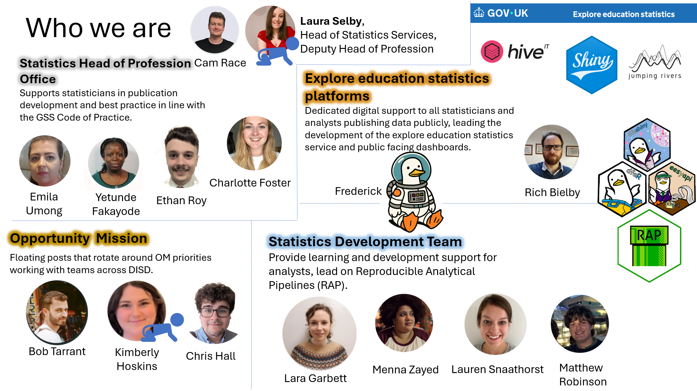
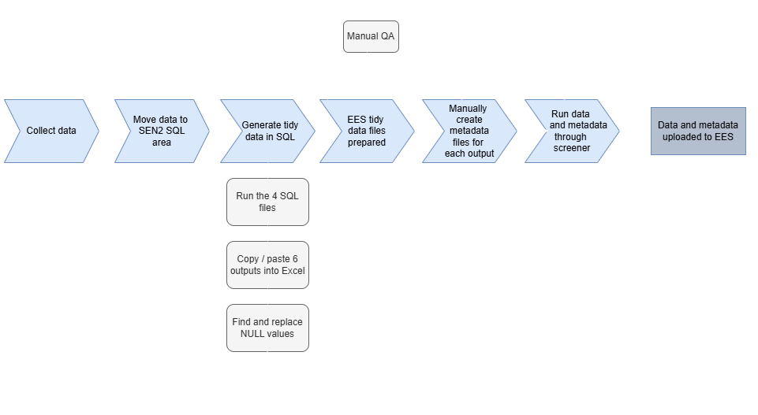
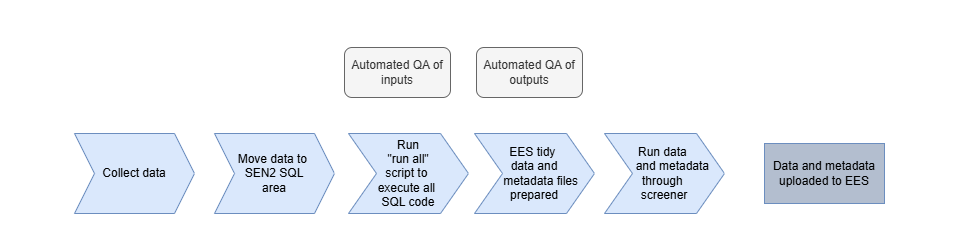
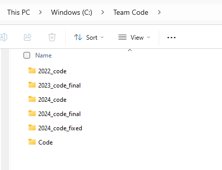
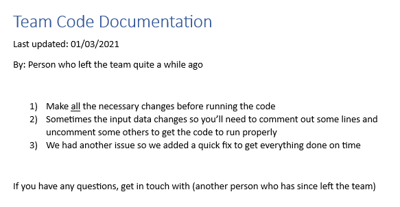
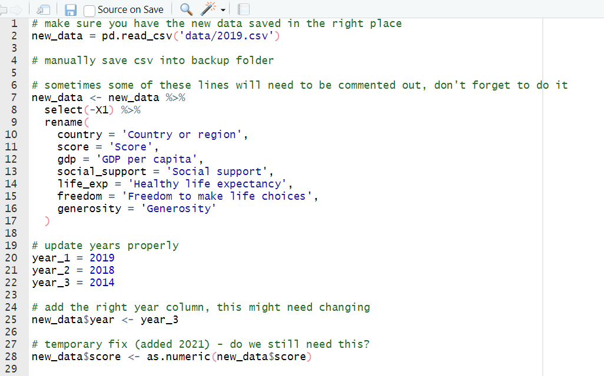
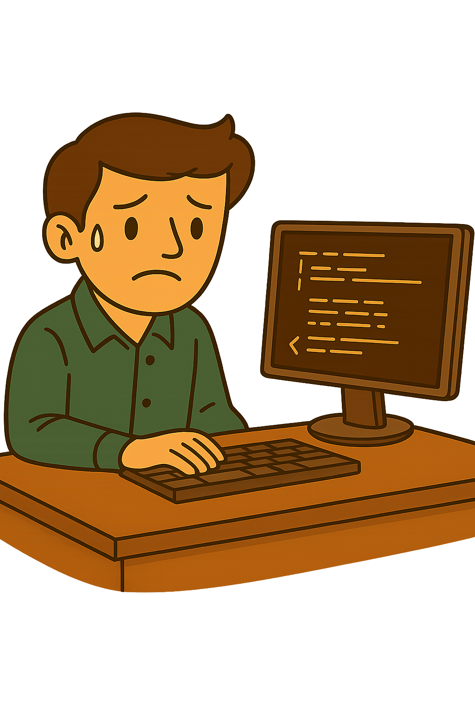
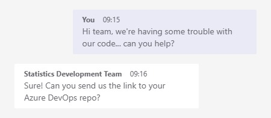
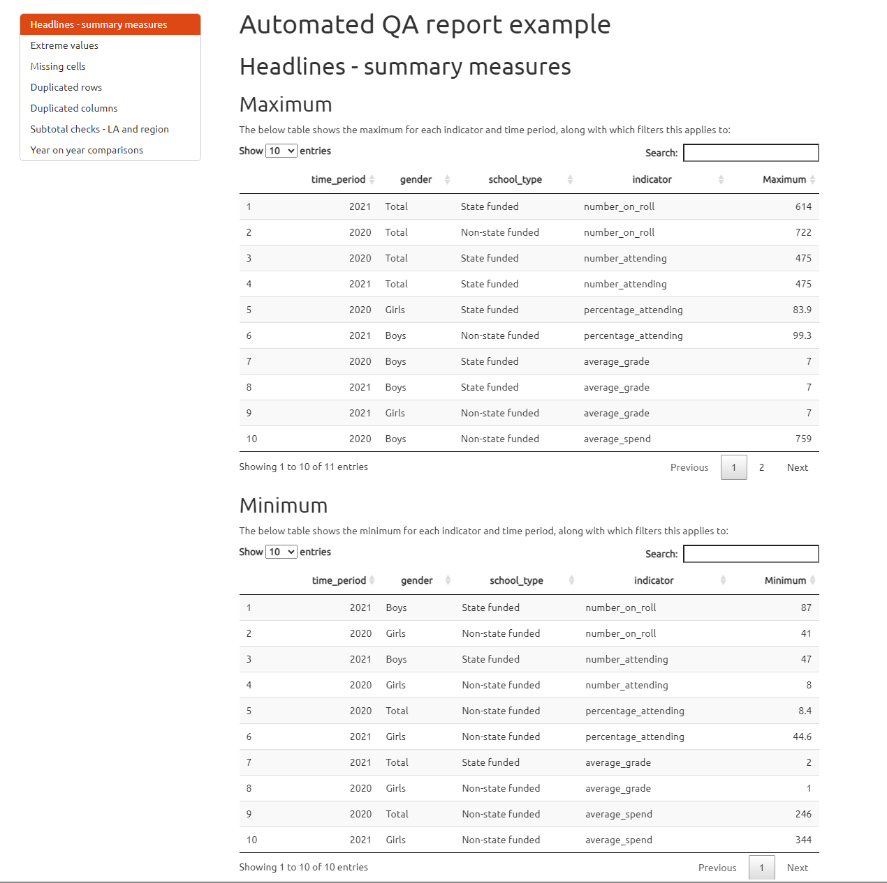

# Introduction

## Introduction to the team

The Statistics Services Unit runs various technical workshops - this is our newest!

::: {.column width="15%"}
:::

::: {.column width="70%"}

:::

::: {.column width="15%"}
:::

## Workshop purpose & aims

This session is designed to cover the basic principles of RAP from the perspective of a manager and to support managers to develop the technical skills they are expected to have.

- For all analysts, coding and technical skills form a core part of our work in DfE.
- To produce high quality statistics, teams need to maintain technical capability at all levels.
- Building technical skills alleviates the risk of staff turnover or technology changes leaving your team with processes you are unable to run. 

In this workshop, our main aims are to:

- Support managers to feel up-to-date and have confidence with technology and relevant skills
- Ensure that managers have appropriate technical skills to effectively collaborate with and advise their teams.
- Direct managers (who can then direct their teams) towards RAP & technical advice and support.

## Structure of the workshop

This workshop will be delivered in two halves with a short break in the middle.

<br>

::: {.column width="50%"}
In the first part we will cover:

- Workshop introduction
- RAP principles
- How RAP can help managers
- How to structure a RAP project
- Quick wins with RAP
- Applying RAP to your publications
:::

::: {.column width="50%"}
The second part will cover:

- Git basics & good practice
- Pull requests
- Quality assuring code
- Speaker session on technical upskilling
- Technical L&D, support & resources
:::

## Initial knowledge check

Scan the QR code or follow [this link](https://app.sli.do/event/adW5shWehmKfor3CAVt57U) to take our knowledge check quiz!

::: {.column width="40%"}
:::

::: {.column width="20%"}

{fig-align="center"}
:::

::: {.column width="40%"}
:::

## Why do I need technical skills?

<br>

We understand that many managers won't be doing as much of the hands-on coding or technical work, but it's important to have strong enough skills to successfully support your teams to achieve their potential. 

<br>

Building your own skills will allow you to demonstrate effective technical leadership, provide advice to team members on how to develop their skills, and to cover during absence or busy periods. 

<br>

Improving your team's skills and RAP principles will also build more flexible, efficient and resilient teams. 

## Expectations of analytical managers: technical skills

The Data Analysis strand of the [GSG competency framework](https://analysisfunction.civilservice.gov.uk/policy-store/competency-framework-for-the-government-statistician-group-gsg/) requires all grades to:

- Innovate and seek out new ways of analysing the data
- Ensure that analysis is reproducible, transparent and robust using coding and code management best practices.

The [Analysis Function Career Framework](https://analysisfunction.civilservice.gov.uk/careers/career-framework) presents the following as one of four core skills for analysts:

- Software programming tools and techniques — the ability to use coding and programming skills for data analysis.

The [cross-government RAP strategy](https://analysisfunction.civilservice.gov.uk/policy-store/reproducible-analytical-pipelines-strategy/) outlines expectations of analyst managers including:

-   build extra time into projects to adopt new skills and practices where appropriate
-   learn the skills they need to manage software
-   evaluate RAP projects within organisations to understand and demonstrate the benefits of RAP
-   mandate their teams use RAP principles whenever possible

These are all central expectations on all government analysts; we have seen several management-level job adverts requiring RAP & technical experience and skills!

## Tools overview: R, RStudio & Positron

::: {.column width="80%"}
R is a coding language:

- Using R allows us to define reusable variables, functions, and packages (sets of pre-defined functions)
- It is open-source so free to use, available to everyone, and anyone can contribute
:::

::: {.column width="20%"}

{fig-align="center"}
:::

RStudio enables us to code using the R language while providing a visual, interactive interface:

- It has various windows that display code scripts, data sets, tables, the console, variables, functions, plots, folders...
- It is a user-friendly way to code in R that is intuitive to navigate and quick to learn

Positron is a new program from the creators of RStudio!

- Can also be used with Python coding language
- Designed specifically for data science applications

All are available to download to your DfE laptop from the Software Centre.

## Tools overview: Git, Azure DevOps & GitHub

::: {.column width="88%"}
Git is software designed for version control:

- It works with repositories (repos), folders containing all version controlled files
- It allows for efficient collaboration; users can simultaneously work on distinct versions of code
:::

::: {.column width="12%"}

{fig-align="center"}
:::

Azure DevOps and GitHub are platforms you can use to work with Git and your repositories:

- They allow you to: view files & their history, structure code QA, automate code pipelines and use integrated project management tools
- DevOps is suitable for working with sensitive data as it is private and secure
- GitHub repos are public*, which supports reproducibility and transparency

_* There is a paid version of GitHub allowing private repos but DfE doesn't currently have this_

## Tools overview: Databricks

::: {.column width="80%"}

Databricks is a cloud-based platform that you can use for storing, managing and analysing large datasets:

- Processing is done remotely by powerful remote computers
- It supports R, SQL, Python and Scala languages
- You can use Git version control with it
- You can build pipelines and workflows that run automatically - excellent for RAP!
:::

::: {.column width="20%"}

{fig-align="center"}
:::

Databricks has replaced SQL Server for our department's data storage and all analysts should have adjusted their processes in line with this transition.

::: {.column width="50%"}
You can access support with this in the following places:

- [ADA team](mailto: ADAPTTeam@education.gov.uk)
- [ADA website](https://analytical-data-access.azurewebsites.net/)
- [ADA user group on Teams](https://teams.microsoft.com/l/team/19%3AGQW24K3V6M873QzUwpBIuyf8KZCxYByRawVsKQvpe-81%40thread.tacv2/conversations?groupId=c70bb59d-c5df-4af5-849f-36196ed14ba3&tenantId=fad277c9-c60a-4da1-b5f3-b3b8b34a82f9)
- [Statistics Development Team](mailto: statistics.development@education.gov.uk)
:::

::: {.column width="50%"}
Some further learning resources:

- [Analysts' Guide Databricks pages](https://dfe-analytical-services.github.io/analysts-guide/ADA/databricks_fundamentals.html)
- [Nick Treece's training materials](https://github.com/dfe-analytical-services/databricks_code_learn)
:::

## Questions & answers

We have set up a live Q&A session - feel free to submit questions [here](https://app.sli.do/event/adW5shWehmKfor3CAVt57U) as we go through the workshop

<br>
<br>

::: {.column width="40%"}
:::

::: {.column width="20%"}

{fig-align="center"}
:::

::: {.column width="40%"}
:::

# Reproducible Analytical Pipelines (RAPs)

# RAP: Introduction

## What is a RAP?

**R**eproducible **A**nalytical **P**ipelines are about having well-documented, reusable processes when analysing data, and ensuring they are transparent.

<br>

We already have *analytical pipelines* but RAP specifically aims to:

-   <span style="color:#f67400;">Automate all of the parts that we can</span>, e.g. rather than entering a hard-coded date repeatedly throughout your code, instead use one date variable that can be changed and reused throughout
-   <span style="color:#f67400;">Increase efficiency and accuracy</span> by reducing the risk of human error, and ensuring calculations are done identically each time where possible
-   <span style="color:#f67400;">Create a clear audit trail</span> using code and documentation to allow analysis to be easily reused where needed, e.g. for routine publications or frequent PQ and FOI requests

## RAP principles

You should be familiar with our RAP standards as a framework for analytical work, and we expect managers to ensure that their teams are following these standards

<br>

::: {.column width="25%"}
:::

::: {.column width="50%"}
<div class="mxgraph" style="max-width: 100%; border: 1px solid transparent; position: relative; touch-action: none; overflow: hidden; margin-top: 26px; width: 999px; height: 494px;" data-mxgraph="{&quot;lightbox&quot;:false,&quot;nav&quot;:true,&quot;resize&quot;:true,&quot;toolbar&quot;:&quot;zoom&quot;,&quot;edit&quot;:&quot;_blank&quot;,&quot;xml&quot;:&quot;<mxfile host=\&quot;app.diagrams.net\&quot; agent=\&quot;Mozilla/5.0 (Windows NT 10.0; Win64; x64) AppleWebKit/537.36 (KHTML, like Gecko) Chrome/131.0.0.0 Safari/537.36 Edg/131.0.0.0\&quot; version=\&quot;25.0.3\&quot;>\n  <diagram id=\&quot;_ltWYIdbVKAG_Xyvna0Y\&quot; name=\&quot;Page-1\&quot;>\n    <mxGraphModel dx=\&quot;1786\&quot; dy=\&quot;749\&quot; grid=\&quot;0\&quot; gridSize=\&quot;10\&quot; guides=\&quot;1\&quot; tooltips=\&quot;1\&quot; connect=\&quot;1\&quot; arrows=\&quot;1\&quot; fold=\&quot;1\&quot; page=\&quot;0\&quot; pageScale=\&quot;1\&quot; pageWidth=\&quot;827\&quot; pageHeight=\&quot;1169\&quot; math=\&quot;0\&quot; shadow=\&quot;0\&quot;>\n      <root>\n        <mxCell id=\&quot;0\&quot; />\n        <mxCell id=\&quot;1\&quot; parent=\&quot;0\&quot; />\n        <UserObject label=\&quot;Sensible folder and file structure\&quot; link=\&quot;#sensible-folder-and-file-structure\&quot; id=\&quot;t2OgNqa9NwPCjF_SyjkI-5\&quot;>\n          <mxCell style=\&quot;shape=hexagon;perimeter=hexagonPerimeter2;whiteSpace=wrap;html=1;fixedSize=1;rotation=90;size=30;direction=east;horizontal=0;fontColor=#FFFFFF;strokeColor=none;fillColor=#4472C4;spacingLeft=7;spacingRight=7;movable=0;resizable=0;rotatable=0;deletable=0;editable=0;connectable=0;fontSize=14;\&quot; parent=\&quot;1\&quot; vertex=\&quot;1\&quot;>\n            <mxGeometry x=\&quot;69\&quot; y=\&quot;326\&quot; width=\&quot;120\&quot; height=\&quot;120\&quot; as=\&quot;geometry\&quot; />\n          </mxCell>\n        </UserObject>\n        <UserObject label=\&quot;Use appropriate tools\&quot; link=\&quot;#appropriate-tools\&quot; id=\&quot;t2OgNqa9NwPCjF_SyjkI-6\&quot;>\n          <mxCell style=\&quot;shape=hexagon;perimeter=hexagonPerimeter2;whiteSpace=wrap;html=1;fixedSize=1;rotation=90;size=30;direction=east;horizontal=0;fontColor=#FFFFFF;fillColor=#4472C4;spacingLeft=7;spacingRight=7;rounded=0;shadow=0;sketch=0;backgroundOutline=0;gradientDirection=north;strokeColor=none;fontSize=14;\&quot; parent=\&quot;1\&quot; vertex=\&quot;1\&quot;>\n            <mxGeometry x=\&quot;-55\&quot; y=\&quot;326\&quot; width=\&quot;120\&quot; height=\&quot;120\&quot; as=\&quot;geometry\&quot; />\n          </mxCell>\n        </UserObject>\n        <UserObject label=\&quot;Processing is done with code\&quot; link=\&quot;#processing-is-done-with-code\&quot; id=\&quot;t2OgNqa9NwPCjF_SyjkI-7\&quot;>\n          <mxCell style=\&quot;shape=hexagon;perimeter=hexagonPerimeter2;whiteSpace=wrap;html=1;fixedSize=1;rotation=90;size=30;direction=east;horizontal=0;fontColor=#FFFFFF;strokeColor=none;fillColor=#4472C4;spacingLeft=7;spacingRight=7;fontSize=14;\&quot; parent=\&quot;1\&quot; vertex=\&quot;1\&quot;>\n            <mxGeometry x=\&quot;7\&quot; y=\&quot;420\&quot; width=\&quot;120\&quot; height=\&quot;120\&quot; as=\&quot;geometry\&quot; />\n          </mxCell>\n        </UserObject>\n        <UserObject label=\&quot;Basic automated QA\&quot; link=\&quot;#basic-automated-qa\&quot; id=\&quot;t2OgNqa9NwPCjF_SyjkI-8\&quot;>\n          <mxCell style=\&quot;shape=hexagon;perimeter=hexagonPerimeter2;whiteSpace=wrap;html=1;fixedSize=1;rotation=90;size=30;direction=east;horizontal=0;fontColor=#FFFFFF;strokeColor=none;fillColor=#4472C4;spacingLeft=7;spacingRight=7;fontSize=14;\&quot; parent=\&quot;1\&quot; vertex=\&quot;1\&quot;>\n            <mxGeometry x=\&quot;132\&quot; y=\&quot;420\&quot; width=\&quot;120\&quot; height=\&quot;120\&quot; as=\&quot;geometry\&quot; />\n          </mxCell>\n        </UserObject>\n        <UserObject label=\&quot;All source data stored in a database\&quot; link=\&quot;#all-source-data-stored-in-a-database\&quot; id=\&quot;t2OgNqa9NwPCjF_SyjkI-9\&quot;>\n          <mxCell style=\&quot;shape=hexagon;perimeter=hexagonPerimeter2;whiteSpace=wrap;html=1;fixedSize=1;rotation=90;size=30;direction=east;horizontal=0;fontColor=#FFFFFF;strokeColor=none;fillColor=#4472C4;spacingLeft=7;spacingRight=7;fontSize=14;\&quot; parent=\&quot;1\&quot; vertex=\&quot;1\&quot;>\n            <mxGeometry x=\&quot;-118\&quot; y=\&quot;420\&quot; width=\&quot;120\&quot; height=\&quot;120\&quot; as=\&quot;geometry\&quot; />\n          </mxCell>\n        </UserObject>\n        <UserObject label=\&quot;Files meet data standards\&quot; link=\&quot;../creating-statistics/ud.html#how-to-check-against-these-standards\&quot; id=\&quot;t2OgNqa9NwPCjF_SyjkI-10\&quot;>\n          <mxCell style=\&quot;shape=hexagon;perimeter=hexagonPerimeter2;whiteSpace=wrap;html=1;fixedSize=1;rotation=90;size=30;direction=east;horizontal=0;fontColor=#FFFFFF;strokeColor=none;fillColor=#4472C4;spacingLeft=7;spacingRight=7;fontSize=14;\&quot; parent=\&quot;1\&quot; vertex=\&quot;1\&quot;>\n            <mxGeometry x=\&quot;-55\&quot; y=\&quot;514\&quot; width=\&quot;120\&quot; height=\&quot;120\&quot; as=\&quot;geometry\&quot; />\n          </mxCell>\n        </UserObject>\n        <UserObject label=\&quot;Documentation\&quot; link=\&quot;#documentation\&quot; id=\&quot;t2OgNqa9NwPCjF_SyjkI-11\&quot;>\n          <mxCell style=\&quot;shape=hexagon;perimeter=hexagonPerimeter2;whiteSpace=wrap;html=1;fixedSize=1;rotation=90;size=30;direction=east;horizontal=0;fontColor=#FFFFFF;strokeColor=none;fillColor=#4472C4;spacingLeft=7;spacingRight=7;fontSize=14;\&quot; parent=\&quot;1\&quot; vertex=\&quot;1\&quot;>\n            <mxGeometry x=\&quot;69\&quot; y=\&quot;514\&quot; width=\&quot;120\&quot; height=\&quot;120\&quot; as=\&quot;geometry\&quot; />\n          </mxCell>\n        </UserObject>\n        <UserObject label=\&quot;Version controlled final code scripts\&quot; link=\&quot;#version-controlled-final-code-scripts\&quot; id=\&quot;t2OgNqa9NwPCjF_SyjkI-12\&quot;>\n          <mxCell style=\&quot;shape=hexagon;perimeter=hexagonPerimeter2;whiteSpace=wrap;html=1;fixedSize=1;rotation=90;size=30;direction=east;horizontal=0;fillColor=#70AD47;strokeColor=none;fontColor=#FFFFFF;spacingLeft=7;spacingRight=7;fontSize=14;\&quot; parent=\&quot;1\&quot; vertex=\&quot;1\&quot;>\n            <mxGeometry x=\&quot;320\&quot; y=\&quot;327\&quot; width=\&quot;120\&quot; height=\&quot;120\&quot; as=\&quot;geometry\&quot; />\n          </mxCell>\n        </UserObject>\n        <UserObject label=\&quot;Recyclable code for future use\&quot; link=\&quot;#recyclable-code-for-future-use\&quot; id=\&quot;t2OgNqa9NwPCjF_SyjkI-13\&quot;>\n          <mxCell style=\&quot;shape=hexagon;perimeter=hexagonPerimeter2;whiteSpace=wrap;html=1;fixedSize=1;rotation=90;size=30;direction=east;horizontal=0;fillColor=#70AD47;strokeColor=none;fontColor=#FFFFFF;spacingLeft=7;spacingRight=7;fontSize=14;\&quot; parent=\&quot;1\&quot; vertex=\&quot;1\&quot;>\n            <mxGeometry x=\&quot;195\&quot; y=\&quot;326\&quot; width=\&quot;120\&quot; height=\&quot;120\&quot; as=\&quot;geometry\&quot; />\n          </mxCell>\n        </UserObject>\n        <UserObject label=\&quot;Dataset production scripts\&quot; link=\&quot;#dataset-production-scripts\&quot; id=\&quot;t2OgNqa9NwPCjF_SyjkI-14\&quot;>\n          <mxCell style=\&quot;shape=hexagon;perimeter=hexagonPerimeter2;whiteSpace=wrap;html=1;fixedSize=1;rotation=90;size=30;direction=east;horizontal=0;fillColor=#70AD47;strokeColor=none;fontColor=#FFFFFF;spacingLeft=7;spacingRight=7;fontSize=14;\&quot; parent=\&quot;1\&quot; vertex=\&quot;1\&quot;>\n            <mxGeometry x=\&quot;257\&quot; y=\&quot;421\&quot; width=\&quot;120\&quot; height=\&quot;120\&quot; as=\&quot;geometry\&quot; />\n          </mxCell>\n        </UserObject>\n        <UserObject label=\&quot;Publication specific automated QA\&quot; link=\&quot;#publication-specific-automated-qa\&quot; id=\&quot;t2OgNqa9NwPCjF_SyjkI-15\&quot;>\n          <mxCell style=\&quot;shape=hexagon;perimeter=hexagonPerimeter2;whiteSpace=wrap;html=1;fixedSize=1;rotation=90;size=30;direction=east;horizontal=0;fillColor=#70AD47;strokeColor=none;fontColor=#FFFFFF;spacingLeft=7;spacingRight=7;fontSize=14;\&quot; parent=\&quot;1\&quot; vertex=\&quot;1\&quot;>\n            <mxGeometry x=\&quot;382\&quot; y=\&quot;421\&quot; width=\&quot;120\&quot; height=\&quot;120\&quot; as=\&quot;geometry\&quot; />\n          </mxCell>\n        </UserObject>\n        <UserObject label=\&quot;Automated summaries\&quot; link=\&quot;#automated-summaries\&quot; id=\&quot;t2OgNqa9NwPCjF_SyjkI-17\&quot;>\n          <mxCell style=\&quot;shape=hexagon;perimeter=hexagonPerimeter2;whiteSpace=wrap;html=1;fixedSize=1;rotation=90;size=30;direction=east;horizontal=0;fillColor=#70AD47;strokeColor=none;fontColor=#FFFFFF;spacingLeft=7;spacingRight=7;fontSize=14;\&quot; parent=\&quot;1\&quot; vertex=\&quot;1\&quot;>\n            <mxGeometry x=\&quot;194\&quot; y=\&quot;515\&quot; width=\&quot;120\&quot; height=\&quot;120\&quot; as=\&quot;geometry\&quot; />\n          </mxCell>\n        </UserObject>\n        <UserObject label=\&quot;Peer review of code within team\&quot; link=\&quot;#review-of-code-within-team\&quot; id=\&quot;t2OgNqa9NwPCjF_SyjkI-18\&quot;>\n          <mxCell style=\&quot;shape=hexagon;perimeter=hexagonPerimeter2;whiteSpace=wrap;html=1;fixedSize=1;rotation=90;size=30;direction=east;horizontal=0;fillColor=#70AD47;strokeColor=none;fontColor=#FFFFFF;spacingLeft=7;spacingRight=7;fontSize=14;\&quot; parent=\&quot;1\&quot; vertex=\&quot;1\&quot;>\n            <mxGeometry x=\&quot;319\&quot; y=\&quot;515\&quot; width=\&quot;120\&quot; height=\&quot;120\&quot; as=\&quot;geometry\&quot; />\n          </mxCell>\n        </UserObject>\n        <UserObject label=\&quot;Collaboratively develop code using git\&quot; link=\&quot;#collaboratively-develop-code-using-git\&quot; id=\&quot;t2OgNqa9NwPCjF_SyjkI-19\&quot;>\n          <mxCell style=\&quot;shape=hexagon;perimeter=hexagonPerimeter2;whiteSpace=wrap;html=1;fixedSize=1;rotation=90;size=30;direction=east;horizontal=0;fillColor=#ED7D31;strokeColor=none;fontColor=#FFFFFF;spacingLeft=7;spacingRight=7;fontSize=14;\&quot; parent=\&quot;1\&quot; vertex=\&quot;1\&quot;>\n            <mxGeometry x=\&quot;674\&quot; y=\&quot;326\&quot; width=\&quot;120\&quot; height=\&quot;120\&quot; as=\&quot;geometry\&quot; />\n          </mxCell>\n        </UserObject>\n        <UserObject label=\&quot;&amp;#39;Clean&amp;#39; final code\&quot; link=\&quot;#clean-final-code\&quot; id=\&quot;t2OgNqa9NwPCjF_SyjkI-20\&quot;>\n          <mxCell style=\&quot;shape=hexagon;perimeter=hexagonPerimeter2;whiteSpace=wrap;html=1;fixedSize=1;rotation=90;size=30;direction=east;horizontal=0;fillColor=#ED7D31;strokeColor=none;fontColor=#FFFFFF;spacingLeft=7;spacingRight=7;fontSize=14;\&quot; parent=\&quot;1\&quot; vertex=\&quot;1\&quot;>\n            <mxGeometry x=\&quot;550\&quot; y=\&quot;326\&quot; width=\&quot;120\&quot; height=\&quot;120\&quot; as=\&quot;geometry\&quot; />\n          </mxCell>\n        </UserObject>\n        <UserObject label=\&quot;&amp;lt;div style=&amp;quot;&amp;quot;&amp;gt;&amp;lt;font style=&amp;quot;font-size: 14px;&amp;quot;&amp;gt;Whole publication production scripts&amp;lt;/font&amp;gt;&amp;lt;/div&amp;gt;\&quot; link=\&quot;#whole-publication-production-scripts\&quot; id=\&quot;t2OgNqa9NwPCjF_SyjkI-21\&quot;>\n          <mxCell style=\&quot;shape=hexagon;perimeter=hexagonPerimeter2;whiteSpace=wrap;html=1;fixedSize=1;rotation=90;size=30;direction=east;horizontal=0;fillColor=#ED7D31;strokeColor=none;fontColor=#FFFFFF;spacingLeft=7;spacingRight=7;fontSize=14;align=center;\&quot; parent=\&quot;1\&quot; vertex=\&quot;1\&quot;>\n            <mxGeometry x=\&quot;612\&quot; y=\&quot;420\&quot; width=\&quot;120\&quot; height=\&quot;120\&quot; as=\&quot;geometry\&quot; />\n          </mxCell>\n        </UserObject>\n        <UserObject label=\&quot;Use open source repositories\&quot; link=\&quot;#use-open-source-repositories\&quot; id=\&quot;t2OgNqa9NwPCjF_SyjkI-22\&quot;>\n          <mxCell style=\&quot;shape=hexagon;perimeter=hexagonPerimeter2;whiteSpace=wrap;html=1;fixedSize=1;rotation=90;size=30;direction=east;horizontal=0;fillColor=#ED7D31;strokeColor=none;fontColor=#FFFFFF;spacingLeft=7;spacingRight=7;fontSize=14;\&quot; parent=\&quot;1\&quot; vertex=\&quot;1\&quot;>\n            <mxGeometry x=\&quot;737\&quot; y=\&quot;420\&quot; width=\&quot;120\&quot; height=\&quot;120\&quot; as=\&quot;geometry\&quot; />\n          </mxCell>\n        </UserObject>\n        <UserObject label=\&quot;Publication specific automated summaries\&quot; link=\&quot;#publication-specific-automated-summaries\&quot; id=\&quot;t2OgNqa9NwPCjF_SyjkI-23\&quot;>\n          <mxCell style=\&quot;shape=hexagon;perimeter=hexagonPerimeter2;whiteSpace=wrap;html=1;fixedSize=1;rotation=90;size=30;direction=east;horizontal=0;fillColor=#ED7D31;strokeColor=none;fontColor=#FFFFFF;spacingLeft=7;spacingRight=7;fontSize=14;\&quot; parent=\&quot;1\&quot; vertex=\&quot;1\&quot;>\n            <mxGeometry x=\&quot;550\&quot; y=\&quot;514\&quot; width=\&quot;120\&quot; height=\&quot;120\&quot; as=\&quot;geometry\&quot; />\n          </mxCell>\n        </UserObject>\n        <UserObject label=\&quot;Peer review of code from outside the team\&quot; link=\&quot;#review-of-code-from-outside-the-team\&quot; id=\&quot;t2OgNqa9NwPCjF_SyjkI-24\&quot;>\n          <mxCell style=\&quot;shape=hexagon;perimeter=hexagonPerimeter2;whiteSpace=wrap;html=1;fixedSize=1;rotation=90;size=30;direction=east;horizontal=0;fillColor=#ED7D31;strokeColor=none;fontColor=#FFFFFF;spacingLeft=7;spacingRight=7;fontSize=14;\&quot; parent=\&quot;1\&quot; vertex=\&quot;1\&quot;>\n            <mxGeometry x=\&quot;674\&quot; y=\&quot;514\&quot; width=\&quot;120\&quot; height=\&quot;120\&quot; as=\&quot;geometry\&quot; />\n          </mxCell>\n        </UserObject>\n        <mxCell id=\&quot;t2OgNqa9NwPCjF_SyjkI-25\&quot; value=\&quot;&amp;lt;font style=&amp;quot;font-size: 32px&amp;quot; color=&amp;quot;#4472c4&amp;quot;&amp;gt;Good practice&amp;lt;/font&amp;gt;\&quot; style=\&quot;text;html=1;align=center;verticalAlign=middle;resizable=0;points=[];autosize=1;fontColor=#FFFFFF;\&quot; parent=\&quot;1\&quot; vertex=\&quot;1\&quot;>\n          <mxGeometry x=\&quot;-38\&quot; y=\&quot;652\&quot; width=\&quot;210\&quot; height=\&quot;30\&quot; as=\&quot;geometry\&quot; />\n        </mxCell>\n        <mxCell id=\&quot;t2OgNqa9NwPCjF_SyjkI-26\&quot; value=\&quot;&amp;lt;font style=&amp;quot;font-size: 32px&amp;quot; color=&amp;quot;#70ad47&amp;quot;&amp;gt;Great practice&amp;lt;/font&amp;gt;\&quot; style=\&quot;text;html=1;align=center;verticalAlign=middle;resizable=0;points=[];autosize=1;fontColor=#FFFFFF;\&quot; parent=\&quot;1\&quot; vertex=\&quot;1\&quot;>\n          <mxGeometry x=\&quot;206\&quot; y=\&quot;652\&quot; width=\&quot;220\&quot; height=\&quot;30\&quot; as=\&quot;geometry\&quot; />\n        </mxCell>\n        <mxCell id=\&quot;t2OgNqa9NwPCjF_SyjkI-27\&quot; value=\&quot;&amp;lt;font style=&amp;quot;font-size: 32px&amp;quot; color=&amp;quot;#ed7d31&amp;quot;&amp;gt;Best practice&amp;lt;/font&amp;gt;\&quot; style=\&quot;text;html=1;align=center;verticalAlign=middle;resizable=0;points=[];autosize=1;fontColor=#FFFFFF;\&quot; parent=\&quot;1\&quot; vertex=\&quot;1\&quot;>\n          <mxGeometry x=\&quot;572\&quot; y=\&quot;652\&quot; width=\&quot;200\&quot; height=\&quot;30\&quot; as=\&quot;geometry\&quot; />\n        </mxCell>\n        <mxCell id=\&quot;S840XJ58BQc_PQPuIZfj-1\&quot; value=\&quot;\&quot; style=\&quot;shape=curlyBracket;whiteSpace=wrap;html=1;rounded=1;labelPosition=left;verticalLabelPosition=middle;align=right;verticalAlign=middle;fontSize=13;rotation=90;strokeWidth=2;strokeColor=#4472c4;gradientColor=none;\&quot; parent=\&quot;1\&quot; vertex=\&quot;1\&quot;>\n          <mxGeometry x=\&quot;168.5\&quot; y=\&quot;26\&quot; width=\&quot;47\&quot; height=\&quot;538\&quot; as=\&quot;geometry\&quot; />\n        </mxCell>\n        <mxCell id=\&quot;S840XJ58BQc_PQPuIZfj-2\&quot; value=\&quot;&amp;lt;font style=&amp;quot;font-size: 32px&amp;quot; color=&amp;quot;#4472c4&amp;quot;&amp;gt;Baseline expectation&amp;lt;/font&amp;gt;\&quot; style=\&quot;text;html=1;align=center;verticalAlign=middle;resizable=0;points=[];autosize=1;fontColor=#FFFFFF;\&quot; parent=\&quot;1\&quot; vertex=\&quot;1\&quot;>\n          <mxGeometry x=\&quot;35.5\&quot; y=\&quot;216\&quot; width=\&quot;313\&quot; height=\&quot;50\&quot; as=\&quot;geometry\&quot; />\n        </mxCell>\n        <mxCell id=\&quot;S840XJ58BQc_PQPuIZfj-4\&quot; value=\&quot;\&quot; style=\&quot;shape=curlyBracket;whiteSpace=wrap;html=1;rounded=1;labelPosition=left;verticalLabelPosition=middle;align=right;verticalAlign=middle;fontSize=13;rotation=90;strokeWidth=2;strokeColor=#ed7d31;gradientColor=none;\&quot; parent=\&quot;1\&quot; vertex=\&quot;1\&quot;>\n          <mxGeometry x=\&quot;659\&quot; y=\&quot;145\&quot; width=\&quot;47\&quot; height=\&quot;292\&quot; as=\&quot;geometry\&quot; />\n        </mxCell>\n        <mxCell id=\&quot;S840XJ58BQc_PQPuIZfj-5\&quot; value=\&quot;&amp;lt;font color=&amp;quot;#ed7d31&amp;quot; style=&amp;quot;font-size: 32px&amp;quot;&amp;gt;Ambition&amp;lt;/font&amp;gt;\&quot; style=\&quot;text;html=1;align=center;verticalAlign=middle;resizable=0;points=[];autosize=1;fontColor=#FFFFFF;\&quot; parent=\&quot;1\&quot; vertex=\&quot;1\&quot;>\n          <mxGeometry x=\&quot;612\&quot; y=\&quot;216\&quot; width=\&quot;143\&quot; height=\&quot;50\&quot; as=\&quot;geometry\&quot; />\n        </mxCell>\n      </root>\n    </mxGraphModel>\n  </diagram>\n</mxfile>\n&quot;}"><svg style="left: 0px; top: 0px; width: 100%; height: 100%; display: block; min-width: 999px; min-height: 494px; background-image: none; background-color: transparent;"><defs><filter id="dropShadow"><feGaussianBlur in="SourceAlpha" stdDeviation="1.7" result="blur"></feGaussianBlur><feOffset in="blur" dx="3" dy="3" result="offsetBlur"></feOffset><feFlood flood-color="#3D4574" flood-opacity="0.4" result="offsetColor"></feFlood><feComposite in="offsetColor" in2="offsetBlur" operator="in" result="offsetBlur"></feComposite><feBlend in="SourceGraphic" in2="offsetBlur"></feBlend></filter></defs><g transformOrigin="0 0" transform="scale(1,1)translate(126,-208)"><g></g><g><g transform="translate(0.5,0.5)" style="visibility: visible;"><path d="M 99 326 L 159 326 L 189 386 L 159 446 L 99 446 L 69 386 Z" fill="#4472c4" stroke="none" transform="rotate(90,129,386)" pointer-events="all"></path></g><g style=""><g><foreignObject pointer-events="none" width="100%" height="100%" style="overflow: visible; text-align: left;"><div style="display: flex; align-items: unsafe center; justify-content: unsafe center; width: 104px; height: 1px; padding-top: 386px; margin-left: 77px;"><div data-drawio-colors="color: #FFFFFF; " style="box-sizing: border-box; font-size: 0px; text-align: center;"><div style="display: inline-block; font-size: 14px; font-family: Helvetica; color: rgb(255, 255, 255); line-height: 1.2; pointer-events: all; white-space: normal; overflow-wrap: normal;">Sensible folder and file structure</div></div></div></foreignObject></g></g><g transform="translate(0.5,0.5)" style="visibility: visible; cursor: pointer;"><path d="M -25 326 L 35 326 L 65 386 L 35 446 L -25 446 L -55 386 Z" fill="#4472c4" stroke="none" transform="rotate(90,5,386)" pointer-events="all"></path></g><g style="cursor: pointer;"><g><foreignObject pointer-events="none" width="100%" height="100%" style="overflow: visible; text-align: left;"><div style="display: flex; align-items: unsafe center; justify-content: unsafe center; width: 104px; height: 1px; padding-top: 386px; margin-left: -47px;"><div data-drawio-colors="color: #FFFFFF; " style="box-sizing: border-box; font-size: 0px; text-align: center;"><div style="display: inline-block; font-size: 14px; font-family: Helvetica; color: rgb(255, 255, 255); line-height: 1.2; pointer-events: all; white-space: normal; overflow-wrap: normal;">Use appropriate tools</div></div></div></foreignObject></g></g><g transform="translate(0.5,0.5)" style="visibility: visible;"><path d="M 37 420 L 97 420 L 127 480 L 97 540 L 37 540 L 7 480 Z" fill="#4472c4" stroke="none" transform="rotate(90,67,480)" pointer-events="all"></path></g><g style=""><g><foreignObject pointer-events="none" width="100%" height="100%" style="overflow: visible; text-align: left;"><div style="display: flex; align-items: unsafe center; justify-content: unsafe center; width: 104px; height: 1px; padding-top: 480px; margin-left: 15px;"><div data-drawio-colors="color: #FFFFFF; " style="box-sizing: border-box; font-size: 0px; text-align: center;"><div style="display: inline-block; font-size: 14px; font-family: Helvetica; color: rgb(255, 255, 255); line-height: 1.2; pointer-events: all; white-space: normal; overflow-wrap: normal;">Processing is done with code</div></div></div></foreignObject></g></g><g transform="translate(0.5,0.5)" style="visibility: visible;"><path d="M 162 420 L 222 420 L 252 480 L 222 540 L 162 540 L 132 480 Z" fill="#4472c4" stroke="none" transform="rotate(90,192,480)" pointer-events="all"></path></g><g style=""><g><foreignObject pointer-events="none" width="100%" height="100%" style="overflow: visible; text-align: left;"><div style="display: flex; align-items: unsafe center; justify-content: unsafe center; width: 104px; height: 1px; padding-top: 480px; margin-left: 140px;"><div data-drawio-colors="color: #FFFFFF; " style="box-sizing: border-box; font-size: 0px; text-align: center;"><div style="display: inline-block; font-size: 14px; font-family: Helvetica; color: rgb(255, 255, 255); line-height: 1.2; pointer-events: all; white-space: normal; overflow-wrap: normal;">Basic automated QA</div></div></div></foreignObject></g></g><g transform="translate(0.5,0.5)" style="visibility: visible;"><path d="M -88 420 L -28 420 L 2 480 L -28 540 L -88 540 L -118 480 Z" fill="#4472c4" stroke="none" transform="rotate(90,-58,480)" pointer-events="all"></path></g><g style=""><g><foreignObject pointer-events="none" width="100%" height="100%" style="overflow: visible; text-align: left;"><div style="display: flex; align-items: unsafe center; justify-content: unsafe center; width: 104px; height: 1px; padding-top: 480px; margin-left: -110px;"><div data-drawio-colors="color: #FFFFFF; " style="box-sizing: border-box; font-size: 0px; text-align: center;"><div style="display: inline-block; font-size: 14px; font-family: Helvetica; color: rgb(255, 255, 255); line-height: 1.2; pointer-events: all; white-space: normal; overflow-wrap: normal;">All source data stored in a database</div></div></div></foreignObject></g></g><g transform="translate(0.5,0.5)" style="visibility: visible;"><path d="M -25 514 L 35 514 L 65 574 L 35 634 L -25 634 L -55 574 Z" fill="#4472c4" stroke="none" transform="rotate(90,5,574)" pointer-events="all"></path></g><g style=""><g><foreignObject pointer-events="none" width="100%" height="100%" style="overflow: visible; text-align: left;"><div style="display: flex; align-items: unsafe center; justify-content: unsafe center; width: 104px; height: 1px; padding-top: 574px; margin-left: -47px;"><div data-drawio-colors="color: #FFFFFF; " style="box-sizing: border-box; font-size: 0px; text-align: center;"><div style="display: inline-block; font-size: 14px; font-family: Helvetica; color: rgb(255, 255, 255); line-height: 1.2; pointer-events: all; white-space: normal; overflow-wrap: normal;">Files meet data standards</div></div></div></foreignObject></g></g><g transform="translate(0.5,0.5)" style="visibility: visible;"><path d="M 99 514 L 159 514 L 189 574 L 159 634 L 99 634 L 69 574 Z" fill="#4472c4" stroke="none" transform="rotate(90,129,574)" pointer-events="all"></path></g><g style=""><g><foreignObject pointer-events="none" width="100%" height="100%" style="overflow: visible; text-align: left;"><div style="display: flex; align-items: unsafe center; justify-content: unsafe center; width: 104px; height: 1px; padding-top: 574px; margin-left: 77px;"><div data-drawio-colors="color: #FFFFFF; " style="box-sizing: border-box; font-size: 0px; text-align: center;"><div style="display: inline-block; font-size: 14px; font-family: Helvetica; color: rgb(255, 255, 255); line-height: 1.2; pointer-events: all; white-space: normal; overflow-wrap: normal;">Documentation</div></div></div></foreignObject></g></g><g transform="translate(0.5,0.5)" style="visibility: visible;"><path d="M 350 327 L 410 327 L 440 387 L 410 447 L 350 447 L 320 387 Z" fill="#70ad47" stroke="none" transform="rotate(90,380,387)" pointer-events="all"></path></g><g style=""><g><foreignObject pointer-events="none" width="100%" height="100%" style="overflow: visible; text-align: left;"><div style="display: flex; align-items: unsafe center; justify-content: unsafe center; width: 104px; height: 1px; padding-top: 387px; margin-left: 328px;"><div data-drawio-colors="color: #FFFFFF; " style="box-sizing: border-box; font-size: 0px; text-align: center;"><div style="display: inline-block; font-size: 14px; font-family: Helvetica; color: rgb(255, 255, 255); line-height: 1.2; pointer-events: all; white-space: normal; overflow-wrap: normal;">Version controlled final code scripts</div></div></div></foreignObject></g></g><g transform="translate(0.5,0.5)" style="visibility: visible;"><path d="M 225 326 L 285 326 L 315 386 L 285 446 L 225 446 L 195 386 Z" fill="#70ad47" stroke="none" transform="rotate(90,255,386)" pointer-events="all"></path></g><g style=""><g><foreignObject pointer-events="none" width="100%" height="100%" style="overflow: visible; text-align: left;"><div style="display: flex; align-items: unsafe center; justify-content: unsafe center; width: 104px; height: 1px; padding-top: 386px; margin-left: 203px;"><div data-drawio-colors="color: #FFFFFF; " style="box-sizing: border-box; font-size: 0px; text-align: center;"><div style="display: inline-block; font-size: 14px; font-family: Helvetica; color: rgb(255, 255, 255); line-height: 1.2; pointer-events: all; white-space: normal; overflow-wrap: normal;">Recyclable code for future use</div></div></div></foreignObject></g></g><g transform="translate(0.5,0.5)" style="visibility: visible;"><path d="M 287 421 L 347 421 L 377 481 L 347 541 L 287 541 L 257 481 Z" fill="#70ad47" stroke="none" transform="rotate(90,317,481)" pointer-events="all"></path></g><g style=""><g><foreignObject pointer-events="none" width="100%" height="100%" style="overflow: visible; text-align: left;"><div style="display: flex; align-items: unsafe center; justify-content: unsafe center; width: 104px; height: 1px; padding-top: 481px; margin-left: 265px;"><div data-drawio-colors="color: #FFFFFF; " style="box-sizing: border-box; font-size: 0px; text-align: center;"><div style="display: inline-block; font-size: 14px; font-family: Helvetica; color: rgb(255, 255, 255); line-height: 1.2; pointer-events: all; white-space: normal; overflow-wrap: normal;">Dataset production scripts</div></div></div></foreignObject></g></g><g transform="translate(0.5,0.5)" style="visibility: visible;"><path d="M 412 421 L 472 421 L 502 481 L 472 541 L 412 541 L 382 481 Z" fill="#70ad47" stroke="none" transform="rotate(90,442,481)" pointer-events="all"></path></g><g style=""><g><foreignObject pointer-events="none" width="100%" height="100%" style="overflow: visible; text-align: left;"><div style="display: flex; align-items: unsafe center; justify-content: unsafe center; width: 104px; height: 1px; padding-top: 481px; margin-left: 390px;"><div data-drawio-colors="color: #FFFFFF; " style="box-sizing: border-box; font-size: 0px; text-align: center;"><div style="display: inline-block; font-size: 14px; font-family: Helvetica; color: rgb(255, 255, 255); line-height: 1.2; pointer-events: all; white-space: normal; overflow-wrap: normal;">Publication specific automated QA</div></div></div></foreignObject></g></g><g transform="translate(0.5,0.5)" style="visibility: visible;"><path d="M 224 515 L 284 515 L 314 575 L 284 635 L 224 635 L 194 575 Z" fill="#70ad47" stroke="none" transform="rotate(90,254,575)" pointer-events="all"></path></g><g style=""><g><foreignObject pointer-events="none" width="100%" height="100%" style="overflow: visible; text-align: left;"><div style="display: flex; align-items: unsafe center; justify-content: unsafe center; width: 104px; height: 1px; padding-top: 575px; margin-left: 202px;"><div data-drawio-colors="color: #FFFFFF; " style="box-sizing: border-box; font-size: 0px; text-align: center;"><div style="display: inline-block; font-size: 14px; font-family: Helvetica; color: rgb(255, 255, 255); line-height: 1.2; pointer-events: all; white-space: normal; overflow-wrap: normal;">Automated summaries</div></div></div></foreignObject></g></g><g transform="translate(0.5,0.5)" style="visibility: visible;"><path d="M 349 515 L 409 515 L 439 575 L 409 635 L 349 635 L 319 575 Z" fill="#70ad47" stroke="none" transform="rotate(90,379,575)" pointer-events="all"></path></g><g style=""><g><foreignObject pointer-events="none" width="100%" height="100%" style="overflow: visible; text-align: left;"><div style="display: flex; align-items: unsafe center; justify-content: unsafe center; width: 104px; height: 1px; padding-top: 575px; margin-left: 327px;"><div data-drawio-colors="color: #FFFFFF; " style="box-sizing: border-box; font-size: 0px; text-align: center;"><div style="display: inline-block; font-size: 14px; font-family: Helvetica; color: rgb(255, 255, 255); line-height: 1.2; pointer-events: all; white-space: normal; overflow-wrap: normal;">Peer review of code within team</div></div></div></foreignObject></g></g><g transform="translate(0.5,0.5)" style="visibility: visible; cursor: pointer;"><path d="M 704 326 L 764 326 L 794 386 L 764 446 L 704 446 L 674 386 Z" fill="#ed7d31" stroke="none" transform="rotate(90,734,386)" pointer-events="all"></path></g><g style="cursor: pointer;"><g><foreignObject pointer-events="none" width="100%" height="100%" style="overflow: visible; text-align: left;"><div style="display: flex; align-items: unsafe center; justify-content: unsafe center; width: 104px; height: 1px; padding-top: 386px; margin-left: 682px;"><div data-drawio-colors="color: #FFFFFF; " style="box-sizing: border-box; font-size: 0px; text-align: center;"><div style="display: inline-block; font-size: 14px; font-family: Helvetica; color: rgb(255, 255, 255); line-height: 1.2; pointer-events: all; white-space: normal; overflow-wrap: normal;">Collaboratively develop code using git</div></div></div></foreignObject></g></g><g transform="translate(0.5,0.5)" style="visibility: visible;"><path d="M 580 326 L 640 326 L 670 386 L 640 446 L 580 446 L 550 386 Z" fill="#ed7d31" stroke="none" transform="rotate(90,610,386)" pointer-events="all"></path></g><g style=""><g><foreignObject pointer-events="none" width="100%" height="100%" style="overflow: visible; text-align: left;"><div style="display: flex; align-items: unsafe center; justify-content: unsafe center; width: 104px; height: 1px; padding-top: 386px; margin-left: 558px;"><div data-drawio-colors="color: #FFFFFF; " style="box-sizing: border-box; font-size: 0px; text-align: center;"><div style="display: inline-block; font-size: 14px; font-family: Helvetica; color: rgb(255, 255, 255); line-height: 1.2; pointer-events: all; white-space: normal; overflow-wrap: normal;">'Clean' final code</div></div></div></foreignObject></g></g><g transform="translate(0.5,0.5)" style="visibility: visible; cursor: pointer;"><path d="M 642 420 L 702 420 L 732 480 L 702 540 L 642 540 L 612 480 Z" fill="#ed7d31" stroke="none" transform="rotate(90,672,480)" pointer-events="all"></path></g><g style="cursor: pointer;"><g><foreignObject pointer-events="none" width="100%" height="100%" style="overflow: visible; text-align: left;"><div style="display: flex; align-items: unsafe center; justify-content: unsafe center; width: 104px; height: 1px; padding-top: 480px; margin-left: 620px;"><div data-drawio-colors="color: #FFFFFF; " style="box-sizing: border-box; font-size: 0px; text-align: center;"><div style="display: inline-block; font-size: 14px; font-family: Helvetica; color: rgb(255, 255, 255); line-height: 1.2; pointer-events: all; white-space: normal; overflow-wrap: normal;"><div style=""><font style="font-size: 14px;">Whole publication production scripts</font></div></div></div></div></foreignObject></g></g><g transform="translate(0.5,0.5)" style="visibility: visible; cursor: pointer;"><path d="M 767 420 L 827 420 L 857 480 L 827 540 L 767 540 L 737 480 Z" fill="#ed7d31" stroke="none" transform="rotate(90,797,480)" pointer-events="all"></path></g><g style="cursor: pointer;"><g><foreignObject pointer-events="none" width="100%" height="100%" style="overflow: visible; text-align: left;"><div style="display: flex; align-items: unsafe center; justify-content: unsafe center; width: 104px; height: 1px; padding-top: 480px; margin-left: 745px;"><div data-drawio-colors="color: #FFFFFF; " style="box-sizing: border-box; font-size: 0px; text-align: center;"><div style="display: inline-block; font-size: 14px; font-family: Helvetica; color: rgb(255, 255, 255); line-height: 1.2; pointer-events: all; white-space: normal; overflow-wrap: normal;">Use open source repositories</div></div></div></foreignObject></g></g><g transform="translate(0.5,0.5)" style="visibility: visible; cursor: pointer;"><path d="M 580 514 L 640 514 L 670 574 L 640 634 L 580 634 L 550 574 Z" fill="#ed7d31" stroke="none" transform="rotate(90,610,574)" pointer-events="all"></path></g><g style="cursor: pointer;"><g><foreignObject pointer-events="none" width="100%" height="100%" style="overflow: visible; text-align: left;"><div style="display: flex; align-items: unsafe center; justify-content: unsafe center; width: 104px; height: 1px; padding-top: 574px; margin-left: 558px;"><div data-drawio-colors="color: #FFFFFF; " style="box-sizing: border-box; font-size: 0px; text-align: center;"><div style="display: inline-block; font-size: 14px; font-family: Helvetica; color: rgb(255, 255, 255); line-height: 1.2; pointer-events: all; white-space: normal; overflow-wrap: normal;">Publication specific automated summaries</div></div></div></foreignObject></g></g><g transform="translate(0.5,0.5)" style="visibility: visible;"><path d="M 704 514 L 764 514 L 794 574 L 764 634 L 704 634 L 674 574 Z" fill="#ed7d31" stroke="none" transform="rotate(90,734,574)" pointer-events="all"></path></g><g style=""><g><foreignObject pointer-events="none" width="100%" height="100%" style="overflow: visible; text-align: left;"><div style="display: flex; align-items: unsafe center; justify-content: unsafe center; width: 104px; height: 1px; padding-top: 574px; margin-left: 682px;"><div data-drawio-colors="color: #FFFFFF; " style="box-sizing: border-box; font-size: 0px; text-align: center;"><div style="display: inline-block; font-size: 14px; font-family: Helvetica; color: rgb(255, 255, 255); line-height: 1.2; pointer-events: all; white-space: normal; overflow-wrap: normal;">Peer review of code from outside the team</div></div></div></foreignObject></g></g><g transform="translate(0.5,0.5)" style="visibility: visible;"><rect x="-38" y="652" width="210" height="30" fill="none" stroke="white" pointer-events="stroke" visibility="hidden" stroke-width="19"></rect><rect x="-38" y="652" width="210" height="30" fill="none" stroke="none" pointer-events="all"></rect></g><g style=""><g><foreignObject pointer-events="none" width="100%" height="100%" style="overflow: visible; text-align: left;"><div style="display: flex; align-items: unsafe center; justify-content: unsafe center; width: 1px; height: 1px; padding-top: 667px; margin-left: 67px;"><div data-drawio-colors="color: #FFFFFF; " style="box-sizing: border-box; font-size: 0px; text-align: center;"><div style="display: inline-block; font-size: 12px; font-family: Helvetica; color: rgb(255, 255, 255); line-height: 1.2; pointer-events: all; white-space: nowrap;"><font color="#4472c4" style="font-size: 32px">Good practice</font></div></div></div></foreignObject></g></g><g transform="translate(0.5,0.5)" style="visibility: visible;"><rect x="206" y="652" width="220" height="30" fill="none" stroke="white" pointer-events="stroke" visibility="hidden" stroke-width="19"></rect><rect x="206" y="652" width="220" height="30" fill="none" stroke="none" pointer-events="all"></rect></g><g style=""><g><foreignObject pointer-events="none" width="100%" height="100%" style="overflow: visible; text-align: left;"><div style="display: flex; align-items: unsafe center; justify-content: unsafe center; width: 1px; height: 1px; padding-top: 667px; margin-left: 316px;"><div data-drawio-colors="color: #FFFFFF; " style="box-sizing: border-box; font-size: 0px; text-align: center;"><div style="display: inline-block; font-size: 12px; font-family: Helvetica; color: rgb(255, 255, 255); line-height: 1.2; pointer-events: all; white-space: nowrap;"><font color="#70ad47" style="font-size: 32px">Great practice</font></div></div></div></foreignObject></g></g><g transform="translate(0.5,0.5)" style="visibility: visible;"><rect x="572" y="652" width="200" height="30" fill="none" stroke="white" pointer-events="stroke" visibility="hidden" stroke-width="19"></rect><rect x="572" y="652" width="200" height="30" fill="none" stroke="none" pointer-events="all"></rect></g><g style=""><g><foreignObject pointer-events="none" width="100%" height="100%" style="overflow: visible; text-align: left;"><div style="display: flex; align-items: unsafe center; justify-content: unsafe center; width: 1px; height: 1px; padding-top: 667px; margin-left: 672px;"><div data-drawio-colors="color: #FFFFFF; " style="box-sizing: border-box; font-size: 0px; text-align: center;"><div style="display: inline-block; font-size: 12px; font-family: Helvetica; color: rgb(255, 255, 255); line-height: 1.2; pointer-events: all; white-space: nowrap;"><font color="#ed7d31" style="font-size: 32px">Best practice</font></div></div></div></foreignObject></g></g><g style="visibility: visible;"><path d="M 215.5 26 L 202 26 Q 192 26 192 36 L 192 285 Q 192 295 182 295 L 175.25 295 Q 168.5 295 178.5 295 L 185.25 295 Q 192 295 192 305 L 192 554 Q 192 564 202 564 L 215.5 564" fill="none" stroke="white" stroke-width="20" stroke-miterlimit="10" transform="rotate(90,192,295)" pointer-events="stroke" visibility="hidden"></path><path d="M 215.5 26 L 202 26 Q 192 26 192 36 L 192 285 Q 192 295 182 295 L 175.25 295 Q 168.5 295 178.5 295 L 185.25 295 Q 192 295 192 305 L 192 554 Q 192 564 202 564 L 215.5 564" fill="none" stroke="#4472c4" stroke-width="2" stroke-miterlimit="10" transform="rotate(90,192,295)" pointer-events="all"></path></g><g transform="translate(0.5,0.5)" style="visibility: visible;"><rect x="35.5" y="216" width="313" height="50" fill="none" stroke="white" pointer-events="stroke" visibility="hidden" stroke-width="19"></rect><rect x="35.5" y="216" width="313" height="50" fill="none" stroke="none" pointer-events="all"></rect></g><g style=""><g><foreignObject pointer-events="none" width="100%" height="100%" style="overflow: visible; text-align: left;"><div style="display: flex; align-items: unsafe center; justify-content: unsafe center; width: 1px; height: 1px; padding-top: 241px; margin-left: 192px;"><div data-drawio-colors="color: #FFFFFF; " style="box-sizing: border-box; font-size: 0px; text-align: center;"><div style="display: inline-block; font-size: 12px; font-family: Helvetica; color: rgb(255, 255, 255); line-height: 1.2; pointer-events: all; white-space: nowrap;"><font color="#4472c4" style="font-size: 32px">Baseline expectation</font></div></div></div></foreignObject></g></g><g style="visibility: visible;"><path d="M 706 145 L 692.5 145 Q 682.5 145 682.5 155 L 682.5 281 Q 682.5 291 672.5 291 L 665.75 291 Q 659 291 669 291 L 675.75 291 Q 682.5 291 682.5 301 L 682.5 427 Q 682.5 437 692.5 437 L 706 437" fill="none" stroke="white" stroke-width="20" stroke-miterlimit="10" transform="rotate(90,682.5,291)" pointer-events="stroke" visibility="hidden"></path><path d="M 706 145 L 692.5 145 Q 682.5 145 682.5 155 L 682.5 281 Q 682.5 291 672.5 291 L 665.75 291 Q 659 291 669 291 L 675.75 291 Q 682.5 291 682.5 301 L 682.5 427 Q 682.5 437 692.5 437 L 706 437" fill="none" stroke="#ed7d31" stroke-width="2" stroke-miterlimit="10" transform="rotate(90,682.5,291)" pointer-events="all"></path></g><g transform="translate(0.5,0.5)" style="visibility: visible;"><rect x="612" y="216" width="143" height="50" fill="none" stroke="white" pointer-events="stroke" visibility="hidden" stroke-width="19"></rect><rect x="612" y="216" width="143" height="50" fill="none" stroke="none" pointer-events="all"></rect></g><g style=""><g><foreignObject pointer-events="none" width="100%" height="100%" style="overflow: visible; text-align: left;"><div style="display: flex; align-items: unsafe center; justify-content: unsafe center; width: 1px; height: 1px; padding-top: 241px; margin-left: 684px;"><div data-drawio-colors="color: #FFFFFF; " style="box-sizing: border-box; font-size: 0px; text-align: center;"><div style="display: inline-block; font-size: 12px; font-family: Helvetica; color: rgb(255, 255, 255); line-height: 1.2; pointer-events: all; white-space: nowrap;"><font style="font-size: 32px" color="#ed7d31">Ambition</font></div></div></div></foreignObject></g></g></g><g></g><g></g></g></svg></div>
:::

## RAP improves efficiency: before RAP

::: {.column width="100%"}
{fig-align="center" width="70%"}
:::

## RAP improves efficiency: after RAP

::: {.column width="100%"}
{fig-align="center" width="80%"}
:::

## RAP case studies

Implementing RAP best practices can free up time for us to focus on the parts of our work where human input adds true value.

 <br> 
 
::::::::: columns
:::: {.column width="33%"}
::: {.fragment .fade-up}
> *"The previous process with the two Excel workbooks would take a couple of months to run, whereas now it can be run in a matter of hours."*\
> **- Matt Jago, Ops & infrastructure**
:::
::::

:::: {.column width="33%"}
::: {.fragment .fade-up}
> *"\[The improvements have\] reduced the human errors and also mean analysts and LA colleagues’ time can be spent on more valuable tasks."*\
> **- Family hubs research and analysis team**
:::
::::

:::: {.column width="33%"}
::: {.fragment .fade-up}
> *"The script itself is not complicated, but it removes the risk of human error and reduces the production time to minutes. The time saved can then be dedicated to further quality assurance."*\
> **- RAAC response analyst**
:::
::::
:::::::::

# How RAP could help you as a manager

## A nightmare scenario...

::: {.column width="75%"}
-   You get a call from your team member, they're too ill to come to work this week. Your other "coder" left the team a month ago and you haven't been able to replace them or train anyone else up yet, so no one else is around!
-   Your team member was the only one who knew how to run the code for your publication.
-   You're already behind schedule...

<br>

No problem! You can just run the code yourself, right?
:::

::: {.column width="25%"}

:::

## Ok, first I need to find the code...

<br>

::: {.column width="60%"}
This should be easy, it's in our shared folder because we haven't had a chance to move it to Azure DevOps yet...
:::

::: {.column width="40%"}
{fig-align="center" width="60%"}
:::

## ...

::: {.column width="100%"}
{fig-align="center" width="60%"}
:::

## Ok, I think I've found the right code...

<br>

::: {.column width="60%"}
It's been a little while since I've run this code; I ought to check the documentation because I can't remember all the details of the process
:::

::: {.column width="40%"}
{fig-align="center" width="100%"}
:::

## Well I'm sure there'll be comments in the code that tell me what to do...

<br>

::: {.column width="100%"}
{fig-align="center" width="45%"}
:::

## Now there's an unexpected error I don't recognise!

<br>

Time to ask for help!

<br>

::: {.column width="30%"}
{fig-align="center" width="70%"}
:::

::: {.column width="70%"}
{fig-align="left" width="40%"}
:::

But my code isn't stored in Azure DevOps, so how can I easily share it...?

## How could RAP have avoided these issues?

This scenario is exaggerated, but it's not far from what we see in many teams.

<br>

This team's current approach means:

-   Finding code and running processes is time-consuming and stressful
-   The risk of errors is high
-   Their processes lack transparency

<br>

Let's have a look at how RAP could have helped us.

## RAP principles that would have helped

Finding the correct version of the code:

> - Sensible folder and file structure <span style="color:#4472c4;">(**Good practice**)</span>
> - Version controlled final code scripts <span style="color:#70ad47;">(**Great practice**)</span>
> - Collaboratively develop code using Git <span style="color:#f67400;">(**Best practice**)</span>

Understanding the code and how to run it:

> - Documentation <span style="color:#4472c4;">(**Good practice**)</span>

Running the code without errors:

> - All source data stored in a database <span style="color:#4472c4;">(**Good practice**)</span>
> - Recyclable code for future use <span style="color:#70ad47;">(**Great practice**)</span>

# Structuring a RAP project

## RAP minimum viable product

The [Analytical Function guidance](https://github.com/best-practice-and-impact/rap_mvp_maturity_guidance/blob/master/Reproducible-Analytical-Pipelines-MVP.md#the-rap-minimum-viable-product) states that at a minimum a RAP must:

:::::::::: {style="font-size: 75%;"}

> -   **Minimise manual steps**, such as copy & paste, point & click, or drag & drop operations.
> -   Be built using **open source software** available to anyone.
> -   Deepen technical and quality assurance processes with **peer review**.
> -   Guarantee an audit trail using **version control software**, preferably Git.
> -   Be **open to anyone** using file- and code-sharing platforms.
> -   Follow existing good practice for **quality assurance**.
> -   Contain well-commented code with embedded **documentation** version controlled within the product.
::::::::::

In the DfE we have our own good, great and best practice standards for RAP. Our minimum requirement is that everyone publishing statistics meets the baseline expectation.

## In practice

In practice, this roughly means:

:::::::: {style="font-size: 75%;"}
-   All source data is stored in and pulled in from a database.
-   All calculations and data manipulation are automated with code (preferably using R) and all scripts should be sourced from one central script.
-   Processes should be well documented (with good comments!) and easy to understand.
-   The code should require minimal edits to run, with variables defines in only one clear place.
-   The code should be stored in a Git repository (public where appropriate), with a sensible file structure and a README document.
-   QA tests and output summaries should be automated and generated on each run.
-   For EES publications, final outputs produced by the code should pass all checks in the [data screener](https://rsconnect/rsc/dfe-published-data-qa/).
::::::::

## Structuring the RAP process

<br>

::: {.column width="45%"}
Typically, processes can be broken down into the following structure:

](images/process_chunks.svg){fig-align="left" width="80%"}
:::

::: {.column width="7%"}
:::

::: {.column width="48%"}
Use the following to help you prioritise which to focus on first:

> -   *Which sections offer the greatest benefits?*
> -   *Which sections have most potential for time-saving?*
> -   *Could improving RAP in any sections achieve a dual purpose?*
> -   *Are the dependencies between sections?*
> -   *Are any sections causing severe issues?*

:::

## Discussion

Imagine you are working to produce a report on the number of pupils in each school in England, discussing differences between school types, geographic regions etc.

What would you change about this current process? Which changes would you do first?

::: {style="font-size: 75%;"}
1.  Ingest the raw data from a Databricks schema owned by another team in the department. You run SQL code within Databricks that aggregates to school level, then you copy and paste the aggregated data into Excel so you can get to work.

2.  The data is cleaned and transformed in Excel. The aggregated data is copied into a new sheet to clean it, filters are applied to remove schools outside of England, and some duplicates are removed/combined where certain schools have had name changes etc.

3.  The data is validated by checking the number of schools in your clean data against the number of schools in the raw data, and also by comparing it to last years figures and judging whether the changes look sensible. This is all done in some additional QA Excel sheets in the same workbook.

4.  The output figures are produced in Excel in some extra sheets. You copy and paste values from the validated data into new tables, using no formulas so they can't break. You also add some pivot tables to find totals for different school types and geographies etc.

5.  The pivot tables are copied into new sheets and used to produce relevant charts in Excel.

6.  A commentary is written in Word, with some of the charts and tables copied in as images in from Excel.

7.  Once you have the report written up in Word, you copy the text across to EES.
:::

# Examples of quick RAP wins

## Data ingestion from Databricks

Use R to query data from Databricks catalog, rather than manually pasting in data to Excel. This can be done using the `odbc` and `DBI` R packages.

Example:

```{r}
#| echo: true
#| eval: false

# Load packages
library(odbc)
library(DBI)
library(dplyr)
library(dbplyr)

# Set up Databricks connection
connection <- DBI::dbConnect(odbc::databricks(),
                             httpPath = Sys.getenv("DATABRICKS_SQL_WAREHOUSE_ID"))

# Pull in data from Databricks table
data <- dplyr::tbl(connection, dbplyr::in_catalog(
  "catalog_40_copper_statistics_services",
  "dbo",
  "publicationtracking")) %>%
  dplyr::collect()

```

## Data ingestion using an API

Use R to make API calls and ingest data directly into R. Some APIs have their own R packages; the EES API package is [`eesyapi`](https://dfe-analytical-services.github.io/eesyapi/).

::::: columns
::: {.column width="100%"}
EES example:

```{r}
#| echo: true
#| eval: false

# Load packages
library(eesyapi)
library(magrittr)

# Get list of available publications
eesyapi::get_publications()

# Pick out “Apprenticeships” (ID = 412d8090-ab45-455a-c176-08dbf5ab522b);
# return all the data sets within that publication
eesyapi::get_data_catalogue("412d8090-ab45-455a-c176-08dbf5ab522b")

# Choose the data set with ID = 1d419801-a90e-f970-9335-a13623faccbe; 
# return its indicator codes
eesyapi::get_meta(dataset_id = "1d419801-a90e-f970-9335-a13623faccbe") %>%
  magrittr::extract2("indicators")

# Query the data set; we want "Starts" (col_id = EADqF) in AY 2024/25
data <- eesyapi::query_dataset(
  dataset_id = "1d419801-a90e-f970-9335-a13623faccbe",
  indicators = "EADqF",
  time_periods = c("2024|AY"))
```
:::
:::::

## Data ingestion by downloading files

Use R to download files from the internet and ingest data directly into R, avoiding manual downloads. This can be done using the `download.file` function.

Example:

```{r}
#| echo: true
#| eval: false

# Load packages
library(readxl)

# Define link to latest ONS population estimates dataset
pop_est_url <- "https://www.ons.gov.uk/file?uri=/peoplepopulationandcommunity/populationandmigration/populationestimates/datasets/estimatesofthepopulationforenglandandwales/mid20242023localauthorityboundaries/mye24tablesew.xlsx"

# Download the file into the "ONS_input_data" folder
download.file(pop_est_url, 
              "ONS_input_data/ons_population_estimates.xlsx", 
              mode = "wb")

# Pull in data from the "MYE1" sheet in the downloaded file
pop_est_data <- read_excel("ONS_input_data/ons_population_estimates.xlsx",
                           sheet = "MYE1",
                           skip = 6)

```

## Data cleaning and transformation

**Data cleaning & transformation**: Use R to efficiently clean and transform data. This can be done using the `dplyr` and `tidyr` packages.

Example:

```{r}
#| echo: true
#| eval: false

# Load packages
library(dplyr)
library(tidyr)

# Data cleaning and transformation
student_data_cleaned <- student_data %>%
  # Remove any rows with missing data
  tidyr::drop_na() %>%
  # Filter to only include students 18 and under
  dplyr::filter(age <= 18) %>%
  # pivot wider on subject
  tidyr::pivot_wider(names_from = subject, values_from = grade)

```

## Updating variables

Use R to define variables that are expected to change and use the variable names in your code rather than hard-coded values.

Example:

```{r}
#| echo: true
#| eval: false

# Load packages
library(dplyr)

# Define variables that are expected to change each year
current_year <- 2024
last_year <- current_year - 1
comparison_year <- current_year - 10

# Define geography level
geog_level <- "national"

# Use the defined variables in code
output_table <- data %>%
  dplyr::filter(year %in% c(current_year, last_year, comparison_year), 
                geography == geog_level) %>%
  dplyr::group_by(year) %>%
  dplyr::summarise(mean_value = mean(value))

```

## Producing output data files

Use R to produce output csv files. This can be done using the `write_csv` function from the `readr` package.

Example:

```{r}
#| echo: true
#| eval: false

# Load packages
library(readr)

# Save student_data_cleaned as csv file in "output_data" folder:
write_csv(student_data_cleaned, "output_data/student_data_cleaned.csv")

```

## Producing QA reports or briefing packs

Use R to produce an automated QA report, commentary or briefing pack. This can be done using `rmarkdown` or `quarto`. 

::::: columns
::: {.column width="50%"}

The Statistics Development Team have created an example QA report available in the [automated-data-qa repo](https://github.com/dfe-analytical-services/automated-data-qa). This template includes code snippets, which cover the minimum QA checks statistics production teams should be applying. The code snippets can be adjusted to apply the QA checks to your analysis specifically, to help you meet good RAP practice.  

Using this template could provide you with a report like that seen on the right.
:::

::: {.column width="10%"}
:::

::: {.column width="40%"}

:::
:::::

# RAP: Conclusions

## RAP myth-busting

- <span style="color:#f67400;">**Myth**</span>: **Applying RAP principles will reduce output quality as computers can't perform as well as humans with experience**
- <span style="color:#f67400;">**Reality**</span>: RAP is about using computers to do the things they're good at (repetitive processes), so humans can do the things they're good at (critical thinking and contextual quality assurance). It's about making the best use of both.

<br>

- <span style="color:#f67400;">**Myth**</span>: **Once our project has achieved the RAP standards, it'll be perfect**
- <span style="color:#f67400;">**Reality**</span>: RAP is a set of best practice standards, but there are always ways to improve code efficiency. You should be looking to make continuous improvements to your processes where possible.


## RAP myth-busting

- <span style="color:#f67400;">**Myth**</span>: **If we move to RAP best practice, we'll have to rewrite all our SQL code into R**
- <span style="color:#f67400;">**Reality**</span>: RAP is about using the best tool for the job. If you're using SQL code and it's working for you, that's great and there's no pressure to change it.

<br>

- <span style="color:#f67400;">**Myth**</span>: **RAP must be complicated and hugely time-consuming**
- <span style="color:#f67400;">**Reality**</span>: Gradual, small changes towards best practice all add up - you don't have to change everything all at once! Consider how best to prioritise your effort.

<br>

- <span style="color:#f67400;">**Myth**</span>: **RAP is a barrier to innovation and creativity**
- <span style="color:#f67400;">**Reality**</span>: RAP is just a framework that gives us a consistent way of doing analysis across government. Tedious and time-consuming processes are automated, so you can spend more time on the creative parts of your work.

## RAP self-assessment tool

The [RAP self-assessment tool](https://rsconnect/rsc/publication-self-assessment/) allows statistics producers to assess themselves against the department's RAP standards.

You should have entries for <span style="color:#f67400;">**every statistics publication**</span> you manage, and these should be updated:

 -   **When you make updates to your processes** that change your responses, or
 -   **at least once a year** if you've made no changes.

Your entries inform our picture of RAP progress across the department, which is shared with analytical leadership and the Statistics HoP.

You can monitor your team's progress by viewing 'RAP progress by area' and 'Overview of latest responses'.

The Statistics Development Team uses the self-assessment tool in prioritising Partnership Programme applications, so it's in your best interest to keep your entries up to date!

## Exercise: assessing your publications

Pick a publication that your team owns and consider how well it currently meets the RAP baseline expectations.

What steps could you realistically take to move further towards them (or exceed them!)?

Download a copy of the [prepared template](https://educationgovuk.sharepoint.com/:w:/r/sites/lveesfa00074/SSU%20%20Open%20sharing/Tech%20skills%20workshop%20materials/RAP_for_managers-publication_template.docx?d=w92becf587ce34f21b09b05b6a438913e&csf=1&web=1&e=RB0EtG) to structure your thoughts and plans.

<br>

::: {.column width="25%"}
:::

::: {.column width="50%"}
<div class="mxgraph" style="max-width: 100%; border: 1px solid transparent; position: relative; touch-action: none; overflow: hidden; margin-top: 26px; width: 999px; height: 494px;" data-mxgraph="{&quot;lightbox&quot;:false,&quot;nav&quot;:true,&quot;resize&quot;:true,&quot;toolbar&quot;:&quot;zoom&quot;,&quot;edit&quot;:&quot;_blank&quot;,&quot;xml&quot;:&quot;<mxfile host=\&quot;app.diagrams.net\&quot; agent=\&quot;Mozilla/5.0 (Windows NT 10.0; Win64; x64) AppleWebKit/537.36 (KHTML, like Gecko) Chrome/131.0.0.0 Safari/537.36 Edg/131.0.0.0\&quot; version=\&quot;25.0.3\&quot;>\n  <diagram id=\&quot;_ltWYIdbVKAG_Xyvna0Y\&quot; name=\&quot;Page-1\&quot;>\n    <mxGraphModel dx=\&quot;1786\&quot; dy=\&quot;749\&quot; grid=\&quot;0\&quot; gridSize=\&quot;10\&quot; guides=\&quot;1\&quot; tooltips=\&quot;1\&quot; connect=\&quot;1\&quot; arrows=\&quot;1\&quot; fold=\&quot;1\&quot; page=\&quot;0\&quot; pageScale=\&quot;1\&quot; pageWidth=\&quot;827\&quot; pageHeight=\&quot;1169\&quot; math=\&quot;0\&quot; shadow=\&quot;0\&quot;>\n      <root>\n        <mxCell id=\&quot;0\&quot; />\n        <mxCell id=\&quot;1\&quot; parent=\&quot;0\&quot; />\n        <UserObject label=\&quot;Sensible folder and file structure\&quot; link=\&quot;#sensible-folder-and-file-structure\&quot; id=\&quot;t2OgNqa9NwPCjF_SyjkI-5\&quot;>\n          <mxCell style=\&quot;shape=hexagon;perimeter=hexagonPerimeter2;whiteSpace=wrap;html=1;fixedSize=1;rotation=90;size=30;direction=east;horizontal=0;fontColor=#FFFFFF;strokeColor=none;fillColor=#4472C4;spacingLeft=7;spacingRight=7;movable=0;resizable=0;rotatable=0;deletable=0;editable=0;connectable=0;fontSize=14;\&quot; parent=\&quot;1\&quot; vertex=\&quot;1\&quot;>\n            <mxGeometry x=\&quot;69\&quot; y=\&quot;326\&quot; width=\&quot;120\&quot; height=\&quot;120\&quot; as=\&quot;geometry\&quot; />\n          </mxCell>\n        </UserObject>\n        <UserObject label=\&quot;Use appropriate tools\&quot; link=\&quot;#appropriate-tools\&quot; id=\&quot;t2OgNqa9NwPCjF_SyjkI-6\&quot;>\n          <mxCell style=\&quot;shape=hexagon;perimeter=hexagonPerimeter2;whiteSpace=wrap;html=1;fixedSize=1;rotation=90;size=30;direction=east;horizontal=0;fontColor=#FFFFFF;fillColor=#4472C4;spacingLeft=7;spacingRight=7;rounded=0;shadow=0;sketch=0;backgroundOutline=0;gradientDirection=north;strokeColor=none;fontSize=14;\&quot; parent=\&quot;1\&quot; vertex=\&quot;1\&quot;>\n            <mxGeometry x=\&quot;-55\&quot; y=\&quot;326\&quot; width=\&quot;120\&quot; height=\&quot;120\&quot; as=\&quot;geometry\&quot; />\n          </mxCell>\n        </UserObject>\n        <UserObject label=\&quot;Processing is done with code\&quot; link=\&quot;#processing-is-done-with-code\&quot; id=\&quot;t2OgNqa9NwPCjF_SyjkI-7\&quot;>\n          <mxCell style=\&quot;shape=hexagon;perimeter=hexagonPerimeter2;whiteSpace=wrap;html=1;fixedSize=1;rotation=90;size=30;direction=east;horizontal=0;fontColor=#FFFFFF;strokeColor=none;fillColor=#4472C4;spacingLeft=7;spacingRight=7;fontSize=14;\&quot; parent=\&quot;1\&quot; vertex=\&quot;1\&quot;>\n            <mxGeometry x=\&quot;7\&quot; y=\&quot;420\&quot; width=\&quot;120\&quot; height=\&quot;120\&quot; as=\&quot;geometry\&quot; />\n          </mxCell>\n        </UserObject>\n        <UserObject label=\&quot;Basic automated QA\&quot; link=\&quot;#basic-automated-qa\&quot; id=\&quot;t2OgNqa9NwPCjF_SyjkI-8\&quot;>\n          <mxCell style=\&quot;shape=hexagon;perimeter=hexagonPerimeter2;whiteSpace=wrap;html=1;fixedSize=1;rotation=90;size=30;direction=east;horizontal=0;fontColor=#FFFFFF;strokeColor=none;fillColor=#4472C4;spacingLeft=7;spacingRight=7;fontSize=14;\&quot; parent=\&quot;1\&quot; vertex=\&quot;1\&quot;>\n            <mxGeometry x=\&quot;132\&quot; y=\&quot;420\&quot; width=\&quot;120\&quot; height=\&quot;120\&quot; as=\&quot;geometry\&quot; />\n          </mxCell>\n        </UserObject>\n        <UserObject label=\&quot;All source data stored in a database\&quot; link=\&quot;#all-source-data-stored-in-a-database\&quot; id=\&quot;t2OgNqa9NwPCjF_SyjkI-9\&quot;>\n          <mxCell style=\&quot;shape=hexagon;perimeter=hexagonPerimeter2;whiteSpace=wrap;html=1;fixedSize=1;rotation=90;size=30;direction=east;horizontal=0;fontColor=#FFFFFF;strokeColor=none;fillColor=#4472C4;spacingLeft=7;spacingRight=7;fontSize=14;\&quot; parent=\&quot;1\&quot; vertex=\&quot;1\&quot;>\n            <mxGeometry x=\&quot;-118\&quot; y=\&quot;420\&quot; width=\&quot;120\&quot; height=\&quot;120\&quot; as=\&quot;geometry\&quot; />\n          </mxCell>\n        </UserObject>\n        <UserObject label=\&quot;Files meet data standards\&quot; link=\&quot;../creating-statistics/ud.html#how-to-check-against-these-standards\&quot; id=\&quot;t2OgNqa9NwPCjF_SyjkI-10\&quot;>\n          <mxCell style=\&quot;shape=hexagon;perimeter=hexagonPerimeter2;whiteSpace=wrap;html=1;fixedSize=1;rotation=90;size=30;direction=east;horizontal=0;fontColor=#FFFFFF;strokeColor=none;fillColor=#4472C4;spacingLeft=7;spacingRight=7;fontSize=14;\&quot; parent=\&quot;1\&quot; vertex=\&quot;1\&quot;>\n            <mxGeometry x=\&quot;-55\&quot; y=\&quot;514\&quot; width=\&quot;120\&quot; height=\&quot;120\&quot; as=\&quot;geometry\&quot; />\n          </mxCell>\n        </UserObject>\n        <UserObject label=\&quot;Documentation\&quot; link=\&quot;#documentation\&quot; id=\&quot;t2OgNqa9NwPCjF_SyjkI-11\&quot;>\n          <mxCell style=\&quot;shape=hexagon;perimeter=hexagonPerimeter2;whiteSpace=wrap;html=1;fixedSize=1;rotation=90;size=30;direction=east;horizontal=0;fontColor=#FFFFFF;strokeColor=none;fillColor=#4472C4;spacingLeft=7;spacingRight=7;fontSize=14;\&quot; parent=\&quot;1\&quot; vertex=\&quot;1\&quot;>\n            <mxGeometry x=\&quot;69\&quot; y=\&quot;514\&quot; width=\&quot;120\&quot; height=\&quot;120\&quot; as=\&quot;geometry\&quot; />\n          </mxCell>\n        </UserObject>\n        <UserObject label=\&quot;Version controlled final code scripts\&quot; link=\&quot;#version-controlled-final-code-scripts\&quot; id=\&quot;t2OgNqa9NwPCjF_SyjkI-12\&quot;>\n          <mxCell style=\&quot;shape=hexagon;perimeter=hexagonPerimeter2;whiteSpace=wrap;html=1;fixedSize=1;rotation=90;size=30;direction=east;horizontal=0;fillColor=#70AD47;strokeColor=none;fontColor=#FFFFFF;spacingLeft=7;spacingRight=7;fontSize=14;\&quot; parent=\&quot;1\&quot; vertex=\&quot;1\&quot;>\n            <mxGeometry x=\&quot;320\&quot; y=\&quot;327\&quot; width=\&quot;120\&quot; height=\&quot;120\&quot; as=\&quot;geometry\&quot; />\n          </mxCell>\n        </UserObject>\n        <UserObject label=\&quot;Recyclable code for future use\&quot; link=\&quot;#recyclable-code-for-future-use\&quot; id=\&quot;t2OgNqa9NwPCjF_SyjkI-13\&quot;>\n          <mxCell style=\&quot;shape=hexagon;perimeter=hexagonPerimeter2;whiteSpace=wrap;html=1;fixedSize=1;rotation=90;size=30;direction=east;horizontal=0;fillColor=#70AD47;strokeColor=none;fontColor=#FFFFFF;spacingLeft=7;spacingRight=7;fontSize=14;\&quot; parent=\&quot;1\&quot; vertex=\&quot;1\&quot;>\n            <mxGeometry x=\&quot;195\&quot; y=\&quot;326\&quot; width=\&quot;120\&quot; height=\&quot;120\&quot; as=\&quot;geometry\&quot; />\n          </mxCell>\n        </UserObject>\n        <UserObject label=\&quot;Dataset production scripts\&quot; link=\&quot;#dataset-production-scripts\&quot; id=\&quot;t2OgNqa9NwPCjF_SyjkI-14\&quot;>\n          <mxCell style=\&quot;shape=hexagon;perimeter=hexagonPerimeter2;whiteSpace=wrap;html=1;fixedSize=1;rotation=90;size=30;direction=east;horizontal=0;fillColor=#70AD47;strokeColor=none;fontColor=#FFFFFF;spacingLeft=7;spacingRight=7;fontSize=14;\&quot; parent=\&quot;1\&quot; vertex=\&quot;1\&quot;>\n            <mxGeometry x=\&quot;257\&quot; y=\&quot;421\&quot; width=\&quot;120\&quot; height=\&quot;120\&quot; as=\&quot;geometry\&quot; />\n          </mxCell>\n        </UserObject>\n        <UserObject label=\&quot;Publication specific automated QA\&quot; link=\&quot;#publication-specific-automated-qa\&quot; id=\&quot;t2OgNqa9NwPCjF_SyjkI-15\&quot;>\n          <mxCell style=\&quot;shape=hexagon;perimeter=hexagonPerimeter2;whiteSpace=wrap;html=1;fixedSize=1;rotation=90;size=30;direction=east;horizontal=0;fillColor=#70AD47;strokeColor=none;fontColor=#FFFFFF;spacingLeft=7;spacingRight=7;fontSize=14;\&quot; parent=\&quot;1\&quot; vertex=\&quot;1\&quot;>\n            <mxGeometry x=\&quot;382\&quot; y=\&quot;421\&quot; width=\&quot;120\&quot; height=\&quot;120\&quot; as=\&quot;geometry\&quot; />\n          </mxCell>\n        </UserObject>\n        <UserObject label=\&quot;Automated summaries\&quot; link=\&quot;#automated-summaries\&quot; id=\&quot;t2OgNqa9NwPCjF_SyjkI-17\&quot;>\n          <mxCell style=\&quot;shape=hexagon;perimeter=hexagonPerimeter2;whiteSpace=wrap;html=1;fixedSize=1;rotation=90;size=30;direction=east;horizontal=0;fillColor=#70AD47;strokeColor=none;fontColor=#FFFFFF;spacingLeft=7;spacingRight=7;fontSize=14;\&quot; parent=\&quot;1\&quot; vertex=\&quot;1\&quot;>\n            <mxGeometry x=\&quot;194\&quot; y=\&quot;515\&quot; width=\&quot;120\&quot; height=\&quot;120\&quot; as=\&quot;geometry\&quot; />\n          </mxCell>\n        </UserObject>\n        <UserObject label=\&quot;Peer review of code within team\&quot; link=\&quot;#review-of-code-within-team\&quot; id=\&quot;t2OgNqa9NwPCjF_SyjkI-18\&quot;>\n          <mxCell style=\&quot;shape=hexagon;perimeter=hexagonPerimeter2;whiteSpace=wrap;html=1;fixedSize=1;rotation=90;size=30;direction=east;horizontal=0;fillColor=#70AD47;strokeColor=none;fontColor=#FFFFFF;spacingLeft=7;spacingRight=7;fontSize=14;\&quot; parent=\&quot;1\&quot; vertex=\&quot;1\&quot;>\n            <mxGeometry x=\&quot;319\&quot; y=\&quot;515\&quot; width=\&quot;120\&quot; height=\&quot;120\&quot; as=\&quot;geometry\&quot; />\n          </mxCell>\n        </UserObject>\n        <UserObject label=\&quot;Collaboratively develop code using git\&quot; link=\&quot;#collaboratively-develop-code-using-git\&quot; id=\&quot;t2OgNqa9NwPCjF_SyjkI-19\&quot;>\n          <mxCell style=\&quot;shape=hexagon;perimeter=hexagonPerimeter2;whiteSpace=wrap;html=1;fixedSize=1;rotation=90;size=30;direction=east;horizontal=0;fillColor=#ED7D31;strokeColor=none;fontColor=#FFFFFF;spacingLeft=7;spacingRight=7;fontSize=14;\&quot; parent=\&quot;1\&quot; vertex=\&quot;1\&quot;>\n            <mxGeometry x=\&quot;674\&quot; y=\&quot;326\&quot; width=\&quot;120\&quot; height=\&quot;120\&quot; as=\&quot;geometry\&quot; />\n          </mxCell>\n        </UserObject>\n        <UserObject label=\&quot;&amp;#39;Clean&amp;#39; final code\&quot; link=\&quot;#clean-final-code\&quot; id=\&quot;t2OgNqa9NwPCjF_SyjkI-20\&quot;>\n          <mxCell style=\&quot;shape=hexagon;perimeter=hexagonPerimeter2;whiteSpace=wrap;html=1;fixedSize=1;rotation=90;size=30;direction=east;horizontal=0;fillColor=#ED7D31;strokeColor=none;fontColor=#FFFFFF;spacingLeft=7;spacingRight=7;fontSize=14;\&quot; parent=\&quot;1\&quot; vertex=\&quot;1\&quot;>\n            <mxGeometry x=\&quot;550\&quot; y=\&quot;326\&quot; width=\&quot;120\&quot; height=\&quot;120\&quot; as=\&quot;geometry\&quot; />\n          </mxCell>\n        </UserObject>\n        <UserObject label=\&quot;&amp;lt;div style=&amp;quot;&amp;quot;&amp;gt;&amp;lt;font style=&amp;quot;font-size: 14px;&amp;quot;&amp;gt;Whole publication production scripts&amp;lt;/font&amp;gt;&amp;lt;/div&amp;gt;\&quot; link=\&quot;#whole-publication-production-scripts\&quot; id=\&quot;t2OgNqa9NwPCjF_SyjkI-21\&quot;>\n          <mxCell style=\&quot;shape=hexagon;perimeter=hexagonPerimeter2;whiteSpace=wrap;html=1;fixedSize=1;rotation=90;size=30;direction=east;horizontal=0;fillColor=#ED7D31;strokeColor=none;fontColor=#FFFFFF;spacingLeft=7;spacingRight=7;fontSize=14;align=center;\&quot; parent=\&quot;1\&quot; vertex=\&quot;1\&quot;>\n            <mxGeometry x=\&quot;612\&quot; y=\&quot;420\&quot; width=\&quot;120\&quot; height=\&quot;120\&quot; as=\&quot;geometry\&quot; />\n          </mxCell>\n        </UserObject>\n        <UserObject label=\&quot;Use open source repositories\&quot; link=\&quot;#use-open-source-repositories\&quot; id=\&quot;t2OgNqa9NwPCjF_SyjkI-22\&quot;>\n          <mxCell style=\&quot;shape=hexagon;perimeter=hexagonPerimeter2;whiteSpace=wrap;html=1;fixedSize=1;rotation=90;size=30;direction=east;horizontal=0;fillColor=#ED7D31;strokeColor=none;fontColor=#FFFFFF;spacingLeft=7;spacingRight=7;fontSize=14;\&quot; parent=\&quot;1\&quot; vertex=\&quot;1\&quot;>\n            <mxGeometry x=\&quot;737\&quot; y=\&quot;420\&quot; width=\&quot;120\&quot; height=\&quot;120\&quot; as=\&quot;geometry\&quot; />\n          </mxCell>\n        </UserObject>\n        <UserObject label=\&quot;Publication specific automated summaries\&quot; link=\&quot;#publication-specific-automated-summaries\&quot; id=\&quot;t2OgNqa9NwPCjF_SyjkI-23\&quot;>\n          <mxCell style=\&quot;shape=hexagon;perimeter=hexagonPerimeter2;whiteSpace=wrap;html=1;fixedSize=1;rotation=90;size=30;direction=east;horizontal=0;fillColor=#ED7D31;strokeColor=none;fontColor=#FFFFFF;spacingLeft=7;spacingRight=7;fontSize=14;\&quot; parent=\&quot;1\&quot; vertex=\&quot;1\&quot;>\n            <mxGeometry x=\&quot;550\&quot; y=\&quot;514\&quot; width=\&quot;120\&quot; height=\&quot;120\&quot; as=\&quot;geometry\&quot; />\n          </mxCell>\n        </UserObject>\n        <UserObject label=\&quot;Peer review of code from outside the team\&quot; link=\&quot;#review-of-code-from-outside-the-team\&quot; id=\&quot;t2OgNqa9NwPCjF_SyjkI-24\&quot;>\n          <mxCell style=\&quot;shape=hexagon;perimeter=hexagonPerimeter2;whiteSpace=wrap;html=1;fixedSize=1;rotation=90;size=30;direction=east;horizontal=0;fillColor=#ED7D31;strokeColor=none;fontColor=#FFFFFF;spacingLeft=7;spacingRight=7;fontSize=14;\&quot; parent=\&quot;1\&quot; vertex=\&quot;1\&quot;>\n            <mxGeometry x=\&quot;674\&quot; y=\&quot;514\&quot; width=\&quot;120\&quot; height=\&quot;120\&quot; as=\&quot;geometry\&quot; />\n          </mxCell>\n        </UserObject>\n        <mxCell id=\&quot;t2OgNqa9NwPCjF_SyjkI-25\&quot; value=\&quot;&amp;lt;font style=&amp;quot;font-size: 32px&amp;quot; color=&amp;quot;#4472c4&amp;quot;&amp;gt;Good practice&amp;lt;/font&amp;gt;\&quot; style=\&quot;text;html=1;align=center;verticalAlign=middle;resizable=0;points=[];autosize=1;fontColor=#FFFFFF;\&quot; parent=\&quot;1\&quot; vertex=\&quot;1\&quot;>\n          <mxGeometry x=\&quot;-38\&quot; y=\&quot;652\&quot; width=\&quot;210\&quot; height=\&quot;30\&quot; as=\&quot;geometry\&quot; />\n        </mxCell>\n        <mxCell id=\&quot;t2OgNqa9NwPCjF_SyjkI-26\&quot; value=\&quot;&amp;lt;font style=&amp;quot;font-size: 32px&amp;quot; color=&amp;quot;#70ad47&amp;quot;&amp;gt;Great practice&amp;lt;/font&amp;gt;\&quot; style=\&quot;text;html=1;align=center;verticalAlign=middle;resizable=0;points=[];autosize=1;fontColor=#FFFFFF;\&quot; parent=\&quot;1\&quot; vertex=\&quot;1\&quot;>\n          <mxGeometry x=\&quot;206\&quot; y=\&quot;652\&quot; width=\&quot;220\&quot; height=\&quot;30\&quot; as=\&quot;geometry\&quot; />\n        </mxCell>\n        <mxCell id=\&quot;t2OgNqa9NwPCjF_SyjkI-27\&quot; value=\&quot;&amp;lt;font style=&amp;quot;font-size: 32px&amp;quot; color=&amp;quot;#ed7d31&amp;quot;&amp;gt;Best practice&amp;lt;/font&amp;gt;\&quot; style=\&quot;text;html=1;align=center;verticalAlign=middle;resizable=0;points=[];autosize=1;fontColor=#FFFFFF;\&quot; parent=\&quot;1\&quot; vertex=\&quot;1\&quot;>\n          <mxGeometry x=\&quot;572\&quot; y=\&quot;652\&quot; width=\&quot;200\&quot; height=\&quot;30\&quot; as=\&quot;geometry\&quot; />\n        </mxCell>\n        <mxCell id=\&quot;S840XJ58BQc_PQPuIZfj-1\&quot; value=\&quot;\&quot; style=\&quot;shape=curlyBracket;whiteSpace=wrap;html=1;rounded=1;labelPosition=left;verticalLabelPosition=middle;align=right;verticalAlign=middle;fontSize=13;rotation=90;strokeWidth=2;strokeColor=#4472c4;gradientColor=none;\&quot; parent=\&quot;1\&quot; vertex=\&quot;1\&quot;>\n          <mxGeometry x=\&quot;168.5\&quot; y=\&quot;26\&quot; width=\&quot;47\&quot; height=\&quot;538\&quot; as=\&quot;geometry\&quot; />\n        </mxCell>\n        <mxCell id=\&quot;S840XJ58BQc_PQPuIZfj-2\&quot; value=\&quot;&amp;lt;font style=&amp;quot;font-size: 32px&amp;quot; color=&amp;quot;#4472c4&amp;quot;&amp;gt;Baseline expectation&amp;lt;/font&amp;gt;\&quot; style=\&quot;text;html=1;align=center;verticalAlign=middle;resizable=0;points=[];autosize=1;fontColor=#FFFFFF;\&quot; parent=\&quot;1\&quot; vertex=\&quot;1\&quot;>\n          <mxGeometry x=\&quot;35.5\&quot; y=\&quot;216\&quot; width=\&quot;313\&quot; height=\&quot;50\&quot; as=\&quot;geometry\&quot; />\n        </mxCell>\n        <mxCell id=\&quot;S840XJ58BQc_PQPuIZfj-4\&quot; value=\&quot;\&quot; style=\&quot;shape=curlyBracket;whiteSpace=wrap;html=1;rounded=1;labelPosition=left;verticalLabelPosition=middle;align=right;verticalAlign=middle;fontSize=13;rotation=90;strokeWidth=2;strokeColor=#ed7d31;gradientColor=none;\&quot; parent=\&quot;1\&quot; vertex=\&quot;1\&quot;>\n          <mxGeometry x=\&quot;659\&quot; y=\&quot;145\&quot; width=\&quot;47\&quot; height=\&quot;292\&quot; as=\&quot;geometry\&quot; />\n        </mxCell>\n        <mxCell id=\&quot;S840XJ58BQc_PQPuIZfj-5\&quot; value=\&quot;&amp;lt;font color=&amp;quot;#ed7d31&amp;quot; style=&amp;quot;font-size: 32px&amp;quot;&amp;gt;Ambition&amp;lt;/font&amp;gt;\&quot; style=\&quot;text;html=1;align=center;verticalAlign=middle;resizable=0;points=[];autosize=1;fontColor=#FFFFFF;\&quot; parent=\&quot;1\&quot; vertex=\&quot;1\&quot;>\n          <mxGeometry x=\&quot;612\&quot; y=\&quot;216\&quot; width=\&quot;143\&quot; height=\&quot;50\&quot; as=\&quot;geometry\&quot; />\n        </mxCell>\n      </root>\n    </mxGraphModel>\n  </diagram>\n</mxfile>\n&quot;}"><svg style="left: 0px; top: 0px; width: 100%; height: 100%; display: block; min-width: 999px; min-height: 494px; background-image: none; background-color: transparent;"><defs><filter id="dropShadow"><feGaussianBlur in="SourceAlpha" stdDeviation="1.7" result="blur"></feGaussianBlur><feOffset in="blur" dx="3" dy="3" result="offsetBlur"></feOffset><feFlood flood-color="#3D4574" flood-opacity="0.4" result="offsetColor"></feFlood><feComposite in="offsetColor" in2="offsetBlur" operator="in" result="offsetBlur"></feComposite><feBlend in="SourceGraphic" in2="offsetBlur"></feBlend></filter></defs><g transformOrigin="0 0" transform="scale(1,1)translate(126,-208)"><g></g><g><g transform="translate(0.5,0.5)" style="visibility: visible;"><path d="M 99 326 L 159 326 L 189 386 L 159 446 L 99 446 L 69 386 Z" fill="#4472c4" stroke="none" transform="rotate(90,129,386)" pointer-events="all"></path></g><g style=""><g><foreignObject pointer-events="none" width="100%" height="100%" style="overflow: visible; text-align: left;"><div style="display: flex; align-items: unsafe center; justify-content: unsafe center; width: 104px; height: 1px; padding-top: 386px; margin-left: 77px;"><div data-drawio-colors="color: #FFFFFF; " style="box-sizing: border-box; font-size: 0px; text-align: center;"><div style="display: inline-block; font-size: 14px; font-family: Helvetica; color: rgb(255, 255, 255); line-height: 1.2; pointer-events: all; white-space: normal; overflow-wrap: normal;">Sensible folder and file structure</div></div></div></foreignObject></g></g><g transform="translate(0.5,0.5)" style="visibility: visible; cursor: pointer;"><path d="M -25 326 L 35 326 L 65 386 L 35 446 L -25 446 L -55 386 Z" fill="#4472c4" stroke="none" transform="rotate(90,5,386)" pointer-events="all"></path></g><g style="cursor: pointer;"><g><foreignObject pointer-events="none" width="100%" height="100%" style="overflow: visible; text-align: left;"><div style="display: flex; align-items: unsafe center; justify-content: unsafe center; width: 104px; height: 1px; padding-top: 386px; margin-left: -47px;"><div data-drawio-colors="color: #FFFFFF; " style="box-sizing: border-box; font-size: 0px; text-align: center;"><div style="display: inline-block; font-size: 14px; font-family: Helvetica; color: rgb(255, 255, 255); line-height: 1.2; pointer-events: all; white-space: normal; overflow-wrap: normal;">Use appropriate tools</div></div></div></foreignObject></g></g><g transform="translate(0.5,0.5)" style="visibility: visible;"><path d="M 37 420 L 97 420 L 127 480 L 97 540 L 37 540 L 7 480 Z" fill="#4472c4" stroke="none" transform="rotate(90,67,480)" pointer-events="all"></path></g><g style=""><g><foreignObject pointer-events="none" width="100%" height="100%" style="overflow: visible; text-align: left;"><div style="display: flex; align-items: unsafe center; justify-content: unsafe center; width: 104px; height: 1px; padding-top: 480px; margin-left: 15px;"><div data-drawio-colors="color: #FFFFFF; " style="box-sizing: border-box; font-size: 0px; text-align: center;"><div style="display: inline-block; font-size: 14px; font-family: Helvetica; color: rgb(255, 255, 255); line-height: 1.2; pointer-events: all; white-space: normal; overflow-wrap: normal;">Processing is done with code</div></div></div></foreignObject></g></g><g transform="translate(0.5,0.5)" style="visibility: visible;"><path d="M 162 420 L 222 420 L 252 480 L 222 540 L 162 540 L 132 480 Z" fill="#4472c4" stroke="none" transform="rotate(90,192,480)" pointer-events="all"></path></g><g style=""><g><foreignObject pointer-events="none" width="100%" height="100%" style="overflow: visible; text-align: left;"><div style="display: flex; align-items: unsafe center; justify-content: unsafe center; width: 104px; height: 1px; padding-top: 480px; margin-left: 140px;"><div data-drawio-colors="color: #FFFFFF; " style="box-sizing: border-box; font-size: 0px; text-align: center;"><div style="display: inline-block; font-size: 14px; font-family: Helvetica; color: rgb(255, 255, 255); line-height: 1.2; pointer-events: all; white-space: normal; overflow-wrap: normal;">Basic automated QA</div></div></div></foreignObject></g></g><g transform="translate(0.5,0.5)" style="visibility: visible;"><path d="M -88 420 L -28 420 L 2 480 L -28 540 L -88 540 L -118 480 Z" fill="#4472c4" stroke="none" transform="rotate(90,-58,480)" pointer-events="all"></path></g><g style=""><g><foreignObject pointer-events="none" width="100%" height="100%" style="overflow: visible; text-align: left;"><div style="display: flex; align-items: unsafe center; justify-content: unsafe center; width: 104px; height: 1px; padding-top: 480px; margin-left: -110px;"><div data-drawio-colors="color: #FFFFFF; " style="box-sizing: border-box; font-size: 0px; text-align: center;"><div style="display: inline-block; font-size: 14px; font-family: Helvetica; color: rgb(255, 255, 255); line-height: 1.2; pointer-events: all; white-space: normal; overflow-wrap: normal;">All source data stored in a database</div></div></div></foreignObject></g></g><g transform="translate(0.5,0.5)" style="visibility: visible;"><path d="M -25 514 L 35 514 L 65 574 L 35 634 L -25 634 L -55 574 Z" fill="#4472c4" stroke="none" transform="rotate(90,5,574)" pointer-events="all"></path></g><g style=""><g><foreignObject pointer-events="none" width="100%" height="100%" style="overflow: visible; text-align: left;"><div style="display: flex; align-items: unsafe center; justify-content: unsafe center; width: 104px; height: 1px; padding-top: 574px; margin-left: -47px;"><div data-drawio-colors="color: #FFFFFF; " style="box-sizing: border-box; font-size: 0px; text-align: center;"><div style="display: inline-block; font-size: 14px; font-family: Helvetica; color: rgb(255, 255, 255); line-height: 1.2; pointer-events: all; white-space: normal; overflow-wrap: normal;">Files meet data standards</div></div></div></foreignObject></g></g><g transform="translate(0.5,0.5)" style="visibility: visible;"><path d="M 99 514 L 159 514 L 189 574 L 159 634 L 99 634 L 69 574 Z" fill="#4472c4" stroke="none" transform="rotate(90,129,574)" pointer-events="all"></path></g><g style=""><g><foreignObject pointer-events="none" width="100%" height="100%" style="overflow: visible; text-align: left;"><div style="display: flex; align-items: unsafe center; justify-content: unsafe center; width: 104px; height: 1px; padding-top: 574px; margin-left: 77px;"><div data-drawio-colors="color: #FFFFFF; " style="box-sizing: border-box; font-size: 0px; text-align: center;"><div style="display: inline-block; font-size: 14px; font-family: Helvetica; color: rgb(255, 255, 255); line-height: 1.2; pointer-events: all; white-space: normal; overflow-wrap: normal;">Documentation</div></div></div></foreignObject></g></g><g transform="translate(0.5,0.5)" style="visibility: visible;"><path d="M 350 327 L 410 327 L 440 387 L 410 447 L 350 447 L 320 387 Z" fill="#70ad47" stroke="none" transform="rotate(90,380,387)" pointer-events="all"></path></g><g style=""><g><foreignObject pointer-events="none" width="100%" height="100%" style="overflow: visible; text-align: left;"><div style="display: flex; align-items: unsafe center; justify-content: unsafe center; width: 104px; height: 1px; padding-top: 387px; margin-left: 328px;"><div data-drawio-colors="color: #FFFFFF; " style="box-sizing: border-box; font-size: 0px; text-align: center;"><div style="display: inline-block; font-size: 14px; font-family: Helvetica; color: rgb(255, 255, 255); line-height: 1.2; pointer-events: all; white-space: normal; overflow-wrap: normal;">Version controlled final code scripts</div></div></div></foreignObject></g></g><g transform="translate(0.5,0.5)" style="visibility: visible;"><path d="M 225 326 L 285 326 L 315 386 L 285 446 L 225 446 L 195 386 Z" fill="#70ad47" stroke="none" transform="rotate(90,255,386)" pointer-events="all"></path></g><g style=""><g><foreignObject pointer-events="none" width="100%" height="100%" style="overflow: visible; text-align: left;"><div style="display: flex; align-items: unsafe center; justify-content: unsafe center; width: 104px; height: 1px; padding-top: 386px; margin-left: 203px;"><div data-drawio-colors="color: #FFFFFF; " style="box-sizing: border-box; font-size: 0px; text-align: center;"><div style="display: inline-block; font-size: 14px; font-family: Helvetica; color: rgb(255, 255, 255); line-height: 1.2; pointer-events: all; white-space: normal; overflow-wrap: normal;">Recyclable code for future use</div></div></div></foreignObject></g></g><g transform="translate(0.5,0.5)" style="visibility: visible;"><path d="M 287 421 L 347 421 L 377 481 L 347 541 L 287 541 L 257 481 Z" fill="#70ad47" stroke="none" transform="rotate(90,317,481)" pointer-events="all"></path></g><g style=""><g><foreignObject pointer-events="none" width="100%" height="100%" style="overflow: visible; text-align: left;"><div style="display: flex; align-items: unsafe center; justify-content: unsafe center; width: 104px; height: 1px; padding-top: 481px; margin-left: 265px;"><div data-drawio-colors="color: #FFFFFF; " style="box-sizing: border-box; font-size: 0px; text-align: center;"><div style="display: inline-block; font-size: 14px; font-family: Helvetica; color: rgb(255, 255, 255); line-height: 1.2; pointer-events: all; white-space: normal; overflow-wrap: normal;">Dataset production scripts</div></div></div></foreignObject></g></g><g transform="translate(0.5,0.5)" style="visibility: visible;"><path d="M 412 421 L 472 421 L 502 481 L 472 541 L 412 541 L 382 481 Z" fill="#70ad47" stroke="none" transform="rotate(90,442,481)" pointer-events="all"></path></g><g style=""><g><foreignObject pointer-events="none" width="100%" height="100%" style="overflow: visible; text-align: left;"><div style="display: flex; align-items: unsafe center; justify-content: unsafe center; width: 104px; height: 1px; padding-top: 481px; margin-left: 390px;"><div data-drawio-colors="color: #FFFFFF; " style="box-sizing: border-box; font-size: 0px; text-align: center;"><div style="display: inline-block; font-size: 14px; font-family: Helvetica; color: rgb(255, 255, 255); line-height: 1.2; pointer-events: all; white-space: normal; overflow-wrap: normal;">Publication specific automated QA</div></div></div></foreignObject></g></g><g transform="translate(0.5,0.5)" style="visibility: visible;"><path d="M 224 515 L 284 515 L 314 575 L 284 635 L 224 635 L 194 575 Z" fill="#70ad47" stroke="none" transform="rotate(90,254,575)" pointer-events="all"></path></g><g style=""><g><foreignObject pointer-events="none" width="100%" height="100%" style="overflow: visible; text-align: left;"><div style="display: flex; align-items: unsafe center; justify-content: unsafe center; width: 104px; height: 1px; padding-top: 575px; margin-left: 202px;"><div data-drawio-colors="color: #FFFFFF; " style="box-sizing: border-box; font-size: 0px; text-align: center;"><div style="display: inline-block; font-size: 14px; font-family: Helvetica; color: rgb(255, 255, 255); line-height: 1.2; pointer-events: all; white-space: normal; overflow-wrap: normal;">Automated summaries</div></div></div></foreignObject></g></g><g transform="translate(0.5,0.5)" style="visibility: visible;"><path d="M 349 515 L 409 515 L 439 575 L 409 635 L 349 635 L 319 575 Z" fill="#70ad47" stroke="none" transform="rotate(90,379,575)" pointer-events="all"></path></g><g style=""><g><foreignObject pointer-events="none" width="100%" height="100%" style="overflow: visible; text-align: left;"><div style="display: flex; align-items: unsafe center; justify-content: unsafe center; width: 104px; height: 1px; padding-top: 575px; margin-left: 327px;"><div data-drawio-colors="color: #FFFFFF; " style="box-sizing: border-box; font-size: 0px; text-align: center;"><div style="display: inline-block; font-size: 14px; font-family: Helvetica; color: rgb(255, 255, 255); line-height: 1.2; pointer-events: all; white-space: normal; overflow-wrap: normal;">Peer review of code within team</div></div></div></foreignObject></g></g><g transform="translate(0.5,0.5)" style="visibility: visible; cursor: pointer;"><path d="M 704 326 L 764 326 L 794 386 L 764 446 L 704 446 L 674 386 Z" fill="#ed7d31" stroke="none" transform="rotate(90,734,386)" pointer-events="all"></path></g><g style="cursor: pointer;"><g><foreignObject pointer-events="none" width="100%" height="100%" style="overflow: visible; text-align: left;"><div style="display: flex; align-items: unsafe center; justify-content: unsafe center; width: 104px; height: 1px; padding-top: 386px; margin-left: 682px;"><div data-drawio-colors="color: #FFFFFF; " style="box-sizing: border-box; font-size: 0px; text-align: center;"><div style="display: inline-block; font-size: 14px; font-family: Helvetica; color: rgb(255, 255, 255); line-height: 1.2; pointer-events: all; white-space: normal; overflow-wrap: normal;">Collaboratively develop code using git</div></div></div></foreignObject></g></g><g transform="translate(0.5,0.5)" style="visibility: visible;"><path d="M 580 326 L 640 326 L 670 386 L 640 446 L 580 446 L 550 386 Z" fill="#ed7d31" stroke="none" transform="rotate(90,610,386)" pointer-events="all"></path></g><g style=""><g><foreignObject pointer-events="none" width="100%" height="100%" style="overflow: visible; text-align: left;"><div style="display: flex; align-items: unsafe center; justify-content: unsafe center; width: 104px; height: 1px; padding-top: 386px; margin-left: 558px;"><div data-drawio-colors="color: #FFFFFF; " style="box-sizing: border-box; font-size: 0px; text-align: center;"><div style="display: inline-block; font-size: 14px; font-family: Helvetica; color: rgb(255, 255, 255); line-height: 1.2; pointer-events: all; white-space: normal; overflow-wrap: normal;">'Clean' final code</div></div></div></foreignObject></g></g><g transform="translate(0.5,0.5)" style="visibility: visible; cursor: pointer;"><path d="M 642 420 L 702 420 L 732 480 L 702 540 L 642 540 L 612 480 Z" fill="#ed7d31" stroke="none" transform="rotate(90,672,480)" pointer-events="all"></path></g><g style="cursor: pointer;"><g><foreignObject pointer-events="none" width="100%" height="100%" style="overflow: visible; text-align: left;"><div style="display: flex; align-items: unsafe center; justify-content: unsafe center; width: 104px; height: 1px; padding-top: 480px; margin-left: 620px;"><div data-drawio-colors="color: #FFFFFF; " style="box-sizing: border-box; font-size: 0px; text-align: center;"><div style="display: inline-block; font-size: 14px; font-family: Helvetica; color: rgb(255, 255, 255); line-height: 1.2; pointer-events: all; white-space: normal; overflow-wrap: normal;"><div style=""><font style="font-size: 14px;">Whole publication production scripts</font></div></div></div></div></foreignObject></g></g><g transform="translate(0.5,0.5)" style="visibility: visible; cursor: pointer;"><path d="M 767 420 L 827 420 L 857 480 L 827 540 L 767 540 L 737 480 Z" fill="#ed7d31" stroke="none" transform="rotate(90,797,480)" pointer-events="all"></path></g><g style="cursor: pointer;"><g><foreignObject pointer-events="none" width="100%" height="100%" style="overflow: visible; text-align: left;"><div style="display: flex; align-items: unsafe center; justify-content: unsafe center; width: 104px; height: 1px; padding-top: 480px; margin-left: 745px;"><div data-drawio-colors="color: #FFFFFF; " style="box-sizing: border-box; font-size: 0px; text-align: center;"><div style="display: inline-block; font-size: 14px; font-family: Helvetica; color: rgb(255, 255, 255); line-height: 1.2; pointer-events: all; white-space: normal; overflow-wrap: normal;">Use open source repositories</div></div></div></foreignObject></g></g><g transform="translate(0.5,0.5)" style="visibility: visible; cursor: pointer;"><path d="M 580 514 L 640 514 L 670 574 L 640 634 L 580 634 L 550 574 Z" fill="#ed7d31" stroke="none" transform="rotate(90,610,574)" pointer-events="all"></path></g><g style="cursor: pointer;"><g><foreignObject pointer-events="none" width="100%" height="100%" style="overflow: visible; text-align: left;"><div style="display: flex; align-items: unsafe center; justify-content: unsafe center; width: 104px; height: 1px; padding-top: 574px; margin-left: 558px;"><div data-drawio-colors="color: #FFFFFF; " style="box-sizing: border-box; font-size: 0px; text-align: center;"><div style="display: inline-block; font-size: 14px; font-family: Helvetica; color: rgb(255, 255, 255); line-height: 1.2; pointer-events: all; white-space: normal; overflow-wrap: normal;">Publication specific automated summaries</div></div></div></foreignObject></g></g><g transform="translate(0.5,0.5)" style="visibility: visible;"><path d="M 704 514 L 764 514 L 794 574 L 764 634 L 704 634 L 674 574 Z" fill="#ed7d31" stroke="none" transform="rotate(90,734,574)" pointer-events="all"></path></g><g style=""><g><foreignObject pointer-events="none" width="100%" height="100%" style="overflow: visible; text-align: left;"><div style="display: flex; align-items: unsafe center; justify-content: unsafe center; width: 104px; height: 1px; padding-top: 574px; margin-left: 682px;"><div data-drawio-colors="color: #FFFFFF; " style="box-sizing: border-box; font-size: 0px; text-align: center;"><div style="display: inline-block; font-size: 14px; font-family: Helvetica; color: rgb(255, 255, 255); line-height: 1.2; pointer-events: all; white-space: normal; overflow-wrap: normal;">Peer review of code from outside the team</div></div></div></foreignObject></g></g><g transform="translate(0.5,0.5)" style="visibility: visible;"><rect x="-38" y="652" width="210" height="30" fill="none" stroke="white" pointer-events="stroke" visibility="hidden" stroke-width="19"></rect><rect x="-38" y="652" width="210" height="30" fill="none" stroke="none" pointer-events="all"></rect></g><g style=""><g><foreignObject pointer-events="none" width="100%" height="100%" style="overflow: visible; text-align: left;"><div style="display: flex; align-items: unsafe center; justify-content: unsafe center; width: 1px; height: 1px; padding-top: 667px; margin-left: 67px;"><div data-drawio-colors="color: #FFFFFF; " style="box-sizing: border-box; font-size: 0px; text-align: center;"><div style="display: inline-block; font-size: 12px; font-family: Helvetica; color: rgb(255, 255, 255); line-height: 1.2; pointer-events: all; white-space: nowrap;"><font color="#4472c4" style="font-size: 32px">Good practice</font></div></div></div></foreignObject></g></g><g transform="translate(0.5,0.5)" style="visibility: visible;"><rect x="206" y="652" width="220" height="30" fill="none" stroke="white" pointer-events="stroke" visibility="hidden" stroke-width="19"></rect><rect x="206" y="652" width="220" height="30" fill="none" stroke="none" pointer-events="all"></rect></g><g style=""><g><foreignObject pointer-events="none" width="100%" height="100%" style="overflow: visible; text-align: left;"><div style="display: flex; align-items: unsafe center; justify-content: unsafe center; width: 1px; height: 1px; padding-top: 667px; margin-left: 316px;"><div data-drawio-colors="color: #FFFFFF; " style="box-sizing: border-box; font-size: 0px; text-align: center;"><div style="display: inline-block; font-size: 12px; font-family: Helvetica; color: rgb(255, 255, 255); line-height: 1.2; pointer-events: all; white-space: nowrap;"><font color="#70ad47" style="font-size: 32px">Great practice</font></div></div></div></foreignObject></g></g><g transform="translate(0.5,0.5)" style="visibility: visible;"><rect x="572" y="652" width="200" height="30" fill="none" stroke="white" pointer-events="stroke" visibility="hidden" stroke-width="19"></rect><rect x="572" y="652" width="200" height="30" fill="none" stroke="none" pointer-events="all"></rect></g><g style=""><g><foreignObject pointer-events="none" width="100%" height="100%" style="overflow: visible; text-align: left;"><div style="display: flex; align-items: unsafe center; justify-content: unsafe center; width: 1px; height: 1px; padding-top: 667px; margin-left: 672px;"><div data-drawio-colors="color: #FFFFFF; " style="box-sizing: border-box; font-size: 0px; text-align: center;"><div style="display: inline-block; font-size: 12px; font-family: Helvetica; color: rgb(255, 255, 255); line-height: 1.2; pointer-events: all; white-space: nowrap;"><font color="#ed7d31" style="font-size: 32px">Best practice</font></div></div></div></foreignObject></g></g><g style="visibility: visible;"><path d="M 215.5 26 L 202 26 Q 192 26 192 36 L 192 285 Q 192 295 182 295 L 175.25 295 Q 168.5 295 178.5 295 L 185.25 295 Q 192 295 192 305 L 192 554 Q 192 564 202 564 L 215.5 564" fill="none" stroke="white" stroke-width="20" stroke-miterlimit="10" transform="rotate(90,192,295)" pointer-events="stroke" visibility="hidden"></path><path d="M 215.5 26 L 202 26 Q 192 26 192 36 L 192 285 Q 192 295 182 295 L 175.25 295 Q 168.5 295 178.5 295 L 185.25 295 Q 192 295 192 305 L 192 554 Q 192 564 202 564 L 215.5 564" fill="none" stroke="#4472c4" stroke-width="2" stroke-miterlimit="10" transform="rotate(90,192,295)" pointer-events="all"></path></g><g transform="translate(0.5,0.5)" style="visibility: visible;"><rect x="35.5" y="216" width="313" height="50" fill="none" stroke="white" pointer-events="stroke" visibility="hidden" stroke-width="19"></rect><rect x="35.5" y="216" width="313" height="50" fill="none" stroke="none" pointer-events="all"></rect></g><g style=""><g><foreignObject pointer-events="none" width="100%" height="100%" style="overflow: visible; text-align: left;"><div style="display: flex; align-items: unsafe center; justify-content: unsafe center; width: 1px; height: 1px; padding-top: 241px; margin-left: 192px;"><div data-drawio-colors="color: #FFFFFF; " style="box-sizing: border-box; font-size: 0px; text-align: center;"><div style="display: inline-block; font-size: 12px; font-family: Helvetica; color: rgb(255, 255, 255); line-height: 1.2; pointer-events: all; white-space: nowrap;"><font color="#4472c4" style="font-size: 32px">Baseline expectation</font></div></div></div></foreignObject></g></g><g style="visibility: visible;"><path d="M 706 145 L 692.5 145 Q 682.5 145 682.5 155 L 682.5 281 Q 682.5 291 672.5 291 L 665.75 291 Q 659 291 669 291 L 675.75 291 Q 682.5 291 682.5 301 L 682.5 427 Q 682.5 437 692.5 437 L 706 437" fill="none" stroke="white" stroke-width="20" stroke-miterlimit="10" transform="rotate(90,682.5,291)" pointer-events="stroke" visibility="hidden"></path><path d="M 706 145 L 692.5 145 Q 682.5 145 682.5 155 L 682.5 281 Q 682.5 291 672.5 291 L 665.75 291 Q 659 291 669 291 L 675.75 291 Q 682.5 291 682.5 301 L 682.5 427 Q 682.5 437 692.5 437 L 706 437" fill="none" stroke="#ed7d31" stroke-width="2" stroke-miterlimit="10" transform="rotate(90,682.5,291)" pointer-events="all"></path></g><g transform="translate(0.5,0.5)" style="visibility: visible;"><rect x="612" y="216" width="143" height="50" fill="none" stroke="white" pointer-events="stroke" visibility="hidden" stroke-width="19"></rect><rect x="612" y="216" width="143" height="50" fill="none" stroke="none" pointer-events="all"></rect></g><g style=""><g><foreignObject pointer-events="none" width="100%" height="100%" style="overflow: visible; text-align: left;"><div style="display: flex; align-items: unsafe center; justify-content: unsafe center; width: 1px; height: 1px; padding-top: 241px; margin-left: 684px;"><div data-drawio-colors="color: #FFFFFF; " style="box-sizing: border-box; font-size: 0px; text-align: center;"><div style="display: inline-block; font-size: 12px; font-family: Helvetica; color: rgb(255, 255, 255); line-height: 1.2; pointer-events: all; white-space: nowrap;"><font style="font-size: 32px" color="#ed7d31">Ambition</font></div></div></div></foreignObject></g></g></g><g></g><g></g></g></svg></div>
:::