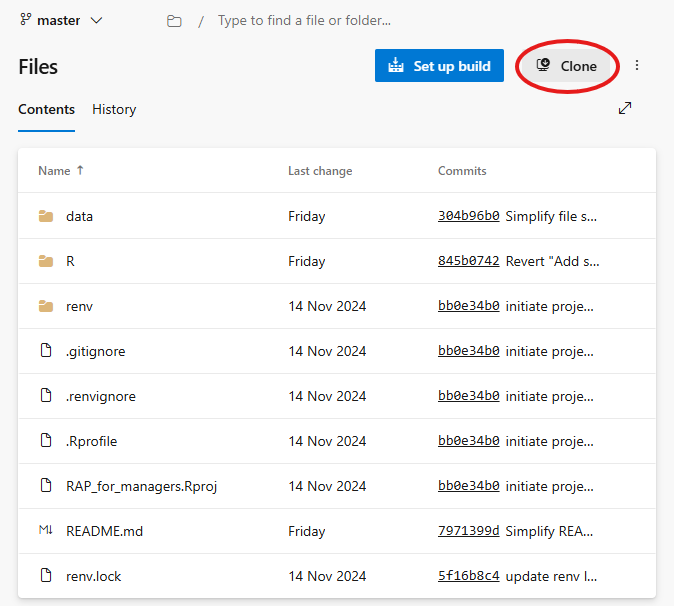
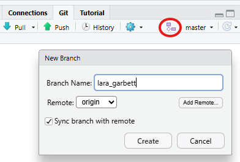
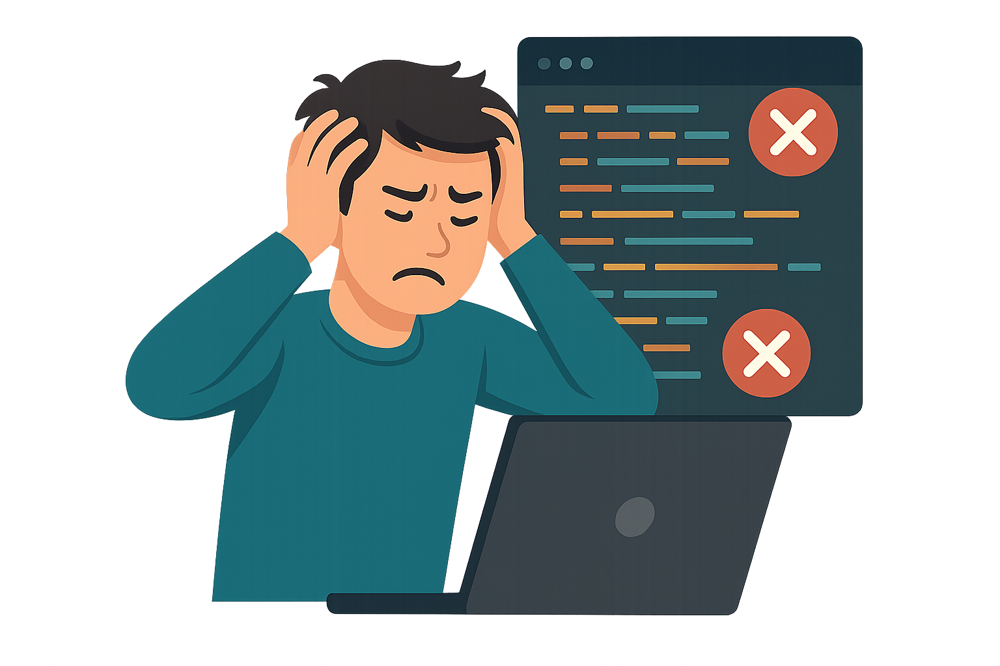
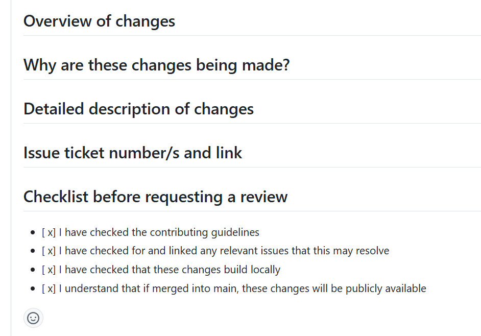
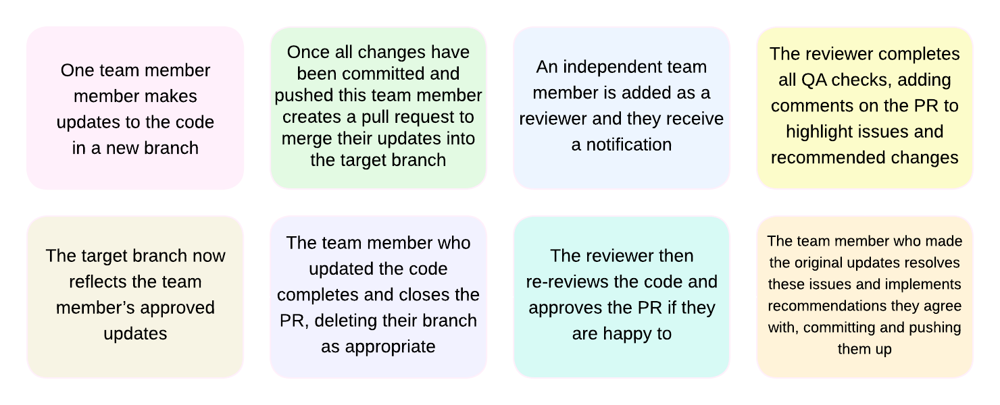
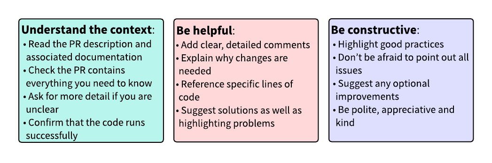
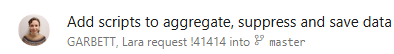

# Git: The basics

Note: the Git basics covered in this section are applicable to both DevOps and GitHub repositories

## Advantages of Git over shared folders

::: {.fragment .fade-up}
-   **Effective version control:**

    -   Avoids messy folders with unclear versioning (file_v2, file_final, file_final_FINAL...).
    -   Prevents overwriting or losing work and allows quick rollback to previous versions.
    -   Trial multiple methodologies without compromising the current version.
    -   Robust change tracking; view a file's history and see who made previous changes.
:::

::: {.fragment .fade-up}
-   **Collaboration:** 

    - Branching with Git is a safe and sensible way to work with parallel versions.
    - Code is easy to share.
    - Easier, clearer, faster code QA via reviews and automated checks.
:::

::: {.fragment .fade-up}
-   **Documentation**: 

    - Git projects often automatically generate README files for you to complete. 
    - Easily link to files and code snippets.
:::

## Git commands: clone

When you want to start working on a project that is already on GitHub or Azure DevOps, you need to *clone* the repository. This means creating a copy on your local machine.

Open the link to the [RAP for managers repo](https://dfe-gov-uk.visualstudio.com/official-statistics-production/_git/RAP_for_managers), and clone it to your laptop following these instructions:

::: {.column width="70%"}

1. Click the "clone" button in the top right of the repo page*
2. Copy the clone URL
3. Create a new folder called "repositories" in your C: drive, _outside OneDrive_
4. Open RStudio and click File -> New Project
5. Choose the Version Control option, then the Git option
6. Paste in the Repository URL, and the project directory name should self-populate
7. Click "Browse" and select your "repositories" folder to store the repo in
8. Click "Create project"
:::

::: {.column width="30%"}
{fig-align="right" width="90%"}
:::
    
You should now have a copy of the repo on your laptop, and the project should be open in RStudio ready to use!

_* When cloning a GitHub repo, you'll need to click on the green "code" button in the top right of the repo page_

## Git commands: branch

Branches in Git are like parallel universes of code.

Your `main` or `master` branch should be the most up-to-date working version. If you want to make updates or develop new features, you should **create a new branch**, which copies whichever parent branch you choose.

Let's create our own branches:

::: {.column width="80%"}

1. In RStudio, find the Git panel in the top right window
2. Find the icon with 2 purple boxes connected by a diamond - this is the "new branch" icon
2. Ensure that the branch name to the right of this icon is "master"
4. Click on the "new branch" icon, and enter your name as the new branch name in the format `<firstname>_<lastname>`
5. Click "Create"
6. In RStudio, click the green arrow in the Git panel to push up your new branch to the global repo
    
:::

::: {.column width="20%"}
{fig-align="right" width="100%"}
:::

Your own new branch should be created, and your branch name should now show in the Git panel.

## Git commands: pull, commit, push

Once you've cloned a repo, *pull, commit, push* are the three main commands you will use in Git:

::: {.column width="100%"}
-   `Pull:` Get the latest changes from the global repo
-   `Commit:` Record your changes to the local repo
-   `Push:` Send your changes to the global repo
:::

::: {.column width="40%"}
{fig-align="center" width="60%"}
:::

::: {.column width="40%"}
{fig-align="left" width="60%"}
:::

A typical workflow would be:

1.  Open the project on your laptop
2.  Pull to ensure that any changes made to the global repo by others are mirrored in your local repo
3.  Make your own changes and save them
4.  Commit your saved changes, including a useful *commit message* to explain what you have done
5.  Push your changes to the global repo when you're ready for others to see and work with them

## <span style="color:#f67400;">Expert level:</span> Create a merge conflict

If you've cloned the repo, created your branch and are already confident with basic Git commands, try this exercise!

A merge conflict occurs when two people separately make different changes to the same section of code, and then try to merge their individual branches. Git doesn't know which version of the changes to keep!

<br>

::: {.column width="70%"}
- Partner up with someone of a similar Git skill level
- Push changes to your respective branches with the aim  of producing a conflict if your branches were to be merged.
- The more complicated the conflict, the better! How messy can you make it?
- Merge one branch into the other; were you "successful" in producing a conflict?
- Decide how to resolve this conflict to complete the merge.
:::

::: {.column width="30%"}
<br>
<br>
<br>

{fig-align="right" width="100%"}
:::

# Pull requests

## What is a pull request?

When someone has finished all of the development work in their branch, they will be ready to mirror their changes in the main branch. 

To merge these changes, they should create a *pull request*. This is a request for someone else to review their changes and approve them before they are merged into the working version of the code, i.e. the code in the main branch.

-   Pull requests allow for transparent code QA and lines or chunks of code can be easily referenced. 

-   Comments added to pull requests are saved in the history of a repo, so you can always go back and review them.

When someone creates a pull request they should add a required reviewer (this will often be you). The reviewer will receive an email notification to let then know that their review has been requested. They will need to review before the pull request can be completed.

<br>

<span style="color:#f67400;">Expert level:</span> Did you know you can add optional reviewers? This is useful when their review is not needed to merge in your changes, but they might like sight of the changes anyway.


## What should I include in a pull request?

It is up to the person requesting review to include sufficient detail. Ideally you should be able to pick up a pull request and know exactly what to check without asking for any more information!

<br>

::: {.column width="40%"}
A pull request should include:

- A detailed description of the changes
- Why the changes are required
- How you have tested the changes
- How the reviewer should test the changes
- Links to any relevant issue tickets
:::

::: {.column width="60%"}
{fig-align="center" width="60%"}
:::

You might wish to set a pull request template on your repo to encourage people to add all required information.

## Recommended PR work flow
There should usually be at least two team members available to work on a pipeline (and in general, any piece of analysis). For low-risk analysis, as QA should be proportionate, this may be unnecessary - but pull requests should still be created for an audit trail regardless!

::: {.column width="100%"}
{fig-align="center" width="78%"}
:::

# Quality assurance: reviewing code

## How to approach a code review

Code reviews are a fundamental part of applying the QA framework to RAPs and encourage knowledge-sharing within teams.

::: {.column width="100%"}
{fig-align="center" width="80%"}
:::

## README file

Every repo has a README file which should contain all necessary instructions for someone knew to use the code.

The README should contain at least the following information:

-   Introduction: explain the purpose of the code
-   Requirements: outline database access and technical skills required
-   Getting started: describe the input data and where it can be found, as well as the expected outputs
-   How to run and update: outline contribution guidelines, code update processes and how to raise issues
-   Contact details: contact information of anyone maintaining the repo, and any support channels

[The dfeR package](https://dfe-analytical-services.github.io/dfeR/reference/create_project.html) contains a README template, and we have information on how to populate it on the [Analysts' Guide](https://dfe-analytical-services.github.io/analysts-guide/RAP/rap-statistics.html#writing-a-readme-file)

## Things to look for

1.  **Correctness**: Does the code do what it's supposed to do? Are there any bugs or errors?

2.  **Clarity**: Is the code easy to understand? Do you understand its intention? Is the logic clear?

3.  **Maintainability**: Is the code easy to update in the future? 

4.  **Performance**: Is the code efficient and optimal? Are there any unnecessary steps?

5.  **Documentation**: Are there comments and documentation where needed? Are they clear and helpful?

You have two options when reviewing a pull request:

-   <span style="color:#70ad47;">Approve</span>: this means that you're happy with all the above and you agree for the changes to be merged into the working version, overwriting the files that have been changed in this pull request.

-   <span style="color:#f67400;">Comment</span>: this means that you request changes to the code, and it'll be sent back to the person who raised the pull request so that they can make any fixes.

## Reviewing as a manager

As a manager you are likely to be less in the technical detail of your team's code but should often still be involved in the review process.

Managers need to be efficient with their own, and their team's time. It may not be optimal for you to worry about every technical detail.

- You might delegate technical code reviews while simultaneously reviewing from a higher-level, more general perspective.
- You can sense check the general changes without understanding their technical correctness.
- You could request brief, top-level summaries for your own QA, and more detailed & in-depth QA documentation for the technical reviewer. 
- The team should be clear on the responsibilities of each reviewer to ensure everything is covered between you.

<span style="color:#f67400;">Tip:</span> Copilot can be an excellent tool for understanding code quickly! Try writing a prompt to get a plain English version of a section of code from the next slides.

## Example: improving comments

```{r}
#| echo: true
#| eval: false

# Create a dummy dataset
student_data <- data.frame(
  student_id = 1:10,
  attendance = c(95, 85, 60, 98, 70, 50, 85, 99, 90, 80)
)

# Create an attendance flag and filter to flagged students only
processed_data <- student_data %>%
  mutate(passed_threshold = if_else(attendance >= 80, TRUE, FALSE)) %>%
  filter(passed_threshold == TRUE)
```

:::: {style="font-size: 75%;"}
::: {.fragment .fade-up}
**Review Comment**:

> *I’m unclear on why the threshold is hard-coded to 80 here. Please could you add a comment explaining its significance and whether it will change in future?*
:::
::::

::: {.fragment .fade-up}
**Suggested Revision**:

```{r}
#| echo: true
#| eval: false

# Create a dummy dataset
student_data <- data.frame(
  student_id = 1:10,
  attendance = c(95, 85, 60, 98, 70, 50, 85, 99, 90, 80)
)

# Define attendance threshold; 80 is the department's standard threshold for 'passing' attendance. This may vary in future with policy changes.
attendance_threshold <- 80

# Create an attendance flag and filter to flagged students only
processed_data <- student_data %>%
  mutate(passed_threshold = if_else(attendance >= attendance_threshold, TRUE, FALSE)) %>%
  filter(passed_threshold == TRUE)
```
:::

## Example: using functions in place of repetitive code

```{r}
#| echo: true
#| eval: false

# Calculate weighted average score by subject
maths_scores <- student_data %>%
  filter(subject == "Maths") %>%
  summarise(weighted_score = sum(score * weight, na.rm = TRUE) / sum(weight, na.rm = TRUE))

science_scores <- student_data %>%
  filter(subject == "Science") %>%
  summarise(weighted_score = sum(score * weight, na.rm = TRUE) / sum(weight, na.rm = TRUE))

english_scores <- student_data %>%
  filter(subject == "English") %>%
  summarise(weighted_score = sum(score * weight, na.rm = TRUE) / sum(weight, na.rm = TRUE))
```

:::: {style="font-size: 75%;"}
::: {.fragment .fade-up}
**Review Comment**:

> *This code is repetitive and if we add more subjects, we'll need to duplicate the code for each one. This makes the code harder to maintain and error-prone. Could you write and apply a function to calculate the weighted average score for a given subject?*
:::
::::

::: {.fragment .fade-up}
**Suggested Revision**:

```{r}
#| echo: true
#| eval: false

# Define a function to calculate the weighted average score
calculate_weighted_score <- function(data, subject_name) {
  data %>%
    filter(subject == subject_name) %>%
    summarise(weighted_score = sum(score * weight, na.rm = TRUE) / sum(weight, na.rm = TRUE))
}

# Calculate weighted average score by subject
maths_scores <- calculate_weighted_score(student_data, "Maths")
science_scores <- calculate_weighted_score(student_data, "Science")
english_scores <- calculate_weighted_score(student_data, "English")
```
:::

## Review an example pull request

Lara has created a branch `feat/aggregate_data.R` in the RAP for managers repo, with the aim of adding all necessary code to load student input data, aggregate it and suppress any small values. 

As she has finished developing this extra code she has created a [pull request](https://dfe-gov-uk.visualstudio.com/official-statistics-production/_git/RAP_for_managers/pullrequest/41414) and asked you to review before she merges it into the master branch.

::: {.column width="100%"}
{fig-align="center" width="30%"}
:::

Work in pairs to review her pull request - note down any issues, recommendations or improvements you would highlight to her.

Hint: it is always a good idea to try to run the code yourself when reviewing a pull request!

<br>

<br>

<span style="color:#f67400;">*Bonus:</span> There are six letters scattered through the repository. Can you work out what they spell?*

## Review an example pull request: possible suggestions

Here are some examples of issues we would highlight to her:

- The pull request doesn't have any description of the changes
- Lara has added herself as the only reviewer, rather than you!
- The README hasn't been updated to reflect the proposed code changes
- There is a missing ".R" in line 20 of the `run_all.R` script
- The `run_all.R` script could do with some commentary at the beginning to explain its purpose
- The `suppress_counts` function suppresses counts less than 10 rather than 5
- The `03_format_data.R` script should have improved, clearer comments explaining what it does
- The `03_format_data.R` script includes a line to save the outputs, but this is also included in the separate `04_save_outputs.R` script
- The `04_save_outputs.R` script saves the non-suppressed outputs


<span style="color:#f67400;">*Bonus*:</span> The letters spell "review"! Did you get it?

# Speaker session

::: {.column width="60%"}
Upskilling in R and Git, from a manager's perspective

*Isabel Ruckelshauss, Skills Policy Analysis*

<br>
<br>

Please ask Isabel any questions!
:::

::: {.column width="40%"}
{fig-align="left" width="30%"}
:::

# L&D, support and resources

## Making time for technical L&D

<br>

Finding time to upskill yourself and your team can be difficult. 

::: {.fragment .fade-up}
> -   What challenges do you and your team face with this?
:::
::: {.fragment .fade-up}
> -   How could you overcome those challenges?
:::

::: {.fragment .fade-up}
Tips our own teams have found helpful:

- Block out weekly / fortnightly / monthly time in team calendars dedicated to learning a specific skill
- Block out a full or half day for yourself well in advance and be strict about being "out of office"
- Sign up to instructor-led courses rather than relying solely on commitment to yourself
- Shape your day-to-day work around a new technical skill; e.g. how could you incorporate R coding into a simple process you use regularly?
:::

## Where to get support: partnership programme

The Statistics Development Team runs a partnership programme, open to analytical teams across the department.

Aims to support teams to make improvements to analytical outputs, through offering help with technical upskilling or RAP implementation, additional resource and/or guidance on best practice.

- <span style="color:#f67400;">Tier 3:</span> Embedded flexible resource working with your team to implement development work. For teams requiring significant upskilling or additional resource to reach RAP baseline expectations.
- <span style="color:#f67400;">Tier 2:</span> Regular coaching & feedback, occasional hands-on support, best practice reviews and regular check-ins. For teams requiring minor technical upskilling with enough resource to implement improvements themselves, who would like coaching through the process.
- <span style="color:#f67400;">Tier 1:</span> Direction towards appropriate learning materials & resources, advice on best practice and occasional check-ins. For teams who feel confident to self-direct but would like guidance on applying best practice.

You can always access ad hoc technical support via our [mailbox](mailto:statistics.development@education.gov.uk).

Take a look at the [partnerships section](https://dfe-analytical-services.github.io/analysts-guide/learning-development/learning-support.html#partnership-programmes) of the Analysts' Guide for details on how to apply.

## Where to get support for you and your team

- [Statistics Development Team](mailto: statistics.development@education.gov.uk): for general support with technical advice, learning & development and RAP
- [RAP champions](https://educationgovuk.sharepoint.com/sites/lvewp00487): for RAP advice more tailored to your team's work area and context
- [Partnership Programme](https://dfe-analytical-services.github.io/analysts-guide/learning-development/learning-support.html#partnership-programmes): for support with technical upskilling or additional resource to RAP your analysis or apply best practice
- [Technical workshops](https://dfe-analytical-services.github.io/analysts-guide/learning-development/learning-support.html#technical-workshops) run by the Statistics Services Unit: Intro to R and Intro to Git
- [Analysts' Guide](https://dfe-analytical-services.github.io/analysts-guide.html): our own guidance covering a range of technical skills & tools
- [Statistics Services Unit support offer](https://educationgovuk.sharepoint.com/sites/lveesfa00074/SSU%20%20Open%20sharing?newTargetListUrl=https%3A%2F%2Feducationgovuk%2Esharepoint%2Ecom%2Fsites%2Flveesfa00074%2FSSU%20%20Open%20sharing&id=%2Fsites%2Flveesfa00074%2FSSU%20%20Open%20sharing%2FSSU%20support%20%2D%20one%20pager%2FRoutes%20and%20support%20one%20pager%2Epdf&viewid=a3d9f08d%2D4fe8%2D4848%2D9157%2Dd7e09b43f701&parent=%2Fsites%2Flveesfa00074%2FSSU%20%20Open%20sharing%2FSSU%20support%20%2D%20one%20pager): a page showing all of the ways our unit can support you
- [QA team](https://educationgovuk.sharepoint.com/sites/sarpi/g/SitePages/The-QA-Team.aspx): a summary of who they are and what they do
- [QA network](https://educationgovuk.sharepoint.com/sites/sarpi/g/SitePages/QA-Officers.aspx): find a QA officer

## Useful learning resources

- [Analysts Guide: Learning support](https://dfe-analytical-services.github.io/analysts-guide/learning-development/learning-support.html)
- [Analysis Function training courses](https://analysisfunction.civilservice.gov.uk/training-courses/)
- [DataCamp](https://www.datacamp.com/): request a license by emailing [Lisa Smyth](mailto:lisa.smyth@education.gov.uk)
- [DfE Git Academy](https://dfe-analytical-services.github.io/git-academy/)
- [Codecademy course on Strategies for Managing Technical Teams](https://www.codecademy.com/learn/ext-courses/strategies-for-managing-technical-teams)
- [NHS-R Youtube, including intro to R courses](https://www.youtube.com/c/nhsrcommunity)
- [Analysis Function RAP learning pathway](https://analysisfunction.civilservice.gov.uk/learning-development/learning-pathways/reproducible-analytical-pipelines-rap-learning-pathway/)
- [HoP office knowledge shares](https://educationgovuk.sharepoint.com/:f:/r/sites/lveesfa00074/SSU%20%20Open%20sharing/HoP%20office/HoP%20Knowledge%20share%20series?csf=1&web=1&e=uefwXH)

# Summary

In this workshop, we covered:

- RAP principles: how they can help you and your teams, how to structure a RAP project, small steps you can take towards the RAP baseline expectation
- Git basics: advantages for version control & collaboration, basic Git commands, how to use Git for QA of code
- Support & resources: making time for L&D in your team, accessing technical support, learning resources

Key takeaways:

- All analysts, including managers, should be using coding and technical skills wherever possible
- Managers should be actively identifying opportunities to improve their team's technical processes
- Managers of statistics production teams should be ensuring their publication processes meet all good & great practice RAP principles as a minimum
- Analytical managers should be aware of, and use, the technical support & resources available to them and their teams

The Statistics Services Unit is here to help you with achieving best practice in statistical processes! You can always contact our mailboxes to be directed to the best avenue of support.