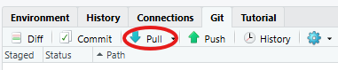
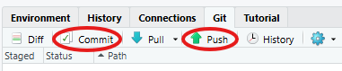
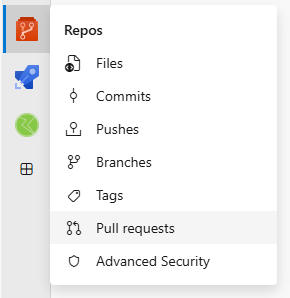
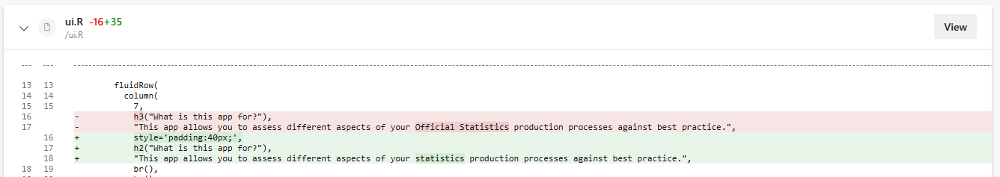
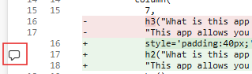
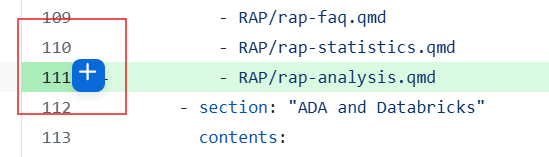
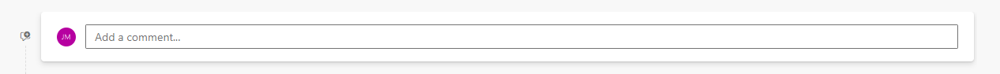
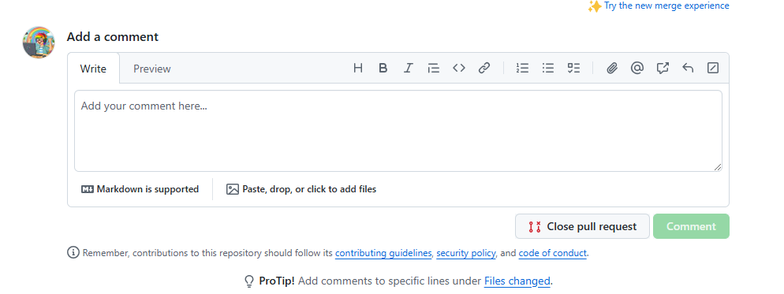

# Git: The basics

## Advantages of Git over shared folders

## Getting your team set up with Git

Your team members will need to download Git (x64) from the Software Centre - this is the Git software.

You'll need to decide whether to host your repository on DevOps or GitHub, and everyone in your team will need to create an account on that platform:

-   **Azure DevOps:** Fill in the [DevOps IT service request form](https://dfe.service-now.com/serviceportal?id=sc_cat_item&sys_id=5447e6e91bdbbb802fe864606e4bcba4) - see the [help page on how to fill in the DevOps IT request](https://dfe-analytical-services.github.io/azure-devops-for-analysis/devops---the-basics.html#getting-a-devops-account) if you need support filling it in.

-   **GitHub:** Just [create your own GitHub account](https://github.com/), no IT support needed! You should use your work email address for GitHub accounts you will use at work.

You should then create a repository for your project:

- **Azure DevOps:** It is likely your work area already has a DevOps project; if so, you should request access from the project owner. If not you can use the same IT service request form as for creating an account to create a new project. Within your area's DevOps project, you can then create a new repo for your specific work.

- **GitHub:** Contact the [EES mailbox](mailto: explore.statistics@education.gov.uk) to request access to the [dfe-analytical-services](https://github.com/dfe-analytical-services) organisation, and to set up a new GitHub repo.

## Git commands: clone

## Git commands: branch

## Git commands: pull, commit, push

## Git commands: pull, commit, push

Let's have a go at making some simple changes to the repo!

<br>

Partner up with someone else. One of you will make changes to the other's branch - decide who this will be.

<br>

If you are the partner making changes, switch to your partner's branch:

1. Click the blue arrow in the Git panel to pull down everyone else's branches onto your laptop
2. Click on your branch name in the Git panel, and select your partner's branch from the drop-down

<br>

::: {.column width="100%"}
{fig-align="center" width="30%"}
:::

## Git commands: pull, commit, push

Next, make and commit a change to the `01_load_data.R` file in the `R` folder:

1. Open the file in RStudio
2. Paste in `student_results <- read_csv("01_data/01_raw/some_student_results.csv")` under the last comment
3. Save the `01_load_data.R` file
4. In the Git panel, click the checkbox next to the file you've changed to "stage" it for your commit
5. Click the "Commit" icon, write a commit message, e.g. "add code to read in csv file", and click "Commit"
6. Finally, push up your changes to the global repo by clicking the green arrow in the Git panel

::: {.column width="100%"}
{fig-align="center" width="30%"}
:::
Now, if your partner pulls down the latest changes, and opens the `01_load_data.R` file, it should contain the new line of code.

# Pull requests

## What is a pull request?

## What should I include in a pull request?

## Recommended PR work flow

## Creating your own pull request

In this example, we will mirror the changes made to one partner's branch in the other's branch too. 

The partner who made the changes should do the following:

::: {.column width="70%"}
1. Open the [RAP for managers repo](https://dfe-gov-uk.visualstudio.com/official-statistics-production/_git/RAP_for_managers) in DevOps
2. On the left navigation bar, under "Repos", click on "Pull requests"
3. Click "New pull request", select your branch (the one with the changes made to it) as the source branch, and select your partner's branch to merge into
4. Add your partner as a required reviewer
5. Click "Create"
:::

::: {.column width="30%"}
{fig-align="center" width="60%"}
:::

The other partner, whose branch was changed, should receive an email notification requesting their review of the code. Once satisfied the code is correct, they can "approve" and "complete" the pull request, and the changes will then be reflected in the other partner's branch.

# Git repos: good practice

## README file

## Branch management 

## Automated testing

# Quality assurance: reviewing code

## How to approach a code review

## Things to look for

## See what has changed

<br>

-   When viewing a pull request, you'll be able to see where lines of code have been added (shown in green) or deleted (shown in red). 
-   Only files that have changed will be shown within the PR, so don't worry if some files aren't visible.

<br>
 
::: {.column width="100%"}
{fig-align="center"}
:::


## Adding comments to code scripts

It's easy to add comments onto specific lines of code by hovering over that line and clicking on the comment icon:

::: {.column width="50%"}
{fig-align="left" width="450"}
:::

::: {.column width="50%"}
{fig-align="left" width="450"}
:::

You can also add overall comments using the comment box on a pull request:

::: {.column width="50%"}
{fig-align="left" width="800"}
:::

::: {.column width="50%"}
{fig-align="left" width="800"}
:::

## Reviewing as a manager

## Example: improving comments

## Example: correcting filter error

```{r}
#| echo: true
#| eval: false

# Filter out students over 18
cleaned_data <- student_data %>%
  filter(age > 18) %>%
# Calculate average score by subject for students under 18
  group_by(subject) %>%
  summarise(mean_score = mean(score), .groups = "drop")
```

:::: {style="font-size: 75%;"}
::: {.fragment .fade-up}
**Review Comment**:

> *The comment on line 1 suggests that students over 18 should be filtered out, but the code `filter(age > 18)` keeps students over 18 instead of removing them. I think the filter condition should be `filter(age <= 18)`.*
:::
::::

::: {.fragment .fade-up}
**Suggested Revision**:

```{r}
#| echo: true
#| eval: false

# Filter out students over 18
cleaned_data <- student_data %>%
  filter(age <= 18) %>%
# Calculate average score by subject for students under 18
  group_by(subject) %>%
  summarise(mean_score = mean(score), .groups = "drop")
```
:::

## Example: using functions in place of repetitive code

## Example: removing hard-coding

```{r}
#| echo: true
#| eval: false

# Calculate average score by subject for 2023
average_scores <- student_data %>%
  filter(year == 2023) %>%
  group_by(subject) %>%
  summarise(mean_score = mean(score, na.rm = TRUE), .groups = "drop")

# Display a summary message for 2023
paste0("The average scores by subject for the year 2023 are as follows:")
average_scores

# Save the 2023 results to a CSV
write.csv(average_scores, "average_scores_2023.csv", row.names = FALSE)

```

:::: {style="font-size: 75%;"}
::: {.fragment .fade-up}
**Review Comment**:

> *The year `2023` is hard-coded in several places. Please can you define the year as a variable at the top of the script so the code is easier to maintain in future years?*
:::
::::

::: {.fragment .fade-up}
**Suggested Revision**:

```{r}
#| echo: true
#| eval: false

# Define the analysis year
analysis_year <- 2023  # Update this each year

# Calculate average score by subject for the analysis year
average_scores <- student_data %>%
  filter(year == analysis_year) %>%
  group_by(subject) %>%
  summarise(mean_score = mean(score, na.rm = TRUE), .groups = "drop")

# Create a summary message for the analysis year
paste0("The average scores by subject for the year ", analysis_year, " are as follows:")
average_scores

# Save the results to a CSV
write.csv(average_scores, paste0("average_scores_", analysis_year, ".csv"), row.names = FALSE)

```
:::

## Review an example pull request

## Review an example pull request: possible suggestions

# Speaker session

# L&D, support and resources

## Making time for technical L&D

## Where to get support for you and your team

## Useful learning resources
