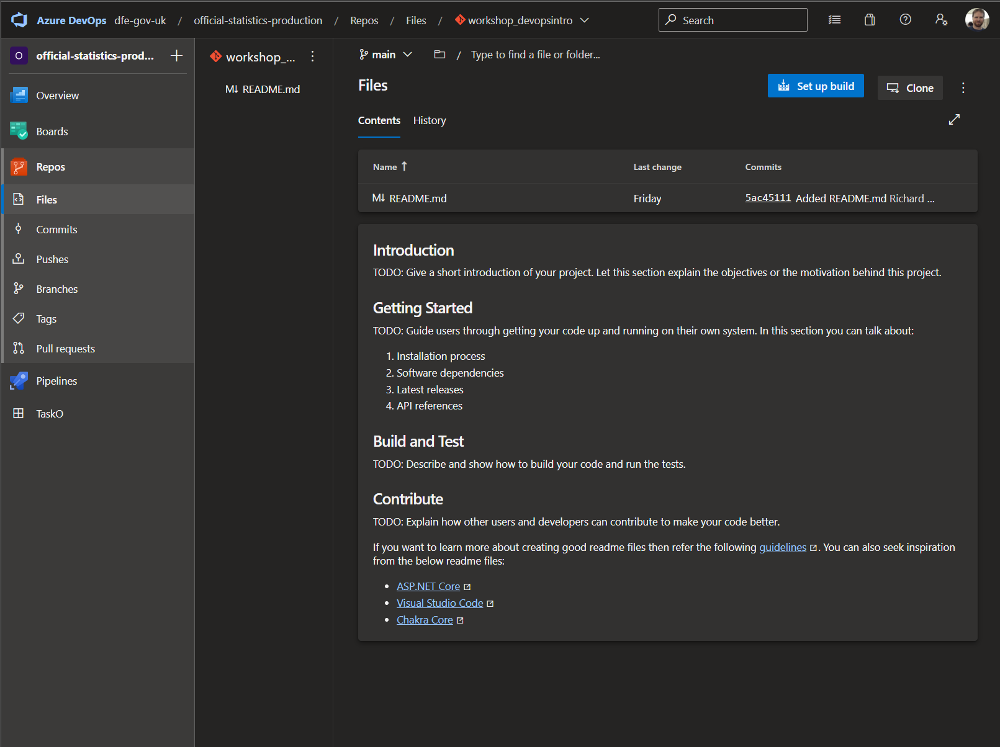
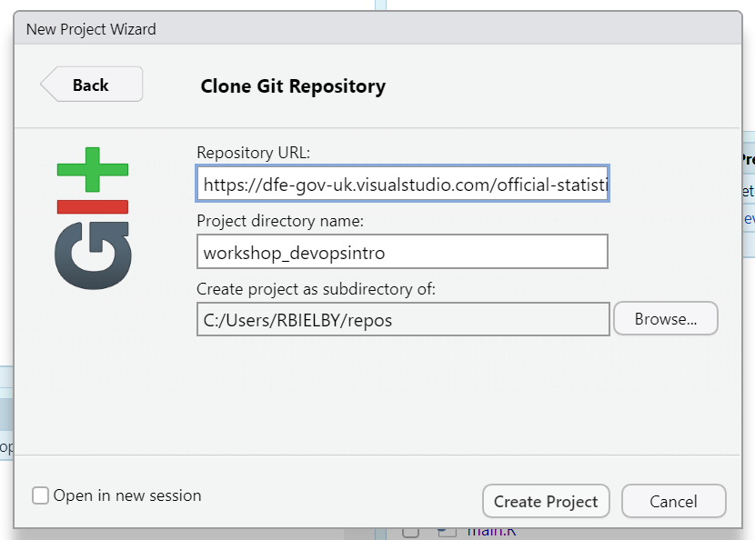
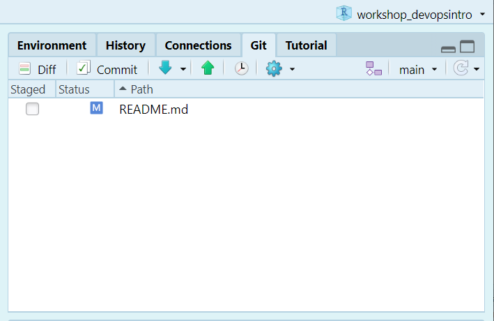
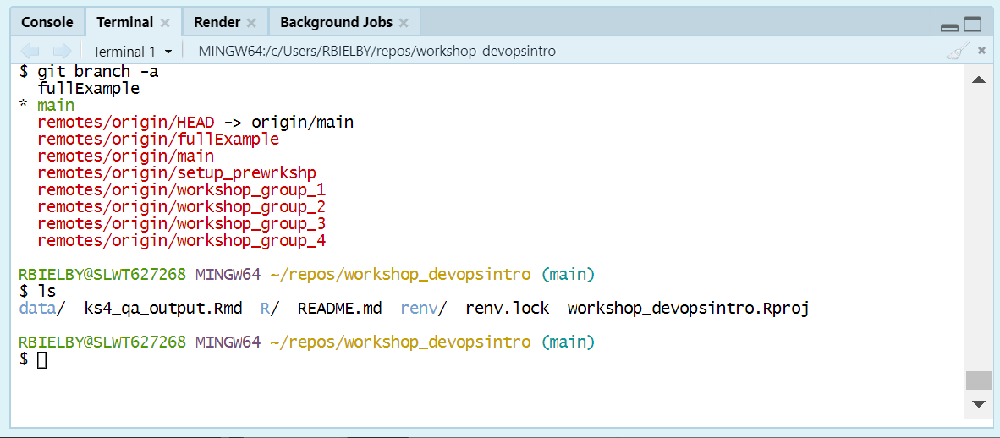
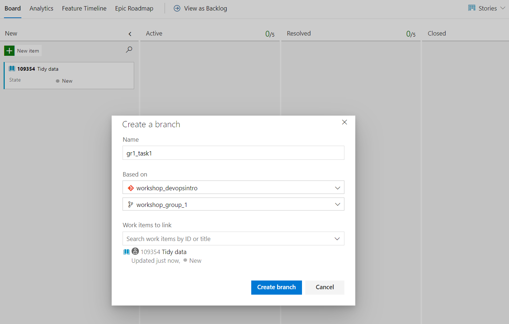
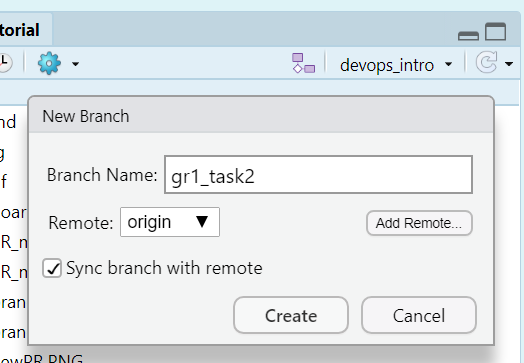
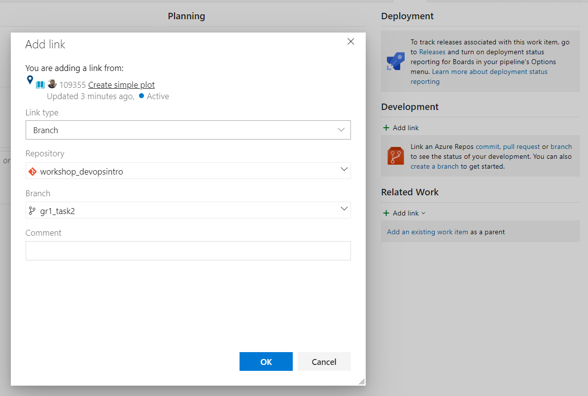
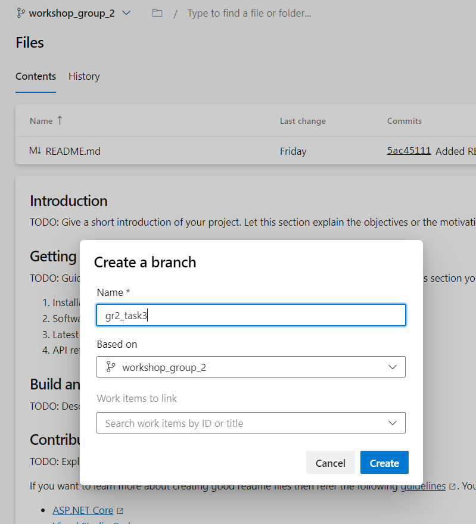
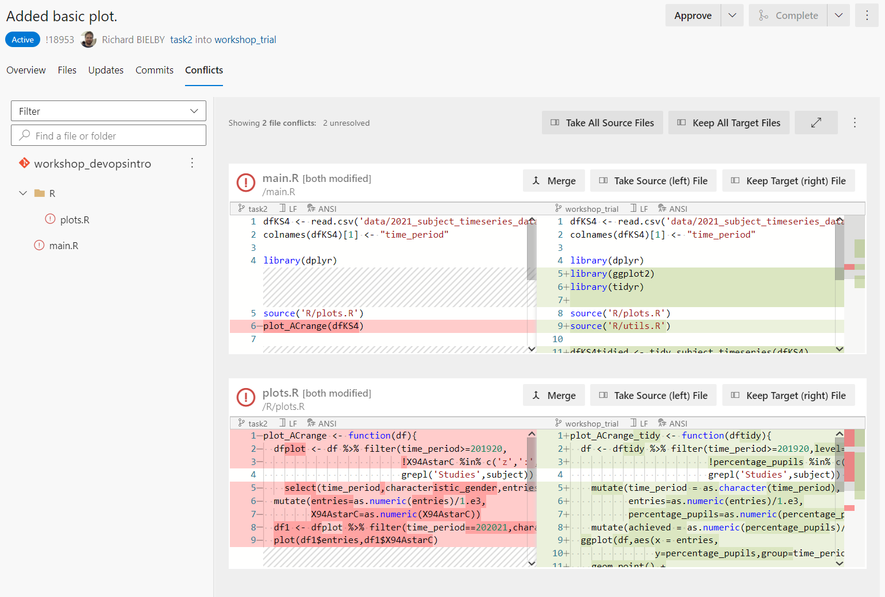

```{r write title page, include=FALSE}
connTitle <- file("title.sty")
writeLines(c("\\resizebox{48mm}{!}{\\includegraphics{images/Department_for_Education.png}}\n",
             "\\vspace*{0.24\\textheight}\n",
             "\\raggedright\\HUGE{\\color{dfeheadingblue}\\textbf{DfE Statistics Development Team Workshops}} \n",
             paste0("\\huge{\\color{dfeheadingblue}\\textbf{Using git and Dev Ops}}"),
             "\\vspace*{2\\baselineskip} \n",
             "\\normalsize \n \\newpage \n"), connTitle)
close(connTitle)
```

\newpage

# Introduction

We've prepared this walkthrough guide for statistics publication teams as an introduction on how to work collaboratively with git and Dev Ops, using some typical data manipulation as an example. The guide is intended to be step-by-step, building up from the very basics. The plan is to work through this in groups of 3-ish and with access to experienced git users to call on for support. If it starts too basic for your level, then just go through at your own/your group's pace as you see fit. By no means can we cover everything in this walkthrough, so please see it as a prompt to ask follow-up questions as you're working through on anything related to git, Dev Ops and GitHub. 

We're focusing on Azure Dev Ops rather than GitHub here, but much of the material is transferable.

## GitHub versus Dev Ops

GitHub and Dev Ops provide overlapping services in terms of creating software via a git repository: they both act as the host for the remote repository, whilst offering important tools to manage bugs and issues, tasks, merging branches, deploying applications and so on. There's a lot more to both, but these are the main bits of functionality that statisticians are likely to need.

Dev Ops is part of the Microsoft Azure platform and uses pricate DfE servers. This can allow you to connect or deploy your repository into wider Azure services. This includes SQL databases that you might already be storing data on as well as the DfE's implementation of rsconnect on DfE internal servers, which allows deployment of shiny apps for internal DfE use.

GitHub is hosted on external servers and therefore is more appropriate for making your code or application available for public access and use. For example, from a GitHub repository, you can deploy an R Shiny dashboard to shinyapps.io where members of the public may view and interact with your published data.

# Pre-workshop requirements

## Technical requirements

First of all, make sure to bring your laptop. This is going to be interactive and require you to do some coding.

Preferably before coming along, you'll need to go through the following list of things you'll need to make sure are set up on your DfE laptop:

* Set up an Azure Dev Ops Basic account (not a Stakeholder account) at the DfE Service Portal;
Either:

* Install git on your laptop: [https://git-scm.com/downloads](https://git-scm.com/downloads);
* Install R-Studio on your machine: Download **R for Windows (x64)** and **RStudio** from the Software Centre on your DfE laptop.

Or:

* If you're on EDAP and used to using R/R-Studio and/or git on there, feel free to just use that.

You'll also need to make sure that git is set up in the git/SVN pane of global options in R-Studio (found in the Tools drop down menu). Make sure the path to your git executable is entered in the git path box and git should automatically be integrated with R-Studio. 

```{r echo=FALSE, out.width='64%', fig.cap='Enter the path to your git executable in the git path option box'}
knitr::include_graphics('images/gitdemo/gitdemo-gitRstudio-settings.png')
```

Once you open a repository, you'll get an extra panel, named 'git', in the top right pane of R-Studio and you'll also be able to use git in the 'Terminal' tab at the bottom left (in the same place as the R console). 

```{r echo=FALSE, out.width='56%', fig.cap='The `git BASH` terminal in R-Studio'}
knitr::include_graphics('images/gitdemo/gitdemo-gitRstudio-NewTerminal.png')
```

A useful thing here if you want to use git commands in the terminal is to switch the terminal from the default Windows Command Prompt to `git BASH`. You can do this in the Terminal tab of R-Studio's global options - just select `git BASH` from the 'New terminal opens with' pull down menu. Click apply and then select the Terminal tab (next to the Console tab), click 'Terminal 1' and then select 'New terminal' from the drop down menu. You should see something similar to the terminal screenshot.

## Working in teams

To get the most out of git and Dev Ops, you're going to need to work in teams. We're aiming for groups of 3. Some of the tasks we'll work through will require just one of your team to perform, whilst others will require all of your team to perform them. If it's not clear then ask and most importantly, communicate with each other about what you're doing.

To help illustrate the challenges and benefits of git and Dev Ops and how to work collectively within the same space, all the groups will be working within the same repository. Each group will have their own working branch (already created) with the naming format `workshop_group_N`:

  * `workshop_group_1`
  * `workshop_group_2`
  * ...

We'll need to prefix branches and tasks within the repository with `grN_` and group N respectively (again switching the `N` for your group number). 

By the end, you should get a good idea of how using branches can facilitate lots of people working within the same space on the same files independently (and where issues can occur!).

\newpage

# Getting started in Dev Ops

## Navigating around Dev Ops

There's a lot to Azure Dev Ops, but we're going to focus today on a handful of key elements arund task management and repositories:

  * Boards
    * Boards
  * Repos
    * Files
    * Commits
    * Branches
    * Pull Requests
    
If you follow the link below, that should take you to our demo repository for this workshop. Follow the link and explore the tabs on the left of the page that are listed above.

[Azure Dev Ops workshop_devopsintro](https://dfe-gov-uk.visualstudio.com/official-statistics-production/_git/workshop_devopsintro)



The key things to note at this stage is that:

  * The Boards area contains useful project management tools for tracking development of your code. Today we'll just use the Kanban board style functionality, but there's plenty more.
  * The Repo area contains any repositories you have access to. You can navigate between repositories using the dropdown menu at the top of the page.
  
## What's a repository?

A repository is a folder containing a related set of code and associated files. So for example, it can contain your full data processing pipeline or it could contain a dashboard app.

The repo on Dev Ops represents the central safe copy of your repository and is called the **Remote** repository. It contains all the history and current code of your code and should also contain at least some associated documentation (primarily in the form of the Readme.md file).
  
You and your team can also have as many copies (or clones) of the repository on your workstations. These are the **Local** repositories. Any updates that you and your team make to the files in your local copies of the repository should be synced to the remote repository at regular intervals, such that all team members can access the latest versions of the files.

## Cloning the repository to your local machine

Cloning the repository refers to creating a copy of the remote repository (i.e. the copy on GitHub or Dev Ops) on the disk on your local machine (i.e. your DfE laptop). For an R project, there are two basic options to choose from for doing this: 

* using the R-Studio new project wizard, or 
* using `git BASH`.

We'd recommend trying the different options across your working group.

Before starting either option, you'll need to copy the repo url from Dev Ops. To do this, open up the repo front page in Dev Ops (you can use the link from earlier) and click the grey **Clone** button near the top right of the page. Make sure HTTPS is selected and then click the copy button to grab the url.

### Cloning in `git BASH`

You can open up a `git BASH` terminal, by typing `git BASH` in the Windows search bar and select `git BASH` when it comes up. With a terminal, you can interact with it just by typing, similar to working in the R console in RStudio. First let's make a directory in which to store our repositories:

```
    mkdir repos
```

We can then move into the directory we just created using:

```
    cd repos
```
    
Now grab the repo url and replace `<repo_url>` in the next command with the actual url from Dev Ops:

```
    git clone <repo_url>
```

You should get some messages letting you know git is connecting to the server and cloning the repository and it should look something like the figure below.

```{r echo=FALSE, out.width='60%', fig.cap='Cloning a repository in git BASH'}
knitr::include_graphics('images/gitdemo/gitdemo-terminal_clone.png')
```

If all went well, you'll now have a complete copy of the repository on your laptop. To open the repository in RStudio, start up RStudio and select Open project. In the file explorer window that opens up, type `C:\Users\` and hit enter (see the screenshot below) and then open up your home folder. 

```{r echo=FALSE, out.width='60%', fig.cap='Open a cloned project in RStudio'}
knitr::include_graphics('images/gitdemo/gitdemo-RStudio_OpenProj.png')
```

Then navigate into `repos` and the repository folder. The full path should be something along the lines of:

> `This PC > Windows (C:) > Users > <USERNAME> > repos > <REPONAME>`

Select the R project file and select open.

```{r echo=FALSE, out.width='60%', fig.cap='Open a cloned project in RStudio'}
knitr::include_graphics('images/gitdemo/gitdemo-RStudio_OpenProj_fullpath.png')
```

### Cloning using the RStudio wizard

If that looks like a bit too much text based effort, RStudio offers a way to clone a repository with it's New project wizard. To do this navigate the menu bar to **File > New Project...**, select **Version Control** and then Git. This opens up a dialogue box to enter the repository url and select where to save it. As with the git BASH version, copy and paste your remote repo URL here and set a directory where you want it saved on your laptop.

```{r echo=FALSE, out.width='60%', fig.cap='Clone a project using the RStudio git wizard'}

```

#### A note on local repository clones and OneDrive

> Note that saving a repository within your OneDrive folder structure can cause some awkward issues. If you use git to perform version control on a repository saved within a OneDrive folder, you may start receiving warning messages that large numbers of files have been removed from OneDrive. In addtion, it can put a heavy burden on your internet connection as OneDrive tries to keep up with changes to the files managed by git. Best practice therefore is to store your repositories somewhere outside your OneDrive file structure. We recommend creating a `repos` directory within your base User directory (i.e. `C:\Users\<USERNAME>\repos\`. Windows sometimes tries to make it awkward for you to navigate to places on your laptop outside of the OneDrive folders, so a useful tip is to add your `repos` folder to your Quick access list in File Explorer.

## Using Dev Ops Boards

We're going to work through a demo of tidying up some data and running a quick QA on it.

To start with, we'll create some tasks on the Kanban Board in Dev Ops. The tasks to create are (note that including your group number in the titles will make things easier further down the line):

  * Group N: [Tidying the data](#tidying-the-data)
  * Group N: [Creating the wide data plot](#creating-the-wide-data-plot)
  * Group N: [Creating the tidy data plot](#creating-the-tidy-data-plot)

Go to the *Boards* > *Boards* tab on Dev Ops and make sure you're in the right board, i.e. workshop_devopsintro_N. Now create tasks for each of these using the New item button.

## Summary

In this section, we've had a quick look around Dev Ops and the remote repository, cloning it to your local drive (using both the BASH terminal and the RStudio wizard) and creating and assigning tasks on the Dev Ops Boards area.

In the next section, we'll cover some of the basics of using git to log changes to your code and sync them between the remote repo and local copies. If you open up one of the tasks, you'll see you can add descriptions, comments, tags, priorities and story points (effectively an estimate of the effort or time required) among other things. We can leave those for the purpose of this demo and for now decide who's going to do what and drag each task into the Active column. Note that whoever drags a given task across will automatically be assigned as the person working on that task. If that's not the right person, then click on the name and select who should be doing it.

We'll take a break from Dev Ops now and move on to taking a look at using git.

\newpage

# Basics of git

We'll now take a look at updating repositories using some simple processing and QA code as an example.

## The git log

In order to move quickly between different versions of files and code, git is built around indexing and a log file that track the changes in a repository. To view the log of any repository, we can simply go into that repository and run the command `git log` from the BASH terminal. Here's a minimal example on a fresh repsoitory:

```{r echo=FALSE, out.width='80%', fig.align='center'}
knitr::include_graphics("images/gitdemo/gitdemo-gitlog-1.png")
```

The log shows all "commits" that have been made to the repository. We'll go into making commits in the next section.

## `git bash` versus the *R-Studio* git panel

```{r echo=FALSE, out.width='50%', fig.align='center', fig.cap="The *R-Studio* git panel provides all the common day to day git commands such as Stage/Add, Commit, Push and Pull, switch branches, view history."}

```

```{r echo=FALSE, out.width='50%', fig.align='center', fig.cap="The *R-Studio* git bash terminal provides access to all git functionality via a command line interface."}

```

There are two main ways you can run git commands within R-Studio, either using the `git bash` terminal or the *R-Studio* git panel Each offers some advantages, but the main ones are that `git bash` offers the full range of tools for controlling your repository, whilst the *R-Studio* git panel offers the most common basic commands but with a simpler (and usually quicker) interface. We'll use both in this workshop.

## Branches

One of the most important elements of using `git` is **branches**. These provide a method to keep multiple different copies of your code in a single repository. This is usually intended to maintain a working base copy alongside one or many development branches with new features, updates or bugfixes.

In this workshop, we've created a branch for each team, so you need to start by switching to the branch for your group - one of workshop_group_1, workshop_group_2, workshop_group_3 etc. As in most cases here, you can use either the RStudio git panel or `git bash` to switch branches.

### Switching branches in `git bash`

In `git bash`, you can change branches using either the `switch` or `checkout` command. Go to the bash terminal in R-Studio and enter the command:

`git checkout workshop_group_1`

Updating the number to your group number. To switch back to main, you can simply use:

`git checkout main`

### Switching branches in the *R-Studio* git panel

In the git panel, the name of the current branch is given next to the purple create branch symbol. Click on the name of the current branch (which should be *main* at present) and a drop down list will appear. Select your group's branch from this list and R-Studio will automatically switch to that branch. Anything you add and commit to the repository will now be written to the branch you've selected and not *main*.

## Adding, commiting and pushing

To have something to work with, we need some data. There should be a data folder in the repository already, so all we need to do is grab some data and save it there. For this workshop, we'll use a file from a publication on Explore Education Statistics. 

*For this section, just one of your group should run through the following steps in your group's branch:*

Go to [key stage 4 performance publication](https://explore-education-statistics.service.gov.uk/data-catalogue/key-stage-4-performance-revised/2020-21) and download the **KS4 subject timeseries data (csv, 364 Kb)** file, extract the data csv file (*2021_subject_timeseries_data.csv*) and save it into the repo's data folder (you can just use the normal Windows File Explorer to do this).

Now to add this to the git tracking: run the following commands:

```
  git add .
```

This searches the repo for any files that have been modified since the last commit and creates a log of the changes. If you want to check that the command has worked, then you can type `git status` or `git st` and you'll get a summary of files that have been staged and are ready to commit.

```
  git commit -m "Added data file into repository."
```

This adds an entry on to the log, updating it with the file changes that you've just made. Note that the text after the `-m` is a comment used to describe the changes to make it easier for someone looking back from the log to see what changes have happened. Those are the two key steps for tracking changes to the files and folders in your repository. 

Now we'll add in some simple code to read in the file. Create a script in the repository's root directory called `main.R`. The add the following code to it:

```
dfKS4 <- read.csv('data/2021_subject_timeseries_data.csv')
colnames(dfKS4)[1] <- "time_period"
```

Let's do a quick commit to log that change. In the termainl run `git add .` and `git commit -m "Added new data and reading it in."`.

If we now run `git log` again, we get something along the lines of:

```{r echo=FALSE, out.width='80%', fig.align='center'}
knitr::include_graphics("images/gitdemo/gitdemo-gitlog-2.png")
```

Here we can see, in reverse order, the commits that have been made, who made them, when they made them, and the messages that have been recorded with them.

Finally, it's important to note that what we've done so far is only being applied to the local copy of the repository (i.e. the copy on your laptop). To apply your changes to the remote repository (i.e. on GitHub or Dev Ops), you need to "push" the changes. This can be done a couple of different ways: a) in the terminal type `git push` or b) on the toolbar in the *R-Studio* git panel press the green up button! Once you've done this, open up a browser and go to your remote repository on Dev Ops and, once you've switched on to your branch, you should now see the data file stored there. You should also see that it's not been added on to the main branch.

## Pulling from the remote repository

Now that you've made changes, the rest of your team need to update their own local copies of the repository with your updates by pulling from the remote. Similarly to pushing, they can do this by either a) typing `git pull` in the BASH terminal or b) pressing the down arrow in the toolbar of the git panel in *R-Studio*.

## Summary of git basics

We've quickly tried out a quick cycle of adding and committing, which is used to log changes into the local repository and then we've pushed and pulled to and from the remote repository and local copies on different laptops. The table below gives a summary of the relevant commands in the BASH terminal and the corresponding buttons in the RStudio git panel. 

| Process | git BASH                          | RStudio git panel                               |
|---------|-----------------------------------|-------------------------------------------------|
| Add     | `git add .`                       | Stage using tickbox next to each modified file. |
| Commit  | `git commit -m "Commit message."` | "Commit" button in toolbar.                     |
| Push    | `git push`                        | Green up arrown in toolbar.                     |
| Pull    | `git pull`                        | Blue down arrow in toolbar.                     |
| View the log | `git log`                    | Clock icon in toolbar.                          |

\newpage

# Working collaboratively with git

Git only really makes proper sense once multiple people start working on a project collaboratively. Solo working, git is useful for version control and syncing your work to a remote repository site like Dev Ops and GitHub, but may not feel like it offers all that much more beyond that. Once we start working collaboratively however, the benefits of using git (alongside GitHub or Dev Ops) become more apparent. We'll now look further into this with some worked examples.

## Branches and splitting tasks

### Task management

One useful management tool that we can use from Dev Ops is the *Boards* area. Here we can create individual tasks, assign them to team member and then create new **branches** from those tasks. You can think of **branches** as self contained copies of the repository that can contain complementary or conflicting differences with all other **branches** in the repository. These allow you to work on different multiple tasks on your code independently of any other changes you might be making. Bringing these different **branches** or tasks together is then managed using **merges** or **pull requests** (PRs).

We'll demonstrate this by performing 3 related tasks on 3 different branches. Each task should be done by only one of your group, so split the following 3 tasks between your group and each follow the relevant instructions in the subsections below:

* 1a) Tidying the data
* 1b) Creating the wide data plot
* 1c) Creating the tidy data plot

Once you've decided who's doing what, each of you should jump to the relevant section below. And remember that you're not working in independent silos here, what you do can impact what other people are doing so communication needs to happen along the way.

#### Tidying the data

Start the task by going to your Dev Ops board and click on the options for the Tidying data task. Select **Create new branch** from the drop down menu that appears over the task. You'll get a pop-up dialogue box with some options about your new branch. Give the new branch a name (e.g. `grN_task1`), make sure it's based on your group's branch (`workshop_group_N`) in the `workshop_devopsintro` repo and then click **Create branch**.

```{r echo=FALSE, out.width='80%', fig.align='center'}

```

You'll now have a new branch in your remote repo that's identical to your groups working branch. To access that branch in your local repo, you just need to perform a pull (i.e. `git pull` in the `bash` terminal or the down arrow in the R-Studio git panel) and then switch branches (`git switch grN_task1` in `bash` or select from the drop down menu in the git panel).

Now to make the edits. Copy and paste the following code into the script `R/utils.R`:

```
tidy_subject_timeseries <- function(dfin){
  # Pivot long and then update the string values in the new filter column.
  dftidied <- dfin  %>%
    pivot_longer(!c(time_period,time_identifier,geographic_level,
                    country_code,country_name,version,characteristic_gender,
                    subject,entries),
                 names_to="level",
                 values_to="percentage_pupils")
  colnames(dftidied) <- gsub("characteristic_","",colnames(dftidied))
  return(dftidied)
}
```

And then go back to `main.R` and add the lines:

```
library(tidyr)
library(dplyr)
source('R/utils.R')
dfKS4tidied <- tidy_subject_timeseries(dfKS4)
```

At this point you could try sourcing `main.R` in the R console and that should create the data frame `dftidy` (and hopefully not produce any errors!).

Once you're happy, then run another `add`/`commit`/`push` cycle and flag to your team that you've finished the code to read in the data. Then scroll down this guide to the [merging and pull requests](#merging-and-pull-requests) section.

#### Creating the wide data plot

Whilst the first task adds in some data, reads it in and does some processing, this task builds a quick chart based on the data.

Create a new branch within R-Studio. To do this, first make sure that you're in your groups branch (i.e. `workshop_group_N`) and then you can either a) use the command `git checkout -b grN_task2` (changing the N to your group number) and push to the remote (`git push`) or click the purple new branch button in the R-Studio git panel (see the image below).

```{r echo=FALSE, out.width='92%', fig.align='center'}

```

We want to track this branch with the associated task in Dev Ops Boards, so go to the card you made for task 2 on your group's board. Move it to the **Active** column and then open up the task to edit. On the right hand side of the dialogue box, you can link your branch to this task under **Development**. Click **Add link** and in the next dialogue box find and select your new branch from the branch drop down menu (as shown in the screenshot). Click Ok to complete the link. Then you should see your branch listed under **Development** (note the option to create a Pull request, which you can use later on when we merge this branch in to the rest of the development).

```{r echo=FALSE, out.width='82%', fig.align='center'}

```

Now to make the changes. Head back to R-Studio and add the following lines of code to `R/plots.R` in your local copy of the repository:

```
plot_ACrange <- function(df){
  dfplot <- df %>% filter(time_period>=201920,
                             !X94AstarC %in% c('z',':','x'),
                             grepl('Studies',subject)) %>% 
    select(time_period,characteristic_gender,entries,subject,X94AstarC) %>%
    mutate(entries=as.numeric(entries)/1.e3,
           X94AstarC=as.numeric(X94AstarC))
  df1 <- dfplot %>% filter(time_period==202021,characteristic_gender=='Total')
  plot(df1$entries,df1$X94AstarC)
}
```
And the following to `main.R`:

```
library(dplyr)
source('R/plots.R')
plot_ACrange(dfKS4)
```

And that should be it for this task. All that's left is to commit and push your changes. If you've got a preferred way already to perform commits, then go for it. If not then let's use the RStudio git panel.

```{r echo=FALSE, out.width='64%', fig.align='center', fig.cap="Staging files in the RStudio git panel."}
knitr::include_graphics("images/gitdemo/gitdemo-RStudio-gitpanel.PNG")
```

Firstly click on the git tab in the top right of RStudio to show the git panel (see the screenshot below). Next click the tickboxes next to the files with changes (i.e. these should be server.R and R/dashboards_panels.R) to **stage** (aka **add**) the files. Now click **commit**, add a commit message in the relavent text box and then hit **commit** in the bottom right corner of the window. 

Assuming that all went through without any issues, you can now press the green up arrow in the git panel to **push** your changes to the remote repository on Dev Ops

Flag to your team that you've finished the code to read in the data. Then scroll down this guide to the [merging and pull requests](#merging-and-pull-requests) section.

#### Creating the tidy data plot

Start by creating a new branch in Dev Ops. Navigate to the files panel of the repo on Dev Ops and click the branch drop down menu. Select your groups working branch (`working_group_N`). Click the drop down again and now select **+ New branch**. You'll get a pop-up dialogue box that looks like the image below. Fill in a name for the new branch and make sure your groups working branch is selected in the **Based on** selection box. You can also link your task to this new branch by selecting it in the **Work items to link** selection box. Once you've done that, quickly go to your group's board and have a look at the task 3 card. If you haven't done so already, drag and drop the card into the Active column (you should then see that you automatically get asigned to the task in Dev Ops).

```{r echo=FALSE, out.width='64%', fig.align='center'}

```

Now head to R-Studio, perform a pull (`git pull` in the terminal or the green down arrow in the git panel) and then switch to your new branch.

Then go ahead and add the following lines of code to `R/plots.R` in your local copy of the repository:

```
plot_ACrange_tidy <- function(dftidy){
  df <- dftidy %>% filter(time_period>=201920,level=='X94AstarC',
                          !percentage_pupils %in% c('z',':','x'),
                          grepl('Studies',subject)) %>%
    mutate(time_period = as.character(time_period),
           entries=as.numeric(entries)/1.e3,
           percentage_pupils=as.numeric(percentage_pupils)) %>%
    mutate(achieved = as.numeric(percentage_pupils)/100.*entries)
  ggplot(df,aes(x = entries,
                y=percentage_pupils,group=time_period,color=subject)) +
    geom_point() +
    facet_grid(time_period ~ gender)
}
```

And the following to `main.R`:

```
library(dplyr)
library(ggplot2)
source('R/plots.R')
plot_ACrange_tidy(dfKS4tidied)
```

And that should be it for this task. All that's left is to commit and push your changes. If you've got a preferred way already to perform commits, then go for it. If not then let's use the RStudio git panel.

```{r echo=FALSE, out.width='64%', fig.align='center', fig.cap="Staging files in the RStudio git panel."}
knitr::include_graphics("images/gitdemo/gitdemo-RStudio-gitpanel.PNG")
```

Firstly click on the git tab in the top right of RStudio to show the git panel (see the screenshot below). Next click the tickboxes next to the files with changes (i.e. these should be server.R and R/dashboards_panels.R) to **stage** (aka **add**) the files. Now click **commit**, add a commit message in the relavent text box and then hit **commit** in the bottom right corner of the window. 

Assuming that all went through without any issues, you can now press the green up arrow in the git panel to **push** your changes to the remote repository on GitHub.

Flag to your team that you've finished the code to read in the data. Then scroll down this guide to the [merging and pull requests](#merging-and-pull-requests) section.


## Merging and pull requests

As part of using branches within git, you'll reach the point where you need to merge two branches together. This can be done with a git command from the `BASH` terminal, but usually it's more helpful to perform merges using a *Pull Request (PR)* in Dev Ops or GitHub. The difference between a merge and a pull request is basically that a pull request is a way to run a merge from Dev Ops or GitHub which provides some useful tracking tools to help you clearly understand and communicate what is happening as part of a given merge. Some key things the pull requests offer are:

  * user documentation of changes;
  * quick look diff/overview of changes made to files on the branch being merged;
  * run automated tests;
  * ability for collaborators to review your code;
  * control of merge conflicts;
  * final sign-off from collaborators;
  * complete a merge.

We'll start though by trying a basic `git merge` from the terminal without these features offered by pull requests.

### `git merge` (and a simple merge conflict)

As we've left things, the code for task 1 and task 2 both should work without errors. However, the code for task 3 (plotting from the tidied data frame) requires the code from task 1 (which produces the tided data frame) to be able to run. To get it running, we're going to merge the branch for task 1 into the branch for task 3. To do this, *one of your team* should switch into the branch for task 3 (e.g. `git switch task3`) and then run the following command:

```
   git merge task1
```

This will attempt to merge the task1 branch into the task3 branch. However, this will produce a merge conflict and the merge will not complete. If you now look at the script `main.R`, it should now look something like the following:

```
   dfKS4 <- read.csv('data/2021_subject_timeseries_data.csv')
   colnames(dfKS4)[1] <- "time_period"

   <<<<<<< HEAD
   library(dplyr)
   library(ggplot2)

   source('R/plots.R')
   plot_ACrange_tidy(dfKS4tidied)
   =======
   library(tidyr)
   library(dplyr)
   source('R/utils.R')
   dfKS4tidied <- tidy_subject_timeseries(dfKS4)
   >>>>>>> task1
```

A merge conflict happens when two concurrent changes have been made across different branches to the same bit of a file. Here we can see that `main.R` has been edited simultaneously on both branches. Everything between `<<<<<<< HEAD` and `=======` is what was written in the current branch (i.e. task3) and everything between `=======` and `>>>>>>> task1` is from the branch that we're trying to merge *into* the current branch. Looking at the code, we can see that it needs the intervention of the person(s) writing the code to decide how the two pieces of code should be combined. In this case, there's a duplicated line that we can get rid of and then some lines that we need to make sure are in the right order. So now replace the lines between (and including) `<<<<<<< HEAD` and `>>>>>>> task1` with the following:

```
   library(dplyr)
   library(ggplot2)
   library(tidyr)

   source('R/plots.R')
   source('R/utils.R')

   dfKS4tidied <- tidy_subject_timeseries(dfKS4)
   plot_ACrange_tidy(dfKS4tidied)

```
We've made a change to a file, so to fully resolve the conflict (and complete the merge), we'll need to perform and `add` and `commit`. Do that whichever way you prefer and at that point the task1 branch will be fully merged into the `task3` branch.

Now we'll look at how a merge works via a pull request.

### Pull requests #1

Whilst the basic merges above work fine for pulling in some simple changes, using `git merge` via the terminal lacks any collaborative functionality like discussing and reviewing changes. This is where pull requests come in to play. Pull requests are a part of both GitHub and Dev Ops and provide similar functionality between those two platforms. Here we're using Azure Dev Ops, but a lot of this will be transferrable to using GitHub.

Go to your repo in Azure Dev Ops and select Branches from the left hand navigation panel under Repos. Select the branch for task3 (`grN_task3`). You should see a panel near the top of the branch page telling you that "You updated grN_task3 Just now". At the right hand side of this panel, there should be an option to create a pull request, click this!

Once the create pull request page has loaded you should see a few text boxes to full in and a handful of options to make choices on. The default for a new pull request is to merge into main, but here we want to merge into your group's branch, so click on `main` near the top and select `workshop_group_N`.

You should see three tabs: Overview, Files and Commits. Try clicking onto the Files and Commits tabs and you'll be given the details of what's being included in the planned merge. You should see all the file changes and commits made as part of task3 and task1 (which was merged into task3 above).

Now back on Overview, give the pull request a descriptive title (e.g. "Tidied data frame and created ggplot") and a quick description in the relevant boxes. Then assign your teammates as reviewers and then click create pull request.

You and your team mates will now have a pull request available under the pull requests panel where they can review the changes, add comments and provide approval. Get your teammates to run through a quick review and approve the pull request. You'll then be able to complete the merge by clicking the blue **Complete** button at the top of the page.

Now head over to Dev Ops Boards and drag tasks 1 and 2 across to Closed to mark them as finished.

### Pull requests #2 (and another merge conflict)

We've got one final branch to merge in to complete the work: grN_task2. Whoever worked on task 2 should now go to Boards in Dev Ops and find their task. Open it up and under **Development**, select **Create a Pull Request**. Again, direct the merge into `workshop_group_N` instead of `main` and give the PR a title, description and reviewers, then click **Create**.

Once you've created the pull request, you should find that this time there's a merge conflict. Now instead of editing the conflicting file(s) in R-Studio, you'll be able to resolve the conflict on Dev Ops. Click on the conflicts tab and review the conflict. It should look something like the following:

```{r echo=FALSE, out.width='96%', fig.align='center', fig.cap="Staging files in the RStudio git panel."}

```

You've got three options for resolving the conflict: **Merge**, **Take Source (left) file** and **Take Target (right) file**. For a simple conflict where just one or the other version is appropriate then you can click the corresponding of the latter two options. Here we have something a little more complicated, so we want to go in and edit and re-arrange the code ourselves. Click **Merge** and you'll get a new screen showing the two versions side by side with an editor panel below. 

For the `main.R` file, change the conflicting lines in the editor to be the following and then click **Submit merge**.

```
   library(dplyr)
   library(ggplot2)
   library(tidyr)

   source('R/plots.R')
   source('R/utils.R')

   plot_ACrange(dfKS4)

   dfKS4tidied <- tidy_subject_timeseries(dfKS4)
   plot_ACrange_tidy(dfKS4tidied)
```

And for the `plots.R` file, simply remove the **auto-generated** lines in the editor (you might also get asked to add a line ending, in which case choose *LF*) and again click **Submit merge**.

Back on the Overview page, it should now say *No merge conflicts* and the **Complete** button should be available to click. Now the PR is ready for your collaborators to review and approve and then you can complete the PR and merge into your group's workshop branch.

Once you've completed the PR, head back to the team board on Dev Ops and open up the task 2. You'll now see that the PR is listed under the Devlopement section on the right as completed. To mark the task as finished, close the task dialogue box and drag the task from Active to Closed.

### Notes on reviewing a pull request

There are some basic steps to go through if you're asked to review a pull request. The key elements are:

  1. Review any automated checks or QA scripts;
  2. Clone the repository, switch to the relevant branch and run the code;
  3. Look through and comment on the changes to the repository using the **Files changes** panel in the PR.
  
In this case, we don't have any automated checks set up properly, so we'll focus on points 2 and 3.

First of all try switching to the *featTimeSeriesChart* branch if you're not already in it and run the Shiny app - this can be done by opening the global.R script in RStudio and clicking Run App in the top right hand corner of the viewer pane. Assuming the dashboard runs, then try cycling through the different panels of the dashboard looking for any problems, errors or just things that could be improved.

There should be plenty of issues to find as we've kept the actual dashboard coding brief to focus on using git. As you find them, enter them in to the GitHub pull request, either under **Review changes** on the Files changed panel or as comments in the **Conversation** panel.

In reality, once you've got those reviews collated, you'd go through and make changes to the code accordingly. This provides the checks and balances and a structure for code QA necessary when developing reproducible analyticle pipelines or data dashboards.

Assuming we've dealt with the outcomes of those reviews appropriately, the next step is to complete the Pull request by clicking the **Merge pull request** button. This then completes the merge in to *main* in this case. Whilst the basic mechanics of what's happening with the branches is the same here as with just running `git merge`, the Pull request provides that extra layer of administrative structure to perform proper QA of the code and the resulting product.


## Summary

We've looked through a lot of the basics in this section, covering adding/staging, committing, pushing/pulling between remote and local repos, merging and pull requests. These are all the main concepts you need to use git. 

We've also tried to cover doing all this through a mixture of RStudio, git BASH and GitHub (and as we've said Azure Dev Ops offers similar functionality to GitHub). Most common processes can be done multiple ways and there's not necessarily a single right method to follow, just whichever makes most sense in your situation.

Just a quick final note on why it's useful to be familiar with git `BASH`. Whilst most of the basic git functionality can be accessed via the RStudio panel or GitHub/Dev Ops, there are some things that are best achieved through BASH. In particular, if you have a file in your repo that you need to remove entirely, this pretty much requires someone to use commands via git BASH.


| Process       | git BASH                          | RStudio git panel                               |
|---------------|------------------------------|:------------------------:|
| Create branch | `git checkout -b branch_name` |  \includegraphics{"images/gitdemo/gitdemo-RStudio-gitToolbarCreateBranch.png"} |
| Switch branch  | `git checkout branch_name` | \includegraphics{"images/gitdemo/gitdemo-RStudio-gitToolbarSwitchBranch.png"} |
| Merge branch   | `git merge branch_name`  | N/A - use GitHub/Dev Ops |


\newpage

# Troubleshooting

## renv

If `renv::restore()` causes issues, then one of your team should try `renv::init()` and select option 2 to restart renv. Then do a add/commit/push cycle and get the other team members to do a pull and then try running `renv::restore()` again on their local clones of the repo.

## Datafiles commit-hooks/`.gitignore`

To help teams keep on top of avoiding any accidental publishing of unpublished data, we've added in some code around commits that checks through any data files in the repo and checks them against a logfile and the .gitignore file. Any files listed in .gitignore will not be included in commits and therefore won't be sent to the remote repo as part of any push.

## merge conflicts

Merge commits happen when two branches have conflicting changes that have been made concurrently. `git` can usually figure out how to prioritise changes based on the commit history, but if changes have happened at the same time to the same bit of code across different branches, then it will need to get your input on how to prioritise the changes.

The easiest way to go through how to deal with merge conflicts is by discussing with an example, so ask us in the workshop if and when you hit a merge conflict.

Briefly though, when there's a merge conflict, git will add some text to the file containing the conflict along the following lines:

```
<<<<<<<<<<< branch_1
code 
on 
branch 
1
===========
conflicting code on branch 2
>>>>>>>>>>> branch_2

```

Effectively as the user, you need to decide which bit of code is the right bit to keep and then delete anything you don't want to keep as well as the tag-lines that git has added in. So for example, you should be left with something along the lines of:

```
code 
on 
branch 
1

```

Once you've cleared up all merge conflicts in the branch that you're working on, then perform another add/commit cycle and thay should clear out the conflict from the branch that you're working on and you'll be able to continue with the intended merge/PR.


\newpage


\resizebox{48mm}{!}{\includegraphics{images/Department_for_Education.png}}
\vspace*{\fill}
\color{black}
© Crown copyright 2022

This publication (not including logos) is licensed under the terms of the Open Government Licence v3.0 except where otherwise stated. Where we have identified any third party copyright information you will need to obtain permission from the copyright holders concerned.

To view this licence:

\begin{tabular}{p{0.02\linewidth} p{0.1\linewidth} p{0.88\linewidth}}
& visit & www.nationalarchives.gov.uk/doc/open-government-licence/version/3 \\
& email & psi@nationalarchives.gsi.gov.uk \\
& write to & Information Policy Team, The National Archives, Kew, London, TW9 4DU \\
\end{tabular}

About this publication:

\begin{tabular}{p{0.02\linewidth} p{0.1\linewidth} p{0.88\linewidth}}
& enquiries & www.education.gov.uk/contactus \\
& download & www.gov.uk/government/publications \\
\end{tabular}

\begin{tabular}[t]{p{0.06\linewidth} p{0.24\linewidth} p{0.04\linewidth} p{0.06\linewidth} p{0.36\linewidth}}
\raisebox{-.5\height}{\includegraphics{images/logoTwitter.png}} &
Follow us on Twitter: @educationgovuk &
&
\raisebox{-.5\height}{\includegraphics{images/logoFacebook.png}} &
Like us on Facebook: \qquad facebook.com/educationgovuk\\
\end{tabular}
