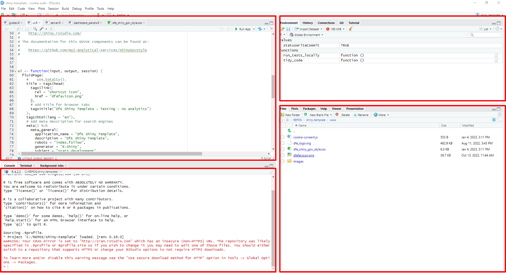
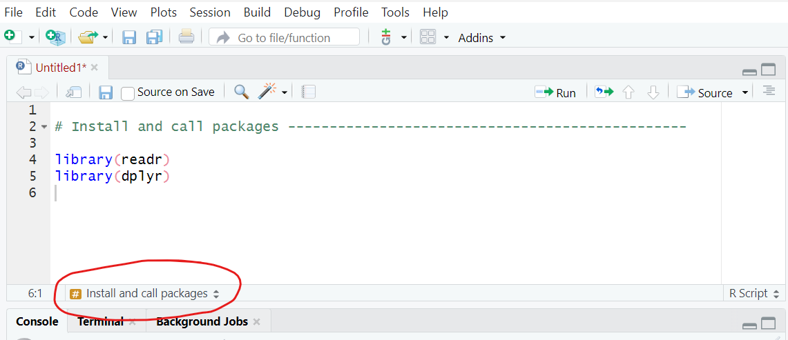
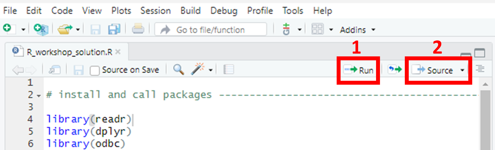

# Introduction

We've prepared this walkthrough guide for statistics publication teams as an introduction to the ways in which coding in R can be used for Reproducible Analystical Pipelines (RAPs), creating functions for typical tasks that teams may come across.
The guide is intended to be step-by-step, building up from the very basics.
The plan is to work through this in groups of 3-ish with access to experienced R users for support.
If it starts too basic for your level, then just go through at your own/your group's pace as you see fit.
By no means can we cover everything in this walkthrough, so please see it as a prompt to ask follow-up questions as you're working through on anything related to R, RAP and coding in general.

## What is a RAP?

RAP stands for Reproducible Analytical Pipeline.
The full words still hide the true meaning behind buzzwords and jargon though.
What it actually means is using automation to our advantage when analysing data, and this is as simple as writing code such as an R script that we can click a button to execute and do the job for us.

Using R (the coding language) really helps us to put the R in RAP ('reproducible').
Ask yourself, if someone else picked up your work, could they easily reproduce your exact outputs?
And when the time comes around to update your analysis with new data, how easy is it for you to reproduce the analysis you need?
In an ideal RAP, it would be as simple as plugging the new data in and clicking 'go', with no need to manually scroll through multiple scripts updating the year in every file name or the variable name that's changed from using \_ to -.

## What is R/R Studio?

R is a coding language.
There are many different languages of code, some others include SQL, python, JavaScript and many more.
They all have benefits, and the difference is often the syntax used (literally like learning new languages!).
R is open-source, meaning it is free, anyone can use it and anyone can contribute to developing new 'packages'.

-   A *package* is a set of functions someone else has written and tied together in a nice neat bow, ready for you to use!
    You simply install the package, and then you have all of the functions available.

-   A *function* is a chunk of code that has been grouped together, given a name, and often has 'place holders' you can change, such that you can use that name to run that code, and apply it to different data.
    For example, mean(x) is a function that calculates the arithmetic mean of x.
    You replace x with any numeric data.

R Studio is a piece of software, specifically an integrated development environment (IDE), that enables us to write code in the R coding language, while also providing a visual and interactive interface.
It has useful areas and windows that enable you to see what tables you have loaded, charts you have created, Git user interface, file explorer, help windows and many more!
Normally you will see the screen split into 3 or 4 windows:

```{r echo=FALSE, out.width='100%', fig.cap='R studio panels'}

```

-   Top left - Source pane.
    Open and view your code scripts, tables, data sets, functions.

-   top right - Environment/History/Connections/Git (if you have it).
    The environment shows you what data, functions, objects etc you have.

-   Bottom left - Console.
    Shows what you have run, and you can type and run commands directly into the console.

-   Bottom right - File explorer/plots/packages/Viewer.

**Please note!:** R is a case sensitive language.
You will see this when using functions like View(), which must have a capital V.

# ADA and databricks

This workshop and it's materials were developed before the implementation of ADA or databricks.
Therefore, they are not currently covered in this workshop, and we use the existing tools of R Studio, Git and SQL for the tasks.
As ADA develops and becomes more widely used, we will incorporate it into the workshop to account for new ways of working.

# Pre-workshop requirements

## Technical requirements

First of all, make sure to bring your laptop.
This is going to be interactive and require you to do some coding.

Preferably before coming along, you'll need to go through the following list of things you'll need to make sure are set up on your DfE laptop:

-   Install R-Studio on your machine: Download **R for Windows (x64)** and **RStudio** from the Software Centre on your DfE laptop.

Or:

-   If you're on EDAP and used to using R/R-Studio, feel free to just use that.

## Working in groups

To get the most out of the workshop, we expect everyone to work through all of the tasks themselves while discussing the work in small groups.
If anything is unclear then ask and most importantly, communicate with each other about what you're doing.

By the end, you should get a good idea of how to utilize R for RAP processes!

# Getting started ...

Now we will begin the tasks and group work.
First, everyone **open up R studio.**

# Creating a project

When creating RAP processes, it's key that your code is reusable, transparent, and well documented, such that it is future-proofed for any future team members.
Therefore, first, we will show you how to create an R project.
Using an R project ensures that all of the files in the project folder (scripts, plots, notes, etc.) can all be referenced relative to the **.Rproj file** location.
Basically, it removes the need to set and get your working directory, and removes the need to use long & complete file paths.
Instead, you essentially start any file path from the location of the .Rproj file!
*For example*, if you have a code.R code script, and a data.csv file in a project folder that has been set up as an R project, and you want to read the .csv in the R script, you don't need the entire file path of the csv (which probably starts C:/... and can get very long), just the file path relative to the *.Rproj file* which in this case would simply be 'data.csv'.

If you're struggling to grasp that, that's okay, we will create a project and see this in action today.
To create a new project, in R studio, go to **File \> New Project \> New directory \> New Project**.

::: {.callout-tip}
## Task
Select `File > New Project > New directory > New Project`. Choose an appropriate name for your project folder.

The two tick boxes; 'Create a git repository' or 'Use renv with this project' are optional. If you would like to learn about either git or renv, tick the box and let us know - we can direct you to the correct chapters!

For the file path, **if using git** you should make sure this is **not** saved in your OneDrive area (this is less important when you aren't using git). If using git you should select Browse and navigate out of OneDrive to save the project directory elsewhere (this is because OneDrive has it's own version-control system, and trying to use Git within that can cause complications and errors). 

Click 'Create project'. 

:::

## Functions and packages

When using functions from packages, you can either type `<package name>::<function name>` )(e.g. `readr::read_csv()`) or just the function name on its own.
However, problems can arise if two packages have different functions with the same name.
When you have loaded two packages that contain functions with the same name and you only type the function name, R automatically uses the function from the package that was loaded most recently.
If you want to choose which package to use and override the precedent set by R, you should use the package name and colons to explicitly state the source package and function you intended.

### Using renv (optional)

Renv (short for R environment) is a package in R that helps you to keep a record of which packages your project uses, and what version of each package it should use (for a reminder of what a package is, check back to the What is R/R Studio? section above).
Using renv in your R project means that anybody in the future (including your future self) who comes back to this project, can immediately get all of the required packages.
First you need to install the renv package by running `install.packages('renv')` in the console.

Once that has installed, you can run the functions from this package.
You can also see what packages are installed by navigating to the 'Packages' tab in the bottom right window - renv should have appeared in here now.

::: {.callout-tip}
## Task

To initiate renv, run `renv::init()` in the console. If you navigate back to the files tab in the bottom left and look in your project folder, you should see some renv-related files have appeared, including a *renv.lock* file. The renv.lock file is the file that records all of your project's packages and their versions. If you click on the renv.lock file it will open for you to view in the top left.  
:::

Each time you add or remove packages, or update the package versions, you should run `renv::snapshot()` to take a snapshot of the current state of your library.
If you ever get a new device, or someone else wants to view your project, they simply need to run `renv::restore()` to restore the package library on their device to match the packages recorded in the renv.lock file.

# Your initial script

Now that we have your project created and renv activated (optional), we can create our first code script.

::: {.callout-tip}
## Task

Open a new R script file by selecting `File > New File > R script`.
:::

## Comments and headings

Comments in code are some of the most useful documentation you can use, and are crucial for RAP!
You should start your script with comments that provide important information such as what this code script contains and what it is for - basically anything you think a new person would need to know in order to understand and run the code effectively.
You add comments in R scripts by starting the line with a **hash symbol, \#**.
Any line that starts with a hash symbol will be treated as a comment rather than code, and so will not be 'run'.
You can also add comments to the end of lines of code by including the hash symbol half-way through a line - everything after the \# will be treated as a comment, and everything before will be treated as code.
If you have multiple lines of comments you wish to add, you can type them out, highlight them and use `ctrl+shift+C` to 'comment out' all of the highlighted lines.

::: {.callout-tip}
## Task
Add some comments to the beginning of your script now - include your name, the date, and a short description that explains that this is the first script, and will include library calls as well as loading data and any functions that will be used in future.

Your first script should definitely include the 'library-calls' for all of the packages you will need. This basically means loading any packages you need at the beginning, before running any future code that requires them. We load/call packages by using the `library()` function.
:::

::: {.callout-tip}
## Task
Our first steps only require two packages, 'readr' and 'dplyr'. You can either install these by typing `install.packages('readr')` and `install.packages('dplyr')` one at a time in the console, or you can install both packages at once by running `install.packages(c('readr', 'dplyr'))`. Then, remember to take a `renv::snapshot()` to add these to the renv.lock file! 
:::

Now, below your initial comments, we will add the library calls to the script.
First, we should add a section header!
Section headers are yet again another form of good documentation, and and extremely helpful when navigating around scripts of code!

::: {.callout-tip}
## Task
To add a section header, we can use the keyboard shortcut `ctrl+shift+R`. In the pop-up window, give the first section the header 'Load in packages'. Then click okay and you should see the header has appeared in your code. In the bottom left of the code window, you should see the section header has appeared, and if you click on the name you can navigate to other sections when you have built up your script further. 
:::

Another way to view and navigate between all of the sections in a script is to use the keyboard shortcut `ctrl+shift+O` to open the sections in a small panel on the right of your script.

::: {.callout-tip}
## Task
Now save your initial script with the name 'main.R'. You can save code scripts by either selecting `File > Save As...` or by clicking the save icon in the bar below the script name. When your script contains **unsaved changes**, the script name will turn red and end with a * symbol. When it does not contain any unsaved changes, the name of the script will turn black, with no * symbol, and the save icon beneath it will grey-out.

**Throughout this workshop, make sure to add comments at every step so you know what each code snippet is doing, and why!**
:::

```{r echo=FALSE, out.width='100%', fig.cap='R Studio section headers navigation'}

```

## Adding and running code

::: {.callout-tip}
## Task
Now, below the heading on a new line, add `library(readr)`, then on a new line add `library(dplyr)`. 
:::

In R, each new line represents a new code command.
You don't need to use a semi-colon or any other punctuation to separate commands other than just starting a new line, and you cannot have two commands on the same line.
Therefore, since the two library calls are two distinct commands because they load different packages, they each need to be on a new line.

To actually run code that you have saved in a script file, there are a few options.
Firstly, there are buttons you can use to the top right of the script file's window.

```{r echo=FALSE, out.width='100%', fig.cap='R Studio run and source buttons'}

```

Button 1 in the above image (the 'run' button) will run either all *highlighted* code, or, if no lines are highlighted it will run the line or snippet where your cursor is located (in the above image, you can see the faint cursor line at the end of line 4, so clicking run would run line 4 in this instance).
Another way to do this is to use the 'run' keyboard shortcut - \hlblue{`ctrl + Enter`}.
This works in the same way and will either run all highlighted lines, or the snippet where the cursor is located.

Button 2 (the 'Source' button) will run the entire script from the first to the last line in one go!
This is the same as running `Source("script_name.R")` in the console.
`Source(...)` is particularly useful in RAPs, as one of the baseline expectations for statistics publication pipelines is that you have one script that runs every single step of the process - sourcing scripts one by one in the correct order in a 'run_pipeline' script (with comments!) is great way to do this while keeping it tidy and clear!

::: {.callout-tip}
## Task
Highlight the lines you have just added to the script and run them either using the button or the keyboard shortcut. Now we have the packages we need to load in some data.  
:::

## Data types and objects in R

### Basic data types

In R, you can have multiple types of data.
The basic data types can be divided into the following:

-   Numeric (10.5, 55, 787)
-   Integer (1L, 55L, 100L - "L" declares these as integers)
-   Complex (9 + 3i - "i" is an imaginary part)
-   Character (a.k.a string/text)
-   Logical (a.k.a boolean- e.g. TRUE or FALSE)

We can use the `class()` function to check the data type of a variable in R.

### Basic data objects

In R, we can store *objects* in our *environment*.
There are 5 basic types of objects in the R language.

**Atomic vectors** are the most basic objects in R.
They can only contain data of one type (e.g. numeric or character).
A vector is just a sequence of elements of a certain type.
To create vectors in R by adding multiple elements, we use `c()`.
You can then use `length()` with the name of the vector in the brackets to find out how many items are in your vector.

::: {.callout-tip}
## Task
Try running the following code: 

```{r}
#| eval: false 
# Create vectors
x <- c(1, 2, 3, 4)
y <- c("a", "b", "c", "d")
z <- 5
  
# Print vector and class of vector
print(x)
class(x)

print(y)
class(y)

print(z)
class(z)
```
:::

**Lists** are another type of object in R programming.
Lists are a variant of vectors known as "recursive vectors" (you don't need to worry about this terminology too much!) and can contain different data types together.
They are one-dimensional and ordered.
Lists can also contain other lists!
You can create a list using `list()`and check its length using `length()`

::: {.callout-tip}
## Task
Try running the following code: 

```{r}
#| eval: false 
# Create list
ls <- list(c(1, 2, 3, 4), list("a", "b", "c"))
  
# Print
print(ls)
class(ls)
```
:::

**Matrices** are collections of the same data type, but instead of being one-dimensional, they are arranged into columns and rows, a bit like a spreadsheet.
Data, number of rows and columns are defined in the `matrix()` function.
The syntax for the `matrix()` function is:

```{r}   
#| eval: false 
matrix(data = NA, nrow = 1, ncol = 1, byrow = FALSE, dimnames = NULL)
```

::: {.callout-tip}
## Task
Try running the following code: 

```{r}
#| eval: false 
x <- c(1, 2, 3, 4, 5, 6)
  
# Create matrix
mat <- matrix(x, nrow = 2)
  
print(mat)
class(mat)
```
:::

**Factors** are usually used to store categorical variables with a limited range of potential answers.
One example of this might be if you need to store the season in which something took place.
You would first have a vector containing all of the data about the seasons, which might look like `("spring", "spring", "winter", "spring", "autumn", "summer", "summer")`.
Within the factor, you would then identify the possible "levels" of the factor, which is just another way of saying that you'd list the *potential* options that the data vector could contain.
In this case the levels would be "spring", "summer," "autumn" and "winter".

::: {.callout-tip}
## Task
Try running the following code: 

```{r}
#| eval: false 
# Create vector
s <- c("spring", "autumn", "winter", "summer", 
"spring", "autumn")
  
factor(s)
nlevels(factor(s))
```
:::

**Arrays** are objects that can hold two- or more than two-dimensional data.
in rows and columns.
They can only store one data type and are useful for organising and accessing data.
The `array()` function takes dim attribute as an argument and creates required length of each dimension as specified in the attribute.

::: {.callout-tip}
## Task
Try running the following code: 

```{r}
#| eval: false 
# Create vector
# Create 3-dimensional array
# and filling values by column
arr <- array(c(1, 2, 3), dim = c(3, 3, 3))
  
print(arr)
```
:::

**Data frames** are tabular data objects in R, using rows and columns.
Data frames consists of multiple columns and each column represents a vector.
Columns in data frames can have different types of data, unlike matrices.
You can create data frames using `data.frame()`

::: {.callout-tip}
## Task
Try running the following code: 

```{r}
#| eval: false 
# Create vectors
x <- 1:5
y <- LETTERS[1:5]
z <- c("Albert", "Bob", "Charlie", "Denver", "Elie")
  
# Create data frame of vectors
df <- data.frame(x, y, z)
  
# Print data frame
print(df)
```
:::

## Loading in the data

There are multiple ways to load data into R.
Today we will cover two common ways we see analysts use;

1.  Reading in a **CSV** file,

2.  Loading data in directly from **SQL** servers.

Before using either method to load in the data, we should add a new section header!
Use the guidance above to add a new section header called 'Load in the data'.

### Reading in CSVs

We already installed the `readr` package, which contains the functions we need to read CSVs into R.
In R, it is best practice to name our objects (tables, data sets, etc) so that you can use that name to reference the objects you need.
This means that while the code `readr::read_csv(insert_filename/filepath_here)` is the function that reads in a given csv, we should write it in the below format:

`chosen_name <- readr::read_csv(insert_filename/filepath_here)`

When you're reading in the HEA CSV file for the below example, make sure that you have saved it inside a folder called "data" (you may need to create this folder yourself), and that the file name matches exactly (e.g. doesn't have (1) or similar on the end).
If you don't want to use a data folder, modify the read_csv command to say:

`read_csv("HEA_some_student_results.csv")`

::: {.callout-tip}
## Task
In this workshop, the data is available as a csv in the 'data' folder of the project, and is called `HEA_some_student_results.csv`. Therefore, the code will look like this:

```{r}
#| eval: false 
student_results <- read_csv("data/HEA_some_student_results.csv")
```

Write and run this line in your script. 
:::

Then, if you navigate to the 'environment' window in the top right of the screen, you should see an object has appeared with your chosen name under the heading 'Data'.
If you click the blue circle with the white arrow inside, it will expand to show you information about the data you've uploaded, including the name of every column/variable, and the format of each column (i.e. chr for character, num for numeric).
If you click the name of the object, it will open in the viewer in the top left so that you can look at the table.
This is the same as typing `View(name_of_data)` in the console (note that View must have a capital V!)

### Writing to and reading from a SQL database (optional section)

**NOTE:** to work through the tasks in these SQL sections, you must have access to an existing SQL database.

In order to read and write data from and to a SQL database, we need to install the relevant packages and connect to the SQL database.
Firstly, we need to install the relevant packages.
Try to use the above guidance to;

a.  Install the `odbc`, `DBI` and `dbplyr` packages,

b.  Add the library calls to the correct section of the initial script,

c.  Take a snapshot to update the renv.lock file.

Once you have completed the above steps, we can use the new packages to connect to the secure SQL database.
We use the following code (**inserting the server and database you require**) to create an object with the connection.
You can call it anything, but common practice is to call this connection 'con':

```{r}   
#| eval: false
# Connect to SQL database
con <- DBI::dbConnect(odbc::odbc(),
    Driver = "{SQL Server Native Client 11.0}",
    Server = "...",
    Database = "...",
    Trusted_connection = "Yes"
  )
```

**[Note that this code will only work for you if you have access to the specified server and database, so only users with existing access can use this code in R to connect and pull in data! If someone without access tried to run this code, they would get an error in the R console.]**

#### Writing a table to a SQL database

There are a number of functions available in R that can write a data frame to a table on a SQL database.
Here we'll use the `dbWriteTable()` function with our students dataframe:

`dbWriteTable(con,  Id(schema = "dbo", table = "sd_sandbox_student_results"), student_results)`

Note the first argument the function takes is the database connection you've already created, the second is the table location that you want to write to on that database (comprised of the schema and desired name) and the third argument is the data frame that you're sending to the database.

::: {.callout-tip}
## Task
If you have existing access to a SQL database that you or your team owns, you can give the above code a go at writing the student results data that we have just pulled in as a CSV to your SQL database, as long as you defined 'con' using the server and database name. 

At the end of the workshop you can delete this by right clicking on the table in SQL Server Management.
:::

#### Reading a table from a SQL database

Now that we have the connection stored and named, we can use it to read in a table from the database into R.
There are multiple ways to do this - in this workshop we will cover two of them.
Unless you successfully wrote the table to a SQL database in the previous step, you **cannot run the following code**.
It is still useful to read and have knowledge of this, and to refer back to in future.

1.  Use `dplyr::tbl(con, in_schema(schema_name, table_name))`,

2.  Use `RODBC::sqlQuery(con, "SELECT * FROM table_name;")`.

Option one above is a very concise and tidy way to read in data from SQL tables, which (as long as you've added descriptive comments) will make your code easy to read and understand.
This option runs extremely quickly because rather than storing the SQL table as a data table in R, it stores a 'live connection' to the table in SQL.
You can type the name of the 'tbl' object in the console, and it will provide a preview of the SQL table using the live connection.
In the environment it will appear as a list rather than a data table.

Option two is slightly longer to write and takes much longer to run, but it does allow you to write SQL queries directly in R, so if you have previous experience with SQL you may find this useful.
You can edit and customise the SQL query, meaning you have the option of selecting specific columns and filtering at this stage, rather than reading in the entire table.
Just ensure that you write the table_name exactly how you would in SQL (including schemas).
To try the second option, you'll need to create a new 'connection' object using the following code: 

```{r}      
#| eval: false
# Connect to SQL database using option 2
con2 <- RODBC::odbcDriverConnect(
    'driver = SQL Server Native Client 11.0,
    server = ...,
    database = ...,
    Trusted_connection = yes'
  )
```

Whichever option you choose, you need to choose what name you would like this object to have in R once the table is read in.
It is best practice to make object names descriptive but concise.
This means describing what the table contains, but not including unnecessary and repetitive words such as 'table' in the name.
The data we are using today contains data on the characteristics and grades of some students, so we might choose to call the table 'students'.
We assign the table this name by using the `<-` symbols, so the full snippet should look something like this:

```         
# Read in student data from SQL
student_results <- tbl(con, in_schema("dbo", "sd_sandbox_student_results"))
```

Add this under an appropriate heading/comment to your initial script.
Then, if you navigate to the 'environment' window in the top right of the screen, you should see an object has appeared with your chosen name under the heading 'Data'.
If you click the blue circle with the white arrow inside, it will expand to show you information about the data you've uploaded, including the name of every column/variable, and the format of each column (i.e. chr for character, num for numeric).
If you click the name of the object, it will open in the viewer in the top left so that you can look at the table.
This is the same as typing `View(name_of_data)` in the console.

# Cleaning data

Once you have pulled data into R studio and you can see it in your environment, you might need to give it a clean.

In most cases, cleaning a data set involves dealing with missing values and duplicated data.
The `dplyr` and `tidyr` packages include some useful functions for cleaning data, such as `dplyr::filter(), dplyr::mutate(), dplyr::summarise()` and `tidyr::replace_na()`! Make sure these both of these packages are installed and included in your library calls!

## Dealing with missing values

The `na.omit()` function removes any rows that contain NA's or missing values!
We use this when we want to **completely remove** the rows with any missing values.
You should be able to see `student_results` in your environment now.

::: {.callout-tip}
## Task

To remove rows that contain any missing values or NA's, we use the following code. Let's call our new dataset '`student_results_rmNAs`' (rmNAs meaning remove NAs):

```{r}
#| eval: false
student_results_rmNAs <- student_results %>%
  na.omit()
  
student_results_rmNAs
```

See how in the environment, `student_results_rmNAs` has less obserbations than `student_results`. 

:::

However, we might only want to remove rows where a **specific column** is NA.
For example, we might want to remove rows if the age or school is missing, but we might not mind if there are other missing values (for example, we might expect some missing values in G1 if a student didn't receive a grade for whatever reason).
In this case there we can use the `drop_na()` function.

::: {.callout-tip}
## Task

To remove rows that contain missing values or NA's in a specific column, we use the following code.

```{r}
#| eval: false
student_results_rmNAs <- student_results %>%
  drop_na(c(age, school))

student_results_rmNAs
```

Note how, because we've used the same name, we have just **overwritten** what *used* to be saved with that name!
:::

We might also want to **replace NAs** with an alternative value such as 0 or the common GSS codes of z (not applicable) or x (unavailable).
We can use the `mutate()` function from the `dplyr` package along with the `replace_na()` function from the `tidyr` package to do this.
You'' need to install and call the `tidyr` package before you can use it, so **do that first!**

::: {.callout-tip}
## Task
Something some teams do is replace numeric NAs with negative numbers that they can then filter out or ignore while doing things like creating charts:

```{r}
#| eval: false
student_results_negatives <- student_results %>%
  mutate(across(where(is.numeric), ~replace_na(.,-100)))
  
student_results_negatives
```

Another common need is to replace NAs with a GSS symbol like 'x'. The above will need tweaking in order to work, as if you replaced -100 with 'x' in the above code, you would get an error. This is because you can't change NAs in a **numeric** column to a character such as 'x'. We would have to make the columns into character variables first, however this prevents you from ordering and filtering them as numeric data, so this should be done **after all numeric calculations have been performed**:

```{r}
#| eval: false
student_results_x <- student_results %>%
  mutate(across(where(is.numeric), ~as.character(.)),
         across(names(student_results),~replace_na(.,"x")))
         
student_results_x
```
:::

## Dealing with duplicates

The other common task when cleaning data is checking for and removing duplicates.
The easiest way to remove duplicate rows is to use the `distinct()` function from the `dplyr` package.

::: {.callout-tip}
## Task
To remove duplicate rows, we simply use the `distinct()` function as follows:

```{r}
#| eval: false
student_results_distinct <- student_results %>%
  distinct()
```

Again, see how in the environment, `student_results_distinct` has less observations than `student_results` because it has removed a duplicate row!

:::

You can also choose to only filter out duplicates in certain rows, for instance if you only wanted to keep one row per school you could just filter out the duplicates from that column.
When specifying a column, if you still want the result to include the unused rows you'll need to add `.keep_all = TRUE` to the end, otherwise the output will only give the row you specified.

::: {.callout-tip}
## Task
To remove duplicate rows based on a specific column, in this instance 'school', we use the `distinct()` function as follows:

```{r}
#| eval: false
student_results_distinct_school <- student_results %>%
  distinct(school, .keep_all = TRUE)
``` 

This returns only 2 observations, because there are only 2 distinct schools! Using distinct in this way will simply keep the first occurance of each distinct school.

:::

# Descriptive statistics

Sometimes you might want a quick overview of a data set.
There are some really useful functions we can use to immediately view descriptive statistics for data.
One useful function to immediately view some descriptive statistics is `summary()`.

Try running \hlblue{`summary(student\_results)`} in the console.
You should see a quick output which includes a column for each variable.
For character variables, it will simply give the length, class and mode of the variable.
However, for numeric variables it will provide the minimum and maximum values, the interqaurtile range, the mean and the median.

For a more comprehensive guide of descriptive statistics in R including a wide range of statistics and visualisations/plots, see <https://statsandr.com/blog/descriptive-statistics-in-r/> (pages like this are useful to bookmark!).

# Manipulating data

Once you have pulled data into R studio and you can see it in your environment, it is likely you want to manipulate it in some way.
In this workshop, we have pulled in data that contains one line per student, so one common task is to aggregate data, and get it in the correct tidy format for EES.

## Aggregate & filter data

Aggregating data is a common task analysts in in statistics publication face.
In the data we have loaded into R studio in this workshop, there is currently one line per student, containing that students characteristics and grades.
We want to aggregate this by certain characteristics and get the average grade for each aggregated group.
Firstly, it's possible that we might want to filter on certain variables so that we only include certain students in our data.

To **filter** data, we can simply use the `filter()` function from the `dplyr` package, which we have already installed and loaded.
Here we will also introduce the **pipe** symbol - `%>%`.
You can either type it out *or* use the keyboard shortcut \hlblue{`Ctrl + Shift + M`} to insert it!
As said before, in R, a new line is read as a new command, however, sometimes we might have long snippets of code that should all be run as one command!
The pipe symbol is used with `dplyr` commands to join up multiple lines into one command, and **the order does matter!**