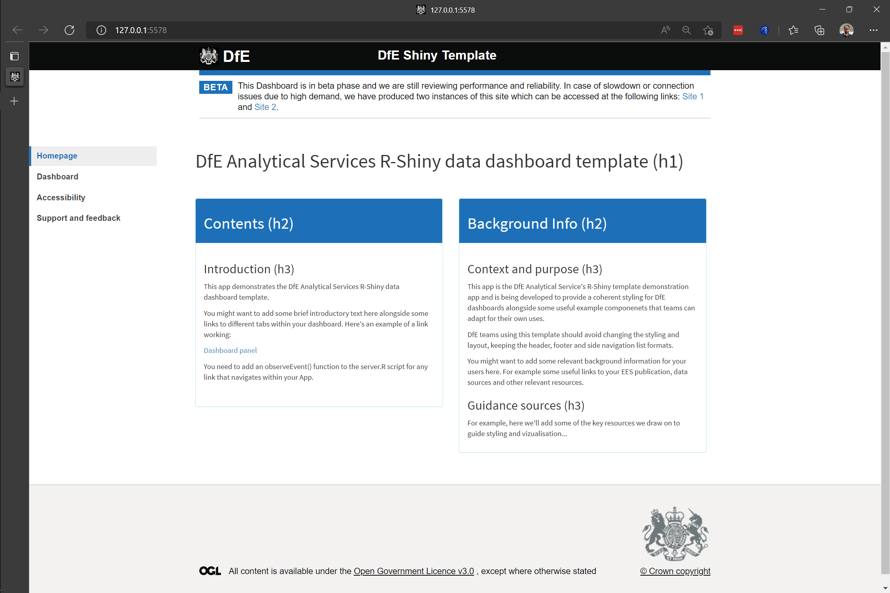

\newpage

# Introduction

We've prepared this walkthrough guide for statistics publication teams as an introduction on how to work collaboratively with git, using the creation of a data dashboard as a relevant context. The guide is intended to be step-by-step, building up from the very basics. The plan is to work through this in groups of 3 or so and with access to experienced git users to call on for support. If it starts too basic for your level, then just go through at your own/your group's pace as you see fit. By no means can we cover everything in this walkthrough, so please see it as a prompt to ask follow-up questions as you're working through on anything related to git, GitHub and Dev Ops. 

For simplicity of access and accounts, we're focussing on GitHub rather than Dev Ops here, but much of the material is transferable.

## GitHub versus Dev Ops

GitHub and Dev Ops effectively provide the same service in terms of creating software via a git repository: they both act as the host for the remote repository, whilst offering important tools to manage bugs and issues, tasks, merging branches, deploying applications and so on.

Dev Ops is part of the Microsoft Azure platform and uses pricate DfE servers. This can allow you to connect or deploy your repository into wider Azure services. This includes SQL databases that you might already be storing data on as well as the DfE's implementation of rsconnect on DfE internal servers, which allows deployment of shiny apps for internal DfE use.

GitHub is hosted on external servers and therefore is more appropriate for making your code or application available for public access and use. For example, from a GitHub repository, you can deploy an R Shiny dashboard to shinyapps.io where members of the public may view and interact with your published data.

# Pre-workshop requirements

First of all, make sure to bring your laptop. This is going to be interactive and require you to do some coding.

Preferably before coming along, you'll need to go through the following list of things you'll need to make sure are set up on your DfE laptop:

* Create a GitHub account: [https://github.com/join](https://github.com/join);
* Install git on your laptop: [https://git-scm.com/downloads](https://git-scm.com/downloads);
* Install R-Studio on your machine: Download **R for Windows (x64)** and **RStudio** from the Software Centre on your DfE laptop.

You'll also need to make sure that git is set up in the git/SVN pane of global options in R-Studio (found in the Tools drop down menu). Make sure the path to your git executable is entered in the git path box and git should automatically be integrated with R-Studio. 

\begin{figure}
\includegraphics[width=0.64\linewidth]{images/gitdemo/gitdemo-gitRstudio-settings} \caption{Enter the path to your git executable in the git path option box}\label{fig:unnamed-chunk-1}
\end{figure}

Once you open a repository, you'll get an extra panel, named 'git', in the top right pane of R-Studio and you'll also be able to use git in the 'Terminal' tab at the bottom left (in the same place as the R console). 

\begin{figure}
\includegraphics[width=0.56\linewidth]{images/gitdemo/gitdemo-gitRstudio-NewTerminal} \caption{The `git BASH` terminal in R-Studio}\label{fig:unnamed-chunk-2}
\end{figure}

A useful thing here if you want to use git commands in the terminal is to switch the terminal from the default Windows Command Prompt to `git BASH`. You can do this in the Terminal tab of R-Studio's global options - just select `git BASH` from the 'New terminal opens with' pull down menu. Click apply and then select the Terminal tab (next to the Console tab), click 'Terminal 1' and then select 'New terminal' from the drop down menu. You should see something similar to the terminal screenshot.

\newpage

# Setting up the repository

## Creating a new repository on GitHub

At this point, we're ready to create a new repository. The conext of this exercise is to create a dashboard, so let's get a head start on that by using the DfE R-Shiny template.


You can access the template here:

https://github.com/dfe-analytical-services/shiny-template


On that page, you'll see the main repository page. This contains a menu bar to navigate the range of GitHub features (e.g. Code, Issues, Pull Requests, Discussions, Actions and others); shortcuts to access different branches within the repository; some top-level summary information on the repository; a listing of the files and folders in the repository's root directory; and a markdown render of the repository's Readme file if one exists. 

In the case of our template, you'll also see a button saying use this repo as a template. At this point, one (and only one!) of your group should click that button, which will take you to the create repository page. Here you have the option to create a copy of the template in your own GitHub area as shown below. Give the new repository a name and a description and then click "Create repository from template".

\begin{figure}
\includegraphics[width=0.72\linewidth]{images/gitdemo/gitdemo-shinydash-newrepofromtemplate} \caption{Put in a name for the new repo and a quick description and then click on Create repository from template}\label{fig:unnamed-chunk-3}
\end{figure}

One of you at least should now have their own repository produced from this starting template project. We need everyone in your team to be able to work on this project however, so now you'll need to give access to your other team members. To do so, navigate to settings (at the far right of the menu bar on your repository page) and = 

Now you'll need to add your other team members as collaborators in order to allow them to contribute to the code development in this repository.

## Cloning the repository to your local machine

Cloning the repostory refers to creating a copy of the remote repository (i.e. the copy on GitHub or Dev Ops) on the disk on your local machine (i.e. your DfE laptop). For an R project, there are two basic options to choose from for doing this: 

* using the R-Studio new project wizard, or 
* using `git BASH`.

We'd recommend trying the different options across your working group.

### Cloning in `git BASH`

You can open up a `git BASH` terminal, by typing `git BASH` in the Windows search bar and select `git BASH` when it comes up. With a terminal, you can interact with it just by typing, similar to working in the R console in RStudio. First let's make a directory in which to store our repositories:

    mkdir repos
    
We can then move into the directory we just created using:

    cd repos
    
Now grab the repo url and replace `<repo_url>` in the next command with the actual url:

    git clone <repo_url>

You should get some messages letting you know git is connecting to the server and cloning the repository and it should look something like the figure below.

\begin{figure}
\includegraphics[width=0.6\linewidth]{images/gitdemo/gitdemo-terminal_clone} \caption{Cloning a repository in git BASH}\label{fig:unnamed-chunk-4}
\end{figure}

If all went well, you'll now have a complete copy of the repository on your laptop. To open the repository in RStudio, start up RStudio and select Open project. In the file explorer window that opens up, type `C:\Users\` and hit enter (see the screenshot below) and then open up your home folder. 

\begin{figure}
\includegraphics[width=0.6\linewidth]{images/gitdemo/gitdemo-RStudio_OpenProj} \caption{Open a cloned project in RStudio}\label{fig:unnamed-chunk-5}
\end{figure}

Then navigate into `repos` and the repository folder. The full path should be something along the lines of:

> `This PC > Windows (C:) > Users > <USERNAME> > repos > <REPONAME>`

Select the R project file and select open.

\begin{figure}
\includegraphics[width=0.6\linewidth]{images/gitdemo/gitdemo-RStudio_OpenProj_fullpath} \caption{Open a cloned project in RStudio}\label{fig:unnamed-chunk-6}
\end{figure}

### Cloning using the RStudio wizard

If that looks like a bit too much text based effort, RStudio offers a way to clone a repository with it's New project wizard. To do this navigate the menu bar to **File > New Project...**, select **Version Control** and then Git. This opens up a dialogue box to enter the repository url and select where to save it. As with the git BASH version, copy and paste your remote repo URL here and set a directory where you want it saved on your laptop.

\begin{figure}
\includegraphics[width=0.6\linewidth]{images/gitdemo/gitdemo-RStudio_OpenProj_wizard} \caption{Clone a project using the RStudio git wizard}\label{fig:unnamed-chunk-7}
\end{figure}

#### A note on local repository clones and OneDrive

> Note that saving a repository within your OneDrive folder structure can cause some awkward issues. If you use git to perform version control on a repositorry saved within a OneDrive folder, you may start receiving warning messages that large numbers of files have been removed from OneDrive. In addtion, it can put a heavy burden on your internet connection as OneDrive tries to keep up with changes to the files managed by git. Best practice therefore is to store your repositories somewhere outside your OneDrive file structure. We recommend creating a `repos` directory within your base User directory (i.e. `C:\Users\<USERNAME>\repos\`. Windows sometimes tries to make it awkward for you to navigate to places on your laptop outside of the OneDrive folders, so a useful tip is to add your `repos` folder to your Quick access list in File Explorer.


## Controlling packages with renv

Now that you've each got a clone of the repository, it's useful to understand a little bit about environment control. Using R as the specific example, any app or pipeline that you develop will have packages that it depends on. If someone wants to use your code, they need to know what pacakges are involved, whilst it can also be helpful for them to be able to use the same versions of those packages in order to recreate exactly what you intended the code to be able to do.

To manage this, we can use an R package called `renv`. This manages the R environment for you, helping you keep track of your repositories required R packages and their versions. In a brand new empty project, you'd initiate `renv` with the command `renv::init()`. In this case, the template already has `renv` initiated. So instead we can tell renv to check the necessary packages and install them for us. You can do this by entering the following command in the R console:

    renv::restore()
    
This should go through `renv`'s list of the required packages and install them all in one go (note that you'll need to be connected to the internet for it to retrieve any packages that aren't already installed). Once you've done this, the contents of the repository should run as intended. If at some point you install an extra package for the repository, you can add this to `renv`'s package list by entering the command `renv::snapshot()` into the R console.  

## Running the dashboard template locally

Once you've cloned the package and run `renv::restore`, you should then be able to run the Shiny dashboard template. To do this, either a) enter `shiny::runApp()` in the R console or b) open up the file **ui.R** and then click **run App** to the top right of the editor pane. The dashboard should then load either in an RStudio window or in your default web browser (depending on your chosen settings in RStudio).



Although this workshop is primariy a chance to practice using git, you'll need a little understanding of the components of an R-Shiny app as well. A single app generally consists of 3 key scripts: *global.R*, *ui.R* and *server.R*. Each of these fulfills a specific purpose as follows:

* *global.R*: contains variables and functions required by the rest of the app (e.g. reading in data, connecting to a database);
* *ui.R*: contains code to create the app's user interface (e.g. arranging the layout, placement of charts, tables and text);
* *server.R*: contains the functions that make the app responsive (e.g. rendering tables and charts and updating dynamic text and input fields).

We'll explain more as needed, but for now that should give you the basic overview.

## Summary

In this section, we've covered creating a repository via a template on GitHub, cloning it to your local drive (using both the BASH terminal and the RStudio wizard) and getting the necessary packages installed in one go with `renv::restore()` via the R console.

In the next section, we'll cover some of the basics of using git to log changes to your code and sync them between the remote repo and local copies.

\newpage

# Basics of git

We'll now take a look at updating repositories with your working. To do so, we'll follow some example first steps you might take with developing the template dashboard app to use your own data. The steps we'll follow will be to create a new branch, add the data in, commit it to the github log and then push it to the remote (GitHub) repository.

## The git log

In order to move quickly between different versions of files and code, git is built around indexing and a log file that track the changes in a repository. To view the log of any repository, we can simply go into that repository and run the command `git log` from the BASH terminal. For example, if you run it in the repository you've created from the template, you'll get something along the lines of the following:


\begin{center}\includegraphics[width=0.8\linewidth]{images/gitdemo/gitdemo-gitlog-1} \end{center}

The log shows all "commits" that have been made to the repository. We'll go into making commits in the next section.

## Adding, commiting and pushing

First of all, one of your group should make a folder called **data** in your local repository. To do this, you can either go to the BASH terminal and type the command `mkdir data` (making sure you're in your local repositories root directory) or click the add folder button in the Files tab in the bottom right panel of RStudio.

For some example data, we'll use a file from a publication on Explore Education Statistics. Go to [the progression to higher education or training data catalogue](https://explore-education-statistics.service.gov.uk/data-catalogue/progression-to-higher-education-or-training/2019-20) and download the **Progression to higher education and training - Local authority level (csv, 4 Mb)** file and extract the data csv file (*l4_tidy_2020_all_la.csv*) into the data folder you just created.

Now to add this to the git log. Run the following commands:

```
  git add .
```

This searches the repo for any files that have been modified since the last commit and creates a log of the changes.

```
  git commit -m "Added data file into repository."
```

This adds an entry on to the log, updating it with the file changes that you've just made. Note that the text after the `-m` is a comment used to describe the changes to make it easier for someone looking back from the log to see what changes have happened. Those are the two key steps for tracking changes to the files and folders in your repository. Say we decide we're not happy with the data filename, maybe we think the filename should be more informative for users. We'd now change the filename as normal, and then re-run the commands `git add .` and `git commit -m "Made data filename more informative."` (updating the commit comment to describe the changes that we've made). If we now run `git log` again, we get something along the lines of:


\begin{center}\includegraphics[width=0.8\linewidth]{images/gitdemo/gitdemo-gitlog-2} \end{center}

Here we can see, in reverse order, the commits that have been made, who made them, when they made them, and the messages that have been recorded with them.

Finally, it's important to note that what we've done so far is only being applied to the local copy of the repository (i.e. the copy on your laptop). To apply your changes to the remote repository (i.e. on GitHub or Dev Ops), you need to "push" the changes. This can be done a couple of different ways: a) in the terminal type `git push` or b) on the toolbar in the git tab in RStudio press the green up button! Once you've done this, open up a browser and go to your remote repository on GitHub and you should now see the data file stored there.

## Pulling from the remote repository

Now that you've made changes, the rest of your team can update their own local copies of the repository with your updates bu pulling from the remote. Similarly to pushing, they can do this by either a) typing `git push` in the BASH terminal or b) pressing the down arrow in the toolbar of the git tab in RStudio.

## Summary of git basics

We've quickly tried out a quick cycle of adding and committing, which is used to log changes into the local repository and then we've pushed and pulled to and from the remote repository and local copies on different laptops. The table below gives a summary of the relevant commands in the BASH terminal and the corresponding buttons in the RStudio git panel. 

| Process | git BASH                          | RStudio git panel                               |
|---------|-----------------------------------|-------------------------------------------------|
| Add     | `git add .`                       | Stage using tickbox next to each modified file. |
| Commit  | `git commit -m "Commit message."` | "Commit" button in toolbar.                     |
| Push    | `git push`                        | Green up arrown in toolbar.                     |
| Pull    | `git pull`                        | Blue down arrow in toolbar.                     |
| View the log | `git log`                    | Clock icon in toolbar.                          |

\newpage

# Working collaboratively with git

Git only really makes proper sense once multiple people start working on a project collaboratively. Solo working, git is useful for version control and syncing your work to a remote repository site like Dev Ops and GitHub, but doesn't necessarily offer all that much more beyond that. Once we start working collaboratively however, the benefits of using git (alongside GitHub or Dev Ops) become more apparent. We'll now look further into this with some worked examples.

## Branches and splitting tasks

### Task management

One useful management tool that we can use from GutHub is the Issues tab. Here we can create individual tasks, assign them to team member and then create new **branches** from those tasks. You can think of **branches** as self contained copies of the repository that complementary or conflicting differences with all other **branches** in the repository. These allow you to work on different multiple tasks on your code independently of any other changes you might be making. Bringing these different **branches** or tasks together is then managed using **merges** or **pull requests** (PRs).

We'll demonstrate this by performing 3 related tasks on 3 different branches. Split the following 3 tasks between your group and each follow the relevant instructions:

* Reading in the data
* Creating a chart
* Creating a table

Once you've decided who's doing what, each of you should jump to the relevant section below. And remember that you're not working in independent silos here, what you do can impact what other people are doing so communication needs to happen along the way.

### Task 1a - Reading in the data

This task underpins the next two. You need to read in the data file that we've already downloaded. Start by creating a new branch: go to the BASH terminal, and type:

```
  git checkout -b featReadData
```

This creates and moves you into a new branch called featReadData. Anything you do here has no affect on the contents of the main branch until you explicitly tell git to merge your changes. Note that this only creates the branch in your local copy of the repository, for it to be added to the remote, you'll need to push:

```
  git push --set-upstream origin featReadData
```

Note that if you only enter `git push` without the `set-upstream` flag, git will suggest the full command for you. 

Now to write the code in this branch that's going to read in the data. We'll read it in to a data frame and the first task is to choose a name for the data frame and let the rest of the team know, as they'll need that info (in the example below, we're calling it `dfProgressHE`). If you've got the R expertise to do this already, then feel free to go for it, otherwise just follow the following steps below.

Open up the script `R/read_data.R` and change the code from:

```
  read_revenue_data <- function(file){
    dfRevenue <- read.csv(file)
    colnames(dfRevenue)[1] <- "time_period"
    dfRevenue <- dfRevenue %>% 
      mutate(year = as.numeric(paste0("20",substr(format(time_period),5,6))),
      area_name=case_when(geographic_level=='National' ~ country_name,
                       geographic_level=='Regional' ~ region_name,
                       TRUE ~ la_name))
    return(dfRevenue)
  }
```

to: 

```
  funcReadData <- function(file){
    dfData <- read.csv(file)
    dfData <- dfData %>% 
      mutate(year = as.numeric(paste0("20",substr(format(time_period),5,6)))) %>%
      filter(geographic_level != "Parliamentary constituency",
             characteristic_group=='Total',
             institution_type=='Total') %>%
      mutate(area_name=case_when(geographic_level=='National' ~ country_name,
                          geographic_level=='Regional' ~ region_name,
                          TRUE ~ la_name))
    return(dfData)
  }
```

You've made a substantive change, so let's run a quick add, commit and push in the BASH terminal:

```
  git add .
  git commit "Added function to read data in data."
  git push
```

We've made a function to read in the data, but we're not running that function anywhere. So now open up *global.R* and change the line:

```
  dfRevBal <- read_revenue_data()
```

to the following:

```
  dfProgressHE <- funcReadData('data/progress_he_la_2020.csv')
```

Then change the following lines from:

```
  choicesAreas <- dfAreas %>%
    filter(geographic_level == "National") %>%
    select(geographic_level, area_name = country_name) %>%
    rbind(dfAreas %>% filter(geographic_level == "Regional") %>% 
    select(geographic_level, area_name = region_name)) %>%
    rbind(choicesLAs)
  choicesYears <- unique(dfRevBal$time_period)
  choicesPhase <- unique(dfRevBal$school_phase)
```

to:

```
  choicesAreas <- dfAreas %>%
    filter(geographic_level == "Regional") %>% 
    select(geographic_level, area_name = region_name) %>%
    rbind(choicesLAs)
  choicesYears <- unique(dfProgressHE$time_period)
  choicesPhase <- unique(dfProgressHE$data_type)
```

Give it a test, by sourcing *global.R* and checking the contents of `dfProgressHE` (e.g. by typing `dfProgressHE` in the R console). Once you're happy, then run another add/commit/push cycle and flag to your team that you've finished the code to read in the data.


### Task 1b - Updating the user-interface inputs

As task 1a is updating the data that's been read in, we'll need to update some of the code to work with this new data that's been read in, so that the dashboard still works. As we're no longer working with the same data, we've changed the name of the data frame holding the data and some of the column names will be different.

In this task, we'll create a new branch using GitHub. Open up the repository on GitHub and select the Issues tab. You should see something similar to shown below.

\begin{figure}

{\centering \includegraphics[width=0.92\linewidth]{images/gitdemo/gitdemo-GitHub-Issues} 

}

\caption{The Issues panel in GitHub. This can be used to keep track of jobs that need doing on a repository and create new branches linked to individual jobs.}\label{fig:unnamed-chunk-10}
\end{figure}

On the issues tab, select *New issue* and then **Feature request**. This will open a new issue panel, with boxes to put in some details about the feature being requested. Let's put in a title of *"Update inputs for new data"* and put in a description along the lines of "The data file being read in has been updated and the inputs needed updating to match the column headers etc.". You've got options to add assign this task and add labels, link to projects and milestones. We don't need much of that, but maybe add yourself as the assignee. When you're ready, click **Submit new issue**. 

After you've done so, you'll see you now have the option in the right hand side panel to create a new branch linked to this issue. Select that and choose to check out the branch locally as the next option. Once you've confirmed you'll get some code to use to checkout the branch locally, which you can copy and use in the terminal in RStudio. It should look something like this:

```
  git fetch origin
  git checkout 1-update-inputs-for-new-data
```

Run that in RStudio and you'll have your new branch ready to go.

\begin{figure}

{\centering \includegraphics[width=0.64\linewidth]{images/gitdemo/gitdemo-GitHub-Issues-NewBranch} 

}

\caption{Once you've created an Issue on GitHub, you can create a new branch from the GitHub webpage and then fetch it to work on locally on your laptop.}\label{fig:unnamed-chunk-11}
\end{figure}

So we've got a few small changes just to update here given the changes to the input data. Whoever's performing Task 1a, should be updating the data frame containing the new input data to be called `dfProgressHE` to reflect the different data that's being read in. The main changes that are needed are in the *server.R* and *R/dashboard_panels.R*.

Open up *server.R* and replace any instances of `dfRevBal` with `dfProgressHE`. Then in *R/dashboard_panels.R*, update the titles of the input boxes from:

```
  selectizeInput("selectPhase",
        "Select a school phase",
        choices = choicesPhase
```

to:

```
  selectizeInput("selectPhase",
        "Select an indicator",
        choices = choicesPhase
```

And that should be it for this task.


### Task 1c - Creating a chart

There's already an example chart in the template, so let's re-wire that as the basis for our demo chart here. Let's start by creating a new branch in RStudio. With your repo open (and pulled with the latest changes) in RStudio, click the new branch button in the git panel toolbar. This will open a dialogue box as shown here in which you can enter a new branch name. Enter a name (e.g. *featTimeSeriesChart*), make sure syncing to the remote is selected and press *Create*.

\begin{figure}

{\centering \includegraphics[width=0.64\linewidth]{images/gitdemo/gitdemo-RStudio_NewBranch} 

}

\caption{The new branch dialogue box in RStudio is opened using the purple new branch icon in the git toolbar.}\label{fig:unnamed-chunk-12}
\end{figure}

Now in this new branch, you can make updates that won't effect any other branches until you choose to merge this branch with another one. 

To keep the code for the dashboard organised, we've split it into separate scripts and functions in different files. The main code for defining the line chart in the template is contained in `R/plotting.R`. Open that script now and change the lines:

```
  createAvgRevTimeSeries <- function(dfRevenueBalance,inputArea){
    ggplot(dfRevenueBalance, aes(x=year,y=average_revenue_balance,color=area_name)) + 

```

to:

```
  createTimeSeries <- function(df,inputArea){
  ggplot(df, aes(x=year,y=cohort,color=institution_group)) + 

```

This tells the plot to now take the variable `cohort` as the value to plot on the y-axis and `institution_group` as a filter on which to colour the output.


### Pull requests (PRs) and merging branches

## Some basic merging

Once a task is completed on a branch, it will likely need merging into another branch, for example the *main* branch. Once task 1a and 1b are complete, we should merge them into the branch for 1c so that all the changes are collated together. To do so, make sure you're in the *featTimeSeriesChart* branch (or equivalent depending on what you called it in task 1c) and run the following command in the `BASH` terminal (either in RStudio or in the standalone terminal):

```
  git merge featReadData
```

That merges in the branch from task 1a. If you get any messages about merge conflicts, then you'll need to take some extra steps that we can help you through. If it merges in without any problems, then run the following to merge in the changes from task 1b:

```
  git merge 1-update-inputs-for-new-data
```

Provided you don't get any issues with the above merges, then you should now have all the updates from the three branches collected together in the final branch. 

## Merging with pull requests

Whilst the basic merges above work fine for pulling in some simple changes, using `git merge` via the terminal lacks any collaborative functionality like discussing and reviewing changes. This is where pull requests come in to play. Pull requests are a part of both GitHub and Dev Ops and provide similar functionality between those two platforms. Here we're using GitHub, but a lot of this will be transferrable to using Azure Dev Ops.

What we'd like to do now is to merge all the changes made so far into the *main* branch in the repository. To do so, whoever did task 1c should open up the repository on GitHub in their web browser and go to the branches panel under the code tab.

\begin{figure}

{\centering \includegraphics[width=0.64\linewidth]{images/gitdemo/gitdemo-GitHub-Branches} 

}

\caption{The branches overview pane in GitHub.}\label{fig:unnamed-chunk-13}
\end{figure}

Click **New pull request** on the branch for task 1c, which now contains all the updates. That will open up the pull request page, where you can give some details for collaborators to understand what's in this update to the code. The pull request will default to performing a merge from the branch you've created it on into the *main* branch.

\begin{figure}

{\centering \includegraphics[width=0.64\linewidth]{images/gitdemo/gitdemo-GitHub-OpenPullRequest} 

}

\caption{Opening a Pull Request on GitHub.}\label{fig:unnamed-chunk-14}
\end{figure}


There are a few useful things to do here:

  1. Give the PR a meaningful title.
  2. Give it a meaningful description so collaborators know what change in the project you're aiming for. You can also link to issues here, for example by saying "This PR closes #1" (where #1 is the issue reference).
  3. Assign reviewers - add the other members of your group here!

Once you've filled in those elements, you can click **Create pull request**. Note that this won't merge the branch into main, this just creates a review area where you can access useful info on the merge and get feedback from collaborators.

## Dealing with merge conflicts


## Summary

| Process       | git BASH                          | RStudio git panel                               |
|---------------|------------------------------|:------------------------:|
| Create branch | `git checkout -b branch_name` |  \includegraphics{"images/gitdemo/gitdemo-RStudio-gitToolbarCreateBranch.png"} |
| Switch branch  | `git checkout branch_name` | \includegraphics{"images/gitdemo/gitdemo-RStudio-gitToolbarSwitchBranch.png"} |
| Merge branch   | `git merge branch_name`  | N/A - use GitHub/Dev Ops |


\newpage

\resizebox{48mm}{!}{\includegraphics{images/Department_for_Education.png}}
\vspace*{\fill}
\color{black}
© Crown copyright 2022

This publication (not including logos) is licensed under the terms of the Open Government Licence v3.0 except where otherwise stated. Where we have identified any third party copyright information you will need to obtain permission from the copyright holders concerned.

To view this licence:

\begin{tabular}{p{0.02\linewidth} p{0.1\linewidth} p{0.88\linewidth}}
& visit & www.nationalarchives.gov.uk/doc/open-government-licence/version/3 \\
& email & psi@nationalarchives.gsi.gov.uk \\
& write to & Information Policy Team, The National Archives, Kew, London, TW9 4DU \\
\end{tabular}

About this publication:

\begin{tabular}{p{0.02\linewidth} p{0.1\linewidth} p{0.88\linewidth}}
& enquiries & www.education.gov.uk/contactus \\
& download & www.gov.uk/government/publications \\
\end{tabular}

\begin{tabular}[t]{p{0.06\linewidth} p{0.24\linewidth} p{0.04\linewidth} p{0.06\linewidth} p{0.36\linewidth}}
\raisebox{-.5\height}{\includegraphics{images/logoTwitter.png}} &
Follow us on Twitter: @educationgovuk &
&
\raisebox{-.5\height}{\includegraphics{images/logoFacebook.png}} &
Like us on Facebook: \qquad facebook.com/educationgovuk\\
\end{tabular}
